# ePBS: From Spec to Security Properties

EIP-7732 enshrines proposer-builder separation into Ethereum's consensus protocol. This is a large change: it restructures how blocks are produced, introduces a new staked actor (the builder), splits each block into a beacon-block half (broadcast at slot start) and an execution-payload half (revealed separately by the builder), and creates an unconditional payment mechanism that removes the need for trusted relays.

This document is the first part of a security analysis of ePBS. We walk through the protocol's lifecycle, identify six externally observable properties (organised in three categories) that the design is meant to guarantee, plus a parametric non-trustless variant, and trace where in the spec code each guarantee is enforced. Where the argument requires facts about internal spec functions we have not fully presented here, we state those facts as explicit assumptions and show how the properties follow. A companion formal treatment, currently in progress, will discharge every assumption with line-level proofs against the complete spec pseudocode.

**Who should read this.** Anyone who wants a rigorous but readable account of how ePBS works: what changed from pre-ePBS, why, and what guarantees the protocol provides. We assume familiarity with Ethereum's consensus layer (Gasper, LMD-GHOST, FFG, attestation committees, fork choice). We do not assume prior knowledge of EIP-7732.

**Spec version.** This document targets [`ethereum/consensus-specs`](https://github.com/ethereum/consensus-specs) at commit [`ec1c01f5`](https://github.com/ethereum/consensus-specs/commit/ec1c01f5f10fb60636a022ae8944c912b6da35f8), Gloas fork: [`specs/gloas/`](https://github.com/ethereum/consensus-specs/tree/ec1c01f5f10fb60636a022ae8944c912b6da35f8/specs/gloas). The Gloas specs are work-in-progress and may differ from the EIP-7732 draft summary.

**Notation.** Code blocks use Python syntax at an abstracted level. An `...` in arguments or fields means "additional fields omitted for brevity." One convention is worth knowing upfront; the rest are reference material in the expandable table below.

- **`sign(x)` and `broadcast(x)`.** Standard BLS signing and gossip publication. The spec uses domain-specific named signers (`get_attestation_signature`, `get_proposer_preferences_signature`, `get_payload_attestation_message_signature`, `get_block_signature`); we use `sign(x)` as a uniform shorthand and `broadcast(x)` for the gossip layer.

The fork-choice node abstraction used in §6 is the spec container `ForkChoiceNode(root, payload_status)`: a beacon-block root paired with the payload-status branch that fork choice is evaluating.

<details>
<summary><b>Full pedagogical-abstractions table</b> (click to expand)</summary>

Every name below is a pedagogical helper, not a spec function. Each one abstracts a piece of spec prose or a generic operation.

*Proposer- and PTC-side helpers (Sections 4–5):*

- **`collect_valid_bids(state, slot)`** — "Listen to the `execution_payload_bid` gossip global topic and save an accepted `signed_execution_payload_bid` from a builder" (`validator.md`, §"Signed execution payload bid").
- **`select_one_bid(bids)`** — "Select one bid …" (`validator.md`, §"Signed execution payload bid").
- **`aggregate_ptc_votes(slot - 1)`** — "The proposer MUST aggregate all payload attestations with the same data" (`validator.md`, §"Payload attestations").
- **`construct_beacon_block(state, body)`** — Standard `BeaconBlock` container construction with `slot`, `proposer_index`, `parent_root`, `state_root`, `body`.
- **`get_parent_execution_requests(store, state)`** — Three-case logic in `validator.md` §"Parent execution requests" with `head = get_head(store)`: empty `ExecutionRequests()` if the parent block is pre-Gloas; `store.payloads[head.root].execution_requests` if `should_build_on_full(store, head)` returns True; empty `ExecutionRequests()` otherwise.
- **`is_head_of_chain(block, store)`** — Shorthand for `get_head(store).root == hash_tree_root(block)`, the "head of the builder's chain" check from `builder.md` §"Honest payload withheld messages".
- **`has_beacon_block_for_slot(store, slot)`, `get_beacon_block_root_for_slot(store, slot)`** — Inline checks in `validator.md` §"Constructing the `PayloadAttestationMessage`": the PTC member checks whether it has seen any beacon block for the assigned slot and obtains its hash tree root.
- **`has_execution_payload_envelope(store, root)`** — Shorthand for "the node observed a `SignedExecutionPayloadEnvelope` for `root` on gossip strictly before `get_payload_due_ms()` milliseconds into the slot" (spec: `validator.md` §"Constructing a payload attestation message"). This is the predicate the honest PTC member evaluates at vote time to decide `data.payload_present`. It is *independent* of blob-data availability: blob arrival is reported by the separate `data.blob_data_available` signal, which is evaluated against `is_data_available(beacon_block_root)`. The two signals are conceptually distinct because the payload envelope and the blob columns travel on different gossip topics and can diverge. (`store.payloads[root]` is the *stronger* condition "envelope observed AND `is_data_available` passed AND `verify_execution_payload_envelope` passed", populated by `on_execution_payload_envelope`; that is the gate the fork-choice tree's FULL node uses (§6, Lemma 1 in the formal treatment), but it is **not** the gate the PTC's `payload_present` vote uses.)
- **`check_blob_data(store, root)`** — The spec function is `is_data_available(beacon_block_root)` (`fork-choice.md`); we keep `store` in the signature so reads are visible at the call site.
- **`execution_engine.build_payload(...)`** — The two-step spec flow `notify_forkchoice_updated(...) → engine_getPayloadV6(payload_id)`; we collapse to a single call returning the `(payload, execution_requests)` bundle.
- **`update_participation_flags(state, i, data)`** — Abstracts the inline flag-update loop in `process_attestation` (`beacon-chain.md:1734–1751`): for each participation flag set by this attestation that validator `i` has not yet set, set the flag on `epoch_participation[i]` and accumulate the proposer reward. Returns `True` iff at least one new flag was set. Used inside the §9.2 G-PayAttest pseudocode body.
- **`deliver_bid_to_proposer(signed_bid)`** — Pedagogical wrapper for the two delivery channels of §3: `broadcast` on the public `execution_payload_bid` gossip topic when `signed_bid.message.execution_payment == 0`, or off-protocol transport otherwise (cf. p2p-interface.md gossip `REJECT` rule). Replaces the unqualified `broadcast` in the Phase 0 `submit_bid` code; either channel results in the same `SignedExecutionPayloadBid` reaching the proposer.

*Math notation in §9 (proof sketches):*

- **`slot(B)`, `parent(B)`, `state(B)`** — "the slot of block B", "the parent block of B", "the post-state of B"; i.e., `B.slot`, `store.blocks[B.parent_root]`, and `store.block_states[hash_tree_root(B)]` respectively.
- **`bid(B)`, `head(chain)`, `child(chain, B)`** — "the bid carried by block B", i.e., `B.body.signed_execution_payload_bid.message` (so `bid(B).block_hash`, `bid(B).parent_block_hash`, etc. are the corresponding fields of the `ExecutionPayloadBid` SSZ container). `head(chain)` is the head block of a canonical chain (the latest block in the sequence). `child(chain, B)` is B's unique canonical child on `chain` (the block whose `parent_root` equals B's hash-tree root); defined formally in §3.
- **`block_status(chain, B)`, `parentStatus(B)`** — `block_status(chain, B)` is the FULL / EMPTY / undefined classifier defined in §3. `parentStatus(B)` is shorthand for "B's bid declares its parent as FULL or EMPTY": FULL if `bid(B).parent_block_hash == bid(parent(B)).block_hash`, EMPTY otherwise. Used in §8 / §9 to refer to a block's *declared* view of its parent.
- **`active_validators(store)`, `latest_message(v)`, `effective_balance(v)`, `child_blocks_of(blocks, r)`** — Pedagogical helpers in the §6 fork-choice machinery and §9 G-assumption sketches; abbreviate `get_active_validator_indices(state, get_current_epoch(state))`, `store.latest_messages[v]`, `state.validators[v].effective_balance`, and the children-of-`r` filter (over the filtered block tree `blocks`) that `get_node_children` (`fork-choice.md` line 554) applies, respectively.
- **`epoch(N)`** — The epoch containing slot $N$, equal to `compute_epoch_at_slot(N) = N // SLOTS_PER_EPOCH`. We write $`\mathsf{epoch}(N)`$ in math notation and `epoch(N)` in prose. Some earlier drafts of this document used the shorthand $e_N$ for the same quantity; we no longer do.
- **"$`B'`$ will remain canonical forever"** — The strengthening canonicity precondition embedded in P1, P4 (trustless case), and P6's statements (§4), where $`B'`$ is the canonical block at slot $`N{-}1`$. Rules out a configuration where a Byzantine slot-$`N`$ proposer publishes $`B`$ late and fragments honest votes between $`B`$'s branch and a competing branch under an older common ancestor, causing parent($`B`$) to lose canonicity. The companion missing-slot configuration (a colluding slot-$`N{-}1`$ / slot-$`N`$ Byzantine pair exploiting a missing intervening slot) is excluded automatically: $`B'`$'s existence at slot $`N{-}1`$ leaves no missing slot to exploit. The fact that $`B`$ extends $`B'`$ is derived from the other hypotheses in each property (automatic for an honest proposer in P1/P6; derived from A1a (ii) plus $`B'`$'s canonicity in P4 trustless). P4's non-trustless case substitutes the confirmation rule's $`\Sigma_R`$ (§5 Phase 3 A1b) for this hypothesis. Not a spec function; see §4 for full motivation and open work to weaken it.

*Symbols used in the §5 A1a / A1b pseudocode blocks (declared here for strict-correspondence compliance):*

- **`T_att`, `T_ptc`, `T_payload_due`, `Delta`** — Wall-clock constants and the synchrony bound. `T_att = get_attestation_due_ms() = ATTESTATION_DUE_BPS_GLOAS · SLOT_DURATION_MS / 10000` (currently 25% = 3000 ms = 3 s). `T_payload_due = get_payload_due_ms()` and `T_ptc = get_payload_attestation_due_ms()` (currently both 75% = 9000 ms = 9 s). `SLOT_DURATION_MS` is the spec constant for slot duration in milliseconds (`phase0/fork-choice.md`); the per-basis-point accessors are in `validator.md`. `Delta` is the synchrony delay $\Delta$ from S1 (an external network bound, not a spec constant).
- **`W`** — The spec's per-slot balance denominator, `get_total_active_balance(state) // SLOTS_PER_EPOCH`. This is the denominator used by proposer boost and `get_builder_payment_quorum_threshold`. When the proofs speak about 40% / 60% / 80% of a slot's weight, **S2** supplies the committee-regularity and online-participation link between actual same-slot attesting weight and this spec denominator.
- **`time_in_slot()`** — The wall-clock offset within the current slot at the calling node, i.e. `compute_time_at_slot(state, ...)`-derived; used by the builder's reveal-time check. Client-scheduler primitive.
- **`real_attestation_weight(store, B)`** — Sum of effective balances of validators with a real (validator-cast) `Attestation` for `B` in `store`, *excluding* the synthetic proposer-boost vote. Builder-side observation derived from `store.latest_messages` plus the slot's `Attestation` queue.
- **`equivocation_visible(store, proposer_index, slot)`** — Returns True iff `store` contains two distinct `SignedBeaconBlockHeader`s for `(proposer_index, slot)` (i.e., evidence sufficient for a `ProposerSlashing`). Builder-side observation.
- **`R_confirms(rule, store, B)`** — The confirmation predicate of an external rule $R$ applied to $B$ at the calling node's view (A1b only); parametric — see §5 Phase 3.
- **`reveal_time_safe_for_next_slot(t, B)`** — Returns True iff $`t + \Delta < T_{\mathrm{payload\_due}}`$ (network delivery only: the envelope reaches honest PTC members and the slot-$`N{+}1`$ proposer before their respective deadlines under S1). A1b's analogue of A1a's reveal-time upper bound; local DA/EL processing is covered separately by **L_verify** in §9.1.

</details>

---

## 1. What is ePBS and why

> **TL;DR.** ePBS replaces MEV-Boost's trusted relays with a protocol-native builder role and a decentralized timeliness committee, and modifies fork-choice to handle the resulting two-phase block model.

Today, Ethereum block production already operates under a separation of concerns: validators (called **proposers** in this context) produce beacon blocks, while specialized **builders** construct the execution payloads inside them. This division of labor exists because building a profitable execution payload requires sophisticated MEV (Maximal Extractable Value) extraction strategies that most validators do not have the infrastructure to run. The current implementation, **MEV-Boost**, achieves this separation through **trusted relays**: builders submit blocks to relays, relays forward block headers to proposers, proposers commit to a header without seeing the full block, and relays then reveal the block to the network.

This works (as of late 2025, around 90% of Ethereum mainnet blocks are produced through MEV-Boost — see the live dashboards at [Rated&#39;s relay landscape](https://explorer.rated.network/relays?network=mainnet&timeWindow=1d) and [Relayscan](https://www.relayscan.io/) for current numbers), but it has fundamental problems:

- **Trust in relays.** Relays are single points of failure. Both proposers and builders must trust them: the proposer trusts the relay will reveal the block after signing, and the builder trusts the relay will not steal MEV. If a relay is malicious, crashes, or censors, liveness and fairness suffer.
- **No on-chain accountability.** Relays are not protocol participants. There is no on-chain mechanism to detect or punish relay misbehavior.
- **Censorship vector.** Relays can selectively refuse to forward certain blocks, enabling censorship at the relay level.

**Enshrined Proposer-Builder Separation (ePBS)**, specified in EIP-7732, integrates the builder-proposer interaction directly into Ethereum's consensus protocol, eliminating the need for trusted relays. The protocol itself mediates the exchange: builders are now staked on-chain participants, the bid commitment becomes a consensus object, and a dedicated committee of validators (the **Payload Timeliness Committee**, PTC) provides a decentralized signal about whether the builder delivered.

The goal of this document, and of the broader project it belongs to, is to characterize ePBS rigorously: identify what the protocol is supposed to guarantee, formalize the algorithms that implement those guarantees, and prove that the guarantees actually hold under both honest and adversarial behavior.

---

## 2. The actors

> **TL;DR.** ePBS introduces the **builder** as a new staked actor, modifies attesters (`data.index` now signals payload status) and proposers (now select bids or self-build), and adds a per-slot **PTC** subcommittee that witnesses payload arrival.

ePBS introduces one new actor and modifies the role of existing ones.

**Proposer** — a validator selected for a slot. **Modified under ePBS.** The proposer typically *selects a builder's bid* and includes it in the beacon block (the expected case). Alternatively, the proposer can *self-build* by setting `builder_index = BUILDER_INDEX_SELF_BUILD`, `value = 0`, and signature `bls.G2_POINT_AT_INFINITY`, constructing the execution payload directly. Self-build is the escape hatch when no acceptable bid is available.

**Attester** — a validator assigned to a slot's committee. **Modified under ePBS.** The `data.index` field is repurposed to signal payload status (0 = empty, 1 = full). For same-slot attestations (block from the attester's own slot), `data.index` must be 0: the attester cannot have an opinion on the payload yet because it votes before the builder reveals.

**Builder** — *new*. A staked participant (separate from validators) that constructs execution payloads and bids for inclusion. Key properties:

- **Registration.** Builders deposit ETH on-chain with a dedicated withdrawal credential prefix (`0x03`), receive a `BuilderIndex`, and become active when their deposit is finalized.
- **Duties.** Builders do not attest or propose; they only build payloads. They are also responsible for broadcasting blob data (EIP-4844 data column sidecars) across the p2p network.
- **Not slashable.** Unlike validators, builders are not slashable: there is no `process_builder_slashing` handler. The protocol enforces accountability solely through *bid forfeit*: the `BuilderPendingPayment` IOU clears against the builder's stake at the epoch boundary even when the builder withholds, provided the slot's pending-payment weight reaches the 60% quorum (Path B). **Bid forfeit only applies to the trustless `value` field**; the non-trustless `execution_payment` field (introduced in §3) has no protocol enforcement at all, only off-protocol reputation.
- **Exit.** Builders may voluntarily exit (via `process_voluntary_exit`, which uses the bitwise `BUILDER_INDEX_FLAG` to distinguish builder indices from validator indices in the same wire format). There is no misbehaviour-driven exit: builders are never forcibly removed from the registry. The bid-forfeit mechanism described in the previous bullet is the protocol's only enforcement lever, and only on the trustless field.

**PTC member** — *new role for existing validators*. A subcommittee of 512 ballot positions per slot, sampled from the slot's regular attestation committees by effective balance (a high-balance validator may occupy multiple positions; the >256-True threshold counts ballot positions, not distinct validators). Key properties:

- **PTC members are themselves attesters for the slot.** Every PTC member also belongs to one of the slot's attestation committees and casts the standard same-slot attestation at $T_{\mathrm{att}}$ in addition to the PTC witness statement at $T_{\mathrm{ptc}}$. Throughout this document and in the figures we draw the PTC as a separate column from Attesters. This is a *pedagogical* separation, not a mechanical one, isolating the witness-statement duty (a binary observation about payload arrival) from the head-vote duty (which drives fork-choice weight).
- **Distinct duty.** The PTC casts a **payload timeliness attestation** at 75% of the slot, reporting two independent signals: `payload_present` (whether the member observed the `SignedExecutionPayloadEnvelope` arrive) and `blob_data_available` (whether the member's sampled blob data columns arrived and passed KZG verification). Both are binary observations, never validity judgments. The spec object is a `PayloadAttestationMessage` ([`beacon-chain.md`](https://github.com/ethereum/consensus-specs/blob/ec1c01f5f10fb60636a022ae8944c912b6da35f8/specs/gloas/beacon-chain.md)); we follow the PBS literature and use the shorthand **witness statement** (or **witness vote**), since the PTC is *witnessing* payload and blob-data arrival, not judging execution validity. Phase 4 (§5) details the two-signal mechanics.
- **Observation, not validation.** PTC members run `on_execution_payload_envelope` as part of normal node operation, but payload validity is *not* a precondition for the PTC vote. The vote is conditioned solely on payload observation.

---

## 3. How an execution payload becomes part of the chain

> **TL;DR.** ePBS splits each block into two pieces that propagate separately: the **beacon block** carries consensus data and the builder's bid; the **execution payload** is revealed later by the builder. The beacon chain stores **bids** (hashes), not payloads, so anything the protocol can guarantee about payloads is expressed in terms of hashes. We define a function `block_status(chain, B)` that yields FULL/EMPTY for a (chain, block) pair, and a **payload hash chain**: the sequence of `bid.block_hash` values from FULL blocks on the canonical chain. A payload hash is **on chain** iff it belongs to this chain. A revealed execution payload is considered fully delivered only when both the payload and the associated blob data are available; P3 (§4) promotes hash-on-chain to "payload available + valid + blob data available".

### Consensus chain and execution chain

An incoming block makes exactly one structural choice — which beacon block to extend — and the hash it commits to as its execution parent (the previous execution payload its bid points at) is then constrained to one of exactly two values, both already visible in the parent's bid.

Each beacon block $B$ under ePBS carries:

- **`parent_root`** — the hash-tree root of $B$'s parent beacon block, `parent(B)`. This is $B$'s choice: which beacon block to extend.
- **`bid.parent_block_hash`** — the `block_hash` of the execution payload $B$'s bid references as its parent. `parent(B)`'s bid itself carries two hash fields: `block_hash` (the hash of `parent(B)`'s own future execution payload) and `parent_block_hash` (the hash `parent(B)` inherited as its execution parent). **$B$'s `bid.parent_block_hash` must equal one of these two values**, and which value it takes corresponds to `parent(B)`'s **payload status** — either **FULL** (the execution chain advances *through* `parent(B)`'s payload) or **EMPTY** (the execution chain *skips past* `parent(B)`, inheriting `parent(B)`'s own execution parent):
  - **`bid(parent(B)).block_hash`** → $B$ declares `parent(B)` as **FULL**.
  - **`bid(parent(B)).parent_block_hash`** → $B$ declares `parent(B)` as **EMPTY**.

No third value is admissible; `process_execution_payload_bid` rejects any block that violates this constraint. So the binary FULL/EMPTY structure is not an emergent property — it is directly visible in the on-chain layout: a block's bid points its execution parent at one of the two hashes its parent's bid already exposes.

**The two-chain picture is the consequence of accumulating these binary choices across a sequence of blocks.** The **consensus chain** (beacon blocks linked by `parent_root`) advances every slot a block is proposed. The **execution chain** (sequence of revealed execution payloads, linked by their `block_hash` values) advances exactly at slots a successor declared FULL — and stays put across slots declared EMPTY. When a builder withholds, the successor declares its parent EMPTY, the execution chain stays at the most recent FULL ancestor, and the two chains drift apart by one slot.

<details>
<summary><b>Equivalent state-machine view</b> (click to expand)</summary>

The same constraint is enforced at the state-machine level by `process_execution_payload_bid`, which asserts `bid.parent_block_hash == state.latest_block_hash`. The field `state.latest_block_hash` carries the `block_hash` of the most recent FULL ancestor — so the two admissible values listed above (`bid(parent(B)).block_hash` and `bid(parent(B)).parent_block_hash`) are exactly the two values `state.latest_block_hash` can hold when $B$ is processed, depending on whether `parent(B)`'s payload effects were applied during $B$'s `process_parent_execution_payload` step.

*On the construction side:* when the slot-$N$ builder constructs $B$'s bid, it does not pick from the two-element set directly. The execution head is determined by the same `should_build_on_full(store, head)` decision that the proposer later uses to accept bids. If it returns True, `prepare_execution_payload` simulates `apply_parent_execution_payload` on a copy of state, advances the execution head to `bid(parent(B)).block_hash`, and the bid uses that value as `bid.parent_block_hash`. If it returns False, construction uses the parent's EMPTY variant and the bid uses `bid(parent(B)).parent_block_hash`. So the bid-layer constraint (one of two values) is a *consequence* of the construction mechanism, not a direct choice.

We prefer the bid-layer framing in the main text because it is directly inspectable on-chain — there are exactly two hashes in `parent(B)`'s bid, and $B$'s bid takes one of them. This avoids reasoning about the precise moment in the state transition at which `state.latest_block_hash` is updated, a subtlety addressed by [consensus-specs PR #5094](https://github.com/ethereum/consensus-specs/pull/5094) (which deferred execution-payload processing to the next block via `process_parent_execution_payload`). The bid-layer constraint holds regardless of those state-machine timing details.

</details>

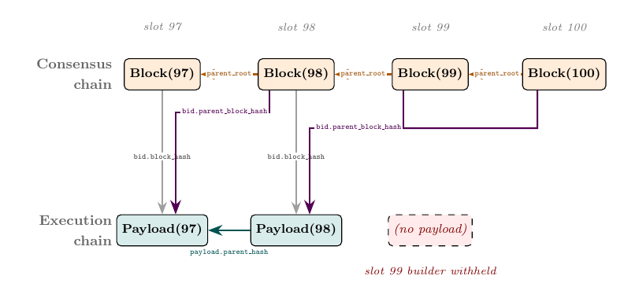

*Figure 1: Two-chain structure across slots 97–100; slot 99's builder withholds, so Block(100) declares Block(99) EMPTY by setting its `bid.parent_block_hash` to Block(99)'s `bid.parent_block_hash` (one of the two admissible values) rather than to Block(99)'s `bid.block_hash`. **The beacon chain stores hashes** (via the bid fields); revealed payloads live in node-local stores. The **payload hash chain** induced by this figure is the pair of `bid.block_hash` values committed by Block(97) and Block(98), the two FULL blocks.*

- ***Consensus chain (orange, `parent_root`).*** Beacon blocks linked by the previous block's hash-tree-root; one per proposed slot, with no gap at slot 99.
- ***Block → its own payload (gray, `bid.block_hash`).*** Each block commits to the hash of its future payload; `verify_execution_payload_envelope` checks the match at reveal. Slot 99 has no arrow (withhold); Block(100)'s payload is unrevealed in this snapshot.
- ***Block → previous payload (violet, `bid.parent_block_hash`).*** Each bid records the hash of the payload it references as its parent, drawn from one of the two hashes in its parent's bid. Block(99) and Block(100) both point at Payload(98), and their paths merge above it; slot 99's withhold did not advance the execution chain tip.
- ***Execution chain (teal, `payload.parent_hash`).*** Revealed `ExecutionPayload` carries the previous payload's `block_hash`, the same value as `bid.parent_block_hash`, stored in a different container and verified equal at reveal. Only Payload(98) → Payload(97) is visible.

**`state.latest_block_hash` tracks the execution chain tip.** It is the `block_hash` of the most recently revealed execution payload that has been integrated into the chain. It is updated only when `process_parent_execution_payload` confirms the parent block was FULL (i.e., applies the parent's execution effects). When a builder withholds, `latest_block_hash` does not advance, and the next slot's builder reads this older value as its `parent_block_hash`.

### What's actually on chain: bids and payload hashes

**The beacon chain stores bids, not payloads.** Every beacon block carries a `SignedExecutionPayloadBid` in its body, a small container holding the builder's signature over an `ExecutionPayloadBid` message. The bid commits to two hashes:

- `bid.block_hash` — the hash the builder commits to for its own future execution payload (the payload it will reveal in Phase 3, if it reveals).
- `bid.parent_block_hash` — the hash of the previous execution payload that the bid references as its parent.

The actual `ExecutionPayload` SSZ container (transactions, state root, withdrawals, …) is **not** stored on chain. The builder broadcasts it separately, and it lands in each node's local `store.payloads` only if received and verified. The beacon chain only records HASHES of payloads, via the two bid fields above.

**This shapes what we can formally guarantee.** Anything the protocol can promise about payloads from on-chain inspection alone (validity, availability, blob-data availability) must be expressible in terms of these hashes, because hashes are all the canonical chain stores. Payload-level claims are downstream of hash-level claims, and the most we can claim at the hash level is *which hashes appear in which bid fields on the canonical chain*.

### Block status: a property of (chain, block)

We now define formally what it means for a block to be **FULL** or **EMPTY**.

*Notation reminder.* In the definitions below, `bid(X)` denotes the bid carried by block $X$, i.e., the `ExecutionPayloadBid` message inside `X.body.signed_execution_payload_bid`. Its fields are accessed with the usual dot syntax: `bid(X).block_hash`, `bid(X).parent_block_hash`, etc. (See the abstractions table at the top of the doc for the full set of pedagogical helpers.)

> **Definition (Block status).** Write $`B \prec \mathit{chain}`$ to mean "$`B`$ is a non-head canonical block on $`\mathit{chain}`$", and let `child(chain, B)` denote $`B`$'s unique canonical child on $`\mathit{chain}`$ (the block whose `parent_root` equals $`B`$'s hash-tree root). Then `block_status(chain, B)` is:
>
> - **FULL** if $B \prec \mathit{chain}$ and `bid(child(chain, B)).parent_block_hash` equals `bid(B).block_hash`;
> - **EMPTY** if $B \prec \mathit{chain}$ and `bid(child(chain, B)).parent_block_hash` does not equal `bid(B).block_hash`;
> - **undefined** otherwise (i.e., $`B`$ is not on $`\mathit{chain}`$, or $`B = \mathit{head}(\mathit{chain})`$).
>
> **Why undefined at the head.** When $`B = \mathit{head}(\mathit{chain})`$, $B$'s `bid.block_hash` has been committed but no child exists yet to reference it. Status becomes defined once $B$'s child lands.

**Why the function takes the chain as an argument.** FULL/EMPTY is not an intrinsic property of $B$. The definition depends on $B$'s **child** in $\mathit{chain}$, and the child is a property of the chain, not of $B$. A reorg that replaces $B$'s child can flip $B$'s status without $B$ changing. The explicit `chain` argument is a reminder that status is meaningful only relative to a fixed canonical branch.

**One more fact:**

- **FULL/EMPTY is retrospective.** $B$'s status is decided at slot N+1 (or later, at the next canonical slot after $`B`$) by $B$'s child's bid, not by $B$ itself at slot N. At slot N, $B$'s execution payload is in flight; until $B$'s child commits to building on it, $B$'s on-chain status is unsettled.

**Why the child alone determines the status.** Once $B$'s child $C$ declares EMPTY for $B$ (i.e., $C$'s `bid.parent_block_hash` does not equal $B$'s `bid.block_hash`), no later canonical block can declare FULL for $B$: `state.latest_block_hash` after $C$ no longer holds $B$'s `bid.block_hash`, and every subsequent block reads `state.latest_block_hash` to set its own `bid.parent_block_hash`. So the verdict is fixed by $C$ and cannot be revised by later blocks.

**An equivalent form of EMPTY, and a useful invariant.** Let $`C = `$ `child(chain, B)`. Then $`B`$ is EMPTY on chain iff `bid(C).parent_block_hash` equals `bid(B).parent_block_hash` — that is, $`C`$ stamps the *same* execution-layer tip its parent stamped, because `state.latest_block_hash` did not advance across $`B`$. More generally, for any non-head canonical block $`B`$ on $`\mathit{chain}`$, `bid(B).parent_block_hash` equals the `block_hash` of the **most recent FULL ancestor** of $`B`$ on $`\mathit{chain}`$ (or genesis if none). A run of consecutive EMPTY blocks all stamp the same upstream FULL ancestor; the stamp updates only when an ancestor is FULL.

Throughout this document, when we say "$`B`$ is FULL on chain" without qualification we mean `block_status(canonical, B) = FULL`, where `canonical` is the current canonical beacon chain.

### The payload hash chain

Block statuses on the canonical chain induce a chain over payload hashes. This is the formal object that captures *which payload hashes are on chain*.

> **Definition (Payload hash chain).** The **payload hash chain** is the collection of `bid.block_hash` values committed by every FULL block on the canonical chain, inheriting the canonical chain's order. Equivalently, a payload hash $`h`$ belongs to the payload hash chain if and only if there exists a non-head canonical block $`B^*`$ such that $`B^*`$'s `bid.block_hash` equals $`h`$ AND $`B^*`$ is **FULL** on the canonical chain.
>
> (FULL is undefined at the head, so the head's `bid.block_hash` is *not* on chain; it only enters once a successor lands.)

<details>
<summary><b>Inductive construction (head-to-genesis)</b> (click to expand)</summary>

Given a head beacon block $B$ on the canonical chain, the payload hash chain can be enumerated by walking backwards from $B$. Let $h^{(0)}, h^{(1)}, h^{(2)}, \ldots$ be the sequence defined by:

- **Base case.** $h^{(0)}$ is $B$'s `bid.parent_block_hash`: the hash of the latest confirmed execution payload (the one referenced by $B$'s bid as its parent).
- **Recurrence (for each $`k \geq 0`$).** Let $B^{(k)}$ be the unique canonical ancestor of $B$ whose `bid.block_hash` equals $h^{(k)}$ (i.e., $B^{(k)}$ is the block whose bid committed to the payload with hash $`h^{(k)}`$). Then set $h^{(k+1)}$ to $B^{(k)}$'s `bid.parent_block_hash`.
- **Termination.** The recurrence stops when no such $B^{(k)}$ exists, i.e., when $h^{(k)}$ corresponds to a payload at or before genesis (or the slot before ePBS activation).

This enumeration produces the chain in *reverse* execution order (head-to-genesis): $h^{(0)}$ is the most recent, $h^{(k)}$ gets older as $k$ grows.

</details>

> **Definition (Payload hash on chain).** A payload hash $h$ is **on chain** if it belongs to the payload hash chain of the canonical beacon chain at the time of inspection.

This is as much as we can say from on-chain data alone: $h$ is on chain iff some canonical bid commits to $h$ *and* some subsequent canonical bid references $h$ as its parent. Both bids are visible in the canonical chain; their composition certifies $h$'s on-chain membership. P3 below promotes this hash-level fact to a payload-level guarantee: a hash on chain implies the corresponding payload (and its blob data) is available and valid.

### Data availability: payload + blob data

**When the builder reveals, it broadcasts two separate objects on two separate gossip channels**: the **payload** and the **blob data**. They are independent in propagation but jointly required for chain inclusion:

- **The payload** — the broadcast object carrying the transactions, state root, withdrawals, and delivery metadata (`builder_index`, `beacon_block_root`, `parent_beacon_block_root`, `execution_requests`). The spec name for this signed broadcast object is `SignedExecutionPayloadEnvelope`. It propagates on a dedicated gossip topic; the builder broadcasts it before the PTC deadline. Receiving nodes verify it via `verify_execution_payload_envelope` against the execution engine.
- **The blob data** — binary chunks attached to EIP-4844 transactions, used by rollups for cheap data availability. Each blob is erasure-coded into 128 **data columns** propagated as separate `DataColumnSidecar` objects on a distinct gossip topic via **PeerDAS**. No single node downloads all columns; each node samples the columns it is responsible for. The blob data is **not** carried inside the payload; only the **KZG commitments** authenticating the blobs live inside the payload's transactions, and they are mirrored in the bid (`bid.blob_kzg_commitments`) so nodes can check the commitments against the bid before the payload arrives.

**The payload and the blob data arrive via different channels and can diverge.** A node may have the payload but not all the blob columns it samples, or vice versa. The PTC vote at slot N reports both signals independently: `payload_present = True` confirms payload arrival; `blob_data_available = True` confirms the member's sampled blob columns arrived and pass KZG verification.

**Both halves are required for local FULL admission.** A node can only admit a FULL-declaring successor for block B after B's payload envelope has been locally verified and B's blob data has passed the node's `is_data_available` check. The PTC primary path for the slot-N+1 FULL/EMPTY decision also requires majority support on **both** signals: payload arrival and blob-data availability. If that primary path does not fire, §6 describes the fallback and honest-construction rules that determine whether B is treated as FULL or EMPTY on chain.

This is the foundation of Property P3 (Data availability for chain inclusion) below.

### The bid container and its two payment fields

> **TL;DR.** A bid carries two distinct payment fields: `value` (trustless: the protocol settles it via the unconditional-payment mechanism) and `execution_payment` (non-trustless: an advertised promise the protocol does not enforce). The public bid gossip topic rejects non-zero `execution_payment`; bids with non-zero `execution_payment` must travel through some off-protocol channel. Properties in §4 split along this divide: some hold regardless of which field a builder uses, others apply only when one of the two is set.

We've referred to "the builder's bid" loosely; we now make the object concrete. The bid is the `ExecutionPayloadBid` SSZ container, wrapped in `SignedExecutionPayloadBid` for transport. Spec source: [`beacon-chain.md`](https://github.com/ethereum/consensus-specs/blob/ec1c01f5f10fb60636a022ae8944c912b6da35f8/specs/gloas/beacon-chain.md) §`ExecutionPayloadBid`. The fields:

```python
class ExecutionPayloadBid(Container):
    parent_block_hash: Hash32              # execution-chain parent (§3)
    parent_block_root: Root                # consensus-chain parent (§3)
    block_hash: Hash32                     # commitment to this slot's payload (§3)
    prev_randao: Bytes32
    fee_recipient: ExecutionAddress        # destination of the payment
    gas_limit: uint64
    builder_index: BuilderIndex
    slot: Slot
    value: Gwei                            # TRUSTLESS payment
    execution_payment: Gwei                # NON-TRUSTLESS payment
    blob_kzg_commitments: List[KZGCommitment, MAX_BLOB_COMMITMENTS_PER_BLOCK]
    execution_requests_root: Root
```

Three of these fields are the ones §3 has been using all along: `parent_block_hash`, `parent_block_root`, and `block_hash` define the two-chain layout and the FULL/EMPTY classifier. The next two fields, `value` and `execution_payment`, are the two payment fields the rest of the document will reason about.

**`value` — the trustless payment.** This is the amount, in gwei, that the builder commits to pay the proposer's `fee_recipient` if the bid is accepted. The protocol enforces it directly. When `value > 0`, `process_execution_payload_bid` ([beacon-chain.md:1475](consensus-specs/specs/gloas/beacon-chain.md#L1475)) records a `BuilderPendingPayment` IOU in state; from that moment, the unconditional-payment mechanism (§7) takes over. The common settlement paths are **Path A** at slot N+1 if the builder reveals and a successor declares the slot FULL, and **Path B** at the end of epoch *e+1* if the slot's pending-payment weight reaches the 60% same-slot quorum. Section 7 also identifies a rare **Path C** old-parent branch for the missed-slot corner where the IOU has aged out but a later canonical block declares the parent FULL. In all settlement paths, an on-chain commitment to credit the proposer is recorded out of the builder's on-chain stake (the actual execution-layer transfer follows in a later accepted FULL payload whose expected withdrawals include this entry): *the builder cannot avoid this commitment under P6's stated liveness and inclusion hypotheses*. This is the design that removes the need for trusted relays.

**`execution_payment` — the non-trustless payment.** This is also an amount in gwei, but the protocol does **not** enforce it. `process_execution_payload_bid` never reads `execution_payment`. No IOU is created, no balance is locked, no Path A or Path B applies. The field is metadata: a builder advertises an intended off-protocol payment, and the proposer chooses whether to believe it. Delivery has to happen through some other channel, most plausibly a transaction inside the revealed execution payload that pays `fee_recipient` from the builder's execution-layer address. If the builder doesn't honor it, the proposer has no protocol-level recourse.

**Non-zero `execution_payment` cannot be gossiped.** The public `execution_payload_bid` gossip topic carries a [`REJECT`](consensus-specs/specs/gloas/p2p-interface.md) validation rule: *`bid.execution_payment == 0`*. Bids with non-zero `execution_payment` are dropped at the gossip layer. They cannot reach the proposer via the canonical bid topic; they must travel via some off-protocol transport (a relay-style HTTP service, a direct builder ↔ proposer connection, a side-protocol). The consensus-layer admission in `process_execution_payload_bid` does not check `execution_payment`, so once such a bid is in a beacon block by *some* path, the block processes normally. The spec does not specify what that path looks like.

**Why a builder might prefer non-trustless payment.** Two structural reasons:

- **No solvency lock.** `can_builder_cover_bid` ([beacon-chain.md:595](consensus-specs/specs/gloas/beacon-chain.md#L595)) checks the builder's stake against the sum of all outstanding `value` obligations. `execution_payment` is not in that sum. A builder can issue unlimited `execution_payment` promises across slots without the protocol noticing they've overcommitted.
- **No unconditional-payment exposure.** With `value`, even withholding triggers Path B if the slot's pending-payment weight reaches the 60% same-slot quorum. The only escapes are low same-slot payment weight that leaves the quorum unreachable, or proposer slashing via `ProposerSlashing` (which clears the IOU). With `execution_payment`, the builder controls reveal *and* payment: they only pay if they reveal *and* honor the off-protocol promise. The reveal decision becomes purely strategic, with no protocol exposure to a withholding choice.

**Why a proposer might accept it.** A non-trustless bid can advertise a higher headline number than a trustless bid from the same builder, because the builder accepts no protocol-side risk. The proposer is making a reputation-based trade (trust this specific staked builder to deliver) in exchange for upside the trustless market cannot match. The proposer remains a staked, identifiable consensus participant; the builder remains a staked, identifiable builder-registry participant; the missing piece is the protocol's enforcement of the payment between them.

**The builder identity is on-chain either way.** Whether the bid arrives via gossip or via an off-protocol channel, `process_execution_payload_bid` enforces `is_active_builder(state, bid.builder_index)` and `verify_execution_payload_bid_signature` ([beacon-chain.md:1453–1459](consensus-specs/specs/gloas/beacon-chain.md#L1453)). The only escape is the self-build branch (`BUILDER_INDEX_SELF_BUILD`, `value = 0`, signature `bls.G2_POINT_AT_INFINITY`), which is the proposer building for themselves. Off-protocol does **not** mean "off-chain builder identity"; it means "off-protocol bid transport".

**This split structures §4.** Properties in §4 are organised into three groups. Some hold regardless of which payment field a bid uses (the always-on layer). Some hold only in the trustless case (`value > 0`). Some hold only in the non-trustless case (`execution_payment > 0` with `value = 0`), under different assumption sets. The next section is where this split is made explicit.

---

## 4. Properties

> **TL;DR.** Seven externally observable properties (P1–P6 plus P_valid), organised in three categories. **Category A — payment-trustlessness-independent**: P1 (block safety), P2 (payload execution deadline is the beginning of the next slot), P3 (data availability for chain inclusion), and P_valid (chain validity); these hold regardless of which payment field the builder uses. **Category B — payment-trustlessness-dependent**: P4 (builder revealing protection) and P5 (builder withholding protection); each has a unified conclusion with two assumption-set cases, one per case. **Category C — trustless-payment-only**: P6 (unconditional payment), which has no analogue when `execution_payment` is used. All seven are claims an observer with full visibility of network messages and on-chain state can verify, without inspecting any node's internal state.

Each property is stated here informally and revisited precisely as we walk through the lifecycle. The two cases are introduced in §3 ("The bid container and its two payment fields"); we refer to them here as the *trustless case* (when `bid.value > 0`) and the *non-trustless case* (when `bid.execution_payment > 0` and `bid.value = 0`, delivered off-protocol).

### Category A — payment-trustlessness-independent properties

These hold regardless of which payment field the builder uses. They are pure consensus-layer properties: ePBS does not weaken what was already true about beacon-block canonicity, and the new two-phase model preserves data-availability guarantees for any payload that does land on chain.

**P1: Block safety.** Let $`B`$ be a block proposed in slot $`N`$ by an **honest proposer**, extending a block $`B'`$. Assume that $`B'`$'s slot is $`N{-}1`$, that $`B'`$ will remain canonical forever, **S1** (synchrony) and **S2** (β < 20%). If $`B`$ includes a valid bid, then $`B`$ remains in the canonical chain at every later time.

> **Why P1 is stated this way.** What we really want to claim is stronger: *ePBS does not introduce any new reorg attack against a block proposed by an honest proposer*. Proving that directly would require running the same execution on both pre-ePBS and ePBS and showing the canonical chains agree, which is too complex for this kind of document. So we prove P1 instead: under the same conditions that would have made $`B`$ canonical pre-ePBS (parent stays canonical, proposer is honest), $`B`$ is still canonical under ePBS. P1 is what we prove in place of the "no new reorg attacks" claim. *Note: an honest slot-$`N`$ proposer (a) broadcasts $`B`$ at slot start (hence timely in the §9.1 sense, $`t + \Delta \leq T_{\mathrm{att}}`$) and (b) does not equivocate (publishes a single block at slot $`N`$).*

**P2: Payload execution deadline is the beginning of the next slot.**
Let $B$ be a block proposed in slot $N$ and $P$ be the payload associated with $B$ (i.e. `bid(B).block_hash = P.block_hash`).
With the only possible exception of builders, the protocol does not require any other honest actor to complete the execution of $P$ before the beginning of slot $N+1$.

**P3: Data availability for chain inclusion.** Assume **S2** (β < 20%, giving an honest super-majority). If a payload hash is in the payload hash chain of the canonical beacon chain (i.e., the hash is on chain in the §3 sense), then the corresponding payload and blob data were available to at least one honest node. More precisely, some honest node successfully processed, via `on_block`, a canonical block that declared the corresponding beacon block FULL. At that node, the corresponding execution-payload envelope was in `store.payloads`, its payload was valid, and its associated blob data was available in the spec-local sense required by `is_data_available`.

**P_valid: Chain validity.** For every block $B$ on the canonical chain, $B$'s `bid.parent_block_hash` equals either `bid(parent(B)).block_hash` (declaring `parent(B)` FULL) or `bid(parent(B)).parent_block_hash` (declaring `parent(B)` EMPTY). Equivalently: a block's bid commits its execution parent to exactly one of the two hashes already on chain in its parent's bid; no third value is admissible.

### Category B — payment-trustlessness-dependent properties

Each property here has one conclusion with two possible assumptions — one when the builder uses trustless payment, one when the builder uses non-trustless payment. The protocol that an honest builder can follow to guarantee these properties is detailed in §5 Phase 3.

**P4: Builder revealing protection.** Under the assumptions listed below, there exists a protocol an honest builder can follow such that, if the builder decides to reveal payload $P$ in slot $N$, then `P.block_hash` is in the payload hash chain of the canonical beacon chain (equivalently, $B$ is FULL on chain; and by P3, the corresponding payload and blob data are available and valid).

- *Trustless (`bid.value > 0`).* Assume there exists a canonical block $`B'`$ at slot $`N{-}1`$ that remains canonical forever, **S1** (synchrony), **S2** (β < 20%), **S3** (slot-$`N`$ PTC majority is honest and online, and honest online PTC members wait to observe both the payload and the blob data before voting), **L_verify** (local payload/DA checks and DA/EL verification finish before the relevant PTC/successor decisions; §9.1), **L_successor** (a canonical successor following the FULL decision is eventually produced; §9.1), and $`B`$ is timely (Definition in §9.1: $`t + \Delta \leq T_{\mathrm{att}}`$).
- *Non-trustless (`bid.execution_payment > 0`, `bid.value = 0`).* Assume **S1** (synchrony), **S3** (slot-$`N`$ PTC majority is honest and online, and honest online PTC members wait to observe both the payload and the blob data before voting), **L_verify** (local payload/DA checks and DA/EL verification finish before the relevant PTC/successor decisions; §9.1), **L_successor** (a canonical successor following the FULL decision is eventually produced; §9.1), and the builder knows of a confirmation rule that relies on a set of assumptions that hold.

**P5: Builder withholding protection.** Under the assumptions listed below, there exists a protocol an honest builder can follow such that, if the builder withholds its execution payload, the protocol does not charge it.

- *Trustless (`bid.value > 0`).* Assume **S1** (synchrony) and **S2** (β < 20%).
- *Non-trustless (`bid.execution_payment > 0`, `bid.value = 0`).* No assumptions needed.

### Category C — trustless-payment-only properties

This category contains exactly one property: the unconditional-payment guarantee that defines the trustless case. There is no analogue in the non-trustless case: the protocol does not enforce `execution_payment` at all, so no on-chain mechanism can guarantee the proposer is paid.

**P6: Unconditional payment to the proposer.** Given the same set of assumptions as **P1**, plus `bid.value > 0`, that all attestations cast by online honest validators at slot $N$ are included on the canonical chain before the start of epoch $\mathsf{epoch}(N)+2$, and the withdrawal-pipeline liveness condition in §9.1. The proposer's `fee_recipient` is eventually credited with the bid amount.

P6 commits the chain to paying — a `BuilderPendingWithdrawal` is enqueued by the settlement mechanism detailed in §7 (normally Path A or Path B, with a rare Path C missed-slot corner). The actual **EL credit** — the moment the proposer's `fee_recipient` receives the funds at the execution layer — follows when a subsequent canonical FULL block drains the queue, includes the resulting `Withdrawal` in its execution payload, and that payload is accepted by the EL; its timing depends on chain state at settlement time. §7 includes a fold-out that works through the drain rate and the best- and worst-case settlement timing.

The remainder of this section discusses the fee-recipient destination, the adversarial model the proofs rely on, and the strengthening hypothesis embedded in P1, P4 (trustless case), and P6.

**Why the fee recipient and not the validator's balance.** *The bid is paid to the proposer's `fee_recipient` (an execution-layer address) rather than added to the validator's consensus-layer balance.* This follows the same convention used pre-ePBS for execution-layer fees: staking pools and similar operators rely on this separation because keeping consensus rewards apart from execution-layer revenue makes accounting and revenue distribution to delegators much simpler. Under ePBS, the only difference is *who* drives the credit (the builder, via `BuilderPendingWithdrawal`); the destination address remains the same. The same `fee_recipient` field is the destination for both `value` and `execution_payment`; the difference is only in *how* the payment lands there.

**Adversarial model.** Three structural assumptions are catalogued in §9.1: network synchrony (**S1**, Δ < $`T_{\mathrm{att}}`$), a per-slot online-participation / adversarial-weight bound against the spec denominator $W$ (**S2**), and a PTC honest-online majority bound (**S3**). Each property above lists the subset of {S1, S2, S3} it uses; not every property uses all three. P4's non-trustless case imports the rule-specific assumption set $\Sigma_R$ associated with the builder's confirmation rule.

<details>
<summary><b>Why the strengthening precondition is needed for P1, P4 (trustless case), and P6</b> (click to expand)</summary>

The clause "**$`B'`$ will remain canonical forever**", embedded in P1, P4 (trustless case), and P6, rules out a reorg scenario where the property would otherwise fail even when the builder behaved honestly. Without this clause, a Byzantine slot-$`N`$ proposer can publish $`B`$ late in the slot so that some honest validators don't see $`B`$ in time. Those validators vote for a different descendant of an older ancestor (a sibling of parent($`B`$)), pulling enough weight away from $`B`$'s branch that parent($`B`$) loses canonicity at the next slot, and $`B`$ goes with it.

**On the missing-slot configuration.** A separate attack — the *missing-slot configuration* — is also closed by the same hypothesis. Without it, a colluding Byzantine pair at slots $`N{-}1`$ and $`N`$ could mount the following: the slot-$`N{-}1`$ proposer withholds; the slot-$`N`$ proposer publishes $`B`$ parented at $`H`$ from slot $`N{-}2`$, skipping $`N{-}1`$; the slot-$`N{-}1`$ proposer simultaneously releases a withheld sibling $`B^*`$ parented at $`H`$; honest slot-$`N`$ attestations split between $`B`$ and $`B^*`$; at slot $`N{+}1`$ with proposer boost reset, $`B^*`$ outweighs $`B`$ and reorgs it. The hypothesis "there exists a canonical $`B'`$ at slot $`N{-}1`$ that remains canonical forever" forecloses this directly: $`B'`$'s existence means slot $`N{-}1`$ is not missing, so the attack has no missing slot to exploit. (That $`B`$ extends $`B'`$, rather than skipping past it, then follows from the other hypotheses of each property: automatic for an honest proposer in P1/P6; derived from A1a (ii) plus $`B'`$'s canonicity in P4 trustless. See the §9.3 P4 trustless proof for the latter derivation.)

**An honest builder can self-enforce these conditions.** Under network synchrony, an honest builder observes the gossip layer by bid-construction time. If parent($`B`$) is at risk of reorg (e.g., late-published or with low attestation support) or any slot between the canonical head and $N$ is observably empty, the builder declines to bid: forgoing one slot's MEV is strictly safer than bidding into a configuration where the trustless guarantees are known to fail.

**Why P4's non-trustless case does not embed the same strengthening.** With non-trustless payment, the honest builder uses a confirmation rule $R$ that *itself* certifies "the block will remain canonical forever" before revealing. So if the rule has any of the reorg attacks above as a counter-example, the rule would not have returned `confirmed` in the first place. The attacks are ruled out by what $R$ means, not by an extra hypothesis we add. The price is that the builder must wait until $R$ confirms, so the reveal window is tighter.

</details>

The remainder of this document shows how the protocol's algorithms enforce each of P1–P6. §5 Phase 3 presents the cautious-reveal protocols an honest builder can follow in each case. §8 walks through the adversarial scenarios in the trustless case. §9 (work-in-progress) catalogues a self-contained set of assumptions and gives proof sketches that, combined with the code in §5–§7, justify the six properties.

---

## 5. The slot, abstracted

> **TL;DR.** A slot under ePBS proceeds through five phases: pre-slot bid construction, beacon block publication, attestation, builder reveal, and PTC witness vote. Phases 0–4 are described in this section. Phase 5 (the slot-N+1 `get_head` resolution that picks the canonical head and decides any FULL/EMPTY ambiguity for slot N) is covered in §6 along with the full fork-choice and construction machinery (`get_node_children`, `get_weight`, `get_payload_status_tiebreaker`, `should_build_on_full`, `get_supported_node`, `is_ancestor`, `on_block`). Each phase below shows the actor code, identifies the property it enforces, and depicts both happy and degraded paths.

**State and store.** *Two data structures recur throughout this section.* The **state** (`BeaconState`) is the consensus-layer snapshot associated with a specific block. It is computed deterministically: the state after block B is the result of applying B to the state of B's parent, i.e., `state(B) = process_block(state(parent(B)), B)`. No other input is needed: a node that knows the genesis state and the chain of blocks can recompute any block's state. Under ePBS, this computation is split in two: `process_block` applies the consensus-layer transition (including deferred execution effects from the parent's execution payload via `process_parent_execution_payload`, bid verification, attestation processing, withdrawals), while the current slot's execution payload is verified separately by `verify_execution_payload_envelope` when the builder reveals.

**The store reflects per-node observations, not deterministic state.** Unlike the state, which is per-block and deterministic, the store records what a particular node has observed from the network: all received blocks (`store.blocks`), the state after processing each block's consensus layer (`store.block_states`), attestations, PTC votes, and (new under ePBS) `store.payloads`, which maps a block root to the payload (spec: `ExecutionPayloadEnvelope`) that the builder revealed for that block. `store.payloads` is populated only when the node locally receives and verifies the payload, which is why it serves as the **gate** for the slot-N+1 chain-inclusion check that decides FULL/EMPTY on chain (§3); a node-internal invariant that supports several externally observable properties (notably P3 data availability and P4 revealing protection in both cases). Phase 5 makes this gate explicit when describing the fork-choice rule.

A slot under ePBS proceeds through five phases. Below we walk through the phases as a storyline, showing the abstracted code that each actor runs, and connecting each step to the formal property it enforces.

> **Convention: `...` in code blocks.** Throughout this document, `...` inside a function signature, parameter list, or function body marks parts of the code that are **immaterial to the property being analysed**. The spec-defined logic may be anything in those positions and the conclusions still hold. Concretely, in `def submit_bid(state, slot, ...) -> ...`, the omitted parameters and return type can be any spec-defined values; in a function body, `...` collapses spec-mandated steps (validation, signature checks, etc.) that don't affect the property the surrounding code is meant to demonstrate. Read as: "any spec-defined fill here is fine".

**How to read Figure 2.** The diagram uses a sequence-diagram convention: **each box names a *computation*** (the procedure or activation an actor performs), and **each arrow names a *transmission*** (the message broadcast from the box at the arrow's tail). Box *heights* are also meaningful: a tall box represents substantial computation (e.g., the Attesters' CL `Process block and update store`), while a short box represents a light step (the `Store block` boxes used by Builder and PTC for the same `on_block` handler they barely use; the brief `Check payload and blob data` store lookup the PTC runs before voting). In Phase 3, the Builder emits **two** outgoing transmissions: the **payload** (solid violet) and the **blob data** (dashed violet, separate PeerDAS gossip topic). Dashed horizontal lines mark the spec-mandated slot-time deadlines (Phase 1b, 2, 3, 4 ↔ $t = 0^+$, $T_{\mathrm{att}}$, the builder reveal window, $`T_{\mathrm{ptc}}`$). The figure depicts the **happy path**: every actor follows the protocol, the builder reveals on time, the PTC observes both signals before its deadline, and every message propagates within $\Delta$. Adversarial and degraded scenarios are surveyed in §8.

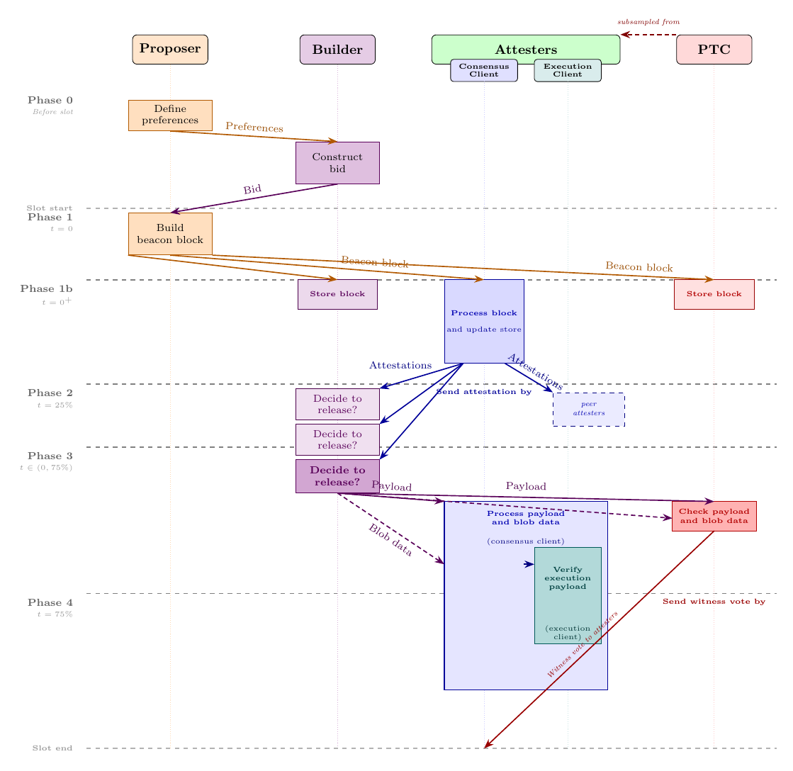

*Figure 2: Slot lifecycle under ePBS, happy path. Columns: Proposer (orange), Builder (violet), Attesters with CL/EL (blue/teal), PTC (red; a 512-member subcommittee of the slot's attesters, with the dashed arrow at the top marking the subsampling). Phase-by-phase walkthroughs of every box and arrow follow below.*

### Phase 0 — Before the slot

*The proposer broadcasts preferences; the builder constructs the execution payload and submits a bid.*

**Happy path: external builder.**

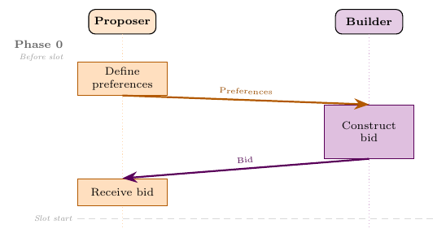

*Figure 3a: Pre-slot exchange with an external builder. Proposer broadcasts `SignedProposerPreferences`; Builder constructs the full execution payload and submits a `SignedExecutionPayloadBid` (carrying `block_hash`, `value`, `parent_block_hash`) which arrives just before slot start.*

**Alternative: self-build.**

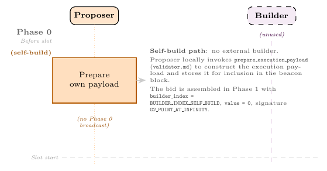

*Figure 3b: Pre-slot self-build. No external builder is involved (Builder column dashed); the Proposer runs `prepare_execution_payload` locally and assembles the bid with `builder_index = BUILDER_INDEX_SELF_BUILD`, `value = 0`, signature `bls.G2_POINT_AT_INFINITY`. Nothing crosses the network in Phase 0; the execution payload and bid are held until Phase 1.*

The proposer for an upcoming slot may broadcast a `SignedProposerPreferences` message specifying its preferred `fee_recipient` (where to receive payment) and `target_gas_limit` (the desired gas-limit target; bids whose actual `gas_limit` is not compatible with this target via `is_gas_limit_target_compatible(parent_gas_limit, bid.gas_limit, target_gas_limit)` are filtered at the gossip layer). Without this broadcast, the gossip network will not forward any builder bids for that slot.

The builder, observing the proposer's preferences, constructs an execution payload via its execution engine and broadcasts a bid:

> **A note on `@Upon` handlers (pedagogical, not spec).** Five names appear in code blocks below decorated with `@Upon(condition)`: the builder's **`submit_bid`** and **`reveal_payload`**, the proposer's **`propose`**, the attester's **`attest`**, and the PTC member's **`ptc_vote`**. **None of these are functions defined in the consensus specs.** They are pedagogical handlers we introduce for three reasons:
>
> 1. **Some actor duties live in spec prose, not in named functions.** Builder bid construction, builder payload reveal, and PTC vote construction are described as numbered prose lists under headings in `builder.md` and `validator.md` (e.g., "Constructing the `SignedExecutionPayloadBid`", "Constructing the `SignedExecutionPayloadEnvelope`", "Constructing a `PayloadAttestationMessage`"). We wrap those lists into named handlers so the reader has one place to cite in proofs and reasoning.
> 2. **Timing triggers become explicit.** The `@Upon(condition)` decorator makes the trigger condition inspectable at a glance: `@Upon(time_in_slot == T_ptc)` says "this code runs at the PTC deadline". The spec expresses the same trigger in prose ("broadcast within the first `get_payload_attestation_due_ms()` ms of the slot"); the decorator surfaces it as structure.
> 3. **Honest vs Byzantine is a property of the handler.** An actor is **honest** iff its client runs exactly these steps when the condition fires; **dishonest (Byzantine)** if its client deviates (e.g., a validator signalling `data.index = 1` without having seen the execution payload, a builder revealing a different payload than committed, or a PTC member voting without observing the payload). Honest-actor facts that the proofs need (same-slot attesters set `data.index = 0`, PTC members vote from local observation, etc.) are read off the relevant phase code directly; the proofs cite "by Phase 2 attest code" or similar. Two cautious-reveal protocols extend what the spec's minimal honest rule mandates, named **A1a** (trustless case) and **A1b** (non-trustless case), and are presented as pseudocode in the §5 Phase 3 reveal section.
>
> **Functions without `@Upon` in the lifecycle sections are real spec functions.** `process_block`, `get_head`, `on_block`, `process_attestation`, `verify_execution_payload_envelope`, etc. are defined in the spec under `def NAME(...):` and are called internally by the client whenever it receives a block, needs to compute the chain head, or processes protocol state. Later §9 G-assumption snippets are labelled separately as proof pseudocode.

```python
@Upon(received SignedProposerPreferences for upcoming_slot)
def submit_bid(builder, upcoming_slot, state, proposer_preferences):
    head = get_head(store)
    parent_bid = state.latest_execution_payload_bid
    parent_hash = (
        parent_bid.block_hash
        if should_build_on_full(store, head)
        else parent_bid.parent_block_hash
    )
    payload, execution_requests = execution_engine.build_payload(
        parent_hash=parent_hash,
        fee_recipient=proposer_preferences.fee_recipient,         # MUST match preferences
        target_gas_limit=proposer_preferences.target_gas_limit,   # compatibility (not equality) with target, checked at gossip
        ...,
    )
    bid = ExecutionPayloadBid(
        block_hash=payload.block_hash,                          # The binding commitment
        value=builder.trustless_amount,                         # TRUSTLESS payment (§3)
        execution_payment=builder.nontrustless_amount,          # NON-TRUSTLESS payment (§3)
        builder_index=builder.index,
        slot=upcoming_slot,
        parent_block_hash=parent_hash,
        execution_requests_root=hash_tree_root(execution_requests),
        ...,
    )
    # Delivery: public gossip topic if execution_payment == 0; off-protocol channel otherwise (§3).
    deliver_bid_to_proposer(SignedExecutionPayloadBid(bid, sign(bid)))
    builder.stored_payload = payload                        # saved for reveal, same object used in reveal_payload
    builder.stored_requests = execution_requests            # execution requests come from the same bundle
```

`deliver_bid_to_proposer` collapses the gossip-vs-off-protocol delivery distinction introduced in §3: bids with `execution_payment == 0` may be `broadcast` on the public `execution_payload_bid` gossip topic; bids with `execution_payment > 0` are rejected by that topic and must travel via some other transport (a relay-style HTTP service, a direct builder ↔ proposer connection, etc.). Either path lands the same `SignedExecutionPayloadBid` object at the proposer; from `process_execution_payload_bid`'s perspective they are indistinguishable.

**The builder constructs the full payload before submitting the bid, because `bid.block_hash` must equal the actual payload's hash.** This is a binding commitment: when the builder later reveals, the revealed execution payload must match this hash exactly. The other key field is `bid.parent_block_hash`, which declares which execution chain tip the builder built on. This is how the next block signals whether it treats its parent as FULL or EMPTY on chain (defined in §3).

**The builder simulates the *consensus-layer* application of the parent's execution payload locally to determine the correct execution chain tip.** The builder needs to know the execution head for the new payload, but at this point `apply_parent_execution_payload` (which updates `latest_block_hash`) has not yet run for the current slot; it runs inside `process_block` of the *next* block. The builder resolves this by following the `should_build_on_full(store, head)` branch used by `prepare_execution_payload`: when building on FULL, it runs `apply_parent_execution_payload` on a **copy** of the state; otherwise it uses the parent's EMPTY execution head. The FULL simulation does only what `apply_parent_execution_payload` does in the spec: it processes the parent's execution requests (deposits, withdrawals, consolidations), settles the parent's builder payment, sets `state.execution_payload_availability[parent_slot % SLOTS_PER_HISTORICAL_ROOT] = 0b1`, and advances `state.latest_block_hash = parent_bid.block_hash`. It does **not** re-execute the parent's transactions in the EVM (that happened when the parent's payload was first verified against the execution engine by `verify_execution_payload_envelope`) and it does **not** touch blob data (blob data participates only in PeerDAS availability sampling, never in the consensus state transition). The network's eventual `process_block` for the next block performs the same deterministic update.

> **Remark on bid commitments.** An honest builder's revealed execution payload necessarily has `block_hash == bid.block_hash` because the builder reveals the same payload object it constructed at bid time (the `builder.stored_payload` line in the `submit_bid` pseudocode is the runtime-process variable holding it across phases — not a spec field). A dishonest builder revealing a different payload fails the equality check in `verify_execution_payload_envelope`. This is not a separate property in our list; it is a precondition underlying P4 (builder revealing protection in both cases) that follows from the Phase 0 / Phase 3 honest-builder code by construction.

### Phase 1 — Slot start (t = 0): Proposer publishes the beacon block

*The proposer collects valid bids, selects one, and broadcasts a beacon block carrying the bid (not the execution payload).*

**Happy path: valid block proposed and received by all.**

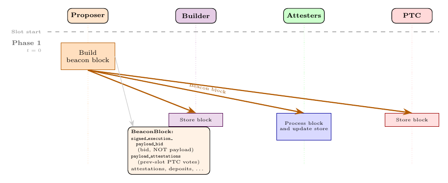

*Figure 4a: Slot start, valid block. Proposer broadcasts the BeaconBlock to Builder, Attesters, and PTC; the body carries the bid (`signed_execution_payload_bid`) and the previous slot's aggregated PTC votes (`payload_attestations`), both new under ePBS. The execution payload is not in the block; it arrives separately in Phase 3.*

**Alternative: missing or invalid block.**

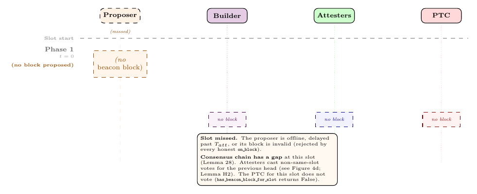

*Figure 4b: Slot start, missing or invalid block. The Proposer is dashed (offline, delayed, or block rejected at every honest `on_block`); no slot-N consensus chain entry is created. Attesters fall back to the previous head (Figure 4d); the slot-N PTC does not vote at all, since `has_beacon_block_for_slot(store, slot)` is False.*

At the beginning of the slot, the proposer collects valid bids from the gossip topic, selects one (typically the highest-value), and includes it in the beacon block:

```python
@Upon(time_in_slot == 0 and is_proposer(state, validator.index))
def propose(validator, slot, state):
    head = get_head(store)
    bids = collect_valid_bids(state, slot)
    selected_bid = select_one_bid(bids)              # Spec: just "select one bid"

    body = BeaconBlockBody(
        signed_execution_payload_bid = selected_bid,        # NEW under ePBS
        payload_attestations = aggregate_ptc_votes(slot - 1),  # NEW: prev-slot PTC votes
        parent_execution_requests = get_parent_execution_requests(store, state),  # NEW
        # ... remaining operation fields: attestations, slashings, exits, etc.
    )
    block = construct_beacon_block(state, body)
    broadcast(SignedBeaconBlock(block, sign(block)))
```

**The beacon block contains the bid, not the payload; this is the change that enables the two-phase model.** The actual `ExecutionPayload` will arrive separately. Two-phase processing is a node-internal mechanism (the consensus layer advances on the beacon block alone, with execution-layer effects applied separately when the builder reveals); it is what makes the externally observable properties below work, but is not itself one of them. The `should_build_on_full(store, head)` decision fixes the block's parent-execution view: if it returns True, the selected bid must use `state.latest_execution_payload_bid.block_hash` as `bid.parent_block_hash`, the `parent_execution_requests` field comes from `store.payloads[head.root].execution_requests`, and self-build payload construction uses the parent's FULL execution state. Otherwise, the selected bid must use `state.latest_execution_payload_bid.parent_block_hash`, `parent_execution_requests` is empty, and self-build payload construction uses the parent's EMPTY variant.

### Phase 1b — Block receipt

*Every node runs `process_block`, which applies the parent's deferred execution effects, verifies the bid, and arms the unconditional payment IOU.*

**Happy path: block received and processed.**

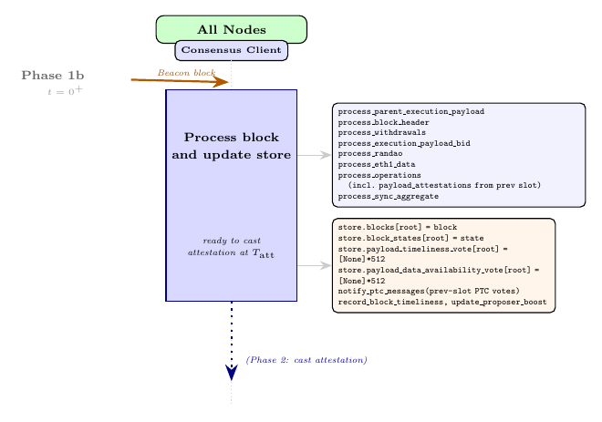

*Figure 4c: Block receipt. All nodes run `Process block and update store`; the two new ePBS steps inside are `process_parent_execution_payload` (applies the parent's execution effects if the block declares FULL) and `process_execution_payload_bid` (verifies the bid and records the `BuilderPendingPayment` IOU; Property P6). The pipeline and store-update annotations beside the figure list the sub-steps.*

**Alternative: block missing or invalid; attest for previous head.**

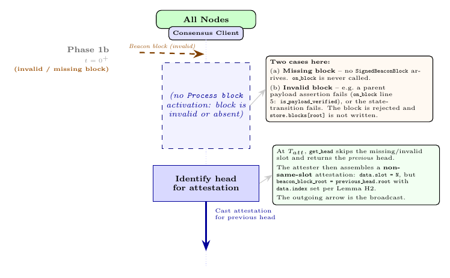

*Figure 4d: Attestation fallback when the slot-N block is missing or invalid. No `Process block and update store` runs (`store.blocks[root]` is never written), but at $`T_{\mathrm{att}}`$ the attester still runs `get_head`, returns the previous head, and casts a **non-same-slot attestation** for the previous head with `data.index` set according to whether the parent declared FULL or EMPTY. This is the fallback that keeps fork-choice progressing through missed slots; the missed-slot FULL/EMPTY resolution it enables is analysed in §6 (Case 2).*

When other nodes receive the beacon block, they run `process_block`. Here is what changed under ePBS:

```diff
 def process_block(state, block):
+    process_parent_execution_payload(state, block)     # NEW: apply parent's EL effects if FULL
     process_block_header(state, block)
     process_withdrawals(state)
-    process_execution_payload(state, block.body.execution_payload, ...)
+    process_execution_payload_bid(state, block)        # Verify the bid, arm payment
     process_randao(state, block.body)
     process_eth1_data(state, block.body)
-    process_operations(state, block.body)              # Same name, but modified internally
+    process_operations(state, block.body)              # Processes payload_attestations; direct execution-request ops are removed
     process_sync_aggregate(state, block.body.sync_aggregate)
```

> **Observe that** the first step in `process_block` is `process_parent_execution_payload`: if the current block declares that its parent's execution payload was FULL (via `bid.parent_block_hash`), this function applies the parent's execution-layer effects: processing execution requests (deposits, withdrawals, consolidations), settling the builder payment, and advancing `state.latest_block_hash`. If the parent was EMPTY, it verifies that no execution requests are included and returns immediately. This is how ePBS integrates the parent's execution effects into the consensus-layer state transition.

> The `payload_attestations` processed inside `process_operations` are **PTC votes cast in the previous slot**, not votes about the current block's execution payload. When a node runs `process_block` for block N at t = 0 of slot N, slot N's PTC has not yet voted (PTC members vote at 75% of their slot). The votes included in block N's `payload_attestations` are slot N−1's PTC votes, aggregated by the slot N proposer before proposing. How the current slot's execution payload is verified (separately from `process_block`) is described in Phase 3 below.

The other key new function called here is `process_execution_payload_bid`, which verifies the builder's bid and arms the unconditional payment mechanism:

```python
def process_execution_payload_bid(state: BeaconState, block: BeaconBlock) -> None:
    signed_bid = block.body.signed_execution_payload_bid
    bid = signed_bid.message
    builder_index = bid.builder_index
    amount = bid.value

    # For self-builds, amount must be zero regardless of withdrawal credential prefix
    if builder_index == BUILDER_INDEX_SELF_BUILD:
        assert amount == 0
        assert signed_bid.signature == bls.G2_POINT_AT_INFINITY
    else:
        # Verify that the builder is active
        assert is_active_builder(state, builder_index)
        # Verify that the builder has funds to cover the bid
        assert can_builder_cover_bid(state, builder_index, amount)
        # Verify that the bid signature is valid
        assert verify_execution_payload_bid_signature(state, signed_bid)

    # Verify commitments are under limit
    assert (
        len(bid.blob_kzg_commitments)
        <= get_blob_parameters(get_current_epoch(state)).max_blobs_per_block
    )

    # Verify that the bid is for the current slot
    assert bid.slot == block.slot
    # Verify that the bid is for the right parent block
    assert bid.parent_block_hash == state.latest_block_hash
    assert bid.parent_block_root == block.parent_root
    assert bid.prev_randao == get_randao_mix(state, get_current_epoch(state))

    # Record the pending payment if there is some payment
    if amount > 0:
        pending_payment = BuilderPendingPayment(
            weight=0,
            withdrawal=BuilderPendingWithdrawal(
                fee_recipient=bid.fee_recipient,
                amount=amount,
                builder_index=builder_index,
            ),
        )
        state.builder_pending_payments[SLOTS_PER_EPOCH + bid.slot % SLOTS_PER_EPOCH] = (
            pending_payment
        )

    # Cache the signed execution payload bid
    state.latest_execution_payload_bid = bid
```

Fee-recipient equality, gas-limit-target compatibility, and the rule that `bid.slot` is greater than the slot of `bid.parent_block_root` are builder/gossip-side obligations, enforced by `builder.md` and the `p2p-interface.md` topic validators. They are not beacon-chain assertions inside `process_execution_payload_bid`.

**The `BUILDER_INDEX_SELF_BUILD` branch is the escape hatch for solo validators.** A proposer that constructs its own execution payload (without an external builder) takes this branch: `bid.value` must be zero (the proposer does not pay itself), the signature check is skipped, and no IOU is recorded. ePBS does not force any validator to depend on the builder market.

> **Remark on builder solvency at bid time.** The check `can_builder_cover_bid` accounts for **all outstanding `value` obligations** of the builder: both already-approved payments waiting in `builder_pending_withdrawals` and pending bids in `builder_pending_payments` from other slots. A builder cannot overbid across concurrent slots *in the trustless field*. `execution_payment` is **not** in the sum (cf. §3), so the solvency check only constrains trustless commitments. This is a precondition for P6 (unconditional payment): without it, a builder could promise more `value` than it owns and the on-chain payment would not settle.

> **Property P6: Unconditional payment is armed.** No money has moved yet, but the IOU (`BuilderPendingPayment`) is now in state. From this point forward, the builder **will pay** if the beacon block is widely attested, regardless of whether it reveals the execution payload. (This callout applies only to the trustless case; in the non-trustless case no IOU is created; cf. P5 non-trustless case in §9.3.)

### Phase 2 — Attestation deadline (t = 25%)

*Honest attesters cast same-slot attestations with `data.index = 0`; once the cautious-reveal threshold is met, the builder releases the payload.*

**Happy path: cautious threshold met, builder releases.**

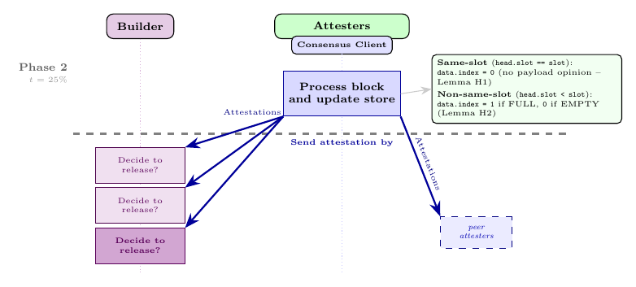

*Figure 5a: Phase 2, attestation deadline (t = 25%), trustless case. Attesters cast their votes (`data.index` set by the Phase 2 `attest` code; see annotation); the votes reach both peer attesters and the Builder. The Builder's three `Decide to release?` boxes model trustless cautious-reveal (Assumption A1a): the third evaluation crosses the ≥ 40% threshold and triggers payload construction in Phase 3. Under the non-trustless case (A1b) the decision predicate is a confirmation rule $`R`$ rather than the 40% threshold, but the figure's structure is the same.*

**Alternative: cautious threshold never met; builder withholds.**

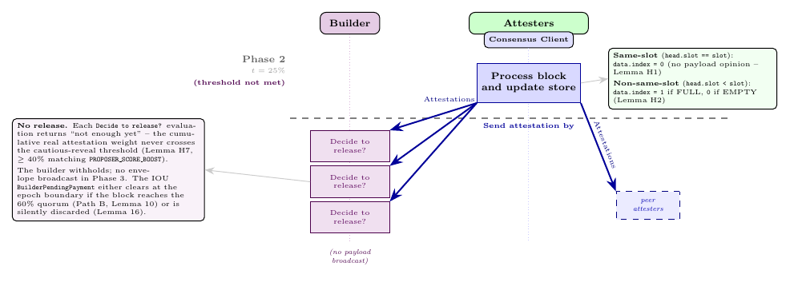

*Figure 5b: Phase 2, cautious threshold never met (trustless case). All three `Decide to release?` evaluations return "not enough yet" (light shade); cumulative real attestation weight never crosses ≥ 40% (Assumption A1a). No payload is broadcast; the IOU persists and falls through to Path B (settled if the 60% quorum is later met; otherwise discarded, per Property P5).*

Honest attesters run the fork-choice function and broadcast their vote:

```python
@Upon(time_in_slot == T_att and validator in committee)
def attest(validator, slot, state, store):
    head = get_head(store)                      # head is a ForkChoiceNode (root, payload_status); see Phase 5
    head_block = store.blocks[head.root]
    data = AttestationData(slot=slot, beacon_block_root=head.root, ...)
    if head_block.slot == slot:                 # Same-slot attestation
        data.index = 0                          # signal zero, no payload opinion possible
    else:                                       # Non-same-slot attestation
        data.index = 1 if head.payload_status == FULL else 0  # signal FULL/EMPTY consistently
    broadcast(sign(data))
```

**Same-slot attesters are payload-neutral: `data.index = 0` always for the current slot's block.** The attester cannot know whether the payload will be revealed: the builder has until 75% of the slot, but the attester votes at 25%. Their votes count toward the block's overall canonical-chain weight (helping it win against competing blocks at the same slot) and toward ancestor branches via the chain structure, but they do not carry a payload-status opinion that the next-slot FULL/EMPTY decision can use.

> **Note on reading the gossip-validation bullets.** The p2p-interface entries are written as predicates that must pass, with `[REJECT]` naming the failure action if they do not. Read that way, `data.index < 2` and `data.index == 0 if block.slot == attestation.data.slot` are consistent with the same-slot rule in `validator.md` §"Attestation" and with `fork-choice.md`: `validate_on_attestation` enforces the same-slot zero index, `get_supported_node` maps same-slot latest messages to `PENDING`, and `is_ancestor` does not let a `PENDING` direct vote support a `FULL` or `EMPTY` node for the same root.

**Same-slot payload-neutrality is a fact about the weight computation, not a property in our externally observable list.** A same-slot attester's vote contributes to the overall fork-choice weight of its block (helping it win against competing blocks at the same slot) but contributes nothing to the FULL/EMPTY resolution for that block, by construction of `get_supported_node` and `is_ancestor` (see §6, Fork-choice machinery in detail). This follows directly from the timing constraint: attesters vote at 25% of the slot while the builder has until 75% to reveal, so a same-slot attester cannot have a payload opinion. The behaviour is enforced internally by the fork-choice's weighing rules and is consumed by the slot-N+1 fork-choice resolution described in Phase 5, including the missed-slot resolution (Case 2) discussed there.

### Phase 3 — Builder reveal window (t ∈ (0, 75%))

*The builder broadcasts the `SignedExecutionPayloadEnvelope`; nodes verify it and populate `store.payloads`, which is the gate for declaring the slot FULL on chain at slot N+1 (§3).*

**Happy path: builder reveals, all clients process the payload.**


*Figure 6a: Phase 3, builder reveals. Two separate objects are broadcast: the **payload** (solid violet) and the **blob data** (dashed violet, propagated as `DataColumnSidecar` columns via PeerDAS), each going to both the Attesters' CL and the PTC. The cautious threshold has crossed, so the Builder broadcasts; Attesters run `Process payload and blob data` (CL: `on_execution_payload_envelope` checks `is_data_available` + invokes `verify_execution_payload_envelope`, which in turn calls the EL via `verify_and_notify_new_payload`); PTC members observe both signals and (under vote-on-receipt) broadcast the witness vote immediately. If both checks succeed, `store.payloads[root]` is populated; this is the gate consumed by Properties P6 (Path A settlement requires the next block to declare the slot FULL on chain) and P4 (honest reveal opens the gate that the slot-N+1 fork-choice resolves in the builder's favour, in both cases). The fork-choice mechanism that consumes this gate is described in Phase 5.*

**Alternative: builder withholds; no payload reaches the network.**


*Figure 6b: Phase 3, builder withholds (continuing Figure 5b). No payload crosses the network: Attesters never run `Process payload and blob data`, `store.payloads[root]` is never populated, and under honest majority no subsequent canonical block declares the slot FULL on chain (§3 definition). PTC members vote `payload_present = False` per the Phase 4 `ptc_vote` code (no observed envelope ⇒ False); the slot-N+1 fork-choice resolves the slot as EMPTY on chain and payment falls through to Path B.*

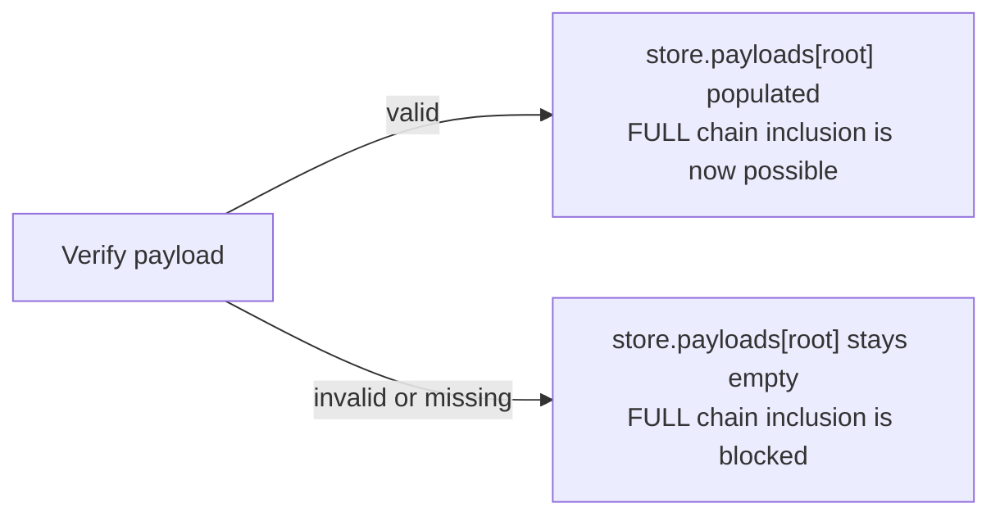

*Figure 6c: The outcome of execution validation. If `verify_execution_payload_envelope` succeeds, `store.payloads[root]` is populated with the payload; this is the sole mechanism that lets a later block declare the slot FULL on chain (§3). If verification fails or the payload never arrives, `store.payloads[root]` stays empty and no honest successor can declare the slot FULL, regardless of PTC votes or proposer declarations. The fork-choice mechanism that enforces this is described in Phase 5.*

Some time after the beacon block is published (typically before the PTC deadline) the builder reveals the execution payload by broadcasting a `SignedExecutionPayloadEnvelope`:

```python
@Upon(received SignedBeaconBlock containing this bid)
def reveal_payload(builder, block, store):
    if not is_head_of_chain(block, store):
        return                                              # honest withholding when block is not local head
    # Non-normative cautious-reveal precondition (see callout below):
    #      wait until T_att + Delta <= t_rev < T_payload_due - Delta
    #      AND >= 40% real attestation weight AND no proposer equivocation observed.
    envelope = ExecutionPayloadEnvelope(
        payload=builder.stored_payload,                     # same payload object as in submit_bid
        execution_requests=builder.stored_requests,
        builder_index=builder.index,
        beacon_block_root=hash_tree_root(block),
        parent_beacon_block_root=block.parent_root,
    )
    broadcast(SignedExecutionPayloadEnvelope(envelope, sign(envelope)))
```

**An honest builder reveals only when the beacon block is the fork-choice head; a dishonest builder may withhold strategically.** Honestly, if the block arrived late or a competing block won, revealing serves no purpose: the execution payload would not be used by the canonical chain. Dishonestly, a builder might withhold even when the block is canonical (for example, if the MEV opportunity that justified the bid has vanished). The unconditional payment mechanism (§7) ensures that strategic withholding does not let the builder avoid paying the proposer.

When nodes receive the payload, they run `on_execution_payload_envelope`. This verifies the execution payload against the execution engine and stores it, separately from the beacon block:

```python
def on_execution_payload_envelope(
    store: Store, signed_envelope: SignedExecutionPayloadEnvelope
) -> None:
    """
    Run ``on_execution_payload_envelope`` upon receiving a new execution payload envelope.
    """
    envelope = signed_envelope.message
    # The corresponding beacon block root needs to be known
    assert envelope.beacon_block_root in store.block_states

    # Check if blob data is available
    # If not, this payload MAY be queued and subsequently considered when blob data becomes available
    assert is_data_available(envelope.beacon_block_root)

    state = store.block_states[envelope.beacon_block_root]

    # Verify the execution payload envelope
    verify_execution_payload_envelope(state, signed_envelope, EXECUTION_ENGINE)

    # Add execution payload envelope to the store
    store.payloads[envelope.beacon_block_root] = envelope
```

**The single line `store.payloads[root] = envelope` is the only place where the gate for FULL chain inclusion opens.** If `verify_execution_payload_envelope` fails (invalid execution payload, EL rejection, blob data unavailable), this line is never reached and `store.payloads[root]` stays empty. Note that `store.payloads` stores the payload itself (not a post-state); the execution-layer state effects are applied later, inside `process_parent_execution_payload` when the next block is processed (see Phase 1b).

> **What "verify" means at the EL boundary.** `verify_execution_payload_envelope` ([fork-choice.md:834](consensus-specs/specs/gloas/fork-choice.md#L834)) ends in `execution_engine.verify_and_notify_new_payload(NewPayloadRequest(...))` ([fork-choice.md:864](consensus-specs/specs/gloas/fork-choice.md#L864)). The EL has no fast path that checks validity without running the transactions: it executes the payload against the parent's EL state, computes the resulting state root, and returns `True` only if the executed result matches what the payload claims. So "verify" here means **execute and check**, atomically — and consequently, **`store.payloads[B.root]` is populated *iff* this node's EL has executed and accepted B's payload.** Throughout the rest of the document, every phrase like "verified", "validated", "EL accepts the payload", or "payload locally available" denotes this same condition: the EL ran the transactions and the result was consistent.

**Execution validity gates FULL chain inclusion: a structural invariant, not an external property.** Every honest node has `store.payloads[B.root]` populated *if and only if* B's execution payload was locally received and validated; PTC votes, attestation weight, and proposer declarations cannot create the underlying data that the slot-N+1 chain-inclusion check (§3) requires. This is the strongest structural guarantee ePBS makes, but it is a per-node invariant: an external observer cannot directly inspect any node's store. They observe its consequences instead, most notably the fact that subsequent blocks declaring FULL on chain (via `bid.parent_block_hash`) only land on the canonical chain when the parent's execution payload was actually delivered, which is what Properties P3 (data availability for chain inclusion) and P4 (revealing protection, both cases) capture externally.

The builder's **payment** is not settled at this point. It is settled later, when the next block's `process_parent_execution_payload` → `apply_parent_execution_payload` → `settle_builder_payment` chain fires; this is Path A of the unconditional payment mechanism. The full mechanism, including what happens when the builder withholds, is described in §7.

#### Cautious-reveal protocols an honest builder can follow

The spec prescribes only the minimal honest rule: reveal when the block is timely and is the head of the local chain ([`builder.md`](https://github.com/ethereum/consensus-specs/blob/ec1c01f5f10fb60636a022ae8944c912b6da35f8/specs/gloas/builder.md)). The §4 property statements (P4, P5) reference *cautious-reveal protocols* that strengthen this minimum. Two protocols, one per case; an honest builder picks the one that matches their bid's payment field:

**Protocol A1a — trustless cautious-reveal (`bid.value > 0`).** Reveal only when all three conditions hold: (i) $T_{\mathrm{att}} + \Delta \leq t_{\mathrm{rev}} < T_{\mathrm{payload\_due}} - \Delta$ — a lower bound (the cautious-reveal floor, used to close the equivocation window) and an upper bound (network reveal-timing safety: the envelope reaches every honest PTC member before `get_payload_due_ms()` under **S1**; **L_verify** supplies the separate local payload/DA/EL processing liveness needed by P4); (ii) at least `PROPOSER_SCORE_BOOST` = 40% of $W$ in real attestations supporting the block; (iii) no proposer equivocation by `block.proposer_index` for `block.slot` is visible. The lower bound on (i) ensures any equivocation $B''$ broadcast at $t_{\mathrm{eq}} \leq T_{\mathrm{att}}$ is delivered to the builder by $t_{\mathrm{rev}}$ (S1), so (iii) sees it. The upper bound is the analogue of **A1b**'s reveal-timing-safety condition.

> *Feasibility of the A1a (i) interval.* The window $`[T_{\mathrm{att}} + \Delta,\; T_{\mathrm{payload\_due}} - \Delta)`$ has width $T_{\mathrm{payload\_due}} - T_{\mathrm{att}} - 2\Delta$, which is positive **iff $`\Delta < (T_{\mathrm{payload\_due}} - T_{\mathrm{att}})/2`$** — at the current calibration $`(T_{\mathrm{att}}, T_{\mathrm{payload\_due}}) = (25\%, 75\%)`$ that is $\Delta < 25\%$ of a slot $= T_{\mathrm{att}}$, which is exactly **S1**. So the A1a (i) interval is non-empty as a consequence of S1; no further network-timing assumption is needed for the interval itself.

<details>
<summary><b>Pseudocode (A1a)</b> (click to expand)</summary>

```python
@Upon(received SignedBeaconBlock containing this bid)
def reveal_payload(builder, block, ...):
    if not is_head_of_chain(block, store):
        return                                  # spec-minimal withhold rule

    # (A1a) Trustless cautious-reveal: three additional conditions.
    t_rev = time_in_slot()
    if not (
        T_att + Delta <= t_rev < T_payload_due - Delta          # (i) reveal window: lower bound = cautious-reveal floor,
                                                                #     upper bound = reveal-timing safety so envelope reaches
                                                                #     honest PTC before T_payload_due
        and real_attestation_weight(store, block) >= 0.40 * W   # (ii) >=40% real weight
        and not equivocation_visible(store,
                                     block.proposer_index,
                                     block.slot)                # (iii) no equivocation
    ):
        return                                  # withhold pending cautious-reveal conditions
    ...
    broadcast(envelope)
```

</details>

**Protocol A1b — non-trustless cautious-reveal (`bid.execution_payment > 0`, `bid.value = 0`).** Fix a *confirmation rule* $`R`$: a function that, given a node's view of the gossip layer and beacon-chain state, returns `confirmed` or `unconfirmed` for a beacon block. Fix the rule's *assumption set* $`\Sigma_R`$: the network-and-adversary assumptions under which $`R`$ is sound. We say $`R`$ is **provably secure under $`\Sigma_R`$** if, under every execution satisfying $`\Sigma_R`$, every block confirmed with $`R`$ remains in the canonical chain at every later time. A1b says: reveal only when (i) $`R(\text{view}, B)`$ returns `confirmed` at $`t_{\mathrm{rev}}`$, and (ii) $`t_{\mathrm{rev}}`$ is early enough that the broadcast payload + blob data reach the slot-$`N{+}1`$ builder, proposer, and PTC before their respective deadlines under **S1** (the 75% payload-arrival deadline `get_payload_due_ms()`, the PTC-vote deadline, and the slot-$`N{+}1`$ bid-construction time).

*Concrete example.* The **[Fast Confirmation Rule (FCR)](https://fastconfirm.it)** is one provably-secure choice for $R$. Its $\Sigma_{\mathrm{FCR}}$ is the conjunction of network synchrony, a Byzantine-fraction bound, and a quorum-threshold predicate on the block's accumulated attestations. An honest builder choosing FCR for $R$ inherits $\Sigma_{\mathrm{FCR}}$ as the assumption set under which P4's non-trustless case holds. Other confirmation rules with different $\Sigma_R$ (e.g., trading network strength for adversarial strength) are equally admissible; the property P4 is parametric in $R$.

<details>
<summary><b>Pseudocode (A1b)</b> (click to expand)</summary>

```python
@Upon(received SignedBeaconBlock containing this bid)
def reveal_payload(builder, block, ...):
    if not is_head_of_chain(block, store):
        return                                  # spec-minimal withhold rule

    # (A1b) Non-trustless cautious-reveal: confirm under R, broadcast in time.
    if not R_confirms(builder.confirmation_rule, store, block):
        return                                  # withhold pending R-confirmation
    if not reveal_time_safe_for_next_slot(time_in_slot(), block):
        return                                  # withhold if too late for slot N+1 actors
    ...
    broadcast(envelope)
```

</details>

> **Why 40% specifically (trustless case):** it equals the proposer boost (`PROPOSER_SCORE_BOOST = 40`), so a block with 40% real attestation weight cannot be reorged by the next proposer's boost alone.
>
> **Why check equivocation (trustless case):** the proposer might broadcast a conflicting block $B''$ after the builder has already observed the original $B$ as the head. Waiting for equivocation evidence protects the builder. Under synchrony with $\Delta < T_{\mathrm{att}}$ and A1a (i)'s reveal-time floor of $t_{\mathrm{rev}} \geq T_{\mathrm{att}} + \Delta$, the equivocation broadcast time $t_{\mathrm{eq}}$ splits into two cases:
>
> - $t_{\mathrm{eq}} \leq T_{\mathrm{att}}$. By **S1**, $B''$ reaches the builder by $t_{\mathrm{eq}} + \Delta \leq T_{\mathrm{att}} + \Delta \leq t_{\mathrm{rev}}$. The builder's A1a (iii) equivocation check fires; the builder withholds.
> - $`t_{\mathrm{eq}} > T_{\mathrm{att}}`$. Online honest slot-$`N`$ attesters voted at $`T_{\mathrm{att}}`$ before any of them received $`B''`$, so they all voted for $`B`$. $`B''`$ accumulates no online honest real weight; A1a (ii)'s 40% threshold cannot be met by Byzantine alone (capped at $`\beta W < 20\% W`$).
>
> Either way, $`B''`$ cannot threaten $`B`$'s canonicity: in the first case the builder withholds (so no payment is owed for a payload that might end up off-chain), in the second case $`B`$ retains $`\geq (1-\beta) W`$ online honest real weight while $`B''`$ has none. The reveal-time floor $`T_{\mathrm{att}} + \Delta`$ is exactly the smallest reveal time at which "no equivocation visible to the builder" implies "no equivocation visible to any honest slot-$`N`$ validator at $`T_{\mathrm{att}}`$".
>
> **Payment safety (trustless case):** if the proposer equivocates and the builder withholds, `process_proposer_slashing` clears the `BuilderPendingPayment` once a `ProposerSlashing` object is included and processed on the canonical chain. The builder is the obvious publisher of that evidence (it observed the equivocation directly during cautious-reveal) and has direct incentive to get it included to clear its own pending obligation. Combined with the Path B settlement timing established in §7 (a bid recorded at slot $N$ in epoch $e$ is settled at the end of epoch $e{+}1$, not $`e`$), this leaves at least one full epoch of headroom to process the slashing before the epoch-boundary quorum check runs. The spec supplies the clearing rule; the proof of P5 separately assumes timely inclusion and processing of the valid slashing in the equivocation-driven subcase where a canonical IOU for this builder bid remains. The no-weight subcase also has a separate side condition because `process_attestation` credits pending payments by slot, not by the attested head.
>
> **Why no payment safety in the non-trustless case:** the protocol records no `BuilderPendingPayment` IOU when `bid.value = 0`, so there is nothing for `process_proposer_slashing` to clear. The builder's reveal decision is purely about chain inclusion and reputation, not protocol exposure.

### Phase 4 — PTC deadline (t = 75%)

*Each PTC member broadcasts a witness statement reporting whether it observed the payload and the blob data: a binary observation, never a validity judgment.*

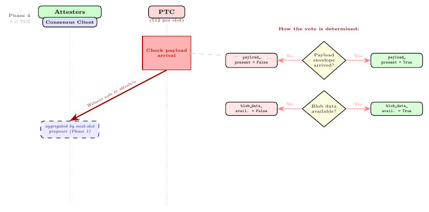

*Figure 7: Phase 4 (t = 75%), PTC witness-vote deadline. Each of the 512 PTC members runs `Check payload arrival` and broadcasts a vote carrying two independent signals: `payload_present` and `blob_data_available` (decision tree on the right). The vote is a binary observation, not a validity judgment (the Phase 4 `ptc_vote` code never calls the execution engine); the PTC primary path inside the slot-N+1 chain-inclusion check `should_extend_payload` (described in Phase 5) requires majority support on **both** signals.*

An honest PTC member's slot-level duty consists of three handlers that fire on independent triggers: `on_block` (when the beacon block arrives), `on_execution_payload_envelope` (when the payload arrives, if it does), and `ptc_vote` (at $`T_{\mathrm{ptc}}`$). The first two are common to all nodes; every node processes blocks and payloads the same way. The third is PTC-specific. Below we focus on `ptc_vote`. The handler corresponds to the spec handler in [`validator.md`](https://github.com/ethereum/consensus-specs/blob/ec1c01f5f10fb60636a022ae8944c912b6da35f8/specs/gloas/validator.md) ("Constructing a payload attestation message"). The four lookup helpers (`has_beacon_block_for_slot`, `get_beacon_block_root_for_slot`, `has_execution_payload_envelope`, `check_blob_data`) are pedagogical names for the corresponding inline checks in the spec prose (the spec uses `is_data_available` for the blob-data check; the others are described in prose rather than as named helpers):

```python
@Upon(time_in_slot == T_ptc and validator.index in get_ptc(state, slot))
def ptc_vote(validator, slot, state, store):
    if not has_beacon_block_for_slot(store, slot):
        return                                              # No block, no vote
    block_root = get_beacon_block_root_for_slot(store, slot)
    msg = PayloadAttestationMessage(
        validator_index=validator.index,
        data=PayloadAttestationData(
            beacon_block_root=block_root,
            slot=slot,
            payload_present=has_execution_payload_envelope(store, block_root),  # report observation
            blob_data_available=check_blob_data(store, block_root),             # spec: is_data_available
        ),
        signature=sign(...),
    )
    broadcast(msg)
```

Three observations about this handler:

- **No block, no vote.** If no beacon block has arrived by $T_{\mathrm{ptc}}$, the early return fires. *Absence of a block is not a vote with `payload_present = False`; it is no vote at all*.
- **The vote is tied to the assigned slot's block.** Gossip validation ignores a `payload_attestation_message` unless the referenced block is at `data.slot` (`block.slot == data.slot`), and `on_payload_attestation_message` returns early if `data.slot != state.slot`. A PTC vote for slot $N$ therefore reports on a slot-$N$ beacon block; it cannot redirect the assigned-slot vote to an inherited head from an earlier slot when slot $N$ has no block.
- **Payload handling is best-effort.** A late or missing envelope simply leaves the PTC's `payload_present` signal at `False` — the member never observed an envelope on gossip before the deadline. The separate `blob_data_available` signal is similarly best-effort against `is_data_available`. (`store.payloads`, populated only after the envelope passes both DA and execution-validity checks, is a *stronger* condition that the slot-N+1 fork-choice gate uses (§6); it is not the gate the PTC vote uses.)
- **The vote can be cast at the PTC deadline or earlier on receipt.** The `@Upon(time_in_slot == T_ptc ...)` form above shows a PTC member that waits until $T_{\mathrm{ptc}}$ and evaluates the store at that moment. A member is also allowed to broadcast its witness vote earlier (as drawn in Figures 2 and 6a) — but the two signals `payload_present` and `blob_data_available` are evaluated at message construction time, so a member that votes immediately on envelope arrival, before its sampled blob columns have come in, will commit to `(payload_present = True, blob_data_available = False)` even if the blobs would have arrived by the deadline. The proofs in §9 therefore assume an honest PTC member that votes before $T_{\mathrm{ptc}}$ waits until both signals are positive locally; a member that has not seen both by $T_{\mathrm{ptc}}$ votes at the deadline on whatever it has. This is not a spec requirement — the spec only mandates the vote be broadcast by `get_payload_attestation_due_ms()` — but it is the honest-actor reading the proofs adopt.
- **Two separate deadlines.** The spec distinguishes the **payload-arrival deadline** `get_payload_due_ms()` (parameter `PAYLOAD_DUE_BPS = 7500`, currently 75% of the slot) from the **PTC-vote deadline** `get_payload_attestation_due_ms()` (parameter `PAYLOAD_ATTESTATION_DUE_BPS = 7500`, also 75% currently). The PTC member sets `data.payload_present = True` only if the envelope arrived strictly **before `get_payload_due_ms()`**, not merely at any point before the vote is cast. This separation closes a builder-side ex-ante reorg vector: a builder cannot release the payload right before the vote deadline to ensure timeliness while leaving the next proposer with no time to import it. The two constants are equal in the current calibration but may diverge in future spec revisions.

**The PTC vote contains two independent signals, because the builder delivers two things:**

- **`payload_present`** — did the payload arrive (spec object: `SignedExecutionPayloadEnvelope`)? The payload carries the transactions, state root, withdrawals: the content that the execution engine validates.
- **`blob_data_available`** — did the blob data arrive? Blobs are large binary data chunks (EIP-4844) used by rollups for cheap temporary storage. Each blob is split into 128 data columns distributed across the p2p network via subnets; no single node downloads all columns. Each PTC member checks whether the columns it is responsible for arrived and pass KZG proof verification. The KZG commitments for these blobs are included in the builder's bid (`bid.blob_kzg_commitments`).

**The payload and the blob data arrive through separate gossip channels and can diverge.** The execution payload carries the transactions that update Ethereum's state (account balances, smart contracts); blob data provides temporary data availability for rollups. A PTC member might receive the payload but not yet have the blob columns, or vice versa.

**The PTC member reports what it observed, not what it judged.** It does not call `verify_execution_payload_envelope` or any validation function; it only checks arrival on the gossip network. This decoupling between observation (PTC) and validation (`verify_execution_payload_envelope`) is fundamental: it allows the PTC vote to be fast (no heavy execution required) while validity remains enforced separately by `store.payloads` (populated by `on_execution_payload_envelope` only after the execution engine verifies the execution payload; see Phase 3).

**The PTC primary path requires majority support on both signals.** `should_extend_payload` (described in Phase 5) consults both `payload_timeliness(store, root, timely=True)` (majority voted `payload_present = True`) AND `payload_data_availability(store, root, available=True)` (majority voted `blob_data_available = True`). If either fails, the PTC-driven path of the check fails; Phase 5 describes the proposer-side fallbacks that may still fire in that case.

**Witness-statement semantics is honest-handler behaviour, not an external property.** Honest PTC members vote `payload_present = True` if and only if they locally observed the payload, and `blob_data_available = True` if and only if the blob data columns they are responsible for arrived and pass KZG verification; they never check execution validity. This is what the Phase 4 `ptc_vote` code does (it does not call `verify_execution_payload_envelope`). An external observer cannot tell from a PTC vote alone whether the member "actually saw" the payload; the proofs cite the Phase 4 code when they need this fact, but it is not externally checkable from messages.

> **What if the PTC lies about a missing payload?** Suppose the builder for slot N never reveals, but a malicious PTC majority votes `payload_present = True`. This has no effect on chain inclusion. Under honest majority, no honest node has `store.payloads[B.root]` populated; `on_execution_payload_envelope` never ran. The slot-N+1 chain-inclusion check (which Phase 5 describes in detail via `should_extend_payload`) depends on this `store.payloads` entry; without it the check fails at every honest node, no honest successor sets `bid.parent_block_hash = bid_B.block_hash`, and B stays EMPTY on chain (§3) regardless of how the PTC voted. PTC votes can influence which existing branch wins among those the chain already considers, but they cannot create chain inclusion for a payload the execution engine never validated.

---

## 6. Phase 5 and Fork Choice

> **TL;DR.** At the start of slot N+1, `get_head` traverses the fork-choice tree to pick the canonical head. Under ePBS the tree's nodes are `(root, payload_status)` pairs, so the traversal must also resolve the payload status of slot N, using PTC votes or (if those are unavailable) proposer-side fallbacks. This section walks through the Phase-5 outcome and then provides the full body of every fork-choice function the traversal calls.

### Phase 5 — Slot N+1 starts: the fork-choice resolves

*At the start of the next slot, `get_head` traverses the fork-choice tree to pick the canonical head. Under ePBS the tree's nodes are `(root, payload_status)` pairs, so the traversal must also resolve the payload status of the previous slot's block, using PTC votes or (if those are unavailable) proposer-side fallbacks.*

#### The fork-choice tree is a tree of nodes, not blocks

The on-chain FULL/EMPTY notion of §3 (defined by comparing successor `bid.parent_block_hash` to predecessor `bid.block_hash`) describes what *the canonical chain* eventually records. The fork-choice rule needs to *decide* the canonical chain, so before any block has been finalized it must reason about both possibilities. This is the change ePBS makes inside the fork-choice tree.

> **Definition (fork-choice node).** Under ePBS, the fork-choice tree is a tree of *nodes*, where each node is a `ForkChoiceNode(root, payload_status)` with `payload_status ∈ {PENDING, FULL, EMPTY}`. The node, not the block, is the primary fork-choice abstraction. For readability, figures and prose often write the same object as `(root, payload_status)`.

**Multiple nodes can reference the same block, each carrying a different payload status.** Pre-ePBS, each block maps to exactly one node. Under ePBS, because the execution payload arrives separately from the beacon block and may or may not arrive at all, the fork-choice tree represents both possibilities:

- **PENDING** — the node represents a block whose payload-delivery outcome has not yet been decided by the fork-choice.
- **FULL** — the node represents the world where the block's execution payload was revealed and validated.
- **EMPTY** — the node represents the world where the block's execution payload was not delivered.

**The tree alternates between PENDING nodes and payload-status nodes.** A PENDING node branches into FULL and EMPTY children (both if the payload was validated locally; only EMPTY otherwise), and each FULL or EMPTY node branches into PENDING nodes for the next blocks in the chain. The fork-choice traversal makes two kinds of decisions at each level: "which payload status?" (choosing between the FULL and EMPTY nodes for a given block) and "which next block?" (choosing among PENDING child nodes).

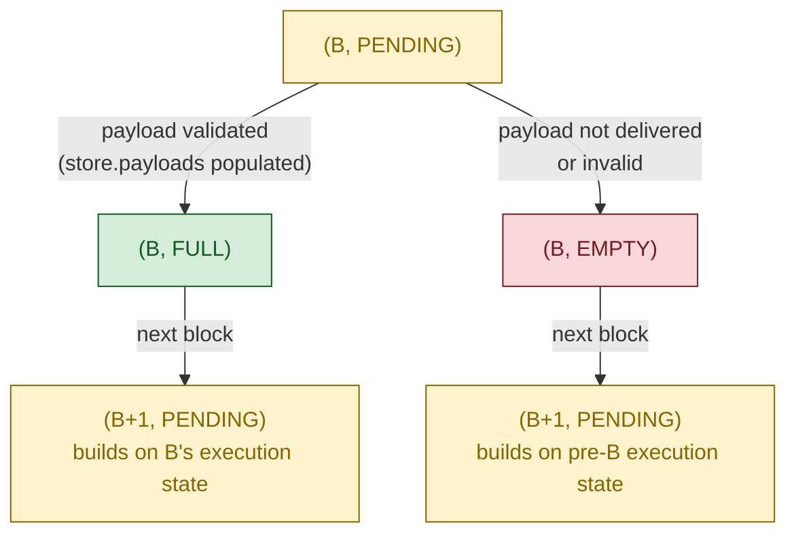

*Figure 8: The ePBS fork-choice tree around block B. Pre-ePBS, B maps to one node; under ePBS, three distinct nodes reference B: `(B, PENDING)`, `(B, FULL)`, `(B, EMPTY)`. The `(B, FULL)` node exists only if `store.payloads` has been populated for B (i.e., only if the execution engine locally accepted B's execution payload; see Phase 3). The next block's PENDING node descends from whichever payload-status node it builds on, declared via `bid.parent_block_hash`.*

**Relation to §3's on-chain FULL/EMPTY.** §3 defines FULL/EMPTY as a retrospective property of the canonical chain. Phase 5's fork-choice nodes are the *forward-looking* version: at slot N+1 the tree carries both `(B, FULL)` and `(B, EMPTY)` as candidate worlds, and `get_head` picks one. The chosen branch becomes canonical; the next canonical block's `bid.parent_block_hash` then records that choice on chain, which is what §3's definition observes after the fact.

#### `get_head` traversal

**ePBS extends LMD-GHOST without replacing it.** Ethereum's existing fork-choice function selects the head by iteratively picking the child with the highest attestation weight; the ePBS modification is that the tree now carries multiple nodes per block, so the traversal must resolve payload status in addition to choosing between competing blocks. The two kinds of decisions:

- At a PENDING node: branch into FULL and EMPTY children (only FULL exists if `is_payload_verified(store, root)` returns true, which by Phase 3 requires the execution engine to have verified the payload)
- At a FULL or EMPTY node: branch into the next blocks in the chain (children whose `bid.parent_block_hash` matches the parent's committed status)

```python
def get_head(store: Store) -> ForkChoiceNode:
    # Get filtered block tree that only includes viable branches
    blocks = get_filtered_block_tree(store)
    # Execute the LMD-GHOST fork-choice
    head = ForkChoiceNode(
        root=store.justified_checkpoint.root,
        payload_status=PAYLOAD_STATUS_PENDING,
    )

    while True:
        children = get_node_children(store, blocks, head)
        if len(children) == 0:
            return head
        # Sort by latest attesting balance with ties broken lexicographically
        head = max(
            children,
            key=lambda child: (
                get_weight(store, child),
                child.root,
                get_payload_status_tiebreaker(store, child),
            ),
        )
```

**`get_head` picks the child with the highest value of a three-key sort.** First `get_weight` (attestation weight), then block root (lexicographic, for determinism), then **the payload-status tiebreaker**: a PTC-based priority function that matters only when the first two keys tie. Internally, `get_payload_status_tiebreaker` consults `should_extend_payload` only for FULL/EMPTY payload-decision nodes whose block is exactly one slot behind the current slot.

#### How FULL vs. EMPTY is decided

**The FULL vs. EMPTY decision for a block depends on how old the block is.** There are two cases.

**Case 1: The immediately previous slot's block.** Same-slot attesters set `data.index = 0`: they have no payload opinion (same-slot payload-neutrality, see §5 Phase 2). The protocol returns weight 0 for both FULL and EMPTY (the *zero-return rule*) and delegates to the **tiebreaker**, which reads the PTC votes. This is the normal path: the PTC is the informed signal for the most recent block.

**Case 2: Older blocks (missed slot).** If slot N+1 is missed, slot N+1's attesters make non-same-slot attestations for block B (from slot N). They observed B's execution payload, so they set `data.index = 1`. At slot N+2, the zero-return rule no longer applies to B, and `get_weight` computes full attestation scores; FULL wins by weight, no tiebreaker needed. This is why `data.index = 1` exists: a missed slot prevents the PTC from being consulted, so the protocol falls back to attestation-derived weight from the slot-N+1 attesters who voted on slot N's head.

> **Concrete example.** Block B at slot 50, builder reveals. Slot 51 missed. Slot 51's attesters vote for B with `data.index = 1`. At slot 52, `slot(B) + 1 = 51 ≠ 52`, so the zero-return rule does not apply. `get_weight(B, FULL)` counts slot 51's attesters; `get_weight(B, EMPTY) = 0`. FULL wins, and an honest proposer building on that FULL head has `should_build_on_full(store, head) = True` because the head is older than the immediately previous slot.

In practice, most FULL/EMPTY decisions are resolved by the tiebreaker (Case 1) at slot N+1. Case 2 is the fallback for missed slots.

Let us look at how the tiebreaker works in Case 1:

```python
def is_previous_slot_payload_decision(store: Store, node: ForkChoiceNode) -> bool:
    is_previous_slot = store.blocks[node.root].slot + 1 == get_current_slot(store)
    is_payload_decision = node.payload_status in [PAYLOAD_STATUS_EMPTY, PAYLOAD_STATUS_FULL]
    return is_previous_slot and is_payload_decision


def get_payload_status_tiebreaker(store: Store, node: ForkChoiceNode) -> uint8:
    if is_previous_slot_payload_decision(store, node):
        if node.payload_status == PAYLOAD_STATUS_EMPTY:
            return 1
        if should_extend_payload(store, node.root):
            return 2
        return 0
    else:
        return node.payload_status


def should_extend_payload(store: Store, root: Root) -> bool:
    if not is_payload_verified(store, root):
        return False
    proposer_root = store.proposer_boost_root
    payload_is_timely = payload_timeliness(store, root, timely=True)
    payload_data_is_available = payload_data_availability(store, root, available=True)
    return (
        (payload_is_timely and payload_data_is_available)
        or proposer_root == Root()
        or store.blocks[proposer_root].parent_root != root
        or is_parent_node_full(store, store.blocks[proposer_root])
    )
```

**`should_extend_payload` first checks a hard precondition, then evaluates four independent conditions.** The function decides whether to favor FULL for a specific block, call it B. The hard precondition is `is_payload_verified(store, root)`: the node must have locally verified B's execution payload via `on_execution_payload_envelope`. If it fails, the function returns False immediately. This hard guard exists primarily to protect the fallback conditions below: the PTC primary path already checks `is_payload_verified` internally, but the fallbacks do not. Without the hard guard, fallback (a), (b), or (c) could favor FULL for a payload the node has never received. If the hard guard passes, the function evaluates four independent conditions, and any one returning True is sufficient. The intuition behind each condition:

- **PTC primary path** — "The committee confirms both the payload and the blob data arrived." Two independent PTC majority signals must hold: `payload_timeliness(store, root, timely=True)` (a majority of PTC members voted `payload_present = True`, confirming the payload arrived in time) AND `payload_data_availability(store, root, available=True)` (a majority voted `blob_data_available = True`, confirming the blob data columns arrived). These are two separate checks on two separate PTC vote arrays, because the payload and the blob data arrive through different gossip channels and can diverge. This is direct evidence of full delivery, the strongest signal available. (Each helper takes a boolean second argument because the same predicate is also used to count "not-timely" / "not-available" votes when the proposer needs to decide whether to *reorg* an unavailable block; see `should_build_on_full` below.)
- **Fallback (a): no block proposed yet for the next slot** — "Nobody has said otherwise, so give B's builder the benefit of the doubt." If the slot N+1 proposer has not published a block yet, there is no contrary declaration about B's execution payload. Defaulting to EMPTY would punish B's builder before anyone has even claimed B's execution payload is missing, so the protocol defaults to FULL for B.
- **Fallback (b): the slot N+1 block is on a different branch** — "The slot N+1 proposer is not building on B at all." A block was proposed for slot N+1, but its parent is some other block, not B. The slot N+1 proposer's FULL/EMPTY declaration says nothing about B; it is about a different part of the tree. Default to FULL for B.
- **Fallback (c): the slot N+1 block builds on B and declares B was FULL** — "The slot N+1 proposer agrees that B's execution payload was delivered." The slot N+1 block is a child of B and its `bid.parent_block_hash` matches B's committed `block_hash`, meaning the slot N+1 builder read B's execution state and built on top of it. The proposer is confirming delivery.

> **Which fallback is live at which time.** Fallbacks (b) and (c) require `proposer_root != Root()`, so only the PTC primary path and **fallback (a)** are reachable from the slot-N+1 proposer's *own* `get_head` at construction time (when `on_tick_per_slot` has just reset `proposer_boost_root`). Fallback (a) can make `get_head` select FULL when the parent payload is locally verified and no slot-N+1 block has yet made a contrary declaration. That fork-choice result is then filtered by `should_build_on_full`: for an immediately previous-slot FULL head, an honest proposer builds EMPTY if the PTC has a negative quorum on either payload timeliness or blob-data availability. Fallbacks (b) and (c) only become reachable afterward, once every other honest node runs `get_head` against the now-broadcast slot-N+1 block, and the proposer's `parentStatus` declaration determines which of them fires for the rest of the network.

**`should_extend_payload` returns False under two disjunctive conditions:** (i) `is_payload_verified(store, B.root)` is False, meaning this node has not locally validated B's payload, so FULL is not a sound choice for this node's fork-choice; OR (ii) the hard guard passes but all four conditions of the disjunction fail: PTC primary fails AND a slot N+1 block exists AND it builds on B AND it declares EMPTY.

**`should_build_on_full`: the proposer's stricter constraint.** `should_extend_payload` is the tiebreaker every node consults inside `get_head`. The slot N+1 proposer, in addition, must consult a stricter helper before constructing its block:

```python
def should_build_on_full(store: Store, head: ForkChoiceNode) -> bool:
    assert head.payload_status != PAYLOAD_STATUS_PENDING
    if head.payload_status == PAYLOAD_STATUS_EMPTY:
        return False
    if store.blocks[head.root].slot + 1 != get_current_slot(store):
        return True
    if payload_data_availability(store, head.root, available=False):
        return False
    if payload_timeliness(store, head.root, timely=False):
        return False
    return True
```

The slot N+1 proposer uses this helper before constructing the parts of its block that depend on the parent's execution state. If `head` is EMPTY, the proposer builds on EMPTY. If `head` is FULL and older than the immediately previous slot, the proposer builds on FULL because fork choice has already resolved that payload branch by weight. If `head` is the immediately previous slot's FULL node, either negative PTC quorum is enough to make the proposer build on EMPTY: `blob_data_available = False` via `payload_data_availability(..., available=False)`, or `payload_present = False` via `payload_timeliness(..., timely=False)`. Otherwise, the proposer builds on FULL.

The same decision fixes accepted bid construction. When `should_build_on_full(store, head)` is True, the selected bid's `parent_block_hash` must be `state.latest_execution_payload_bid.block_hash`; when it is False, the selected bid's `parent_block_hash` must be `state.latest_execution_payload_bid.parent_block_hash`. Thus external bids, `parent_execution_requests`, and self-build payload preparation all describe the same FULL/EMPTY parent state.

**Local verification versus PTC-wide construction vetoes.** Two signal families operate in the protocol and can disagree:

- **Local payload verification** (`is_payload_verified(store, root)`, populated by `on_execution_payload_envelope`; see §5 Phase 3): a per-node gate requiring the payload envelope, blob-data availability, and execution-engine verification. It determines whether the FULL node can exist locally and whether a FULL-declaring successor passes `on_block`'s parent-FULL assertion at this node.
- **PTC aggregate observations** (`payload_timeliness(store, root, timely=True/False)` and `payload_data_availability(store, root, available=True/False)`): quorum signals derived from the previous slot's PTC votes. They decide the PTC primary path inside `should_extend_payload`, and their negative forms constrain honest proposer construction through `should_build_on_full`.

Under asymmetric delivery, the two can disagree: a proposer may locally verify B's payload while the PTC majority reports that the payload envelope or blob data did not arrive as required. For an immediately previous-slot FULL head, `should_build_on_full` resolves the honest construction choice in favor of the negative PTC quorum: the proposer builds on EMPTY even if its own local copy of B's payload passes verification. This helper is an honest-construction rule, not an `on_block` admission rule; a FULL-declaring successor is admitted at a node exactly when that node has locally verified the parent payload.

**Combined interaction: what determines FULL on chain at slot N+1.** Assuming the builder revealed and `store.payloads[B.root]` is populated at honest nodes, the slot-N+1 outcome depends on the PTC's two-dimensional vote and the proposer's behaviour:

| PTC `payload_present` (timeliness) | PTC `blob_data_available` (DA) | Slot N+1 proposer            | Outcome   | Mechanism                                                                                           |
| ------------------------------------ | -------------------------------- | ---------------------------- | --------- | --------------------------------------------------------------------------------------------------- |
| Majority True                        | Majority True                    | Honest (declares FULL)       | FULL      | PTC primary path AND fallback (c) confirm                                                           |
| Majority True                        | Majority True                    | Malicious (declares EMPTY)   | FULL      | PTC primary path overrides the proposer's false EMPTY                                               |
| Majority False                       | Majority True                    | Honest (builds on EMPTY)     | **EMPTY** | `should_build_on_full` returns False on the negative timeliness quorum                              |
| Majority False                       | Majority True                    | Malicious (declares EMPTY)   | **EMPTY** | Primary path and all fallbacks fail                                                                 |
| Majority False                       | Majority True                    | Malicious (declares FULL)    | FULL      | The FULL-declaring successor passes the parent-FULL assertion under this table's premise; fallback (c) fires |
| any                                  | **Majority False**               | Honest (builds on EMPTY)     | **EMPTY** | `should_build_on_full` returns False on the negative DA quorum                                      |
| any                                  | **Majority False**               | Malicious (declares EMPTY)   | **EMPTY** | Primary path and all fallbacks fail                                                                 |
| any                                  | **Majority False**               | Malicious (declares FULL)    | FULL      | The FULL-declaring successor passes the parent-FULL assertion under this table's premise; fallback (c) fires |

> **The PTC's bidirectional authority.** The fork-choice rule treats the PTC as the network's authoritative previous-slot delivery witness, with two-sided authority:
>
> - A **malicious slot-N+1 proposer alone cannot force EMPTY**: an honest-online PTC majority producing True-quorums on both signals overrides the proposer via the PTC primary path.
> - A **malicious PTC majority producing a negative quorum on either signal can force an honest successor to build EMPTY** for an immediately previous-slot FULL head: `should_build_on_full` returns False on either `payload_present = False` or `blob_data_available = False`.
> - A **malicious slot-N+1 proposer can still declare FULL** despite a negative PTC quorum if the parent-FULL assertion passes locally. `should_build_on_full` constrains honest construction; it is not a protocol admission check.
>
> Under the structural assumption **S3** (honest-online PTC majority), no negative quorum on either signal arises against an honestly revealed payload, so honest builders are protected (this is the PTC-honesty setting used by P4). Outside S3, a malicious PTC majority can force an honest successor to build EMPTY without proposer collusion: the cost of treating the PTC's collective observations as authoritative.

### Fork-choice machinery in detail

*The traversal above (`get_head`) calls a handful of helpers whose bodies are described in prose by `fork-choice.md`. We give the operative pseudocode for each, so the verification reasoning further down can cite a concrete function body. `get_head`, `is_previous_slot_payload_decision`, `get_payload_status_tiebreaker`, `should_extend_payload`, and `should_build_on_full` were shown above; the remaining helpers (`get_node_children`, `get_weight`, `get_supported_node`, `is_ancestor`, proposer-boost update, and the `on_block` admission check) are below.*

**`get_node_children`.** Returns `{(r, EMPTY), (r, FULL)}` for a PENDING input (with the FULL child present only if `is_payload_verified(store, r)` is true) and only `(r', PENDING)` nodes for a FULL/EMPTY input. Consequently, `(r, FULL)` is reachable in the tree only as a child of `(r, PENDING)`.

```python
def get_node_children(
    store: Store, blocks: Dict[Root, BeaconBlock], node: ForkChoiceNode
) -> Sequence[ForkChoiceNode]:
    if node.payload_status == PAYLOAD_STATUS_PENDING:
        children = [ForkChoiceNode(root=node.root, payload_status=PAYLOAD_STATUS_EMPTY)]
        if is_payload_verified(store, node.root):
            children.append(ForkChoiceNode(root=node.root, payload_status=PAYLOAD_STATUS_FULL))
        return children
    else:
        return [
            ForkChoiceNode(root=root, payload_status=PAYLOAD_STATUS_PENDING)
            for root in blocks
            if (
                blocks[root].parent_root == node.root
                and node.payload_status == get_parent_payload_status(store, blocks[root])
            )
        ]
```

**`get_weight`.** Returns 0 exactly when `is_previous_slot_payload_decision(store, node)` is true: the node is FULL or EMPTY, and its block is exactly one slot behind the current slot. For all other nodes, it computes the inherited LMD attestation score **plus** the proposer-boost weight: `PROPOSER_SCORE_BOOST` (currently 40% of one slot's committee), applied when the node is an ancestor of `ForkChoiceNode(store.proposer_boost_root, PENDING)`.

```python
def get_weight(store: Store, node: ForkChoiceNode) -> Gwei:
    if is_previous_slot_payload_decision(store, node):
        return Gwei(0)

    state = store.checkpoint_states[store.justified_checkpoint]
    attestation_score = get_attestation_score(store, node, state)
    if not should_apply_proposer_boost(store):
        return attestation_score

    proposer_score = Gwei(0)
    proposer_boost_node = ForkChoiceNode(
        root=store.proposer_boost_root, payload_status=PAYLOAD_STATUS_PENDING
    )
    if is_ancestor(store, proposer_boost_node, node):
        proposer_score = get_proposer_score(store)

    return attestation_score + proposer_score
```

**`get_supported_node` and `is_ancestor`.** These two helpers define when a latest message supports a fork-choice node. `get_supported_node` first turns the latest message into a `ForkChoiceNode`: direct same-slot messages map to `PENDING`, while non-same-slot messages map to `FULL` or `EMPTY` according to `message.payload_present`. Then `get_attestation_score` counts the message for a candidate node exactly when that candidate is an ancestor of the supported node under `is_ancestor`.

*Direct vote on the same block.* If `message.root = r` and `message.slot = slot(B_r)`, `get_supported_node` returns `(r, PENDING)`: the vote supports the block's PENDING node, but not its FULL or EMPTY node. If `message.root = r` and `message.slot > slot(B_r)`, `get_supported_node` returns `(r, FULL)` iff `message.payload_present = True`, and `(r, EMPTY)` iff `message.payload_present = False`.

*Descendant vote.* If the vote is on a descendant of $B_r$, `get_ancestor` walks the chain back to `slot(B_r)` and reads the chain's structural `parentStatus` declarations. The voter's own `payload_present` field only determines the status of the block it directly voted for when that vote is non-same-slot; ancestor FULL/EMPTY attribution comes from the chain.

```python
def get_supported_node(store: Store, message: LatestMessage) -> ForkChoiceNode:
    """
    Return a node supported by the ``message``.
    """
    block = store.blocks[message.root]
    if block.slot < message.slot:
        if message.payload_present:
            payload_status = PAYLOAD_STATUS_FULL
        else:
            payload_status = PAYLOAD_STATUS_EMPTY
    else:
        payload_status = PAYLOAD_STATUS_PENDING
    return ForkChoiceNode(root=message.root, payload_status=payload_status)

def is_ancestor(store: Store, node: ForkChoiceNode, ancestor: ForkChoiceNode) -> bool:
    node_ancestor = get_ancestor(store, node, store.blocks[ancestor.root].slot)
    if node_ancestor.root != ancestor.root:
        return False

    return (
        node_ancestor.payload_status == ancestor.payload_status
        or ancestor.payload_status == PAYLOAD_STATUS_PENDING
    )
```

**Proposer boost update.** A block receives proposer boost only if it is the first boosted block for the slot, it arrived before the attestation deadline, and its dependent root matches the dependent root of the pre-insertion head. The dependent-root check keeps proposer boost aligned with the canonical chain's shuffling dependency.

```python
def get_dependent_root(store: Store, root: Root) -> Root:
    epoch = get_current_store_epoch(store)
    if epoch <= MIN_SEED_LOOKAHEAD:
        return Root()

    node = ForkChoiceNode(
        root=root,
        payload_status=PAYLOAD_STATUS_PENDING,
    )
    dependent_slot = Slot(compute_start_slot_at_epoch(epoch - MIN_SEED_LOOKAHEAD) - 1)
    return get_ancestor(store, node, dependent_slot).root


def update_proposer_boost_root(store: Store, head: Root, root: Root) -> None:
    is_first_block = store.proposer_boost_root == Root()
    is_timely = store.block_timeliness[root][ATTESTATION_TIMELINESS_INDEX]
    is_same_dependent_root = get_dependent_root(store, root) == get_dependent_root(store, head)

    if is_timely and is_first_block and is_same_dependent_root:
        store.proposer_boost_root = root
```

**`on_block` (fork-choice's block-admission entry point).** `on_block` is the function each honest node runs whenever a new `SignedBeaconBlock` arrives via gossip. It is *the* gate between the network and the local view: a block becomes part of the node's chain only after `on_block` admits it. The structure is a sequence of admission checks, followed by `state_transition` (which applies the block to compute the post-state), followed by store updates. All admission checks run **before** `state_transition` — so a failed admission check prevents `state_transition` (and everything it triggers, including `process_block` → `process_parent_execution_payload`) from running at this node.

The parent-FULL admission check is the **parent-FULL assertion**: when a block declares `parentStatus = FULL` for its parent (via `bid.parent_block_hash == state.latest_execution_payload_bid.block_hash`), `on_block` asserts `is_payload_verified(store, block.parent_root)`, i.e., `block.parent_root ∈ store.payloads`. If the assertion fails, the block is rejected. This is how the spec enforces the two-world model: a block cannot claim FULL ancestry without the parent's payload actually existing in the local store. Crucially, this check runs *before* `state_transition`.

For proposer boost, `on_block` computes the fork-choice head before inserting the new block into the store and passes that pre-insertion head to `update_proposer_boost_root`. The boost check therefore compares the new block's dependent root against the dependent root of the canonical chain head as it stood before the block was admitted.

```python
def on_block(store: Store, signed_block: SignedBeaconBlock) -> None:
    """
    Run ``on_block`` upon receiving a new block.
    """
    block = signed_block.message
    # Parent block must be known
    assert block.parent_root in store.block_states

    # If this block builds on the parent's full payload, that payload must
    # have been verified by on_execution_payload_envelope
    if is_parent_node_full(store, block):
        assert is_payload_verified(store, block.parent_root)

    # Blocks cannot be in the future. If they are, their consideration must be delayed until they are in the past.
    current_slot = get_current_slot(store)
    assert current_slot >= block.slot

    # Check that block is later than the finalized epoch slot (optimization to reduce calls to get_ancestor)
    finalized_slot = compute_start_slot_at_epoch(store.finalized_checkpoint.epoch)
    assert block.slot > finalized_slot
    # Check block is a descendant of the finalized block at the checkpoint finalized slot
    finalized_checkpoint_block = get_checkpoint_block(
        store,
        block.parent_root,
        store.finalized_checkpoint.epoch,
    )
    assert store.finalized_checkpoint.root == finalized_checkpoint_block

    # Make a copy of the state to avoid mutability issues
    state = copy(store.block_states[block.parent_root])

    # Check the block is valid and compute the post-state
    block_root = hash_tree_root(block)
    state_transition(state, signed_block, validate_result=True)

    # Compute head before applying the block
    head = get_head(store)
    # Add new block to the store
    store.blocks[block_root] = block
    # Add new state for this block to the store
    store.block_states[block_root] = state
    # Add a new PTC voting for this block to the store
    store.payload_timeliness_vote[block_root] = [None] * PTC_SIZE
    store.payload_data_availability_vote[block_root] = [None] * PTC_SIZE

    # Notify the store about the payload_attestations in the block
    notify_ptc_messages(store, state, block.body.payload_attestations)

    record_block_timeliness(store, block_root)
    update_proposer_boost_root(store, head.root, block_root)

    # Update checkpoints in store if necessary
    update_checkpoints(store, state.current_justified_checkpoint, state.finalized_checkpoint)

    # Eagerly compute unrealized justification and finality.
    compute_pulled_up_tip(store, block_root)
```

---

## 7. Payment mechanism (trustless case)

> **TL;DR.** This section describes the mechanism that implements **P6** (unconditional payment) and **P5** (builder withholding protection, trustless). The IOU is recorded at bid time (only when `bid.value > 0`); queueing for transfer normally happens via **Path A** (next block, when the builder reveals) or **Path B** (epoch boundary, gated by a 60% attestation quorum), with a rare **Path C** old-parent branch in the missed-slot corner. Path A suppresses Path B, so the proposer is paid exactly once. End-to-end, the `BuilderPendingWithdrawal` is **eventually queued** under P6's attestation-inclusion hypothesis; the actual EL credit follows when a subsequent canonical FULL block drains the queue and its execution payload is accepted (typically a few slots later under standard liveness). Path B's quorum is what makes P5 work: under **I_payweight**, a builder who withholds in the no-weight subcase is not charged.
>
> **Scope.** This section applies only to the trustless case (`bid.value > 0`). In the non-trustless case (`bid.execution_payment > 0`, `bid.value = 0`) no IOU is recorded, no path fires, and there is no corresponding mechanism to document: P4's non-trustless case reveal-protection argument routes through canonicity ($`\Sigma_R`$) and chain-inclusion (**S3**, honest slot-$`N`$ PTC majority) rather than through any payment machinery, and P5's non-trustless case is degenerate (cf. §9.3). There is no §7-analogue for the non-trustless case because the protocol has no payment machinery to describe there.

**The payment mechanism is what gives the trustless case its name.** A proposer that accepts a trustless bid (`bid.value > 0`) can commit to it without trusting the builder, because the payment will arrive regardless of what the builder does under P6's stated assumptions. The mechanism below (IOU, Path A, Path B, the Path C missed-slot corner, and the 60% quorum) is what makes this work. With non-trustless payment, none of this machinery exists, and the proposer is back to trusting the builder.

**Payment under ePBS is deferred.** Pre-ePBS the proposer's MEV revenue arrived immediately. Under ePBS the two common settlement paths defer it: Path A fires at the *next* block when the builder reveals; Path B fires at the first canonical block at slot $\geq$ start of epoch $\mathsf{epoch}(N)+2$ when the builder withholds and the slot's pending-payment weight reaches the 60% quorum. A rare Path C direct append can fire if all intermediate slots are missed and a later canonical block declares the old parent FULL after the IOU aged out. **All settlement paths only enqueue** a `BuilderPendingWithdrawal` in `state.builder_pending_withdrawals`. The actual CL debit happens later when `apply_withdrawals` (called from `process_block`) processes the queue in a subsequent FULL block; the proposer-side EL credit lands when that block's execution payload, carrying the expected withdrawal, is accepted. *Typical timing under standard liveness (not a claim of P6):* Path A fires one slot after $N$ and Path B fires shortly after the start of epoch $\mathsf{epoch}(N)+2$; the EL credit follows within a few additional slots — slightly slower than pre-ePBS in exchange for unconditionality.

The payment mechanism has **three stages** with **two common paths**:

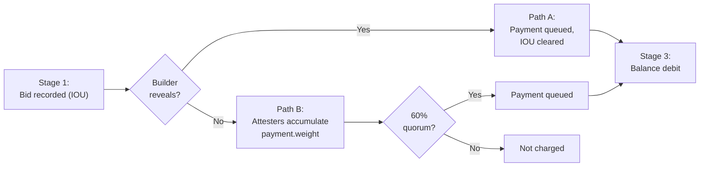

*Figure 9: Three-stage unconditional payment (trustless case). Stage 1 records the IOU; Stage 2 normally settles via Path A (next block, when the builder reveals; clears the IOU and suppresses Path B, so the proposer is paid exactly once) or Path B (epoch-boundary 60% quorum check; protects the builder when withholding, per P5); the Path C missed-slot corner is described below. Stage 3 debits the builder's balance via `apply_withdrawals` in a subsequent FULL block and credits the proposer when that block's execution payload is accepted.*

**Path A** is the happy path. When the builder reveals a valid execution payload, the next block's processing chain (`process_parent_execution_payload` → `apply_parent_execution_payload` → `settle_builder_payment`) appends the payment to `builder_pending_withdrawals`:

```python
# Inside settle_builder_payment (invoked by apply_parent_execution_payload,
# itself called by process_parent_execution_payload when parent was FULL):
payment = state.builder_pending_payments[payment_index]
if payment.withdrawal.amount > 0:
    state.builder_pending_withdrawals.append(payment.withdrawal)
state.builder_pending_payments[payment_index] = BuilderPendingPayment()  # Clear
```

**Path B** is the unconditional path. If the builder withholds, the IOU sits in `builder_pending_payments`. As same-slot attestations for slot $N$ are included on chain, `process_attestation` accumulates the participating validators' effective balance into `payment.weight` for that slot:

```python
# Inside process_attestation (the new ePBS step):
if (will_set_new_flag
        and is_attestation_same_slot(state, data)
        and payment.withdrawal.amount > 0):
    payment.weight += state.validators[index].effective_balance
```

At every epoch boundary, `process_builder_pending_payments` checks whether accumulated weight has crossed the 60% quorum threshold for the entries in the *lower* half of the 2-epoch ring, then shifts the buffer:

```python
def process_builder_pending_payments(state: BeaconState) -> None:
    """
    Processes the builder pending payments from the previous epoch.
    """
    quorum = get_builder_payment_quorum_threshold(state)
    for payment in state.builder_pending_payments[:SLOTS_PER_EPOCH]:
        if payment.weight >= quorum:
            state.builder_pending_withdrawals.append(payment.withdrawal)

    old_payments = state.builder_pending_payments[SLOTS_PER_EPOCH:]
    new_payments = [BuilderPendingPayment() for _ in range(SLOTS_PER_EPOCH)]
    state.builder_pending_payments = old_payments + new_payments
```

**Path B fires one full epoch after the bid's own epoch ends.** `builder_pending_payments` is a ring buffer of size `2 * SLOTS_PER_EPOCH`, and `process_execution_payload_bid` writes a bid at slot N (in epoch *e*) into the *upper* half (index `SLOTS_PER_EPOCH + (N mod SLOTS_PER_EPOCH)`). Only the *lower* half is checked above. So at the end of epoch *e* the bid is shifted down but not yet examined; throughout epoch *e+1* same-slot attestations for slot N keep accumulating into `payment.weight`; and at the end of epoch *e+1* the bid finally faces the quorum check, settled or discarded. The 2-epoch buffer is sized precisely for this delay so that attestations included up to one epoch after slot N can still count.

**The 60% threshold is what makes P5 work.** Under **S2**, Byzantine validators alone can contribute at most 20% of $W$ to `payment.weight`. The quorum is set so that 60% = 40% (honest low-weight boundary) + 20% (Byzantine budget): under **I_payweight**, if the no-weight withholding subcase has < 40% online honest same-slot payment weight, no combination of Byzantine voters can push the quorum over 60% of $W$, so a withholding builder is not charged. Section 4 states the headline P5 property; §9.1 names the proof-specific side conditions **I_payweight** and **I_slash** that are used after the withholding proof splits into subcases.

> **Property P6: Unconditional payment.** For a block at slot N with `bid.value > 0` that is timely (under P6's preconditions: $`B`$ extends $`B'`$ at slot $`N{-}1`$ and $`B'`$ remains canonical forever), and given P6's attestation-inclusion hypothesis (all online honest slot-$`N`$ attestations are included on the canonical chain before the start of epoch $`\mathsf{epoch}(N)+2`$), the proposer's payment is **eventually** queued by Path A or Path B: Path A when a canonical successor declares the slot FULL while the IOU is still in the 2-epoch buffer, or Path B when a canonical block at slot $`\geq`$ start of epoch $`\mathsf{epoch}(N)+2`$ runs `process_epoch` and the slot-N pending-payment weight meets the 60% same-slot quorum. In the Path B case, `payment.weight` reaches the 60% quorum because timeliness + the canonicity precondition + S1 + S2 force at least $`(1-\beta) W > 0.8 W`$ of honest-online same-slot attestation weight for the beacon block, and the inclusion hypothesis puts those attestations on chain; see §9.3 P6 proof Case 1b. Path C is a separate revealed-payload missed-slot edge case: it can still queue the payment when the attestation-inclusion hypothesis fails because all intermediate slots were missed.

> **Property P5: Builder withholding protection (trustless).** If the builder withholds and the slot's pending payment does not reach the quorum, the builder is not charged. The 60% threshold + β < 20% calibration ensures Byzantine voters alone cannot drive the quorum over the threshold without honest participation, under the proof-specific no-weight/payment-weight alignment and slashing-inclusion side conditions named in §9.1.

<details>
<summary><b>From on-chain commitment to EL credit: when does the proposer's <code>fee_recipient</code> actually receive the funds?</b> (click to expand)</summary>

P6 promises that the proposer's `fee_recipient` is **eventually credited**. The protocol delivers this in two steps: *(i)* a `BuilderPendingWithdrawal` entry is appended to `state.builder_pending_withdrawals` via Path A, Path B, or the rare Path C missed-slot branch; *(ii)* a later canonical FULL block drains that entry during `process_withdrawals`, debits the builder's CL balance, commits the corresponding `Withdrawal` into that block's expected execution-payload withdrawals, and the block's accepted execution payload credits the proposer's `fee_recipient` at the EL. Step (ii) requires **L_withdraw**: future canonical FULL blocks with accepted payloads continue until the queue entry is drained. Step (i) is bounded by the structural ring-buffer layout in the normal Path A / Path B cases; Path C is the missed-slot exception described below. Step (ii)'s timing depends on chain state at settlement time (queue position, FULL/EMPTY mix of subsequent slots) and **cannot be precisely bounded by the protocol** — only "eventually". The rest of this drop-down works through the drain rate and best- and worst-case settlement timing.

**The withdrawal queue drains at a fixed rate per FULL block.** The path from a queued `BuilderPendingWithdrawal` to actual EL credit goes through the spec's standard withdrawal pipeline, which is invoked as part of every block's state transition. Specifically, `process_block` calls `process_withdrawals(state)` ([beacon-chain.md:1388-1409](consensus-specs/specs/gloas/beacon-chain.md#L1388-L1409)) once per block. This function first checks `state.latest_block_hash != state.latest_execution_payload_bid.block_hash` to detect whether the parent block declared EMPTY (its execution payload wasn't applied) and **early-returns if so** — EMPTY-declaring blocks do not drain any withdrawal queue. On a FULL-parent block, it proceeds to call `get_expected_withdrawals(state)` ([beacon-chain.md:1275-1308](consensus-specs/specs/gloas/beacon-chain.md#L1275-L1308)) to assemble the planned withdrawals for this slot.

`get_expected_withdrawals` returns a list of at most `MAX_WITHDRAWALS_PER_PAYLOAD = 16` withdrawals by calling four sub-routines in order: `get_builder_withdrawals` (the builder pending-payment queue — what we care about for P6's payments), `get_pending_partial_withdrawals` (validator partial-balance withdrawals), `get_builders_sweep_withdrawals` (the periodic sweep over builders below their withdrawable threshold), and `get_validators_sweep_withdrawals` (the standard validator sweep). The first call, `get_builder_withdrawals` ([beacon-chain.md:1201-1215](consensus-specs/specs/gloas/beacon-chain.md#L1201-L1215)), drains entries FIFO from the front of `state.builder_pending_withdrawals` but stops at `withdrawals_limit = MAX_WITHDRAWALS_PER_PAYLOAD - 1 = 15` — the remaining slot of the 16-entry payload budget is reserved for the other categories. **So per FULL block, at most 15 builder-pending withdrawals are drained.**

Once `get_expected_withdrawals` returns the list, `apply_withdrawals(state, expected.withdrawals)` ([beacon-chain.md:1319-1327](consensus-specs/specs/gloas/beacon-chain.md#L1319-L1327)) decrements each builder's CL balance (`state.builders[i].balance -= amount`). `update_payload_expected_withdrawals` records the same `Withdrawal` objects as the withdrawals that this block's execution payload must carry; when that payload is accepted by the EL on the canonical FULL branch, the EL credits each `fee_recipient` address with the corresponding amount. Finally, `update_builder_pending_withdrawals(state, processed_count)` shifts the queue, removing the entries that were drained.

Two effects then make the EL-credit timing depend on chain state:

- *Queue position matters.* If `state.builder_pending_withdrawals` already holds $K$ entries when a new `BuilderPendingWithdrawal` is appended, the new entry sits at position $K{+}1$ and is drained by the $\lceil (K{+}1) / 15 \rceil$-th subsequent FULL block.
- *Only FULL blocks drain.* `process_withdrawals` ([beacon-chain.md:1388-1409](consensus-specs/specs/gloas/beacon-chain.md#L1388-L1409)) early-returns when the parent block declared EMPTY (no execution payload was applied). EMPTY-declaring blocks do not drain the queue.

**Best case** (empty queue + every subsequent slot FULL with accepted payloads): the proposer's `fee_recipient` is credited within a few slots of the on-chain commitment being recorded — typically at the very next FULL block whose payload is accepted.

**Worst case** (deep queue from prior backlog): if a stretch of missed/EMPTY slots produced a backlog (each Path B settlement can enqueue up to 32 builder withdrawals at the epoch boundary, plus Path A entries from individual FULL declarations and any third-branch entries), the queue can hold thousands of entries. The container's hard cap is **`BUILDER_PENDING_WITHDRAWALS_LIMIT = 2^{20} = 1{,}048{,}576`** ([beacon-chain.md:183](consensus-specs/specs/gloas/beacon-chain.md#L183)) — at 15 builder withdrawals per FULL block, draining a queue of that size takes $\sim 70{,}000$ FULL blocks ($`\approx 10`$ days at standard 12-second slots).

**Bottom line.** P6 promises that the proposer's `fee_recipient` is eventually credited with the bid amount under **L_withdraw**. The protocol delivers this in two steps: queueing (normally within $\sim 2$ epochs of slot $N$ under the attestation-inclusion hypothesis, later only in the Path C missed-slot corner) and EL credit (once a canonical FULL block drains the IOU and its payload is accepted, rate-limited by the 15-per-FULL-block cap and depending on how many other proposers are queued ahead of $B$'s proposer plus the FULL/EMPTY mix of subsequent slots). Under standard liveness with a healthy chain, the gap between queueing and EL credit is small (one to a handful of slots); under heavy backlog or extended periods of missed/EMPTY slots, the gap can be much larger.

</details>

<details>
<summary><b>Edge case: third-branch settlement (the "Path C" corner)</b> (click to expand)</summary>

A third settlement path exists alongside Path A and Path B, hidden inside `apply_parent_execution_payload` ([beacon-chain.md:1157-1166](consensus-specs/specs/gloas/beacon-chain.md#L1157-L1166)):

```python
elif parent_bid.value > 0:
    # Parent is older than the previous epoch, its payment entry has been
    # evicted from builder_pending_payments. Append the withdrawal directly.
    state.builder_pending_withdrawals.append(BuilderPendingWithdrawal(...))
```

This branch fires when a current block declares `parentStatus = FULL` for a parent $B$ that is **more than two epochs old**, AND **no intermediate canonical block exists between $B$ and the current block** (otherwise `state.latest_execution_payload_bid` would have been overwritten by some intermediate bid). It appends the `BuilderPendingWithdrawal` directly, **bypassing the 60% quorum check** that Path B normally enforces.

The configuration that triggers it: all slots from $`N{+}1`$ to $`M{-}1`$ are missed, then a block $`C`$ at slot $`M \geq`$ start-of-epoch$`(\mathsf{epoch}(N) + 2)`$ declares FULL for $`B`$. With no intermediate blocks, no slot-$`N`$ attestations are ever included on chain, `payment.weight` stays at 0, Path B's quorum check at end of epoch $`\mathsf{epoch}(N) + 1`$ discards the IOU — and then the third branch resurrects the payment when $`C`$ arrives. This requires $`\geq 32`$ consecutive missed slots. **S2** does not assign a probability to that event, because missed slots are a proposer-availability/liveness matter rather than just an attester-weight matter.

**Why P5 (Builder withholding protection) is preserved.** The third branch is downstream of `apply_parent_execution_payload`, which itself is reached only via `process_parent_execution_payload` → `process_block` → `state_transition`. As described in §6, `state_transition` runs only after `on_block` admits the block. `on_block`'s parent-FULL assertion (`assert is_payload_verified(store, block.parent_root)`) rejects any FULL-declaring $C$ at every honest node where the parent's payload isn't locally verified. If the builder honestly withholds, no honest node has the payload, so the assertion fails everywhere honest, $C$ is rejected, `state_transition` never runs, the third branch is structurally unreachable. The only way the third branch can fire on the honest chain is if the builder actually revealed (so `on_block`'s gate passes at some honest node) — in which case charging the builder is the protocol's intent anyway.

**How P6's "eventually credited" guarantee interacts with this corner.** The all-slots-missed configuration affects P6 differently depending on whether the builder revealed:

- *Builder revealed + all slots $`N{+}1`$ to $`M{-}1`$ missed*: $`C`$ at slot $`M`$ declares FULL, `on_block`'s gate passes (payload locally verified at some honest nodes), the third branch fires and queues the payment $`M - N`$ slots after $`N`$. P6's "eventually credited" guarantee holds in this sub-case; the payment is still recorded, just later than the typical Path A / Path B timing.
- *Builder withheld + all slots $`N{+}1`$ to end-of-epoch-$`(\mathsf{epoch}(N) + 1)`$ missed*: no slot-$`N`$ attestations are ever included on chain, so `payment.weight` stays at 0 and Path B's quorum check fails when it eventually fires. No FULL declaration is admissible at honest nodes (the `on_block` gate), so the third branch cannot fire either. **No payment is recorded.** The stronger assumption-free reading of P6 would fail in this sub-case; the formal P6 statement excludes it through the attestation-inclusion hypothesis. The protocol's response is the only sound one given the information void: the chain cannot tell whether slot $`N`$ had enough online honest same-slot attesting weight, since no attestations were ever included.

Both sub-cases require $\geq 32$ consecutive missed slots. The document does not derive a probability for that event from **S2** alone; a probability bound would require a separate proposer-availability/schedule model. The §9.3 P6 statement reflects this through its attestation-inclusion hypothesis, which fails in the second sub-case above (no attestations are ever included).

</details>

**A note on the free option (trustless case).** *The same binding-bid mechanism that gives the proposer unconditional payment also gives the builder a short option.* Between bid commitment (`t = 0`, IOU recorded) and the PTC deadline (`t ≈ 9s`), the builder can observe new market information (e.g., centralized-exchange price moves) and choose whether to reveal. If the builder withholds and the slot's pending payment meets the Path B quorum, the builder still pays `bid.value`: exercising the option is not free; its premium is the bid value. The non-trustless case has no such option because no exercise price exists: a non-trustless builder can withhold freely without protocol-side cost. This is a strategic concern, not a positive property, and is therefore not stated as one of P1–P6.

---

## 8. Adversarial summary

> **TL;DR.** Reading off the §6 combined-interaction table, a malicious PTC majority can force an honest successor to build EMPTY against an honestly delivered previous-slot payload by producing a negative quorum on either PTC signal. A malicious proposer alone cannot force EMPTY against an honest-online PTC True/True quorum. Damage is bounded (the proposer is still paid via Path B in the trustless case, no honest validator is slashed, and the FULL branch persists structurally) but the protocol does not force re-selection of the FULL branch by subsequent honest proposers.

We close with a prose summary of adversarial behaviour against an honestly delivered payload, followed by the withheld-payload table and the payment table.

**Scope: trustless case (`bid.value > 0`).** The fork-choice analysis below reads only hashes and PTC votes; it does not consult `value` or `execution_payment`, so it applies identically in the non-trustless case. The payment table is **trustless-only**: in the non-trustless case no `BuilderPendingPayment` IOU is recorded, so payment collapses to "no protocol payment in either direction, regardless of builder behaviour" (cf. P5 non-trustless case in §9.3; degenerate). Off-protocol `execution_payment` outcomes are outside the protocol's scope.

**Payload delivered (`store.payloads[r]` populated at honest nodes, FULL node exists in the fork-choice tree).** The outcome-relevant enumeration over PTC vote × proposer behaviour is the *combined-interaction table* in §6 (lines after `should_build_on_full`). Reading off that table, one PTC-driven path forces EMPTY against an honestly revealed previous-slot payload when the successor follows honest construction:

1. **Malicious PTC majority producing a negative quorum on either signal.** For an immediately previous-slot FULL head, `should_build_on_full` makes the honest proposer build on EMPTY if the PTC majority reports either `payload_present = False` or `blob_data_available = False`. Fallback (c) of `should_extend_payload` is then absent, and EMPTY wins. **No proposer collusion needed.**

Another path is *not* a viable EMPTY attack: a malicious slot-N+1 proposer alone, against an honest PTC producing True/True quorums, is overridden by the PTC primary path. The proposer's lone EMPTY declaration has no effect.

**On the symmetric direction (forcing FULL when honest construction says EMPTY).** A successor that declares FULL is governed by `on_block`'s parent-FULL assertion, not by `should_build_on_full`. If an honest node has not locally verified the parent payload, the FULL-declaring successor is rejected at that node regardless of PTC votes. If the parent payload is locally verified, a malicious successor can declare FULL despite a negative PTC quorum; once admitted, fallback (c) of `should_extend_payload` yields FULL. The reason this attack exists at all is that `should_build_on_full` is an honest-construction constraint, not a protocol-enforced admission rule.

> **The PTC's bidirectional authority (recap of §6).** A malicious proposer alone cannot force EMPTY: an honest-online PTC True/True quorum overrides it. A malicious PTC alone *can* force an honest successor to build EMPTY via a negative quorum on either signal, because `should_build_on_full` strips the honest proposer's discretion for an immediately previous-slot FULL head. Under **S3** (honest-online PTC majority), no negative quorum arises against an honestly delivered payload, so honest builders are protected (the PTC-honesty setting used by P4). Outside S3, the cost of treating the PTC's collective delivery observations as authoritative is the PTC-negative EMPTY attack.

**Damage is bounded** in the PTC-negative EMPTY path: the proposer is still paid via Path B in the trustless case, no honest validator is slashed, and the FULL branch persists structurally in the fork-choice tree. But the protocol does not automatically force re-selection of the FULL branch by subsequent honest proposers.

**Payload withheld or invalid** (`store.payloads[r]` not populated, FULL node does not exist):

| PTC              | Next-slot proposer | Outcome | Why                                                                      |
| ---------------- | ------------------ | ------- | ------------------------------------------------------------------------ |
| Honest (False)   | Honest (EMPTY)     | EMPTY   | Correct outcome                                                          |
| Honest (False)   | Malicious (FULL)   | EMPTY   | `on_block` rejects the block: `is_payload_verified` fails for parent |
| Malicious (True) | Honest (EMPTY)     | EMPTY   | FULL node doesn't exist regardless of PTC                                |
| Malicious (True) | Malicious (FULL)   | EMPTY   | Same: `is_payload_verified` is the gate, PTC cannot create branches    |

**Independent of fork-choice: the payment mechanism:**

| Builder behavior                  | Settlement trigger                           | Outcome                                                            |
| --------------------------------- | -------------------------------------------- | ------------------------------------------------------------------ |
| Reveals valid execution payload   | Next block declares slot N FULL on chain     | Builder pays (Path A)                                              |
| Withholds                         | Slot-N pending-payment weight reaches ≥ 60% | Builder pays (Path B)                                              |
| Withholds                         | Slot-N pending-payment weight remains < 60%  | Builder does NOT pay                                               |
| Reveals invalid execution payload | Slot-N pending-payment weight reaches ≥ 60% | Builder pays (Path B; invalid execution payload doesn't clear IOU) |

The PTC-negative EMPTY path and the "Builder does NOT pay" row of the payment table are the core results that justify the design choices behind the PTC, the fallback conditions, the `should_build_on_full` proposer-side constraint, and the 60% quorum. Note that under **S3** (honest-online PTC majority) this EMPTY path is inaccessible: no negative quorum on either `payload_present` or `blob_data_available` arises against an honestly delivered payload.

---

## 9. From intuition to proof (WIP)

> **TL;DR.** §9 catalogues every assumption needed to justify P1–P6 and gives proof sketches that route through them. Every step in the proof of P1–P6 is a citation to either (i) a line of code shown in Phases 0–4 (§5, including the cautious-reveal protocols A1a/A1b in Phase 3), the Phase 5 + fork-choice machinery (§6), or the payment mechanism (§7), or (ii) one of the assumptions catalogued in §9.1–§9.2. Assumptions come in two categories: **structural** (S1–S3, network and adversary model) and **algorithmic** (G-prefix, what unseen spec helpers do). The honest builder's cautious-reveal strategy is treated as a *protocol* defined in Phase 3 (A1a / A1b), not as a separate behavioural-assumption category.
>
> *This section is work-in-progress and is the most likely part of the document to evolve.*

**§9 is self-contained.** P1–P6 and P_valid are not proved here from first principles; they are proved from the conjunction of:

- the handler code shown in §5 (Phases 0–4, including A1a/A1b protocols in Phase 3), the Phase 5 + fork-choice machinery shown in §6, and the payment mechanism shown in §7;
- the structural and algorithmic assumptions catalogued in §9.1 and §9.2 respectively.

The proof of each property is a finite chain of citations into these two sources. A reader (or a verifier) can mechanically check that no step uses anything outside this contract.

---

### 9.1 Structural assumptions

*S1–S3 fix the network and adversary model.*

**(S1) Network synchrony.** The synchrony delay $\Delta$ satisfies $\Delta < T_{\mathrm{att}}$. Equivalently: every message broadcast by an honest actor before time $t$ is delivered to every honest actor by time $t + \Delta$. In particular, honest attestations cast at $T_{\mathrm{att}}$ propagate to every honest node before the PTC deadline $T_{\mathrm{ptc}}$.

*Why an assumption:* Synchrony is a property of the network, not of any spec function; no protocol code can enforce a delivery-delay bound. External model.

**Definition (timely block).** A beacon block at slot $`N`$ is **timely** iff it is broadcast at a time $`t`$ satisfying $`t + \Delta \leq T_{\mathrm{att}}`$. By **S1**, every online honest validator receives a timely block before $`T_{\mathrm{att}}`$, hence before casting its slot-$`N`$ attestation. A non-timely block (broadcast at $`t > T_{\mathrm{att}} - \Delta`$) is delivered only partially to online honest validators by $`T_{\mathrm{att}}`$: some receive it in time and vote for it, others do not and vote for the previous head. This split visibility is what enables the late-block reorg vector against blocks that fall outside this definition; P1 and P6 condition their conclusions on $`B`$ being timely in this sense.

**(S2) Per-slot participation and adversarial-weight bound.** Let $W$ = `get_total_active_balance(state) // SLOTS_PER_EPOCH`, the spec denominator used by proposer boost and the builder-payment quorum. For any slot named in a property, Byzantine same-slot attesting weight is strictly less than $\beta W$ with $\beta < 20\%$; moreover, when a timely block is the honest local head, online honest same-slot attesters contribute at least $(1-\beta)W$ weight to it.

*Why an assumption:* β bundles two external facts the spec cannot enforce: an adversarial-weight bound and an online-participation lower bound for the relevant slot duties. Offline or late honest validators are not Byzantine, but they also do not contribute same-slot weight; their missing weight must fit inside the non-participating/adversarial budget implicit in S2. The comparison to $W$ also includes the usual committee-balance regularity statement: the realised committee's effective balance is close enough to the spec's per-slot denominator for the 40% / 60% / 80% arithmetic below. Balance-weighted committee sampling helps with the adversarial-weight part; online participation is an operational liveness assumption.

*Why 20%.* The tighter bound is a consequence of ePBS's choice of proposer-boost and same-slot quorum parameters, not a free design knob. The same-slot quorum threshold used to settle Path B (§7) is 60% of $W$ (`get_builder_payment_quorum_threshold`). For the threshold to separate a withholding builder (Path B should *not* fire) from a settling builder (Path B should fire), Byzantine voters acting alone must be unable to drive the weight past the threshold; i.e. the Byzantine budget must be strictly less than $60\% - 40\% = 20\%$ of $W$, where $40\%$ is the proposer boost (`PROPOSER_SCORE_BOOST`). For P1/P4/P6, the same assumption also says the online honest side supplies the large supporting weight used in the anti-reorg and quorum arguments. Equivalently: the boost calibrates S2; S2 calibrates the 60% quorum.

**(S3) PTC honest-online majority.** A strict majority of the 512 PTC positions at every slot are controlled by honest validators that are online for the PTC duty and follow the Phase 4 voting discipline. Offline or late PTC members count against this honest-online majority just like Byzantine members do.

*Why an assumption:* External, same character as **S2**, restricted to the PTC.

<details>
<summary><em>Why holding with overwhelming probability.</em></summary>

The PTC is a 512-position sample drawn from the slot's attestation committees by effective balance. If the global Byzantine stake fraction is $\beta < 20\%$, then the number of Byzantine PTC positions is dominated by $`\mathrm{Bin}(512, 0.20)`$ with mean $102.4$. Hoeffding's bound gives $`\Pr[\mathrm{Bin}(512, 0.20) > 256] \le \exp(-2 \cdot 512 \cdot 0.30^2) = \exp(-92.16) \approx 10^{-40}`$. A tighter Chernoff bound via the binomial KL divergence gives $\exp(-512 \cdot D(0.5 \| 0.2)) \approx \exp(-114) \approx 10^{-50}$. So under the adversarial-weight part of **S2**, the event that any single slot's PTC has a Byzantine majority is astronomically unlikely; summed over a year of slots ($`\approx 2.6 \times 10^6`$) the union bound is still bounded by $\approx 10^{-44}$. **S3** is stated as an explicit assumption because the document's proofs are deterministic (they require an honest-online PTC majority at the named slot, not only with high probability), because $\beta$ is itself an external bound, and because online participation is not supplied by the sampling calculation. The calculation above explains why the adversarial part of S3 is a reasonable assumption to make under S2; the online part remains an operational liveness assumption.

*Note on the iid simplification.* The bound above treats PTC positions as $`\mathrm{Bin}(512, 0.20)`$ — i.e., as independent Bernoulli draws with success probability $\beta$. The actual sampling, via `compute_balance_weighted_selection(..., shuffle_indices=False)` over the slot's attestation committees, is not iid: positions are drawn deterministically from a finite pool with *possible duplicates*, so a high-balance Byzantine validator can occupy several PTC slots at once. This makes the realised distribution more concentrated than the binomial model (Byzantine mass is lumpier; a single high-balance Byzantine validator captures several positions in one draw rather than each draw being an independent coin-flip), and the $10^{-40}$ tail estimate is therefore a first-order heuristic for the order of magnitude rather than a sharp bound on the true sampling tail. The conclusion is robust at the magnitudes considered.

PTC gossip validation and `on_payload_attestation_message` both tie each payload attestation to a block at the message's own `data.slot`, so the sampled committee's vote is about the assigned slot's beacon block; if the slot has no block, the Phase 4 handler has no inherited-head vote to cast.

</details>

**Proof-specific inclusion/liveness side conditions.** These are not additional spec rules; they are external liveness assumptions used only by the named properties below.

- **(I_payweight) P5 low-weight/payment-weight alignment.** In the no-weight P5 subcase where the honest builder withholds because **A1a** (ii) fails and no proposer equivocation is visible, the total online honest same-slot attestation weight for slot $`N`$ that can be included on the canonical chain before the $`\mathsf{epoch}(N)+1 \to \mathsf{epoch}(N)+2`$ payment check is also `< 40%` of $`W`$. This side condition is needed because **G-PayAttest** is slot-keyed, not head-keyed: same-slot attestations for an older head or another slot-$`N`$ block can otherwise increment the slot-$`N`$ pending payment even if they do not support $`B`$.
- **(I_slash) P5 slashing inclusion.** In the equivocation-driven P5 subcase where the honest builder withholds because it observed valid proposer-equivocation evidence, and a canonical IOU for this builder bid remains, some valid `ProposerSlashing` for $`B`$'s slot-$`N`$ proposer is included and processed on the canonical chain before the `builder_pending_payments` entry for slot $`N`$ is checked at the $`\mathsf{epoch}(N)+1 \to \mathsf{epoch}(N)+2`$ boundary. The spec guarantees that processing the slashing clears the IOU; this hypothesis supplies the inclusion-and-processing event.
  *On "checked at the boundary".* This phrasing is happy-path shorthand: there is no spec function that fires on a wall-clock boundary. In practice the slot-$`N`$ entry is checked when the first canonical block at slot $`\geq`$ start of $`\mathsf{epoch}(N)+2`$ is processed via `on_block`. Its `state_transition` advances `state.slot` past the boundary by running `process_slots`, which runs `process_epoch` at the boundary it crosses, which calls `process_builder_pending_payments`. Under standard Gasper liveness (S1 + S2 + an honest proposer schedule) such a block exists eventually; P6's Case 1b proof spells out the same liveness step explicitly.
- **(L_verify) Payload-processing liveness.** In P4, after an honest builder reveals a valid payload and blob sidecars within A1a/A1b's reveal-time-safety window, online honest PTC members complete the local payload/blob observations needed for their True/True Phase 4 vote before the PTC deadline. Also, the honest nodes needed for the first canonical successor decision complete `on_execution_payload_envelope` for the parent block before that successor is proposed or voted on. The latter includes both `is_data_available` and `verify_execution_payload_envelope`, so `store.payloads[B.root]` is populated in time. **S1** supplies network delivery; **L_verify** supplies the local payload/DA/EL processing bound.
- **(L_successor) P4 successor liveness.** In P4, after honest fork choice favours the FULL child of $B$, canonical block production continues long enough for some proposer following that fork-choice decision to publish a canonical successor that declares $B$ FULL. This is the usual chain-liveness / honest-proposer-schedule condition needed to turn a fork-choice preference into an on-chain child; without any subsequent canonical block, $B$ has no retrospective FULL/EMPTY status.
- **(L_withdraw) Withdrawal-pipeline liveness.** In P6, after a `BuilderPendingWithdrawal` is queued, canonical FULL blocks with accepted execution payloads continue often enough to drain the builder-pending-withdrawal queue. The block that drains the entry also has its execution payload accepted by the EL, so the `Withdrawal` emitted for the proposer's `fee_recipient` is actually credited on the execution layer.

---

### 9.2 Algorithmic assumptions

*Each G-assumption pins down the behaviour of an internal spec function. Each is given as a pseudocode definition that captures the assumption's content for the purposes of proving the Category B and Category C properties (P4, P5, P6): pedagogical pseudocode rather than the full spec body. Category A (P1, P2, P3) cites few or none of these; each proof sketch in §9.3 lists the assumptions it uses.*

The remaining G-assumptions cover **payment + slashing machinery** (G-PayAttest, G-PayEpoch, G-Solvency, G-BidAdmit, G-Settle, G-Slashing). The fork-choice machinery (`get_node_children`, `get_weight`, `get_supported_node`, `is_ancestor`, `on_block`'s parent-FULL assertion) is shown directly in §6 and is therefore not carried as a G-assumption here; proofs cite the §6 code by function name. Each subsection below lists the remaining assumption, its statement, and a collapsible pseudocode definition.

**(G-PayAttest)** `process_attestation` selects the pending-payment entry for `attestation.data.slot` from the upper half of `builder_pending_payments` when the attestation target is in the current epoch, and from the lower half when the target is in the previous epoch. It increments that entry's `payment.weight` by `effective_balance(i)` exactly when (a) at least one new participation flag is set for validator `i`, (b) the attestation is same-slot, and (c) `payment.withdrawal.amount > 0`. No other code path increments `payment.weight`; settlement and slashing can only replace the whole entry with a fresh zero entry.

*Why an assumption:* The full body of `process_attestation` is not shown in this document; §7 displays only the new ePBS payment-weight step. The three preconditions and the "no other path increments `payment.weight`" invariant are what P6's Part 3 (no double-charge) and P5's Case 1 (quorum unreachable) both cite.

<details>
<summary><b>Pseudocode definition</b> (click to expand)</summary>

```python
def process_attestation(state: BeaconState, attestation: Attestation) -> None:
    data = attestation.data
    # ... validate attestation, compute participation flags, and select epoch participation ...

    if data.target.epoch == get_current_epoch(state):
        payment_index = SLOTS_PER_EPOCH + data.slot % SLOTS_PER_EPOCH
    else:
        payment_index = data.slot % SLOTS_PER_EPOCH
    payment = state.builder_pending_payments[payment_index]

    for i in get_attesting_indices(state, attestation):
        will_set_new_flag = update_participation_flags(state, i, data)

        # (G-PayAttest) Three exact preconditions to credit payment.weight:
        if (will_set_new_flag                              # (a) new flag set
                and is_attestation_same_slot(state, data)  # (b) same-slot
                and payment.withdrawal.amount > 0):        # (c) IOU still pending
            payment.weight += effective_balance(i)

    state.builder_pending_payments[payment_index] = payment

    # ... reward proposer ...

    # (G-PayAttest) NO other code path increments payment.weight; this is
    # the sole accumulator. settlement/slashing may replace the whole
    # BuilderPendingPayment with a fresh empty one.
```

</details>

**(G-PayEpoch)** `process_builder_pending_payments` appends a previous-epoch entry to `builder_pending_withdrawals` if and only if `payment.weight ≥ quorum`. The fallthrough path discards the entry during the epoch shift without debiting the builder.

*Why an assumption:* §7 shows only the quorum-check loop; the ring-buffer shift and the discard path on quorum failure are described only in prose. G-PayEpoch names the gate condition formally.

<details>
<summary><b>Pseudocode definition</b> (click to expand)</summary>

```python
def process_builder_pending_payments(state: BeaconState) -> None:
    quorum = get_builder_payment_quorum_threshold(state)

    # (G-PayEpoch) Iff `weight >= quorum`, the entry is queued for withdrawal.
    # Otherwise it is silently discarded during the epoch shift below: no
    # debit, no protocol-level penalty (this is the builder-protection
    # mechanism that supports Property P5, trustless withholding protection).
    for payment in state.builder_pending_payments[:SLOTS_PER_EPOCH]:
        if payment.weight >= quorum:
            state.builder_pending_withdrawals.append(payment.withdrawal)
        # else: discarded by the shift on the next two lines

    # Shift the 2-epoch ring buffer: lower half ← upper half; upper ← empty.
    old_payments = state.builder_pending_payments[SLOTS_PER_EPOCH:]
    new_payments = [BuilderPendingPayment() for _ in range(SLOTS_PER_EPOCH)]
    state.builder_pending_payments = old_payments + new_payments
```

</details>

**(G-Solvency)** `get_pending_balance_to_withdraw_for_builder(state, builder_index)` returns the sum of all amounts in `builder_pending_withdrawals` for that builder plus all `amount` fields in `builder_pending_payments` whose `builder_index` matches. No obligation type is omitted.

*Why an assumption:* `get_pending_balance_to_withdraw_for_builder`'s body is not shown in this document. P6's solvency precondition cites this assumption.

<details>
<summary><b>Pseudocode definition</b> (click to expand)</summary>

```python
def get_pending_balance_to_withdraw_for_builder(
    state: BeaconState, builder_index: BuilderIndex
) -> Gwei:
    return sum(
        withdrawal.amount
        for withdrawal in state.builder_pending_withdrawals
        if withdrawal.builder_index == builder_index
    ) + sum(
        payment.withdrawal.amount
        for payment in state.builder_pending_payments
        if payment.withdrawal.builder_index == builder_index
    )
```

</details>

**(G-BidAdmit) `process_execution_payload_bid` IOU creation.** `process_execution_payload_bid` accepts a bid only when (a) the bid signature is valid, (b) the builder is active, and (c) `can_builder_cover_bid(state, builder_index, bid.value)` returns True (the solvency precondition; cf. **G-Solvency**). When accepted, it caches the bid (`state.latest_execution_payload_bid = bid`) and (for non-self-build bids with `bid.value > 0`) creates exactly one `BuilderPendingPayment` IOU at index `SLOTS_PER_EPOCH + (slot % SLOTS_PER_EPOCH)` in `state.builder_pending_payments` (the *upper half* of the 2-epoch ring buffer; the lower half holds the previous epoch's entries facing the quorum check, cf. §7), with `withdrawal.amount = bid.value`, `withdrawal.builder_index = bid.builder_index`, and `weight = 0`. No IOU is created for `bid.value = 0` (which includes both self-build bids and non-trustless bids `bid.execution_payment > 0, bid.value = 0`). (The `fee_recipient` equality and `is_gas_limit_target_compatible(parent_gas_limit, bid.gas_limit, target_gas_limit)` compatibility check against the proposer's preferences are builder/gossip-side obligations, enforced by `builder.md`'s broadcast rule and the `p2p-interface.md` topic validators. The check that `bid.slot` is greater than the slot of `bid.parent_block_root` is also a `p2p-interface.md` topic validation. None of these is part of this beacon-chain function.) The full body of `process_execution_payload_bid` is shown in §5 Phase 1b; this assumption names the contract.

*Why an assumption (special case):* The full body of `process_execution_payload_bid` *is* shown in §5 Phase 1b, but G-BidAdmit promotes its behaviour to a named formal contract so P6's proof can cite "**G-BidAdmit**" rather than "by inspection of Phase 1b line N". This is a citation convenience, not a hidden body.

<details>
<summary><b>Pseudocode definition</b> (click to expand)</summary>

```python
def process_execution_payload_bid(state: BeaconState, block: BeaconBlock) -> None:
    signed_bid = block.body.signed_execution_payload_bid
    bid = signed_bid.message
    builder_index = bid.builder_index
    amount = bid.value

    # (G-BidAdmit) Admission preconditions
    if builder_index == BUILDER_INDEX_SELF_BUILD:
        assert amount == 0
        assert signed_bid.signature == bls.G2_POINT_AT_INFINITY
    else:
        assert is_active_builder(state, builder_index)
        assert can_builder_cover_bid(state, builder_index, amount)
        assert verify_execution_payload_bid_signature(state, signed_bid)
    assert bid.slot == block.slot
    assert bid.parent_block_hash == state.latest_block_hash
    assert bid.parent_block_root == block.parent_root
    ...    # spec checks elided: blob-KZG-commitment count cap and bid.prev_randao == get_randao_mix(...) (`beacon-chain.md:1461–1472`); not relied on by G-BidAdmit. (Fee-recipient equality and gas-limit-target compatibility are builder/gossip-side checks; `bid.slot` greater than the slot of `bid.parent_block_root` is a gossip-side check. They are not part of this beacon-chain function.)

    # (G-BidAdmit) Record IOU exactly once for non-self-build, bid.value > 0
    if amount > 0:
        slot_index = SLOTS_PER_EPOCH + (bid.slot % SLOTS_PER_EPOCH)
        state.builder_pending_payments[slot_index] = BuilderPendingPayment(
            weight=0,
            withdrawal=BuilderPendingWithdrawal(
                amount=amount,
                builder_index=builder_index,
                fee_recipient=bid.fee_recipient))     # P6 destination, set by spec at beacon-chain.md:1479

    state.latest_execution_payload_bid = bid
```

</details>

**(G-Settle) `apply_parent_execution_payload` payment settlement.** When a block at slot M declares `parentStatus = FULL` for its parent at slot N (i.e., `bid.parent_block_hash == state.latest_execution_payload_bid.block_hash`), `process_parent_execution_payload` runs `apply_parent_execution_payload`. If N's epoch equals the current epoch, it invokes `settle_builder_payment` at `SLOTS_PER_EPOCH + (N % SLOTS_PER_EPOCH)` (upper half); if N's epoch equals the previous epoch, it invokes `settle_builder_payment` at `N % SLOTS_PER_EPOCH` (lower half); otherwise, if `parent_bid.value > 0`, it appends the payment directly to `state.builder_pending_withdrawals`. The `settle_builder_payment` path zeroes the targeted `BuilderPendingPayment` entry (`weight = 0`, `withdrawal.amount = 0`); the old-parent direct-append path has no live entry left to zero.

*Why an assumption:* `settle_builder_payment`'s body is shown in §7, but its calling chain (`process_parent_execution_payload → apply_parent_execution_payload`, with the slot-index computation by epoch and the old-parent direct append) is described only in prose. G-Settle names the chain and the index rule formally so P6's Path A and Path C steps are single citations.

<details>
<summary><b>Pseudocode definition</b> (click to expand)</summary>

```python
def apply_parent_execution_payload(
    state: BeaconState,
    requests: ExecutionRequests,
) -> None:
    parent_bid = state.latest_execution_payload_bid
    parent_slot = parent_bid.slot
    parent_epoch = compute_epoch_at_slot(parent_slot)

    # ... process parent execution requests (deposits/withdrawals/consolidations) ...

    # (G-Settle) Index selection: where is the IOU?
    if parent_epoch == get_current_epoch(state):
        payment_index = SLOTS_PER_EPOCH + (parent_slot % SLOTS_PER_EPOCH)
        settle_builder_payment(state, payment_index)        # §7 code zeros & queues
    elif parent_epoch == get_previous_epoch(state):
        payment_index = parent_slot % SLOTS_PER_EPOCH
        settle_builder_payment(state, payment_index)
    elif parent_bid.value > 0:
        # Older than previous epoch; IOU evicted by ring shift; append directly.
        state.builder_pending_withdrawals.append(
            BuilderPendingWithdrawal(amount=parent_bid.value,
                                     builder_index=parent_bid.builder_index,
                                     fee_recipient=parent_bid.fee_recipient))

    state.execution_payload_availability[parent_slot % SLOTS_PER_HISTORICAL_ROOT] = 0b1
    state.latest_block_hash = parent_bid.block_hash
```

</details>

**(G-Slashing) `process_proposer_slashing` IOU clear.** When a valid `ProposerSlashing` for a proposer at slot N is processed on-chain within the 2-epoch `builder_pending_payments` window, the corresponding `BuilderPendingPayment` IOU is cleared: `weight = 0`, `withdrawal.amount = 0`. The cleared entry is therefore not queued by `process_builder_pending_payments` at the epoch boundary. This protects an honest builder that withheld in response to the slashing evidence (A1a condition (iii) failed).

*Why an assumption:* `process_proposer_slashing`'s body is not shown in this document. P5's Case 2 cites this assumption to argue the IOU is cleared before the epoch-boundary quorum check runs.

<details>
<summary><b>Pseudocode definition</b> (click to expand)</summary>

```python
def process_proposer_slashing(state: BeaconState, proposer_slashing: ProposerSlashing) -> None:
    # ... validate the slashing evidence ...

    # (G-Slashing) Clear any pending BuilderPendingPayment for the slashed slot.
    header_1 = proposer_slashing.signed_header_1.message
    slot = header_1.slot
    proposal_epoch = compute_epoch_at_slot(slot)
    if proposal_epoch == get_current_epoch(state):
        payment_index = SLOTS_PER_EPOCH + (slot % SLOTS_PER_EPOCH)
        state.builder_pending_payments[payment_index] = BuilderPendingPayment()
    elif proposal_epoch == get_previous_epoch(state):
        payment_index = slot % SLOTS_PER_EPOCH
        state.builder_pending_payments[payment_index] = BuilderPendingPayment()

    slash_validator(state, header_1.proposer_index)
```

</details>

---

### 9.3 Proof sketches

*Each sketch states the claim and presents a finite chain of citations into the assumptions of §9.1–§9.2, the cautious-reveal protocols A1a/A1b in §5 Phase 3, and the handler code shown in §5–§7.*

The argument is valid **given** the stated assumptions. The sketches are ordered to match §4's categorisation: Category A (P1, P2, P3; payment-trustlessness-independent), Category B (P4, P5; payment-trustlessness-dependent, each with two cases), Category C (P6; trustless-only).

---

**P1 (Block safety) — Category A.**

*Claim:* Let $B$ be a block at slot $N$ proposed by an honest proposer, extending a block $B'$ at slot $N{-}1$ with $B'$ canonical forever. Assume **S1** (synchrony) and **S2** (β < 20%). If $B$ includes a valid bid, then $B$ remains in the canonical chain at every later time. (Recall: an honest proposer broadcasts at slot start — hence timely in the §9.1 sense — and does not equivocate.)

<details>
<summary><b>Proof sketch</b> (click to expand)</summary>

*Proof.* Let $`W`$ denote the per-slot balance denominator from **S2**. An honest slot-$`N`$ proposer broadcasts $`B`$ at slot start and does not equivocate. By **S1**, every online honest slot-$`N`$ validator receives $`B`$ by $`T_{\mathrm{att}}`$; by non-equivocation, no sibling of $`B`$ at slot $`N`$ by the same proposer is visible. By the Phase 2 `attest` handler, each online honest slot-$`N`$ attester casts a same-slot attestation for $`B`$ as its local head; by $`T_{\mathrm{att}} + \Delta < T_{\mathrm{ptc}}`$ these attestations propagate to every honest node. By **S2**, the honest online weight on $`B`$ at slot $`N+1`$ is at least $`(1-\beta) W > 0.8 W`$.

A boost-only reorg attempt at slot $N+1$ would require some competitor $B''$ to outweigh $B$; $B''$ receives proposer boost (40% $`W`$) plus at most $\beta W < 20\% W$ of Byzantine attestation, total $< 60\% W < 80\% W$. By the §6 `get_weight` and `get_head` code (weight arithmetic including proposer boost), no boost-only reorg succeeds.

The weight argument fixes parent($`B`$): it rules out competitors that share parent($`B`$). The hypothesis "$`B'`$ will remain canonical forever" closes the remaining reorg vector at the parent level — a sibling branch of parent($`B`$) cannot pull parent($`B`$) off-chain by hypothesis. The missing-slot configuration (a colluding Byzantine pair seating a competing sibling at a missing slot between parent($`B`$) and $`B`$) is excluded by the precondition "$`B`$ extends $`B'`$ at slot $`N{-}1`$": under that precondition, $`B`$'s parent is $`B'`$ at slot $`N{-}1`$, so there is no missing slot to exploit.

Under these conditions, $B$ has $> 80\% W$ at slot $N+1$ and no competitor at slot $N+1$ or later can accumulate enough weight to overtake it (every later slot's competitor faces the same arithmetic). Hence $B$ remains canonical at every later time.

*Assumptions used:* **S1**, **S2**, **honest slot-$`N`$ proposer** (subsumes timeliness and non-equivocation, see §4 P1 note); plus §6 `get_weight` / `get_head` code (boost-only-reorg arithmetic) and the Phase 2 `attest` handler (honest same-slot voting behaviour). The configuration preconditions on $`B`$ ($`B`$ extends $`B'`$ at slot $`N{-}1`$ and $`B'`$ remains canonical forever) supply the missing-slot exclusion and the parent-canonicity needed for the boost-only-reorg argument.

</details>

---

**P2 (Payload execution deadline is the beginning of the next slot) — Category A.**

*Claim:* Let $B$ be a block proposed in slot $N$ and let $P$ be the payload associated with $B$ (i.e., `bid(B).block_hash = P.block_hash`). With the only possible exception of builders, the protocol does not require any other honest actor to complete the execution of $P$ before the beginning of slot $N+1$.

<details>
<summary><b>Proof sketch</b> (click to expand)</summary>

*Proof.* We enumerate the honest actors whose duties fire at or before the end of slot $N$, and verify that none of them needs $P$ executed to perform those duties.

*Slot-$`N`$ attesters.* The Phase 2 `attest` handler (§5 Phase 2) computes `head = get_head(store)` and constructs an `AttestationData` containing `data.beacon_block_root = head.root`, `data.slot`, `data.target`, `data.source`, and `data.index ∈ {0, 1}`. By the same-slot rule, honest same-slot attesters set `data.index = 0` unconditionally — they take no position on payload status. None of the handler's reads consults executed payload state: it touches `store.blocks`, `store.block_states`, and `store.latest_messages` only. No call into `execution_engine`, no call into `verify_execution_payload_envelope`, and no read of `store.payloads[head.root]` occurs.

*Slot-$`N`$ PTC members.* The Phase 4 `ptc_vote` handler (§5 Phase 4) reads `has_execution_payload_envelope(store, root)` (whether the envelope was observed on gossip before `get_payload_due_ms()`) and `is_data_available(beacon_block_root)`. Neither requires $`P`$ executed: the envelope check is a gossip-arrival check, and `is_data_available` is independent of the execution-layer state transition.

*All other honest actors at slot $`\leq N`$.* Proposers and attesters at earlier slots act before $`B`$ is broadcast and therefore have no relation to $`P`$. The slot-$`N`$ proposer constructs and broadcasts $`B`$ with the bid hash committed — this requires the builder's earlier commitment to $`P`$ (which is the bid's `block_hash` field) but does *not* require $`P`$ executed: the proposer reads the bid's hash, not the payload's executed state.

Hence no honest actor other than the builder is required to have completed the execution of $P$ by the end of slot $N$.

Two clarifications on what does happen *after* slot $N$:

1. **Execution of $`P`$ itself** takes place inside `on_execution_payload_envelope`, the handler that fires whenever the payload envelope arrives at a node. That handler calls `is_data_available` (blob KZG checks) and then `verify_execution_payload_envelope`, whose last assertion is `execution_engine.verify_and_notify_new_payload(...)` ([fork-choice.md:864](consensus-specs/specs/gloas/fork-choice.md#L864)): the EL executes the payload's transactions and returns `True` only if the executed result matches what the payload claims. On success the envelope is stored in `store.payloads`; so a node has `store.payloads[B.root]` populated **iff** its EL has executed and verified $`P`$. This EL execution is asynchronous to slot-$`\leq N`$ consensus duties: it can land at any time the envelope arrives, including after $`T_{\mathrm{att}}`$ of slot $`N`$ or during slot $`N+1`$. (The slot-$`N{+}1`$ builder is the actor that *does* need this EL execution completed before its build time, since its EL must be at $`P`$'s post-state to build on top; this is exactly the "with the only possible exception of builders" carve-out in the P2 statement at §4.)
2. **Application of $`P`$'s execution effects to consensus state** takes place inside `process_block` of the *slot-$`N+1`$ block*, via `process_parent_execution_payload` ([beacon-chain.md](consensus-specs/specs/gloas/beacon-chain.md)). Gloas removed `process_execution_payload` from `process_block`; what remains is the parent-application step, which processes the parent's execution requests, settles the parent's builder payment, and advances `state.latest_block_hash` — *without re-executing transactions*. Re-execution is unnecessary because $`P`$'s validity was already established by `on_execution_payload_envelope` when the envelope first arrived.

Neither of these places an execution deadline on slot-$`N`$ honest actors: (1) is event-driven on envelope arrival; (2) operates during slot $`N+1`$, not before it. So they fall outside the claim's scope. ∎

*Assumptions used:* none beyond the §5 Phase 2 `attest`, Phase 4 `ptc_vote` handler code, and the proposer's bid-construction code. No structural assumption (S1, S2, S3) is needed: the property is a direct consequence of the spec's code structure — execution is off the critical path for slot-$`\leq N`$ honest actors by construction.

</details>

---

**P3 (Data availability for chain inclusion) — Category A.**

*Claim:* Under **S2** (β < 20%, giving an honest super-majority): if a payload hash $h$ belongs to the payload hash chain of the canonical beacon chain (i.e., $h$ is on chain in the §3 sense), then the corresponding payload and blob data were available to at least one honest node. More precisely, some honest node successfully processed, via `on_block`, a canonical block that declared the corresponding beacon block FULL. At that node, the corresponding `ExecutionPayloadEnvelope` with `payload.block_hash == h` is in `store.payloads`; that payload is valid (it passed `verify_execution_payload_envelope`), and its associated blob data is available in the spec-local sense required by `is_data_available`.

<details>
<summary><b>Proof sketch</b> (click to expand)</summary>

*Proof.* Suppose $`h`$ is on chain. By the §3 equivalent characterization, there exist canonical blocks $`B^*`$ (with $`B^*`$'s `bid.block_hash` equal to $`h`$) and $`C`$, $`B^*`$'s canonical child, satisfying $`C`$'s `bid.parent_block_hash` equal to $`h`$ — equivalently, $`C`$ declares $`\texttt{parentStatus}(B^*) = \mathrm{FULL}`$. By **S2** (honest super-majority of attestation weight), Byzantine votes alone cannot make any block canonical; so the canonical chain accumulates honest attestation weight, and in particular some honest node $`v`$ successfully processed $`C`$ through `on_block`, adding $`C`$ to its fork-choice store. By the §6 `on_block` parent-FULL assertion, this processing of $`C`$ at $`v`$ required $`\texttt{is\_payload\_verified}(v.\texttt{store}, B^*.\texttt{root})`$, i.e., $`B^*.\texttt{root} \in v.\texttt{store.payloads}`$, at that time. Hence $`v`$ holds the `ExecutionPayloadEnvelope` with `payload.block_hash == h`, witnessing P3's existential conclusion. The identity of $`C`$'s proposer (slot-$`N{+}1`$'s or any later slot's, honest or Byzantine) does not enter the argument: only that $`C`$ ends up on the canonical chain — which the on-chain hypothesis forces — and that `on_block`'s gate forces any honest node that successfully processes such a FULL-declaring block to have the payload locally verified.

The only path to populating $`\texttt{store.payloads}[B^*.\texttt{root}]`$ is `on_execution_payload_envelope` (§5 Phase 3), which requires (i) `is_data_available(envelope.beacon_block_root)` to pass (the blob data the node sampled arrived and passed KZG verification) and (ii) `verify_execution_payload_envelope` to pass (the payload was validated by the execution engine). Hence the payload with hash $h$ is *available* (it sits in `store.payloads`), *valid* (passed `verify_execution_payload_envelope`), and its blob data is *available* (passed `is_data_available`).

*Contrapositive (unavailability ⟹ hash not on chain):* if either the payload or the sampled blob data is unavailable to every honest node that could pass the `on_block` parent-FULL assertion for a FULL-declaring successor of $`B^*`$, then no such node populates `store.payloads[B^*.root]`. Any block declaring `parentStatus = FULL` for $`B^*`$ — whether constructed honestly (in which case the FULL node is not locally available and `should_build_on_full` returns False on the EMPTY head) or maliciously (declaring FULL anyway) — is either not constructed or rejected by `on_block`'s parent-FULL assertion at every honest node that receives it. So no canonical successor of $`B^*`$ declares FULL, i.e., $`h`$ is not in the payload hash chain.

*Assumptions used:* **S2** (giving honest super-majority); plus §6 fork-choice code (`on_block` parent-FULL assertion) and §5 Phase 3 (`on_execution_payload_envelope` populating `store.payloads` only after `verify_execution_payload_envelope` and `is_data_available` both pass). Honest-PTC behaviour (Phase 4 `ptc_vote` code) is consistent with this picture but the proof does not depend on it; the argument routes through `on_block` and `on_execution_payload_envelope`, not the PTC tiebreaker.

*Remark on payment-field independence.* P3 makes no reference to which payment field the bid used. The argument routes through the on-chain `bid.parent_block_hash` declaration and `on_block`'s `is_payload_verified` assertion, both of which act on hashes only. So P3 holds identically in the trustless and non-trustless cases.

*Remark on the bidirectional reading.* P3's forward direction is "hash on chain ⟹ payload + blob data available + valid at some honest node that successfully processed a canonical FULL-declaring successor through `on_block`" (proved above). The contrapositive is "unavailable to every honest node that could pass the `on_block` parent-FULL assertion for a FULL-declaring successor ⟹ hash not on chain", also useful as a direct chain-inclusion statement. The §3 hash-chain definition makes the two readings equivalent.

</details>

---

**P_valid (Chain validity) — Category A.**

*Claim:* For every block $B$ on the canonical chain, `bid(B).parent_block_hash ∈ {bid(parent(B)).block_hash, bid(parent(B)).parent_block_hash}`.

<details>
<summary><b>Proof sketch</b> (click to expand)</summary>

*Proof.* Enforced by `process_execution_payload_bid` (§5 Phase 1b), which asserts `bid.parent_block_hash == state.latest_block_hash`. At $B$'s processing time, `state.latest_block_hash` takes exactly one of two values: `bid(parent(B)).block_hash` if `process_parent_execution_payload` applied `parent(B)`'s payload effects (declaring `parent(B)` FULL), or `bid(parent(B)).parent_block_hash` otherwise (declaring `parent(B)` EMPTY). Any block whose `bid.parent_block_hash` differs from both values fails the assertion and is rejected at admission. Under **S2** (honest super-majority), rejected blocks cannot become canonical. See the §3.1 expansion box for the chain-layer vs. state-machine equivalence.

*Assumptions used:* **S2**.

</details>

---

**P4 (Builder revealing protection) — Category B.**

*Claim:* There exists a protocol an honest builder can follow such that, if the builder reveals its payload at slot $N$ (call the block $`B`$), then `bid(B).block_hash` is added to the payload hash chain of the canonical beacon chain. Two cases:

- **Trustless case** (`bid.value > 0`): the protocol is **A1a** (§5 Phase 3). Assumptions: there exists a canonical block $`B'`$ at slot $`N{-}1`$ that remains canonical forever, **S1** (synchrony), **S2** (β < 20%), **S3** (honest-online slot-$`N`$ PTC majority, and honest online PTC members wait to observe both the payload and the blob data before voting), **L_verify**, **L_successor**, and $`B`$ is timely.
- **Non-trustless case** (`bid.execution_payment > 0`, `bid.value = 0`): the protocol is **A1b** with a chosen confirmation rule $`R`$ (§5 Phase 3). Assumptions: **S1** (synchrony), **S3** (honest-online slot-$`N`$ PTC majority, and honest online PTC members wait to observe both the payload and the blob data before voting), **L_verify**, **L_successor**, and the rule-specific assumption set $`\Sigma_R`$ (which subsumes reorg-prevention preconditions).

Both cases share the same proof structure: canonicity of $B$ (Part i), then the FULL declaration on chain (Part ii). The only differences are the source of canonicity (P1 vs $`\Sigma_R`$) and the protocol the builder follows (A1a vs A1b).

<details>
<summary><b>Proof sketch — trustless case</b> (click to expand)</summary>

*Proof.* Two parts: (i) $`B`$ stays canonical (by P1); (ii) the slot-$`N{+}1`$ fork-choice eventually declares $`B`$ FULL on chain.

*Part (i) — canonicity.* The builder reveals only when A1a fires, in particular when conditions (i), (ii), (iii) all hold: $`t_{\mathrm{rev}} \geq T_{\mathrm{att}} + \Delta`$; `real_attestation_weight(store, B) ≥ 0.4 W`; and no proposer equivocation against `block.slot` is visible. Two-case analysis: any equivocation $`B''`$ broadcast at $`t_{\mathrm{eq}} \leq T_{\mathrm{att}}`$ is delivered to the builder by $`t_{\mathrm{eq}} + \Delta \leq T_{\mathrm{att}} + \Delta \leq t_{\mathrm{rev}}`$, so A1a (iii) would fire and the builder would withhold — contradicting the reveal hypothesis. Hence any equivocation $`B''`$ at slot $`N`$ was broadcast at $`t_{\mathrm{eq}} > T_{\mathrm{att}}`$, after every online honest slot-$`N`$ validator had already voted at $`T_{\mathrm{att}}`$.

*$`B`$ extends $`B'`$.* (Recall: $`B'`$ is the slot-$`N{-}1`$ canonical-forever block from the trustless-case hypotheses above.) Suppose for contradiction that $`B`$ does not extend $`B'`$. Since $`B'`$ is canonical at slot $`N{-}1`$ by hypothesis, $`B`$ is then not in the subtree rooted at $`B'`$, i.e., $`B`$ sits on a non-canonical branch. Online honest slot-$`N`$ validators' `get_head` at $`T_{\mathrm{att}}`$ therefore returns a node in the canonical subtree (in particular, not $`B`$), and they do not vote for $`B`$. The real attestation weight on $`B`$ is then bounded by Byzantine weight, $`\leq \beta W < 20\% W < 40\% W`$, contradicting **A1a** (ii). Hence $`B`$ extends $`B'`$.

*Honest weight on $`B`$.* Under timeliness and **S1**, every online honest slot-$`N`$ validator receives $`B`$ by $`T_{\mathrm{att}}`$. Combined with $`B`$ extending the canonical $`B'`$ and the absence of any visible equivocation at $`T_{\mathrm{att}}`$, every online honest slot-$`N`$ validator's `get_head` returns $`B`$, so each votes for $`B`$. By **S2**, the honest online weight on $`B`$ is $`\geq (1-\beta) W > 80\% W`$.

*Anti-reorg.* By the same arithmetic as P1's proof (§9.3 P1): $`B`$ has $`\geq (1-\beta) W > 80\% W`$ honest online weight at slot $`N+1`$, while any boost-only competitor has at most $`40\% W`$ (boost) $`+ \beta W < 60\% W`$; no boost-only reorg succeeds. The remaining parent-level reorg vector is closed by "$`B'`$ remains canonical forever"; the missing-slot configuration is excluded because $`B'`$ exists at slot $`N{-}1`$. Hence $`B`$ remains in the canonical chain at every later time.

*Part (ii) — FULL declared on chain.* By the Phase 0 / Phase 3 honest-builder code (the builder reveals the same payload object it constructed at bid time), the revealed payload's `block_hash` equals `bid.block_hash`. By **A1a** condition (i), $`T_{\mathrm{att}} + \Delta \leq t_{\mathrm{rev}} < T_{\mathrm{payload\_due}} - \Delta`$; combined with **S1**, the broadcast `SignedExecutionPayloadEnvelope` (and the accompanying blob sidecars) reaches every honest node before $`T_{\mathrm{payload\_due}}`$. By **L_verify**, the honest nodes needed for the first successor decision complete `on_execution_payload_envelope`, including `is_data_available` and `verify_execution_payload_envelope`, and populate `store.payloads[B.root]` before that decision. By **S3** (honest-online slot-$`N`$ PTC majority, with honest online members waiting to observe both signals before voting), the True-timeliness and True-DA quorums both hold; by the §6 code, `should_extend_payload(B)` evaluates True via the PTC primary path at every honest node's `get_head`, and `should_build_on_full` returns True for an honest successor because neither negative PTC quorum exists. By **L_successor**, that FULL fork-choice decision is eventually realised by a canonical successor declaring `parentStatus = FULL` for $`B`$, completing the inclusion of `bid(B).block_hash` in the payload hash chain.

*Assumptions used (trustless case):* **S1**, **S2**, **S3** (honest-online slot-$`N`$ PTC majority, with honest online members waiting to observe both the payload and the blob data before voting), **L_verify**, **L_successor**, **A1a** (honest builder follows the cautious-reveal protocol, including broadcasting the blob sidecars), **timeliness** ($`t + \Delta \leq T_{\mathrm{att}}`$), and the canonicity hypothesis "there exists a canonical block $`B'`$ at slot $`N{-}1`$ that remains canonical forever"; plus the Phase 0 / 3 / 4 handler code and §6 fork-choice code. Part (i)'s anti-reorg argument re-derives the same conclusion that P1 (Block safety) reaches under "honest proposer"; here P4 supplies the equivalent facts (no-equivocation from A1a (iii); $`B`$ extends $`B'`$ derived from A1a (ii) plus $`B'`$'s canonicity) instead of inheriting them from P1's honest-proposer hypothesis.

</details>

<details>
<summary><b>Proof sketch — non-trustless case</b> (click to expand)</summary>

*Proof.* Two parts: (i) $`B`$ stays canonical (by $`\Sigma_R`$); (ii) the slot-$`N{+}1`$ fork-choice eventually declares $`B`$ FULL on chain.

*Part (i) — canonicity by $`\Sigma_R`$.* By **A1b** condition (i), the honest builder reveals only when its confirmation rule $`R`$ returns `confirmed` for $`B`$. By the definition of *provably secure under* $`\Sigma_R`$ (§5 Phase 3), every block confirmed with $`R`$ remains canonical at every later time under $`\Sigma_R`$. Hence $`B`$ stays canonical.

*Part (ii) — FULL declared on chain.* By the Phase 0 / Phase 3 honest-builder code, the revealed payload's `block_hash` equals `bid.block_hash`. By **A1b** condition (ii) (reveal-timing safety) + **S1**, the broadcast `SignedExecutionPayloadEnvelope` reaches every honest node before $`T_{\mathrm{ptc}}`$, every online honest PTC member before their vote deadline, and the slot-$`N{+}1`$ actors before they need to act. By **L_verify**, the honest nodes needed for the first successor decision complete `on_execution_payload_envelope` and populate `store.payloads[B.root]` before that decision. By **S3** (honest-online slot-$`N`$ PTC majority) + Phase 4 `ptc_vote` code, the True-timeliness and True-DA quorums hold; by the §6 code, `should_extend_payload(B)` evaluates True via the PTC primary path at every honest node's `get_head`, and `should_build_on_full` returns True for an honest successor because neither negative PTC quorum exists. By **L_successor**, that FULL fork-choice decision is eventually realised by a canonical successor declaring `parentStatus = FULL` for $`B`$, completing the inclusion of `bid(B).block_hash` in the payload hash chain.

*Assumptions used (non-trustless case):* **S1**, **S3** (honest-online slot-$`N`$ PTC majority only, no slot-$`N{+}1`$ proposer hypothesis), **L_verify**, **L_successor**, $`\Sigma_R`$ (from the chosen confirmation rule), **A1b**; plus the Phase 0 / 3 / 4 handler code and §6 fork-choice code.

*Remark on the parametric form.* P4's non-trustless case is parametric in the confirmation rule $R$ the builder picks. Choosing FCR, for instance, pulls in $\Sigma_{\mathrm{FCR}}$ (synchrony + a Byzantine bound + a quorum predicate). Choosing a more conservative rule pulls in stronger assumptions but slows confirmation down. So the non-trustless case gives up the protocol's enforcement and gets to pick its own assumption set in return.

*Remark on the PTC-honesty requirement in the non-trustless case.* The FULL-declaration argument still requires an honest-online PTC majority (S3); without it, the PTC tiebreaker can be flipped or fail to produce the needed True/True quorums, and the fork-choice may favour $`(B, \mathrm{EMPTY})`$. Whether $`\Sigma_R`$ already implies S3 depends on the rule (FCR's $`\Sigma_{\mathrm{FCR}}`$ does not, in general; it's about block-level canonicity, not PTC honesty/availability). The cleanest statement keeps **S3** explicit. The slot-$`N{+}1`$ proposer's honesty, by contrast, is not needed.

</details>

---

**P5 (Builder withholding protection) — Category B.**

*Claim:* Let $B$ be a bid-carrying block at slot $N$. There exists a protocol an honest builder can follow such that, if the builder withholds its execution payload, the protocol does not charge it. Two cases:

- **Trustless case** (`bid.value > 0`): the protocol is **A1a** (§5 Phase 3). Assumptions: **S1** (synchrony), **S2** (β < 20%), and **I_payweight** for the no-weight subcase, **I_slash** for the equivocation-driven subcase where a canonical IOU for this builder bid remains, plus algorithmic G-assumptions.
- **Non-trustless case** (`bid.execution_payment > 0`, `bid.value = 0`): trivially true, no IOU is ever created.

<details>
<summary><b>Proof sketch — trustless case</b> (click to expand)</summary>

*Proof.* **A1a** condition (i) $t_{\mathrm{rev}} \geq T_{\mathrm{att}} + \Delta$ is a timing precondition, so any withholding by an honest builder reduces to **A1a** (ii) or **A1a** (iii) failing. We split on which.

*Case 1 (no-weight withhold, A1a (ii) failed, A1a (iii) did not fail).* The builder withholds because strictly less than 40% real attestation weight supporting $`B`$ is observed at reveal time, and no proposer equivocation is visible. The builder does not call `reveal_payload`, so **G-Settle** never fires for this slot. By **G-BidAdmit**, the IOU sits in `builder_pending_payments` with initial `weight = 0`. By **G-PayAttest**, `payment.weight` accumulates from same-slot attestations for slot $`N`$ that set a new participation flag and find a nonzero `payment.withdrawal.amount`; the accumulator is keyed by slot, not by the attested head. Therefore the support-for-$`B`$ threshold alone does not bound `payment.weight`. The missing bridge is exactly **I_payweight**: in this subcase, the total online honest same-slot contribution that can land before the payment check is `< 40%` of $`W`$. By **S2**, the Byzantine contribution is strictly `< 20%` of $`W`$. Hence `payment.weight < 40% + 20% = 60%` of $`W`$, the quorum threshold. By **G-PayEpoch**, `process_builder_pending_payments` discards the entry at the epoch boundary; no `BuilderPendingWithdrawal` is created.

*Case 2 (equivocation-driven withhold, A1a (iii) failed).* The builder withholds because a proposer equivocation against `block.proposer_index` for `block.slot` is visible at reveal time. Two sub-cases.

- *Case 2a (the equivocation reorgs $`B`$ out and no canonical IOU remains).* If $`B`$ is not on the canonical chain after the equivocation lands, and no canonical slot-$`N`$ block carries this same builder bid with `bid.value > 0`, then by the standard fork-choice / state-transition semantics $`B`$'s post-state is not the canonical state. The `BuilderPendingPayment` IOU that $`B`$'s `process_block` wrote into `state.builder_pending_payments` exists only in $`B`$'s non-canonical state, not in the canonical state. `process_builder_pending_payments` (**G-PayEpoch**) is invoked at the epoch-boundary state transition of the canonical chain, which has no IOU at slot $`N`$'s ring-buffer index for this builder bid. No `BuilderPendingWithdrawal` is appended for this slot. (Honest validators may have voted for $`B`$ at $`T_{\mathrm{att}}`$ before the equivocation surfaced — that is consistent with $`B`$ later being reorged; the load-bearing fact is whether a corresponding IOU survives in the *canonical* state, not the *votes* $`B`$ accumulated.)
- *Case 2b (a canonical IOU remains).* This includes the case where $`B`$ retains canonicity, and also the case where an equivocated slot-$`N`$ block reorgs $`B`$ out but carries the same signed builder bid, so the canonical state still contains the builder's IOU. The original block or winning equivocated block may still have ≥ 40% online honest weight, so Case 1's quorum argument does not apply directly. The slashing-inclusion path discharges the IOU instead. By **S1**, the equivocation evidence observed by the honest builder can propagate through the network; by **I_slash**, a valid `ProposerSlashing` for the slot-$`N`$ proposer is included and processed on the canonical chain before the slot-$`N`$ pending-payment entry is checked at the $`\mathsf{epoch}(N)+1 \to \mathsf{epoch}(N)+2`$ boundary. By **G-Slashing**, processing that slashing clears the `BuilderPendingPayment` entry, overriding whatever weight had accumulated. By **G-PayEpoch**, the cleared entry is not queued at the epoch boundary. Inclusion in the boundary-crossing block itself is not enough: `state_transition` runs `process_slots` / `process_epoch` before `process_block` / `process_operations`, so a slashing in that block would be processed only after the payment check.

In every case, the path to charging the builder either fails to reach quorum (Case 1), or has no IOU in the canonical state (Case 2a — $B$'s IOU lives in a non-canonical fork), or is cleared by a `ProposerSlashing` before the epoch-boundary check (Case 2b). The builder's balance is never debited.

*Assumptions used (trustless case):* **S1**, **S2**, **I_payweight**, **I_slash**, **A1a**, **G-BidAdmit**, **G-PayAttest**, **G-PayEpoch**, **G-Slashing**.

</details>

<details>
<summary><b>Proof sketch — non-trustless case</b> (click to expand)</summary>

*Proof.* By **G-BidAdmit**, when `bid.value = 0` no `BuilderPendingPayment` IOU is recorded ([beacon-chain.md:1475](consensus-specs/specs/gloas/beacon-chain.md#L1475) gates the IOU on `amount > 0`). No `payment.weight` accumulates via **G-PayAttest** (the precondition `payment.withdrawal.amount > 0` fails). No `BuilderPendingWithdrawal` is appended via **G-PayEpoch** (no entry to check at the epoch boundary). The protocol's charging mechanism is therefore entirely absent. The builder cannot be debited by the protocol regardless of reveal or withhold choice.

*Why this is degenerate.* The protocol cannot *protect* the builder from a charge it cannot impose. The statement is trivially true because the protocol has no charging mechanism in the non-trustless case, not because some defensive mechanism succeeds. We include it for symmetry with the trustless case, but the real concern in the non-trustless case (that the builder may fail to honor an off-protocol `execution_payment` promise) is a reputation/economic question outside the consensus protocol's scope.

*Assumptions used (non-trustless case):* none beyond the G-assumptions (cited only to confirm the absence of the corresponding charging path).

</details>

---

**P6 (Unconditional payment to the proposer) — Category C.**

*Claim:* Let $B$ be a block at slot $N$ with `bid.value > 0` proposed by an honest proposer, extending a block $B'$ at slot $N{-}1$ with $B'$ canonical forever. Assume **S1** (synchrony), **S2** (β < 20%), P6's attestation-inclusion hypothesis from §4 (all attestations cast by online honest validators at slot $N$ are included on the canonical chain before the start of epoch $`\mathsf{epoch}(N) + 2`$), and **L_withdraw**. Then the proposer's `fee_recipient` is eventually credited with the bid amount, and the payment is single (no double-charge). The case `bid.value = 0` is vacuously covered: by **G-BidAdmit**, no IOU is created, and no payment is owed.

The protocol delivers the credit in two steps under these assumptions: *(i)* a `BuilderPendingWithdrawal` entry is eventually queued in `state.builder_pending_withdrawals` via Path A or Path B; *(ii)* a later canonical FULL block drains that entry, debits the builder's CL balance, places the corresponding `Withdrawal` in that block's expected execution-payload withdrawals, and the accepted payload credits the proposer's `fee_recipient` at the EL (timing detailed in §7's drop-down on EL credit). The proof sketch below establishes (i) in Part 1, single-payment in Part 3, and cites **L_withdraw** for (ii) in Part 2. Section 7's Path C corner is an extra revealed-payload missed-slot case outside the attestation-inclusion route.

<details>
<summary><b>Proof sketch</b> (click to expand)</summary>

*Proof.* By **G-BidAdmit**, processing block $N$ at every honest node creates exactly one `BuilderPendingPayment` IOU at `state.builder_pending_payments[SLOTS_PER_EPOCH + (slot % SLOTS_PER_EPOCH)]` — the upper-half slot of the 2-epoch ring buffer for the current epoch. The IOU's two fields ([beacon-chain.md:226](consensus-specs/specs/gloas/beacon-chain.md#L226)) are initialised as follows.

- **`withdrawal`** is a `BuilderPendingWithdrawal` containing the obligation that the protocol may later deliver: `withdrawal.amount = bid.value` (how much), `withdrawal.builder_index = bid.builder_index` (who pays), and `withdrawal.fee_recipient = bid.fee_recipient` (where the credit lands; under the proposer-preferences gossip rule, this matches the proposer's advertised `fee_recipient`).
- **`weight = 0`** is the running quorum counter that the rest of the proof tracks. Same-slot attestations for slot $N$ included on the canonical chain increment it (via **G-PayAttest**, which adds the attester's `effective_balance` exactly when (a) the attestation sets a new participation flag, (b) the attestation is same-slot, and (c) `withdrawal.amount > 0`). At the $\mathsf{epoch}(N)+1 \to \mathsf{epoch}(N)+2$ boundary, `process_builder_pending_payments` (**G-PayEpoch**) compares the accumulated `weight` against `get_builder_payment_quorum_threshold(state)` ($`= 60\%`$ of $`W`$): if the counter reached the threshold, the entry is queued as a `BuilderPendingWithdrawal` (Path B); if not, it is silently discarded. Settlement via Path A short-circuits the counter by zeroing both `weight` and `withdrawal.amount` when the slot is declared FULL on chain. These facts are what guarantee single payment in Part 3.

The proof proceeds in three parts.

*Part 1 (settlement).* Two cases.

- *Case 1a (Path A; FULL declared while the IOU is still live).* A canonical successor declares the slot FULL on chain (in the §3 sense) while slot $N$'s pending-payment entry is still in the 2-epoch buffer. By **G-Settle**, `process_parent_execution_payload → apply_parent_execution_payload` runs and calls `settle_builder_payment` with the `payment_index` for slot $N$. The code of `settle_builder_payment` shown in §7 then appends a `BuilderPendingWithdrawal` (unconditional under `withdrawal.amount > 0`) and zeroes the IOU.
- *Case 1b (Path B; quorum gate at epoch boundary).* No canonical successor declares the slot FULL before the payment check. By **P1** (Block safety), $`B`$ stays canonical, so the IOU created at $`B`$'s processing time persists in state. By the timeliness hypothesis combined with **S1** and the Phase 2 `attest` handler, every online honest slot-$`N`$ attester casts a same-slot attestation for $`B`$ at $`T_{\mathrm{att}}`$; by **S2** the honest online weight on $`B`$ is at least $`(1-\beta) W > 0.8 W`$. By the inclusion hypothesis, all such attestations are included on the canonical chain before the start of epoch $`\mathsf{epoch}(N) + 2`$ (consistent with the spec's attestation inclusion window, which permits slot-$`N`$ attestations to be included up to the end of epoch $`\mathsf{epoch}(N) + 1`$). By **G-PayAttest**, each inclusion increments `payment.weight` by the attester's effective balance, accumulating to $`\geq (1-\beta) W > 0.8 W \geq`$ `get_builder_payment_quorum_threshold(state)`. The first canonical block whose processing crosses the epoch-$`\mathsf{epoch}(N) + 1`$ boundary (such a block exists eventually under standard Gasper liveness — itself implied by S1 + S2 + an honest proposer schedule, the same setting the inclusion hypothesis implicitly assumes) invokes `process_slots`, which runs `process_epoch`, which calls `process_builder_pending_payments`. By **G-PayEpoch**, the quorum check passes and the `BuilderPendingWithdrawal` is appended at that point.

In both cases the proposer receives a `BuilderPendingWithdrawal`.

*Typical timing of Part 1 (not a claim of P6).* Case 1a normally fires at slot $N{+}1$ (one slot after $`N`$). Case 1b fires at the first canonical block at slot $\geq$ start of epoch $\mathsf{epoch}(N)+2$ — under standard Gasper liveness this is shortly after the start of that epoch; absent liveness it can be arbitrarily later, hence P6's "eventually" framing rather than a hard timing bound. By **G-BidAdmit**, the IOU is written to the upper half of `state.builder_pending_payments` at slot $N$ in epoch $`\mathsf{epoch}(N)`$; by **G-PayEpoch**, the entry shifts to the lower half at the $\mathsf{epoch}(N) \to \mathsf{epoch}(N)+1$ boundary and faces the quorum check at the $\mathsf{epoch}(N)+1 \to \mathsf{epoch}(N)+2$ boundary, whenever the first block crossing that boundary is processed.

*Part 2 (queue → EL credit).* The `BuilderPendingWithdrawal` entry queued in Part 1 sits in `state.builder_pending_withdrawals` until a subsequent canonical FULL block drains it. By inspection of `process_withdrawals` ([beacon-chain.md:1388-1409](consensus-specs/specs/gloas/beacon-chain.md#L1388-L1409)), a block whose parent is EMPTY returns early; otherwise it calls `get_expected_withdrawals` and `apply_withdrawals`. `get_builder_withdrawals` ([beacon-chain.md:1201-1215](consensus-specs/specs/gloas/beacon-chain.md#L1201-L1215)) drains up to `MAX_WITHDRAWALS_PER_PAYLOAD - 1 = 15` builder-pending withdrawals FIFO. `apply_withdrawals` ([beacon-chain.md:1319-1327](consensus-specs/specs/gloas/beacon-chain.md#L1319-L1327)) then decrements the builder's CL balance, and `update_payload_expected_withdrawals` records the `Withdrawal` list that the block's execution payload must carry. By **L_withdraw**, canonical FULL blocks with accepted payloads continue until this entry is drained, and the draining block's accepted payload credits the proposer's `fee_recipient` at the EL. P6 makes no claim about *when* the credit lands — the timing depends on the queue's position when the entry is appended and on the FULL/EMPTY mix of subsequent slots, both of which §7's drop-down works through in detail — only that it lands under this liveness condition.

*Part 3 (single payment; no double-charge).* After Path A queues the payment, **G-Settle** + §7's `settle_builder_payment` zero the entry (`weight = 0`, `withdrawal.amount = 0`). By **G-PayAttest**, `process_attestation` skips zero-`amount` entries, so no further weight accrues. By **G-PayEpoch**, `process_builder_pending_payments` checks `weight ≥ quorum` on the zeroed entry, which fails. Path B removes the entry when the 2-epoch window shifts after its one quorum check. Thus Path A and Path B are mutually exclusive for this slot, and each queues at most one `BuilderPendingWithdrawal`. The Path C fold-out in §7 is likewise disjoint from Path B: it requires no intermediate canonical block, hence no slot-$`N`$ attestations on chain before the Path B check.

*Solvency precondition.* By **G-BidAdmit** condition (c) plus **G-Solvency**, the bid was admitted at slot $N$ only after `can_builder_cover_bid` verified the builder's balance covers all outstanding `value` obligations. (Note: `execution_payment` is not in this sum (cf. §3), so the solvency check is over the trustless field only.) Otherwise the admission assertion fails and no IOU exists.

*Assumptions used:* **S1**, **S2**, **honest slot-$`N`$ proposer** (inherited via P1), P6's **attestation-inclusion hypothesis** (all online honest slot-$`N`$ attestations are included on the canonical chain before the start of epoch $`\mathsf{epoch}(N) + 2`$; required for Path B Case 1b's quorum), **L_withdraw**, **G-BidAdmit**, **G-Settle**, **G-PayAttest**, **G-PayEpoch**, **G-Solvency**. The configuration preconditions on $`B`$ ($`B`$ extends $`B'`$ at slot $`N{-}1`$, $`B'`$ remains canonical forever, `bid.value > 0`) feed canonicity into P1 and arm the IOU machinery. The §7 fold-out works through the queue-drain timing under **L_withdraw**.

</details>

---

## 10. What comes next

This document makes externally observable claims organised in three categories (A: P1, P2, P3, P_valid always-on; B: P4, P5 payment-trustlessness-dependent, each with two cases; C: P6 trustless-only), traces their enforcement, and surfaces every unresolved assumption. Each protocol-enforced property rests on at least one algorithmic assumption about an internal spec function (the G-prefix assumptions in §9.2). Several internal mechanisms (two-phase block processing, `store.payloads` gating the FULL node, same-slot payload-neutrality of the weight computation, witness-statement semantics of honest PTC voting, bid commitments being binding) are treated as *descriptions* in §3 and §5, not as Properties, because they are not directly verifiable from network messages alone.

The companion formal treatment is being developed in a separate document. It rebuilds the model from definitions, gives full spec-grounded pseudocode for every helper and algorithm referenced above, and proves the G-assumptions as lemmas (with the cautious-reveal protocols A1a / A1b in §5 Phase 3 exhibited as non-normative recommendations rather than derived from the spec). It also derives the β < 20% per-slot participation / adversarial-weight bound from balance-weighted committee sampling plus online-participation assumptions and the 60% = 40% + 20% quorum calibration, traces the proposer equivocation + boost attack, and discusses how P4's non-trustless case parametric assumption set $\Sigma_R$ specialises for concrete confirmation rules (FCR and others).
