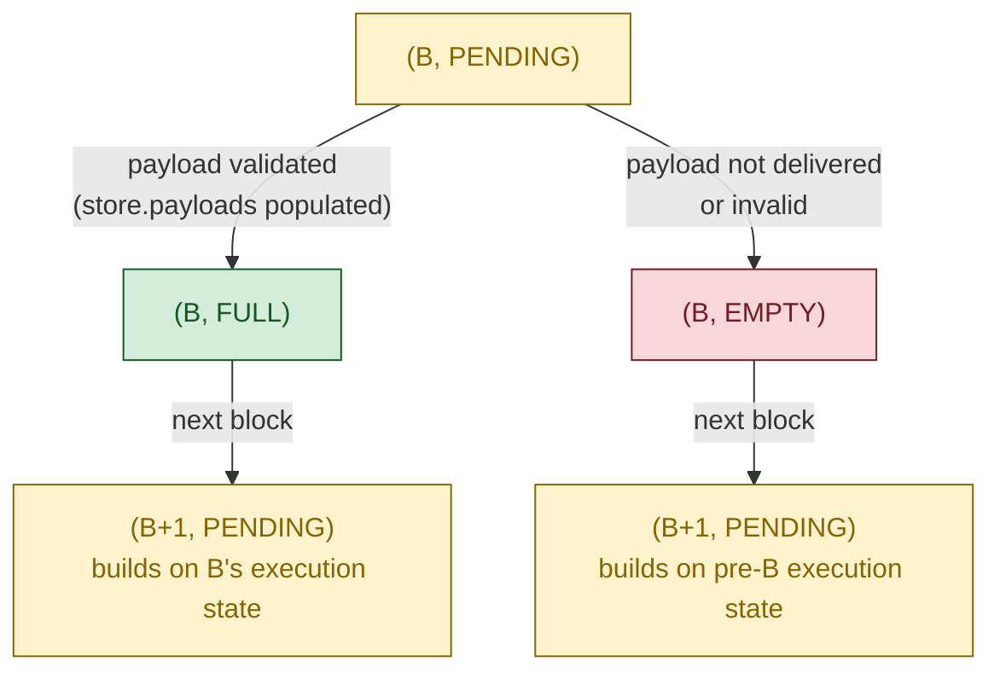
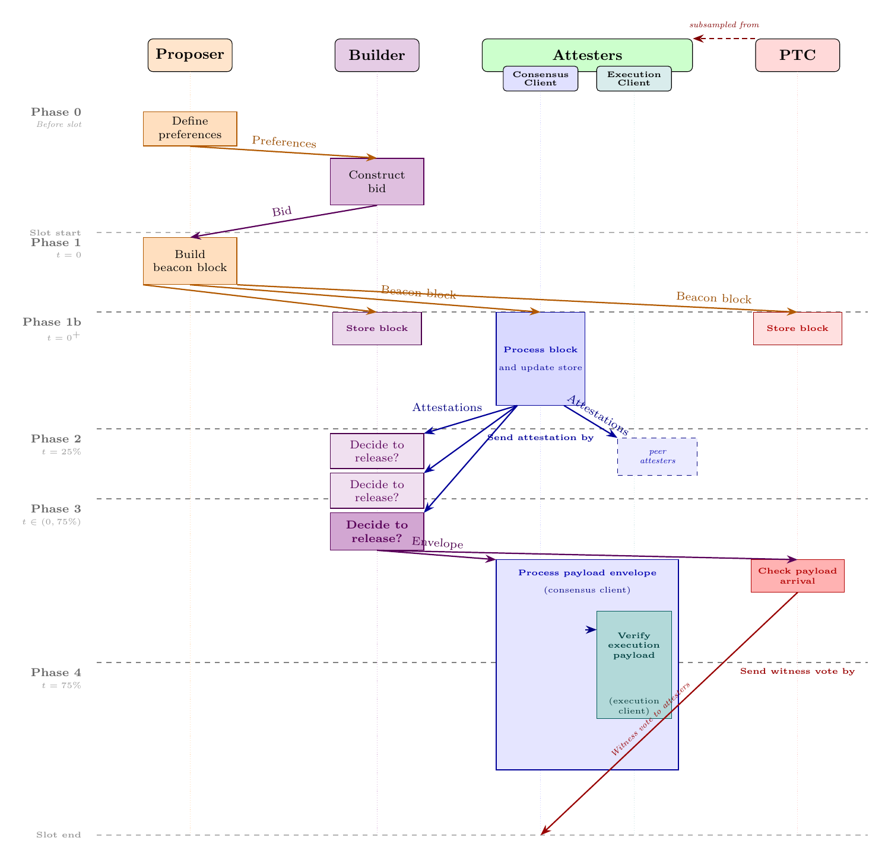
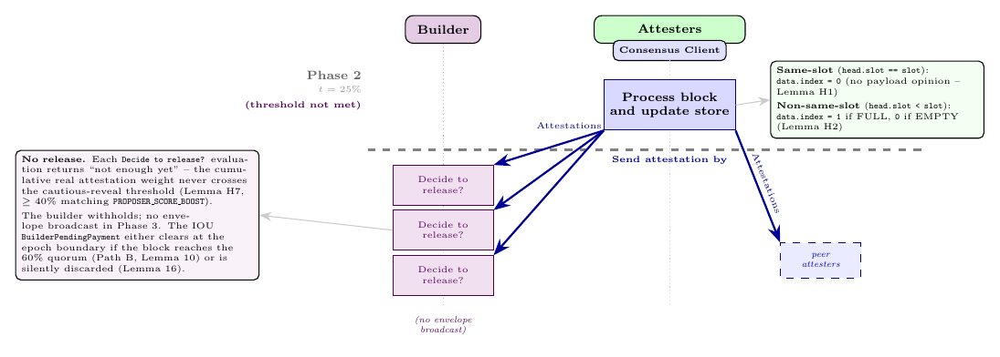
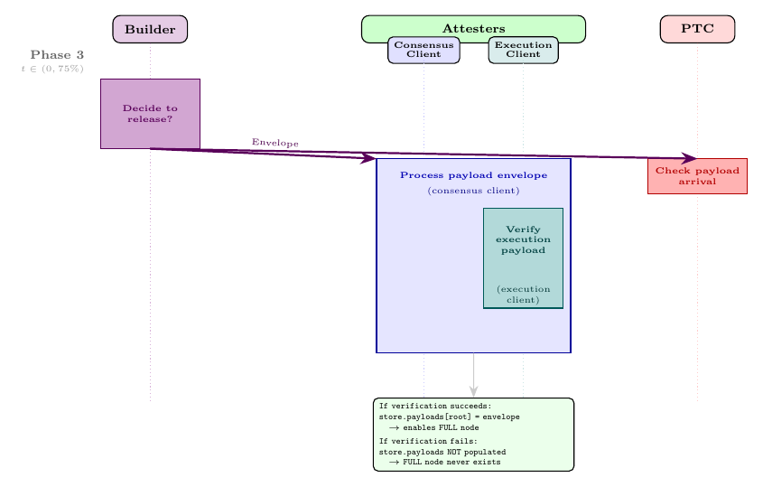
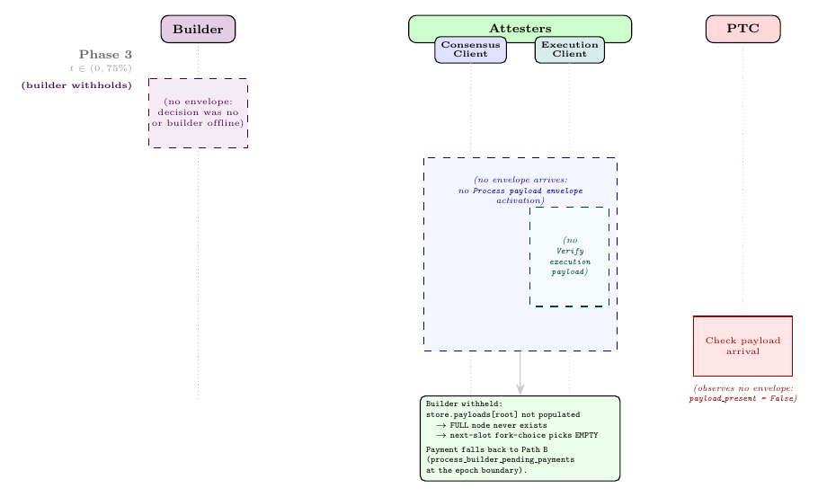
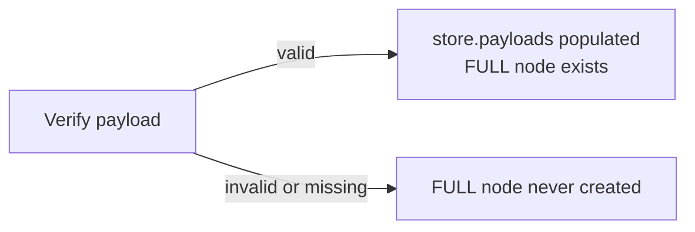
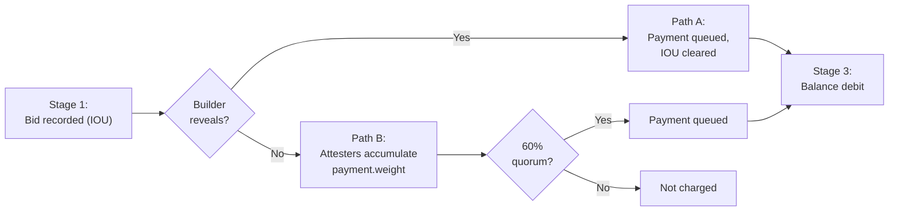
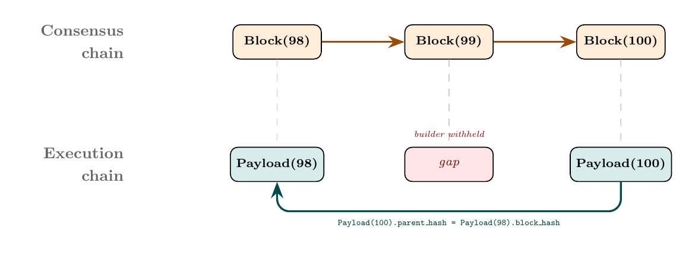

# ePBS: Overview, Lifecycle, and Properties

EIP-7732 enshrines proposer-builder separation into Ethereum's consensus protocol. This is a large change: it restructures how blocks are produced, introduces a new staked actor (the builder), splits the fork-choice tree into a three-state model, and creates an unconditional payment mechanism that removes the need for trusted relays.

This document is the first part of a security analysis of ePBS. We walk through the protocol's lifecycle, identify seven externally observable properties that the design is meant to guarantee, and trace where in the spec code each guarantee is enforced. Where the argument requires facts about internal spec functions we have not fully presented here, we state those facts as explicit assumptions and show how the properties follow. A companion formal treatment — currently in progress — will discharge every assumption with line-level proofs against the complete spec pseudocode.

**Who should read this.** Anyone who wants a rigorous but readable account of how ePBS works: what changed from pre-ePBS, why, and what guarantees the protocol provides. We assume familiarity with Ethereum's consensus layer (Gasper, LMD-GHOST, FFG, attestation committees, fork choice). We do not assume prior knowledge of EIP-7732.

**Spec version.** This document targets [`ethereum/consensus-specs`](https://github.com/ethereum/consensus-specs) at commit [`5aa6eec`](https://github.com/ethereum/consensus-specs/commit/5aa6eec), Gloas fork: [`specs/gloas/`](https://github.com/ethereum/consensus-specs/tree/master/specs/gloas). The Gloas specs are work-in-progress and may differ from the EIP-7732 draft summary.

**Notation.** Code blocks use Python syntax at an abstracted level. An `...` in arguments or fields means "additional fields omitted for brevity" (they exist in the spec but are not needed for the point being made). Helper calls without bodies (e.g., `select_one_bid(bids)`, `is_head_of_chain(block, store)`) abstract over auxiliary logic whose implementations appear in the formal treatment.

---

## 1. What is ePBS and why

> **TL;DR.** ePBS replaces MEV-Boost's trusted relays with a protocol-native builder role and a decentralized timeliness committee, and restructures the fork-choice tree to handle the resulting two-phase block model.

Today, Ethereum block production already operates under a separation of concerns: validators (called **proposers** in this context) produce beacon blocks, while specialized **builders** construct the execution payloads inside them. This division of labor exists because building a profitable execution payload requires sophisticated MEV (Maximal Extractable Value) extraction strategies that most validators do not have the infrastructure to run. The current implementation, **MEV-Boost**, achieves this separation through **trusted relays**: builders submit blocks to relays, relays forward block headers to proposers, proposers commit to a header without seeing the full block, and relays then reveal the block to the network.

This works — over 90% of Ethereum blocks are produced through MEV-Boost — but it has fundamental problems:

- **Trust in relays.** Relays are single points of failure. Both proposers and builders must trust them: the proposer trusts the relay will reveal the block after signing, and the builder trusts the relay will not steal MEV. If a relay is malicious, crashes, or censors, liveness and fairness suffer.
- **No on-chain accountability.** Relays are not protocol participants. There is no on-chain mechanism to detect or punish relay misbehavior.
- **Censorship vector.** Relays can selectively refuse to forward certain blocks, enabling censorship at the relay level.

**Enshrined Proposer-Builder Separation (ePBS)**, specified in EIP-7732, integrates the builder-proposer interaction directly into Ethereum's consensus protocol, eliminating the need for trusted relays. The protocol itself mediates the exchange: builders are now staked on-chain participants, the bid commitment becomes a consensus object, and a dedicated committee of validators (the **Payload Timeliness Committee**, PTC) provides a decentralized signal about whether the builder delivered.

The goal of this document — and the broader project it belongs to — is to characterize ePBS rigorously: identify what the protocol is supposed to guarantee, formalize the algorithms that implement those guarantees, and prove that the guarantees actually hold under both honest and adversarial behavior.

### A structural change to the fork-choice tree

Before stating the protocol's properties, we need to establish one structural fact that will recur throughout the document: **under ePBS, the fork-choice tree is a tree of *nodes*, where each node is a `(root, payload_status)` pair. The node — not the block — is the primary fork-choice abstraction.**

**Multiple nodes can reference the same block, each carrying a different payload status.** Pre-ePBS, each block maps to exactly one node, and the tree's job is to answer "which node is the canonical head?" Under ePBS, because the execution payload arrives separately from the beacon block and may or may not arrive at all, the fork-choice tree must represent both possibilities:

- **PENDING** — the node represents a block whose payload-delivery outcome has not yet been decided by the fork-choice.
- **FULL** — the node represents the world where the block's execution payload was revealed and validated.
- **EMPTY** — the node represents the world where the block's execution payload was not delivered.

**The tree alternates between PENDING nodes and payload-status nodes.** A PENDING node branches into FULL and EMPTY children (both if the payload was validated locally; only EMPTY otherwise), and each FULL or EMPTY node branches into PENDING nodes for the next blocks in the chain. The fork-choice rule traverses nodes, making two kinds of decisions at each level: "which payload status?" (choosing between the FULL and EMPTY nodes for a given block) and "which next block?" (choosing among PENDING child nodes).



*Figure 1: The ePBS fork-choice tree around block B. Pre-ePBS, B maps to one node; under ePBS, three distinct nodes reference B — `(B, PENDING)`, `(B, FULL)`, `(B, EMPTY)`. The `(B, FULL)` node exists only if `store.payloads` has been populated for B — i.e., only if the execution engine locally accepted B's payload (see Phase 3). The next block's PENDING node descends from whichever payload-status node it builds on, declared via `bid.parent_block_hash`. The fork-choice traversal alternates between two decision types at every level: "which payload-status node?" then "which next-block node?"*

**This structural change is what enables ePBS to represent the two-phase model inside the fork-choice rule itself.** Consensus without execution, then execution separately. Concretely: when block B is proposed at slot 100 and its builder reveals the payload, the tree contains three nodes referencing B — `(B, PENDING)`, `(B, FULL)`, `(B, EMPTY)` — and the next proposer must choose which node to build on, committing its choice via a declaration in the bid.

We will revisit this structure throughout the document: when we describe attesters (who signal FULL or EMPTY via `data.index`), PTC members (who provide a signal to resolve FULL vs. EMPTY for the immediately previous slot's block), and the fork-choice rule (which reads these signals to pick the canonical chain). Every property below assumes this node-based tree as the underlying structure.

---

## 2. The actors

> **TL;DR.** ePBS introduces the **builder** as a new staked actor, modifies attesters (`data.index` now signals payload status) and proposers (now select bids or self-build), and adds a per-slot **PTC** subcommittee that witnesses envelope arrival.

ePBS introduces one new actor and modifies the role of existing ones.

**Proposer** — a validator selected for a slot. **Modified under ePBS.** The proposer typically *selects a builder's bid* and includes it in the beacon block (the expected case). Alternatively, the proposer can *self-build* — setting `builder_index = BUILDER_INDEX_SELF_BUILD`, `value = 0`, and signature `G2_POINT_AT_INFINITY` — to construct the execution payload directly. Self-build is the escape hatch when no acceptable bid is available.

**Attester** — a validator assigned to a slot's committee. **Modified under ePBS.** The `data.index` field is repurposed to signal payload status (0 = empty, 1 = full). For same-slot attestations (block from the attester's own slot), `data.index` must be 0 — the attester cannot have an opinion on the payload yet because it votes before the builder reveals.

**Builder** — *new*. A staked participant (separate from validators) that constructs execution payloads and bids for inclusion. Key properties:

- **Registration.** Builders deposit ETH on-chain with a dedicated withdrawal credential prefix (`0x03`), receive a `BuilderIndex`, and become active when their deposit is finalized.
- **Duties.** Builders do not attest or propose — they only build payloads. They are also responsible for broadcasting blob data (EIP-4844 data column sidecars) across the p2p network.
- **Not slashable.** Unlike validators, builders are not slashable: there is no `process_builder_slashing` handler. The protocol enforces accountability solely through *bid forfeit* — the `BuilderPendingPayment` IOU clears against the builder's stake at the epoch boundary even when the builder withholds, provided the beacon block reaches the 60% quorum (Path B, Lemmas 29–30 in the [formal treatment](https://github.com/ethereum/epbs-security-analysis/blob/formal-treatment/ePBS-pseudocode.md)).
- **Exit.** Builders may voluntarily exit (via `process_voluntary_exit`, which uses the bitwise `BUILDER_INDEX_FLAG` to distinguish builder indices from validator indices in the same wire format). There is no misbehaviour-driven exit — accountability is purely economic.

**PTC member** — *new role for existing validators*. A subcommittee of 512 validators per slot, selected from the slot's regular attestation committees. Key properties:

- **PTC members are themselves attesters for the slot.** Every PTC member also belongs to one of the slot's attestation committees and casts the standard same-slot attestation at $T_{\mathrm{att}}$ in addition to the PTC witness statement at $T_{\mathrm{ptc}}$. Throughout this document and in the figures we draw the PTC as a separate column from Attesters — this is a *pedagogical* separation, not a mechanical one, isolating the witness-statement duty (a binary observation about envelope arrival) from the head-vote duty (which drives fork-choice weight).
- **Distinct duty.** The PTC casts a **payload timeliness attestation** at 75% of the slot, reporting whether the member observed the `SignedExecutionPayloadEnvelope` arrive. The spec object is a `PayloadAttestationMessage` ([`beacon-chain.md`](https://github.com/ethereum/consensus-specs/blob/master/specs/gloas/beacon-chain.md)); we follow the PBS literature and use the shorthand **witness statement** (or **witness vote**) — the PTC is *witnessing* envelope arrival, not judging payload validity.
- **Observation, not validation.** PTC members run `on_execution_payload_envelope` as part of normal node operation, but payload validity is *not* a precondition for the PTC vote. The vote is conditioned solely on envelope observation.

---

## 3. Properties

> **TL;DR.** Seven properties P1–P7 capture the externally observable guarantees of ePBS — claims an observer with full visibility of network messages and on-chain state can verify, without inspecting any node's internal state. They hold under β < 20% per committee.

With the actors and the fork-choice tree structure established, we can state the properties that ePBS is designed to guarantee. We restrict the list to **claims that are observable from network messages and on-chain state alone**: an external observer running a passive node should be able to detect a violation. Properties about *how* a node processes a block internally (e.g., whether `process_block` is split into two phases, whether the fork-choice tree contains a FULL node for a given block, how `is_supporting_vote` weighs same-slot votes) are mechanisms — not properties — and are treated as descriptions in the lifecycle walkthrough below.

Each property is stated here informally and revisited precisely as we walk through the lifecycle. Each is backed by lemmas in the companion formal treatment.

**P1: Unconditional payment.** If the proposer's beacon block is widely attested, the proposer receives the builder's bid regardless of whether the builder reveals the payload. The builder cannot commit to a bid and then avoid paying.

**P2: PTC bounds proposer power.** Without the PTC, a single malicious next-slot proposer could force the fork-choice to treat a delivered payload as missing (by declaring `parentStatus = EMPTY`). The PTC primary path overrides such a malicious declaration when an honest PTC majority confirms the payload arrived.

**P3: Builder solvency is enforced at bid time.** A builder cannot commit to a bid it cannot pay, even across concurrent slots. The check accounts for all outstanding obligations.

**P4: Builder bid commitments are binding.** An honest builder's revealed payload necessarily has the same `block_hash` committed in the bid; a dishonest builder revealing a different payload fails the equality check in `verify_execution_payload_envelope`.

**P5: Builder protection from malicious proposer.** If the builder withholds the payload and the beacon block does not reach the 60% attestation quorum at the epoch boundary, the builder is not charged. This protection applies only to the epoch-boundary settlement case (when the builder withholds). If the builder reveals and a subsequent block declares FULL, the payment is settled unconditionally in the next block — the quorum is irrelevant. (The "60% quorum" refers to the threshold used for epoch-boundary settlement: it requires the accumulated effective balance of same-slot attesters who voted for the beacon block to reach at least 60% of the average per-slot active validator balance. It is distinct from the PTC majority threshold. Both are explained fully in Section 5.)

**P6: No double payment.** The payment mechanism has two settlement paths (one triggered when the builder reveals, one at the epoch boundary if the builder withholds). If the first path succeeds, the second is suppressed — the proposer is paid exactly once. Both paths are described in Section 5.

**P7: Missed-slot resolution.** If a payload is delivered at slot N but slot N+1 is missed (no block proposed), then at slot N+2 the FULL/EMPTY decision for slot N is resolved by attestation weight from slot N+1's non-same-slot attesters — the PTC tiebreaker is not needed because the zero-return rule no longer applies.

These seven are the **externally checkable** guarantees: each can in principle be detected by an observer who sees only the network's messages and the on-chain state. The rest of this section's discussion of payment timing, the fee-recipient destination, and the adversarial model applies uniformly to all seven.

**A note on payment timing.** *Payment under ePBS is deferred — but bounded to a couple of epochs.* Pre-ePBS, the proposer's MEV revenue arrived immediately. Under ePBS, two settlement paths defer it:

- **Path A** queues the payment in the *next* block when the builder reveals (`process_parent_execution_payload` → `settle_builder_payment`).
- **Path B** queues it at the end of *epoch e+1* when the builder withholds and the beacon block reaches the 60% quorum (Section 5).

The actual on-chain debit (builder side) and credit (proposer side) both happen later, when `apply_withdrawals` processes the `BuilderPendingWithdrawal` queue in a subsequent block. End-to-end, the proposer's `fee_recipient` receives the bid value within a couple of epochs in the worst case — slightly slower than pre-ePBS in exchange for unconditionality (P1, P5).

**Why the fee recipient and not the validator's balance.** *The bid is paid to the proposer's `fee_recipient` (an Eth1 execution address) rather than added to the validator's consensus-layer balance.* This follows the same convention used pre-ePBS for execution-layer fees: staking pools and similar operators rely on this separation because keeping consensus rewards apart from execution-layer revenue makes accounting and revenue distribution to delegators much simpler. Under ePBS, the only difference is *who* drives the credit (the builder, via `BuilderPendingWithdrawal`) — the destination address remains the same.

**Adversarial model.** Properties P1–P7 hold under the following calibration:

- **Byzantine bound.** β < 20% per committee — the Byzantine fraction in any slot's committee is less than 20% of the committee weight.
- **60% payment quorum = 40% reveal threshold + 20% adversary budget.** If the builder sees < 40% attestation weight and withholds, the adversary (< 20%) cannot fill the gap to reach 60%, so the builder is not charged.
- **Where the formal proofs live.** The full adversarial analysis — proposer equivocation, parameter relationships, all lemmas — is in the [formal treatment](https://github.com/ethereum/epbs-security-analysis/blob/formal-treatment/ePBS-pseudocode.md) (on the `formal-treatment` branch). Section 7 below summarizes the key scenarios.

The remainder of this document shows how the protocol's algorithms enforce each of P1–P7.

---

## 4. The slot, abstracted

> **TL;DR.** A slot under ePBS proceeds through five phases: pre-slot bid construction, beacon block publication, attestation, builder reveal, and PTC witness vote. The next slot's `get_head` resolves any FULL/EMPTY ambiguity. Each phase below shows the actor code, identifies the property it enforces, and depicts both happy and degraded paths.

**State and store.** *Two data structures recur throughout this section.* The **state** (`BeaconState`) is the consensus-layer snapshot associated with a specific block. It is computed deterministically: the state after block B is the result of applying B to the state of B's parent — `state(B) = process_block(state(parent(B)), B)`. No other input is needed: a node that knows the genesis state and the chain of blocks can recompute any block's state. Under ePBS, this computation is split in two: `process_block` applies the consensus-layer transition (including deferred execution effects from the parent's payload via `process_parent_execution_payload`, bid verification, attestation processing, withdrawals), while the current slot's execution payload is verified separately by `verify_execution_payload_envelope` when the builder reveals.

**The store reflects per-node observations, not deterministic state.** Unlike the state, which is per-block and deterministic, the store records what a particular node has observed from the network: all received blocks (`store.blocks`), the state after processing each block's consensus layer (`store.block_states`), attestations, PTC votes, and — new under ePBS — `store.payloads`, which maps a block root to the `ExecutionPayloadEnvelope` that the builder revealed for that block. `store.payloads` is populated only when the node locally receives and verifies the execution payload envelope, which is why it serves as the structural gate for FULL nodes — a node-internal invariant that supports several externally observable properties (notably P2 and P4).

A slot under ePBS proceeds through five phases. Below we walk through the phases as a storyline, showing the abstracted code that each actor runs, and connecting each step to the formal property it enforces.

**How to read Figure 2.** The diagram uses a sequence-diagram convention: **each box names a *computation*** (the procedure or activation an actor performs), and **each arrow names a *transmission*** (the message broadcast from the box at the arrow's tail). Box *heights* are also meaningful — a tall box represents substantial computation (e.g., the Attesters' CL `Process block and update store`), while a short box represents a light step (the `Store block` boxes used by Builder and PTC for the same `on_block` handler they barely use; the brief `Check payload arrival` store lookup the PTC runs before voting). Dashed horizontal lines mark the spec-mandated slot-time deadlines (Phase 1b, 2, 3, 4 ↔ $t = 0^+$, $T_{\mathrm{att}}$, the builder reveal window, $T_{\mathrm{ptc}}$). The figure depicts the **happy path**: every actor follows the protocol, the builder reveals on time, the PTC observes the envelope before its deadline, and every message propagates within $\Delta$. Adversarial and degraded scenarios are surveyed in Section 7.



*Figure 2: Slot lifecycle under ePBS, happy path. Columns: Proposer (orange), Builder (violet), Attesters with CL/EL (blue/teal), PTC (red — a 512-member subcommittee of the slot's attesters; the dashed arrow at the top marks the subsampling). Phase-by-phase walkthroughs of every box and arrow follow below.*

### Phase 0 — Before the slot

*The proposer broadcasts preferences; the builder constructs the payload and submits a bid.*

**Happy path: external builder.**


*Figure 3a: Pre-slot exchange with an external builder. Proposer broadcasts `SignedProposerPreferences`; Builder constructs the full payload and submits a `SignedExecutionPayloadBid` (carrying `block_hash`, `value`, `parent_block_hash`) which arrives just before slot start.*

**Alternative: self-build.**


*Figure 3b: Pre-slot self-build. No external builder is involved (Builder column dashed); the Proposer runs `prepare_execution_payload` locally and assembles the bid with `builder_index = BUILDER_INDEX_SELF_BUILD`, `value = 0`, signature `G2_POINT_AT_INFINITY`. Nothing crosses the network in Phase 0 — the payload and bid are held until Phase 1.*

The proposer for an upcoming slot may broadcast a `SignedProposerPreferences` message specifying its preferred `fee_recipient` (where to receive payment) and `gas_limit`. Without this broadcast, the gossip network will not forward any builder bids for that slot.

The builder, observing the proposer's preferences, constructs an execution payload via its execution engine and broadcasts a bid:

> **A note on `@Upon`.** The code blocks that describe actor behavior (the builder's `submit_bid` and `reveal_payload`, the proposer's `propose`, the attester's `attest`, and the PTC member's `ptc_vote`) are written as **event-driven handlers**: each `@Upon` decorator declares the condition under which the code executes. In practice, a validator or builder runs client software that has a scheduler watching the clock and network events. When a condition is met — the clock reaches a specific point in the slot, or a message arrives on the gossip network — the client internally performs the corresponding steps. An actor is **honest** if its client follows these steps; an actor is **dishonest (Byzantine)** if its client deviates — for example, a validator signaling `data.index = 1` without having seen the payload, a builder revealing a different payload than the one it committed to, or a PTC member voting without observing the envelope. Functions without `@Upon` (such as `process_block` and `get_head` shown later) are **spec functions**: they are not triggered directly by events, but called internally by the client whenever it receives a block, needs to compute the chain head, or otherwise processes protocol state.

```python
@Upon(received SignedProposerPreferences for upcoming_slot)
def submit_bid(builder, upcoming_slot, state, proposer_preferences):
    payload = execution_engine.build_payload(
        parent_hash=state.latest_block_hash,
        fee_recipient=proposer_preferences.fee_recipient,  # MUST match preferences
        gas_limit=proposer_preferences.gas_limit,          # MUST match preferences
        ...,
    )
    bid = ExecutionPayloadBid(
        block_hash=payload.block_hash,                      # The binding commitment
        value=builder.bid_amount,                           # Amount offered to proposer
        builder_index=builder.index,
        slot=upcoming_slot,
        parent_block_hash=state.latest_block_hash,
        ...,
    )
    broadcast(SignedExecutionPayloadBid(bid, sign(bid)))
    builder.stored_payload = payload                        # Keep for reveal phase
```

**The builder constructs the full payload before submitting the bid, because `bid.block_hash` must equal the actual payload's hash.** This is a binding commitment: when the builder later reveals, the revealed payload must match this hash exactly. The other key field is `bid.parent_block_hash`, which declares which execution chain tip the builder built on — this is how the next block signals whether it treats its parent as FULL or EMPTY (explained fully in Section 6, "The two-chain structure").

**The builder simulates the parent's payload locally to determine the correct execution chain tip.** The builder reads `state.latest_block_hash`, but at this point `apply_parent_execution_payload` (which updates `latest_block_hash`) has not yet run for the current slot — it runs inside `process_block` of the *next* block. The builder resolves this by calling `prepare_execution_payload`, which locally runs `apply_parent_execution_payload` on a **copy** of the state when building on FULL. This local simulation advances `latest_block_hash` on the copy, computes the correct withdrawals, and determines the correct execution chain head. The network's eventual `process_block` produces the same deterministic result.

> **Property P4 (implicit):** Bids are binding. An honest builder's revealed payload necessarily has `block_hash == bid.block_hash` because the same `stored_payload` is used in both phases. A dishonest builder revealing a different payload fails the equality check in `verify_execution_payload_envelope`.

### Phase 1 — Slot start (t = 0): Proposer publishes the beacon block

*The proposer collects valid bids, selects one, and broadcasts a beacon block carrying the bid (not the payload).*

**Happy path: valid block proposed and received by all.**


*Figure 4a: Slot start, valid block. Proposer broadcasts the BeaconBlock to Builder, Attesters, and PTC; the body carries the bid (`signed_execution_payload_bid`) and the previous slot's aggregated PTC votes (`payload_attestations`) — both new under ePBS. The execution payload is not in the block; it arrives separately in Phase 3.*

**Alternative: missing or invalid block.**


*Figure 4b: Slot start, missing or invalid block. The Proposer is dashed (offline, delayed, or block rejected at every honest `on_block`); no slot-N consensus chain entry is created. Attesters fall back to the previous head (Figure 4d, Lemma H2); the slot-N PTC does not vote at all, since `has_beacon_block_for_slot(store, slot)` is False.*

At the beginning of the slot, the proposer collects valid bids from the gossip topic, selects one (typically the highest-value), and includes it in the beacon block:

```python
@Upon(time_in_slot == 0 and is_proposer(state, validator.index))
def propose(validator, slot, state):
    bids = collect_valid_bids(state, slot)
    selected_bid = select_one_bid(bids)              # Spec: just "select one bid"

    body = BeaconBlockBody(
        signed_execution_payload_bid = selected_bid,        # NEW under ePBS
        payload_attestations = aggregate_ptc_votes(slot - 1),  # NEW: prev-slot PTC votes
        parent_execution_requests = get_parent_execution_requests(store, state),  # NEW
        # ... existing fields: attestations, deposits, etc.
    )
    block = construct_beacon_block(state, body)
    broadcast(SignedBeaconBlock(block, sign(block)))
```

**The beacon block contains the bid, not the payload — this is the structural change that enables the two-phase model.** The actual `ExecutionPayload` will arrive separately. Two-phase processing is a node-internal mechanism (the consensus layer advances on the beacon block alone, with execution-layer effects applied separately when the builder reveals); it underwrites the externally observable properties below but is not itself one of them. The `parent_execution_requests` field is also new: it carries the execution requests (deposits, withdrawals, consolidations) from the parent's execution payload, which `process_parent_execution_payload` will apply as the first step of block processing. If the proposer is building on the parent's FULL payload, the requests come from `store.payloads[parent_root].execution_requests`; otherwise the field is empty.

### Phase 1b — Block receipt

*Every node runs `process_block`, which applies the parent's deferred execution effects, verifies the bid, and arms the unconditional payment IOU.*

**Happy path: block received and processed.**


*Figure 4c: Block receipt. All nodes run `Process block and update store`; the two new ePBS steps inside are `process_parent_execution_payload` (applies the parent's execution effects if the block declares FULL) and `process_execution_payload_bid` (verifies the bid and records the `BuilderPendingPayment` IOU — Property P1). The pipeline and store-update annotations beside the figure list the sub-steps.*

**Alternative: block missing or invalid; attest for previous head.**


*Figure 4d: Attestation fallback when the slot-N block is missing or invalid. No `Process block and update store` runs (`store.blocks[root]` is never written), but at $T_{\mathrm{att}}$ the attester still runs `get_head`, returns the previous head, and casts a **non-same-slot attestation** for the previous head with `data.index` set per Lemma H2. This is the fallback that keeps fork-choice progressing through missed slots and feeds the missed-slot resolution of Property P7.*

When other nodes receive the beacon block, they run `process_block`. Here is what changed under ePBS:

```diff
 def process_block(state, block):
+    process_parent_execution_payload(state, block)     # NEW: apply parent's EL effects if FULL
     process_block_header(state, block)
     process_withdrawals(state)
-    process_execution_payload(state, block.body.execution_payload, ...)
+    process_execution_payload_bid(state, block)        # Verify the bid, arm payment
     process_randao(state, block.body)
     process_eth1_data(state, block.body)
-    process_operations(state, block.body)              # Same name, but modified internally
+    process_operations(state, block.body)              # Now also processes payload_attestations
     process_sync_aggregate(state, block.body.sync_aggregate)
```

> **Observe that** the very first step in `process_block` is `process_parent_execution_payload`: if the current block declares that its parent's payload was FULL (via `bid.parent_block_hash`), this function applies the parent's execution-layer effects — processing execution requests (deposits, withdrawals, consolidations), settling the builder payment, and advancing `state.latest_block_hash`. If the parent was EMPTY, it verifies that no execution requests are included and returns immediately. This is how ePBS integrates the parent's execution effects into the consensus-layer state transition.

> The `payload_attestations` processed inside `process_operations` are **PTC votes cast in the previous slot**, not votes about the current block's payload. When a node runs `process_block` for block N at t = 0 of slot N, slot N's PTC has not yet voted (PTC members vote at 75% of their slot). The votes included in block N's `payload_attestations` are slot N−1's PTC votes, aggregated by the slot N proposer before proposing. How the current slot's payload is verified (separately from `process_block`) is described in Phase 3 below.

The other key new function called here is `process_execution_payload_bid`, which verifies the builder's bid and arms the unconditional payment mechanism:

```python
def process_execution_payload_bid(state, block):
    bid = block.body.signed_execution_payload_bid.message

    # 1. Verify the builder is eligible
    if bid.builder_index == BUILDER_INDEX_SELF_BUILD:
        assert bid.value == 0                               # Proposer doesn't pay itself
    else:
        assert is_active_builder(state, bid.builder_index)
        assert can_builder_cover_bid(state, bid.builder_index, bid.value)
        assert verify_execution_payload_bid_signature(state, block.body.signed_execution_payload_bid)

    # 2. Verify the bid matches the chain state
    assert bid.slot == block.slot
    assert bid.parent_block_hash == state.latest_block_hash    # Execution chain consistency
    assert bid.parent_block_root == block.parent_root          # Consensus chain consistency

    # 3. Record the IOU: builder owes proposer bid.value
    if bid.value > 0:
        payment = BuilderPendingPayment(weight=0, withdrawal=...)
        state.builder_pending_payments[slot_index] = payment

    # 4. Cache the bid for later verification
    state.latest_execution_payload_bid = bid
```

**The `BUILDER_INDEX_SELF_BUILD` branch is the escape hatch for solo validators.** A proposer that constructs its own execution payload (without an external builder) takes this branch: `bid.value` must be zero (the proposer does not pay itself), the signature check is skipped, and no IOU is recorded. ePBS does not force any validator to depend on the builder market.

> **Property P3: Builder solvency.** The check `can_builder_cover_bid` accounts for **all outstanding obligations** of the builder — both already-approved payments waiting in `builder_pending_withdrawals` and pending bids in `builder_pending_payments` from other slots. A builder cannot overbid across concurrent slots.

> **Property P1: Unconditional payment is armed.** No money has moved yet, but the IOU (`BuilderPendingPayment`) is now in state. From this point forward, the builder **will pay** if the beacon block is widely attested, regardless of whether it reveals the payload.

### Phase 2 — Attestation deadline (t = 25%)

*Honest attesters cast same-slot attestations with `data.index = 0`; once the cautious-reveal threshold is met, the builder releases the envelope.*

**Happy path: cautious threshold met, builder releases.**


*Figure 5a: Phase 2, attestation deadline (t = 25%). Attesters cast their votes (`data.index` per Lemmas H1/H2 — see annotation); the votes reach both peer attesters and the Builder. The Builder's three `Decide to release?` boxes model cautious-reveal (Lemma H7): the third evaluation crosses the ≥ 40% threshold and triggers envelope construction in Phase 3.*

**Alternative: cautious threshold never met; builder withholds.**



*Figure 5b: Phase 2, cautious threshold never met. All three `Decide to release?` evaluations return "not enough yet" (light shade); cumulative real attestation weight never crosses ≥ 40% (Lemma H7). No envelope is broadcast — the IOU persists and falls through to Path B (Lemma 10 if the 60% quorum is met, Lemma 16 / Property P5 otherwise).*

Honest attesters run the fork-choice function and broadcast their vote:

```python
@Upon(time_in_slot == T_ATT and validator in committee)
def attest(validator, slot, state, store):
    head = get_head(store)
    data = AttestationData(slot=slot, beacon_block_root=head.root, ...)
    if head.slot == slot:                       # Same-slot attestation
        data.index = 0                          # No payload opinion possible
    else:                                       # Non-same-slot attestation
        data.index = 1 if head.payload_status == FULL else 0
    broadcast(sign_attestation(validator, data))
```

**Same-slot attesters are payload-neutral: `data.index = 0` always for the current slot's block.** The attester cannot know whether the payload will be revealed — the builder has until 75% of the slot, but the attester votes at 25%. Their votes count toward the block's existence (PENDING) and toward ancestor branches via the chain structure, but not toward the FULL/EMPTY decision for this specific block.

**Same-slot payload-neutrality is a structural fact of the weight computation, not a property in our externally observable list.** A same-slot attester's vote contributes to its block's PENDING node (helping the block win against competing blocks at the same slot) but contributes nothing to the FULL/EMPTY weight for that block — by construction of `is_supporting_vote` (see Section 8, G-Vote.1). This follows directly from the timing constraint: attesters vote at 25% of the slot while the builder has until 75% to reveal, so a same-slot attester cannot have a payload opinion. The behavior is enforced internally by the fork-choice's weighing rules and is consumed by Property P2 (PTC bounds proposer power) and P7 (missed-slot resolution).

### Phase 3 — Builder reveal window (t ∈ (0, 75%))

*The builder broadcasts the `SignedExecutionPayloadEnvelope`; nodes verify it and populate `store.payloads`, which is the structural gate for the FULL node.*

**Happy path: builder reveals, all clients process the envelope.**



*Figure 6a: Phase 3, builder reveals the envelope. The cautious threshold has crossed and the Builder broadcasts; Attesters run `Process payload envelope` (CL) → `Verify execution payload` (EL); PTC members observe the envelope and (under vote-on-receipt) broadcast the witness vote immediately. If EL verification succeeds, `store.payloads[root]` is populated and the FULL node becomes available — the structural gate consumed by Properties P1 and P2.*

**Alternative: builder withholds; no envelope reaches the network.**



*Figure 6b: Phase 3, builder withholds (continuing Figure 5b). No envelope crosses the network — Attesters never run `Process payload envelope`, `store.payloads[root]` is never populated, and the FULL node never exists (Lemma 1). PTC members vote `payload_present = False` (Lemma H4); the next-slot fork-choice picks `(B, EMPTY)` (Lemma 6) and payment falls through to Path B (Lemma 10 / Lemma 16).*



*Figure 6c: The outcome of execution validation. If `verify_execution_payload_envelope` succeeds, `store.payloads[root]` is populated with the envelope — this is the sole mechanism that enables the FULL node in the fork-choice tree. If verification fails or the envelope never arrives, the FULL node is never created regardless of PTC votes or proposer declarations.*

Some time after the beacon block is published — typically before the PTC deadline — the builder reveals the payload by broadcasting a `SignedExecutionPayloadEnvelope`:

```python
@Upon(received SignedBeaconBlock containing this bid)
def reveal_payload(builder, block, store):
    if not is_head_of_chain(block, store):
        return                                              # Honest withholding
    envelope = ExecutionPayloadEnvelope(
        payload=builder.stored_payload,                     # Same payload as the bid commits to
        execution_requests=builder.stored_requests,
        builder_index=builder.index,
        beacon_block_root=hash_tree_root(block),
        parent_beacon_block_root=block.parent_root,
    )
    broadcast(SignedExecutionPayloadEnvelope(envelope, sign(envelope)))
```

**An honest builder reveals only when the beacon block is the fork-choice head; a dishonest builder may withhold strategically.** Honestly, if the block arrived late or a competing block won, revealing serves no purpose — the payload would not be used by the canonical chain. Dishonestly, a builder might withhold even when the block is canonical — for example, if the MEV opportunity that justified the bid has vanished. The unconditional payment mechanism (Section 5) ensures that strategic withholding does not let the builder avoid paying the proposer.

When nodes receive the envelope, they run `on_execution_payload_envelope`. This verifies the payload against the execution engine and stores the envelope — separately from the beacon block:

```python
def on_execution_payload_envelope(store, signed_envelope):
    envelope = signed_envelope.message
    state = store.block_states[envelope.beacon_block_root]
    verify_execution_payload_envelope(state, signed_envelope, execution_engine)  # Verify EL validity
    store.payloads[envelope.beacon_block_root] = envelope      # Enables FULL node
```

**The single line `store.payloads[root] = envelope` is the only place where the FULL node becomes available in the fork-choice tree.** If `verify_execution_payload_envelope` fails (invalid payload, EL rejection, blob data unavailable), this line is never reached and the FULL node is never created. Note that `store.payloads` stores the envelope itself (not a post-state) — the execution-layer state effects are applied later, inside `process_parent_execution_payload` when the next block is processed (see Phase 1b).

**Execution validity gates FULL-node existence — a structural invariant, not an external property.** Every honest node's fork-choice tree contains a FULL node for block B *if and only if* B's payload was locally received and validated; PTC votes, attestation weight, and proposer declarations cannot create a FULL node for an invalid payload. This is the strongest structural guarantee in ePBS, but it is a per-node invariant: an external observer cannot directly inspect any node's fork-choice tree. They observe its consequences instead — most notably the fact that subsequent blocks declaring `parentStatus = FULL` only land on the canonical chain when the parent's payload was actually delivered, which is what Properties P1 and P2 capture externally.

The builder's **payment** is not settled at this point. It is settled later, when the next block's `process_parent_execution_payload` calls `settle_builder_payment` — this is Path A of the unconditional payment mechanism. The full mechanism, including what happens when the builder withholds, is described in Section 5.

> **Non-normative guidance: cautious builder reveal strategy.** The spec prescribes that an honest builder reveals when the block is timely and is the head of its chain ([`builder.md`](https://github.com/ethereum/consensus-specs/blob/master/specs/gloas/builder.md)). A cautious builder may adopt a stronger strategy: **reveal only after observing ≥ 40% of actual attestation weight AND no proposer equivocation.**
>
> *Why 40%:* it equals the proposer boost (`PROPOSER_SCORE_BOOST = 40`), so a block with 40% real attestation weight cannot be reorged by the next proposer's boost alone.
>
> *Why check equivocation:* the proposer might broadcast a conflicting block $B''$ after the builder has already observed the original $B$ as the head. Waiting for equivocation evidence protects the builder. Under synchrony with $\Delta < T_{\mathrm{att}}$ this is sharper than it appears: either $B''$ surfaces early enough that the builder sees it before reveal time (and withholds, since the equivocation check fires), or $B''$ surfaces so late that honest attesters had already cast their votes for $B$ at $T_{\mathrm{att}}$ — in which case $B''$ cannot accumulate the $\geq 40\%$ real attestation weight that the cautious-reveal precondition requires. The two checks together cover both cases. The formal argument is in the [formal treatment](https://github.com/ethereum/epbs-security-analysis/blob/formal-treatment/ePBS-pseudocode.md), Lemma 7 Part (b).
>
> *Payment safety:* if the proposer equivocates and the builder withholds, `process_proposer_slashing` (Helper 22) clears the `BuilderPendingPayment` once a `ProposerSlashing` object is included on-chain. The builder is the natural publisher of that evidence — it observed the equivocation directly during cautious-reveal — and has direct incentive to include it in the next block to clear its own pending obligation. Combined with the Path B settlement timing established in Section 5 (a bid recorded at slot $N$ in epoch $e$ is settled at the end of epoch $e{+}1$, not $e$), this leaves at least one full epoch of headroom to land the slashing on-chain before the epoch-boundary quorum check runs. The full security argument is in the companion formal treatment.

### Phase 4 — PTC deadline (t = 75%)

*Each PTC member broadcasts a witness statement reporting whether it observed the envelope and the blob data — a binary observation, never a validity judgment.*


*Figure 7: Phase 4 (t = 75%), PTC witness-vote deadline. Each of the 512 PTC members runs `Check payload arrival` and broadcasts a vote carrying two independent signals — `payload_present` and `blob_data_available` (decision tree on the right). The vote is a binary observation, not a validity judgment (behavioral assumption A4 / Lemma H4); the tiebreaker `should_extend_payload` requires majority on **both** signals.*

Before zooming into the spec handler, it is useful to look at what a single PTC member does as an *entity* over the entire slot. The spec does not define this view — it splits the behaviour into independent event handlers (`on_block`, `on_execution_payload_envelope`, `ptc_vote`), each fired by its own trigger. The lifecycle below stitches them together in slot order, so the role of the Phase 4 vote becomes visible as the last step of a three-step duty:

```python
# Informal: everything an honest PTC member does over one slot.
# Not a spec function — a sequential view of the three handlers that
# fire on independent triggers (block arrival, envelope arrival, deadline).

def ptc_member_for_slot(validator, slot, state, store):
    if validator.index not in get_ptc(state, slot):
        return                                              # not assigned to PTC this slot

    # ── Phase 1b ── beacon block arrives over gossip
    block = await_gossip(beacon_block_for(slot), deadline=T_PTC)
    if block is None:
        return                                              # no block → no vote
    on_block(store, block)                                  # same handler every node runs

    # ── Phase 3 ── envelope observed passively on gossip
    # No directed transmission from the builder: the PTC picks the envelope
    # off the same broadcast that reaches the Attesters' CL.
    envelope = await_gossip(envelope_for(block.root), deadline=T_PTC)
    if envelope is not None:
        on_execution_payload_envelope(store, envelope)

    # ── Phase 4 ── at the deadline, broadcast the witness vote
    wait_until(T_PTC)
    ptc_vote(validator, slot, state, store)                 # spec handler, below
```

Three observations follow directly from this lifecycle:

- **No block, no vote.** If no beacon block arrives by `T_PTC`, the member returns silently — *absence of a block is not a vote with `payload_present = False`; it is no vote at all*.
- **Envelope handling is best-effort.** A late or missing envelope simply leaves `store.payloads` unpopulated, which is what `has_execution_payload_envelope` reads at vote time.
- **Only the final step requires precise timing** (`wait_until(T_PTC)`). The first two are reactive.

**The lifecycle encodes the vote-at-deadline strategy; vote-on-receipt is equally spec-compliant.** The lifecycle waits until $T_{\mathrm{ptc}}$ and only then evaluates the store. Figures 2 and 6a depict the alternative — vote-on-receipt — where the witness vote is broadcast the moment the envelope is observed. Both strategies satisfy the spec contract that the broadcast happens by `get_payload_attestation_due_ms()`; they differ only in how soon a `payload_present = True` vote is committed once the evidence exists. The proofs in Section 8 and the formal treatment do not depend on the choice between the two.

The vote itself — the last line of the lifecycle — corresponds to the spec handler in [`validator.md`](https://github.com/ethereum/consensus-specs/blob/master/specs/gloas/validator.md) ("Constructing a payload attestation message"). The four lookup helpers below — `has_beacon_block_for_slot`, `get_beacon_block_root_for_slot`, `has_execution_payload_envelope`, `check_blob_data` — are pedagogical names for the corresponding inline checks in the spec prose (the spec uses `is_data_available` for the blob-data check; the others are described in prose at the same `validator.md` section):

```python
@Upon(time_in_slot == T_PTC and validator.index in get_ptc(state, slot))
def ptc_vote(validator, slot, state, store):
    if not has_beacon_block_for_slot(store, slot):
        return                                              # No block, no vote
    block_root = get_beacon_block_root_for_slot(store, slot)
    msg = PayloadAttestationMessage(
        validator_index=validator.index,
        data=PayloadAttestationData(
            beacon_block_root=block_root,
            slot=slot,
            payload_present=has_execution_payload_envelope(store, block_root),
            blob_data_available=check_blob_data(store, block_root),  # spec: is_data_available
        ),
        signature=sign(...),
    )
    broadcast(msg)
```

**The PTC vote contains two independent signals, because the builder delivers two things:**

- **`payload_present`** — did the `SignedExecutionPayloadEnvelope` arrive? The envelope contains the execution payload: transactions, state root, withdrawals — the content that the execution engine validates.
- **`blob_data_available`** — did the blob data arrive? Blobs are large binary data chunks (EIP-4844) used by rollups for cheap temporary storage. Each blob is split into 128 data columns distributed across the p2p network via subnets; no single node downloads all columns. Each PTC member checks whether the columns it is responsible for arrived and pass KZG proof verification. The KZG commitments for these blobs are included in the builder's bid (`bid.blob_kzg_commitments`).

**The envelope and the blob data arrive through separate gossip channels and can diverge.** The execution payload advances Ethereum's state (account balances, smart contracts); blob data provides temporary data availability for rollups. A PTC member might receive the envelope but not yet have the blob columns, or vice versa.

**The PTC member reports what it observed, not what it judged.** It does not call `verify_execution_payload_envelope` or any validation function — it only checks arrival on the gossip network. This decoupling between observation (PTC) and validation (`verify_execution_payload_envelope`) is fundamental: it allows the PTC vote to be fast (no heavy execution required) while validity remains enforced separately by `store.payloads` (populated by `on_execution_payload_envelope` only after the execution engine verifies the payload — see Phase 3).

**The fork-choice tiebreaker requires PTC majority on both signals.** `should_extend_payload` checks `is_payload_timely` (majority voted `payload_present = True`) AND `is_payload_data_available` (majority voted `blob_data_available = True`). If either fails, the PTC primary path does not fire and the tiebreaker falls to the proposer-based fallbacks.

**Witness-statement semantics is a behavioral assumption (A4), not an external property.** Honest PTC members vote `payload_present = True` if and only if they locally observed the envelope, and `blob_data_available = True` if and only if the blob data columns they are responsible for arrived and pass KZG verification — they never check execution validity. An external observer cannot tell from a PTC vote alone whether the member "actually saw" the envelope; this is therefore an assumption about honest implementations (formalized as A4 / discharged by Lemma H4), not a property checkable from messages.

> **What if the PTC lies about a missing payload?** Suppose the builder for slot N never reveals, but a malicious PTC majority votes `payload_present = True`. This has no effect. When `get_head` reaches `(B, PENDING)` at slot N+1, it calls `get_node_children`, which checks `is_payload_verified(store, B.root)` — i.e., whether `B.root` is in `store.payloads`. Since the builder never revealed, `on_execution_payload_envelope` never ran and `store.payloads[B.root]` was never populated. The FULL child does not exist in the tree — `get_node_children` returns only `{(B, EMPTY)}`. The tiebreaker and `should_extend_payload` are never consulted because there is only one child to pick. The malicious PTC votes sit unused. This is the structural FULL-node invariant in its purest form: PTC votes can influence which existing branch wins, but they cannot create a branch that the execution engine did not validate.

### Phase 5 — Slot N+1 starts: the fork-choice resolves

*At the start of the next slot, `get_head` traverses the alternating PENDING/FULL/EMPTY tree, using PTC votes (or fallbacks) to resolve the payload status of the previous slot's block.*

**ePBS extends LMD-GHOST without replacing it.** Ethereum's existing fork-choice function selects the head by iteratively picking the child with the highest attestation weight; the ePBS modification is that the tree now contains **multiple nodes per block** — one per payload status (PENDING, FULL, EMPTY) — so the traversal must resolve payload status in addition to choosing between competing blocks. The traversal alternates between two kinds of decisions:

- At a PENDING node: branch into FULL and EMPTY children (only FULL exists if `is_payload_verified(store, root)` returns true — which, by Phase 3, requires the execution engine to have verified the payload envelope)
- At a FULL or EMPTY node: branch into the next blocks in the chain (children whose `bid.parent_block_hash` matches the parent's committed status)

```python
def get_head(store):
    tree = get_filtered_block_tree(store)
    head = (store.justified_checkpoint.root, PENDING)
    while True:
        children = get_node_children(store, tree, head)
        if not children:
            return head
        head = max(children, key=lambda c: (
            get_weight(store, c),                    # Attestation weight
            c.root,                                  # Lexicographic tiebreaker
            get_payload_status_tiebreaker(store, c), # PTC-based tiebreaker (only for prev slot)
        ))
```

**`get_head` picks the child with the highest value of a three-key sort.** First `get_weight` (attestation weight), then block root (lexicographic, for determinism), then **the payload-status tiebreaker** — a PTC-based priority function that matters only when the first two keys tie. Internally, `get_payload_status_tiebreaker` consults `should_extend_payload` for the immediately previous slot's block (see below).

#### How FULL vs. EMPTY is decided

**The FULL vs. EMPTY decision for a block depends on how old the block is.** There are two cases.

**Case 1: The immediately previous slot's block.** Same-slot attesters set `data.index = 0` — they have no payload opinion (same-slot payload-neutrality, see §4 Phase 2). The protocol returns weight 0 for both FULL and EMPTY (the *zero-return rule*) and delegates to the **tiebreaker**, which reads the PTC votes. This is the normal path: the PTC is the informed signal for the most recent block.

**Case 2: Older blocks (missed slot).** If slot N+1 is missed, slot N+1's attesters make non-same-slot attestations for block B (from slot N). They observed B's payload, so they set `data.index = 1`. At slot N+2, the zero-return rule no longer applies to B, and `get_weight` computes full attestation scores — FULL wins by weight, no tiebreaker needed. This is why `data.index = 1` exists: it is the fallback when a missed slot prevents the PTC from being consulted (Property P7).

> **Concrete example.** Block B at slot 50, builder reveals. Slot 51 missed. Slot 51's attesters vote for B with `data.index = 1`. At slot 52, `slot(B) + 1 = 51 ≠ 52`, so the zero-return rule does not apply. `get_weight(B, FULL)` counts slot 51's attesters; `get_weight(B, EMPTY) = 0`. FULL wins.

In practice, most FULL/EMPTY decisions are resolved by the tiebreaker (Case 1) at slot N+1. Case 2 is the fallback for missed slots.

Let us look at how the tiebreaker works in Case 1:

```python
def should_extend_payload(store, root):
    # Guard: payload must have been locally verified
    if not is_payload_verified(store, root):
        return False
    # Primary path: PTC majority confirms the payload arrived
    return (
        (is_payload_timely(store, root) and is_payload_data_available(store, root))
        # Fallback (a): no block proposed yet for the new slot — default to FULL
        or store.proposer_boost_root == Root()
        # Fallback (b): proposed block is on a different branch — irrelevant
        or store.blocks[store.proposer_boost_root].parent_root != root
        # Fallback (c): proposed block declares parent was FULL — agree
        or is_parent_node_full(store, store.blocks[store.proposer_boost_root])
    )
```

**`should_extend_payload` first checks a hard precondition, then evaluates four independent conditions.** The function decides whether to favor FULL for a specific block — call it B. The hard precondition is `is_payload_verified(store, root)` — the node must have locally verified B's payload via `on_execution_payload_envelope`. If it fails, the function returns False immediately. This hard guard exists primarily to protect the fallback conditions below: the PTC primary path already checks `is_payload_verified` internally, but the fallbacks do not — without the hard guard, fallback (a), (b), or (c) could favor FULL for a payload the node has never received. If the hard guard passes, the function evaluates four independent conditions — any one returning True is sufficient. The intuition behind each condition:

- **PTC primary path** — "The committee confirms both the envelope and the blob data arrived." Two independent PTC majority signals must hold: `is_payload_timely` (a majority of PTC members voted `payload_present = True`, confirming the execution payload envelope arrived) AND `is_payload_data_available` (a majority voted `blob_data_available = True`, confirming the blob data columns arrived). These are two separate checks on two separate PTC vote arrays — the envelope and the blob data arrive through different gossip channels and can diverge. This is direct evidence of full delivery — the strongest signal available.
- **Fallback (a): no block proposed yet for the next slot** — "Nobody has said otherwise, so give B's builder the benefit of the doubt." If the slot N+1 proposer has not published a block yet, there is no contrary declaration about B's payload. Defaulting to EMPTY would punish B's builder before anyone has even claimed B's payload is missing, so the protocol defaults to FULL for B.
- **Fallback (b): the slot N+1 block is on a different branch** — "The slot N+1 proposer is not building on B at all." A block was proposed for slot N+1, but its parent is some other block, not B. The slot N+1 proposer's FULL/EMPTY declaration says nothing about B — it is about a different part of the tree. Default to FULL for B.
- **Fallback (c): the slot N+1 block builds on B and declares B was FULL** — "The slot N+1 proposer agrees that B's payload was delivered." The slot N+1 block is a child of B and its `bid.parent_block_hash` matches B's committed `block_hash`, meaning the slot N+1 builder read B's execution state and built on top of it. The proposer is confirming delivery.

**The function returns False only when both the PTC and the slot N+1 proposer claim B's payload was not delivered.** All four conditions must fail simultaneously: the PTC says the payload did not arrive, a slot N+1 block exists, that block is a child of B, and that block declares B was EMPTY. This requires two colluding parties.

**The interplay between the PTC primary path and the proposer-based fallbacks is the core security argument.** The four cases:

| PTC                     | Next-slot proposer         | Outcome | Mechanism                                                                   |
| ----------------------- | -------------------------- | ------- | --------------------------------------------------------------------------- |
| Honest (votes True)     | Honest (declares FULL)     | FULL    | Both the PTC primary path and fallback (c) confirm                          |
| Honest (votes True)     | Malicious (declares EMPTY) | FULL    | **PTC primary path overrides** the proposer's false EMPTY declaration |
| Malicious (votes False) | Honest (declares FULL)     | FULL    | Fallback (c) (proposer's honest FULL declaration) overrides the lying PTC   |
| Malicious (votes False) | Malicious (declares EMPTY) | EMPTY   | Both attack vectors required — only successful attack                      |

> **Property P2: PTC bounds proposer power.** Without the PTC, a single malicious next-slot proposer could force EMPTY for any block, because the only fallback that survives the proposer's EMPTY declaration is the PTC primary path. With the PTC, an honest 512-member committee overrides the single proposer. The attack succeeds only when **both** colluding parties act maliciously.

---

## 5. Unconditional payment

> **TL;DR.** The IOU is recorded at bid time; settlement happens via Path A (next block, when the builder reveals) or Path B (end of epoch *e+1*, gated by the 60% quorum). Path A suppresses Path B (P6); Path B's quorum protects the builder when withholding (P5).

**Unconditional payment (P1) is the core economic guarantee that makes ePBS work.** A proposer can commit to a builder's bid without trusting the builder, because the payment will arrive regardless of the builder's behavior.

The payment mechanism has **three stages** with **two paths**:



*Figure 8: Three-stage unconditional payment. Stage 1 records the IOU; Stage 2 settles via Path A (next block, when the builder reveals — clears the IOU and suppresses Path B per P6) or Path B (epoch-boundary 60% quorum check — protects the builder when withholding per P5); Stage 3 debits the builder's balance via `apply_withdrawals` in a subsequent block.*

**Path A** is the happy path. When the builder reveals a valid payload, the next block's `process_parent_execution_payload` calls `settle_builder_payment`, which appends the payment to `builder_pending_withdrawals`:

```python
# Inside settle_builder_payment (called by process_parent_execution_payload):
payment = state.builder_pending_payments[payment_index]
if payment.withdrawal.amount > 0:
    state.builder_pending_withdrawals.append(payment.withdrawal)
state.builder_pending_payments[payment_index] = BuilderPendingPayment()  # Clear
```

**Path B** is the unconditional path. If the builder withholds, the IOU sits in `builder_pending_payments`. As same-slot attesters vote for the beacon block, `process_attestation` accumulates their effective balance into `payment.weight`:

```python
# Inside process_attestation (the new ePBS step):
if (will_set_new_flag
        and is_attestation_same_slot(state, data)
        and payment.withdrawal.amount > 0):
    payment.weight += state.validators[index].effective_balance
```

At every epoch boundary, `process_builder_pending_payments` checks whether accumulated weight has crossed the 60% quorum threshold for the entries in the *lower* half of the 2-epoch ring, then shifts the buffer:

```python
def process_builder_pending_payments(state):
    quorum = get_builder_payment_quorum_threshold(state)  # 60% of per-slot active balance
    for payment in state.builder_pending_payments[:SLOTS_PER_EPOCH]:
        if payment.weight >= quorum:
            state.builder_pending_withdrawals.append(payment.withdrawal)
    # ... shift the 2-epoch window
```

**Path B fires one full epoch after the bid's own epoch ends.** `builder_pending_payments` is a ring buffer of size `2 * SLOTS_PER_EPOCH`, and `process_execution_payload_bid` writes a bid at slot N (in epoch *e*) into the *upper* half (index `SLOTS_PER_EPOCH + (N mod SLOTS_PER_EPOCH)`). Only the *lower* half is checked above. So at the end of epoch *e* the bid is shifted down but not yet examined; throughout epoch *e+1* attestations referencing block N keep accumulating into `payment.weight`; and at the end of epoch *e+1* the bid finally faces the quorum check — settled or discarded. The 2-epoch buffer is sized precisely for this delay so that attestations included up to one epoch after slot N can still count.

**The 60% threshold protects the builder when it withholds.** If the beacon block was poorly supported (late, equivocating, on a minority fork), the quorum is not reached and Path B does not charge the builder. This protection applies only to Path B — if the builder reveals and a subsequent block declares FULL, Path A settles the payment unconditionally.

> **Property P1 (full statement):** For any block at slot N with `bid.value > 0` that is attested by honest validators meeting the 60% quorum, the proposer's payment is queued regardless of whether the builder reveals.

> **Property P5 (builder protection — Path B only):** If the builder withholds and the beacon block does not reach the quorum, the builder is not charged via Path B. If the builder reveals, Path A charges unconditionally regardless of the quorum.

> **Property P6 (no double payment):** If Path A succeeds, Path B is suppressed (the IOU is cleared).

**A note on the free option.** *The same binding-bid mechanism that gives the proposer unconditional payment also gives the builder a short option.* Between bid commitment (`t = 0`, IOU recorded) and the PTC deadline (`t ≈ 9s`), the builder can observe new market information (e.g., centralized-exchange price moves) and choose whether to reveal. If the builder withholds and the beacon block meets the Path B quorum, the builder still pays `bid.value` — exercising the option is not free; its premium is the bid value. This is a strategic concern, not a positive property, and is therefore not stated as one of P1–P7; it is bounded formally by Lemmas 29–30 in the [formal treatment](https://github.com/ethereum/epbs-security-analysis/blob/formal-treatment/ePBS-pseudocode.md), §12.6.

---

## 6. The two-chain structure

> **TL;DR.** The consensus chain (beacon blocks) and the execution chain (execution payloads) advance independently — the consensus chain always advances per slot, but the execution chain has a gap whenever a builder withholds. The two reconnect via `bid.parent_block_hash`.

**ePBS maintains two logically distinct chains that can diverge in their slot structure.**

- **Consensus chain** — the sequence of beacon blocks. Always advances slot by slot (or has gaps for missed slots), regardless of whether builders reveal payloads.
- **Execution chain** — the sequence of execution payloads, linked by `parent_hash`. Advances only when a builder actually reveals a payload. If a builder withholds, the execution chain has a gap at that slot.

For example, if the slot 99 builder withholds:



*Figure 9: The two-chain structure when slot 99's builder withholds. The consensus chain (top, orange) advances continuously: Block(98) → Block(99) → Block(100). The execution chain (bottom, teal) has a gap at slot 99 because no payload was delivered. Payload(100) builds on Payload(98)'s execution state, skipping slot 99 entirely — shown by the `parent_hash` arrow connecting them directly. Dashed vertical lines show which block each payload belongs to.*

**Block 100's execution payload builds on slot 98's execution state, skipping slot 99 entirely.** Meanwhile, Block 100 on the consensus side has `parent_root = Block(99).root` — it builds on slot 99's beacon block, which did exist (it just had no payload).

**`state.latest_block_hash` is the tracking mechanism.** It is updated only by `process_parent_execution_payload` (called inside `process_block` when the next block declares FULL). If the builder withholds, `latest_block_hash` is not updated and still points to the last slot that had a revealed payload. The next builder reads this value and builds on top of that older execution state.

**The two chains reconnect through `bid.parent_block_hash`.** Each block declares which execution chain tip its builder built on. This declaration is what `get_parent_payload_status` reads to determine which payload-status node a child descends from in the fork-choice tree. In the node-based tree of Section 1: the FULL node corresponds to the world where the execution chain advanced at that slot (the builder revealed); the EMPTY node corresponds to the world where it did not.

---

## 7. Adversarial summary

> **TL;DR.** Tables enumerate every PTC × proposer combination for delivered and withheld payloads. The only successful attack is *malicious PTC + colluding proposer* — bounded to a single slot, recoverable in subsequent slots, and harmless to honest validators (no slashing).

We close with a comprehensive table summarizing what happens under each combination of adversarial behavior. The table covers both the case where the builder delivered a valid payload and the case where the builder withheld.

**Payload delivered** (`store.payloads[r]` populated, FULL node exists):

| PTC               | Next-slot proposer | Outcome         | Why                                                                                        |
| ----------------- | ------------------ | --------------- | ------------------------------------------------------------------------------------------ |
| Honest (True)     | Honest (FULL)      | FULL            | Both the PTC primary path and fallback (c) confirm                                         |
| Honest (True)     | Malicious (EMPTY)  | FULL            | PTC primary path overrides the proposer's false EMPTY                                      |
| Malicious (False) | Honest (FULL)      | FULL            | Fallback (c) overrides the lying PTC                                                       |
| Malicious (False) | Malicious (EMPTY)  | **EMPTY** | Only successful attack — bounded damage (recovery by honest proposer in subsequent slots) |

**Payload withheld or invalid** (`store.payloads[r]` not populated, FULL node does not exist):

| PTC              | Next-slot proposer | Outcome | Why                                                                        |
| ---------------- | ------------------ | ------- | -------------------------------------------------------------------------- |
| Honest (False)   | Honest (EMPTY)     | EMPTY   | Correct outcome                                                            |
| Honest (False)   | Malicious (FULL)   | EMPTY   | `on_block` rejects the block — `is_payload_verified` fails for parent |
| Malicious (True) | Honest (EMPTY)     | EMPTY   | FULL node doesn't exist regardless of PTC                                  |
| Malicious (True) | Malicious (FULL)   | EMPTY   | Same —`is_payload_verified` is the gate, PTC cannot create branches     |

**Independent of fork-choice — the payment mechanism:**

| Builder behavior        | Beacon block attested? | Outcome                                                  |
| ----------------------- | ---------------------- | -------------------------------------------------------- |
| Reveals valid payload   | Yes (any quorum)       | Builder pays (Path A)                                    |
| Withholds               | Yes (60% quorum)       | Builder pays (Path B)                                    |
| Withholds               | No (< 60% quorum)      | Builder does NOT pay                                     |
| Reveals invalid payload | Yes (60% quorum)       | Builder pays (Path B; invalid payload doesn't clear IOU) |

The rows highlighted as the "only successful attack" and "no builder payment" cases are the core results that justify the design choices behind the PTC, the fallback conditions, and the 60% quorum. A follow-up formal treatment will provide line-level proofs of each row.

### Concrete example: the only successful attack

#### Setup

**Suppose at slot 100 the builder reveals a valid payload for block B.** All honest nodes validate it and populate `store.payloads[B.root]`. A malicious PTC majority (at least 256 of 512 members) votes `payload_present = False`, and the slot 101 proposer colludes by declaring `parentStatus = EMPTY`. (The threshold is 256 because `is_payload_timely` returns True only when `sum(True votes) > PAYLOAD_TIMELY_THRESHOLD = 256`; equivalently, the check fails when `sum(True votes) ≤ 256`, which obtains as soon as at least 256 of the 512 votes are False.)

#### The honest builder for slot 101

**An honest builder for slot 101 sees B-FULL as the head — the PTC alone cannot force EMPTY.** Running `get_head` to determine which state to build on, the builder sees the malicious PTC votes — the PTC primary path of `should_extend_payload` fails. However, no block has been proposed for slot 101 yet (`proposer_boost_root` is the zero root), so **fallback (a) fires** and `should_extend_payload` returns True despite the lying PTC. This illustrates P2 in action: the PTC alone cannot force EMPTY — it needs a colluding proposer to also publish a block that causes all fallbacks to fail.

**The honest builder's FULL-declaring bid goes unused, but it costs nothing.** The builder reads `state.latest_block_hash` from the FULL state — which equals `bid(B).block_hash` — and sets its bid's `parent_block_hash` accordingly. The malicious proposer will not include a FULL-declaring bid (it would place the block on the B-FULL branch, defeating the attack). Instead, the malicious proposer **self-builds** (with `BUILDER_INDEX_SELF_BUILD` and `value = 0`) on the B-EMPTY state, producing block C. The honest builder's bid goes unused — no IOU is created, no payment is owed, the builder is not economically harmed.

#### The attack at slot 101

**At slot 101, all four `should_extend_payload` conditions fail and the colluders succeed for this slot.** The PTC primary path fails (False majority), fallback (a) fails (block C was proposed), fallback (b) fails (C is a child of B), fallback (c) fails (C declares EMPTY). Result: `get_head` picks (B, EMPTY) → (C, PENDING).

#### Why recovery takes multiple slots

**Honest attesters' votes flow through C to B-EMPTY, requiring multiple slots to overcome.** Honest attesters at slot 101 run `get_head`, see C as the head, and vote for C with `data.index = 0` (same-slot, no payload opinion). Through `get_ancestor`, their votes are attributed to B-EMPTY — the chain passes through C, which declared EMPTY. At slot 102 the zero-return rule no longer applies to B (`slot(B) + 1 = 101 ≠ 102`), so `get_weight` computes full attestation scores. B-EMPTY now has the weight of all slot 101 honest attesters (via C), while B-FULL has zero. An honest proposer at slot 102 running `get_head` sees B-EMPTY → C as the winning chain. To build on B-FULL, a proposer must go against the current fork-choice head. If it does, subsequent attesters gradually accumulate weight on the FULL branch until it overtakes EMPTY — but this takes multiple slots, not one.

#### Bounded damage

**Damage is bounded: the slot-100 proposer is still paid via Path B, and no honest validator is slashed.** `store.payloads[B.root]` persists and cannot be removed, so the FULL node remains structurally available. However, if honest proposers follow `get_head` (which points to the EMPTY chain), no block may actually build on B-FULL — Path A may never fire for this slot. In that case, Path B settles the payment: the beacon block was widely attested (honest attesters at slot 100 contributed their weight to `payment.weight`), the 60% quorum is met, and the payment is queued at the epoch boundary. No honest validator is slashed — they followed `get_head` honestly at every step.

---

## 8. From intuition to proof

> **TL;DR.** Each of P1–P7 has a proof sketch, but every sketch eventually rests on either a behavioral assumption (A1–A6, what honest actors do) or an algorithmic assumption (G-Struct, G-Weight, G-Vote.1/2, G-Tiebreaker, G-PayAttest, G-PayEpoch, G-Solvency — facts about spec internals). The companion formal treatment discharges each one as a lemma.

**P1–P7 are backed by code and examples but not proved here.** Each proof sketch eventually reaches a point where it must assume something about a spec function whose internals are not fully shown here. This section makes every such assumption explicit, so the reader knows exactly what is being taken on faith and what the companion formal treatment must deliver.

The assumptions fall into two categories:

- **Behavioral assumptions (A-prefix):** facts about what honest actors do, visible in the `@Upon` handlers shown in Sections 4–5. Each assumption promotes a specific code path to a named, citable fact.
- **Algorithmic assumptions (G-prefix):** facts about the internal logic of spec functions whose complete code is not shown in this document (e.g., `is_supporting_vote`, `get_node_children`, `get_weight`). These are the *real* gaps — the places where a rigorous argument must eventually bottom out in line-level code. The companion formal treatment provides these implementations and proves every G-assumption as a lemma.

---

### Behavioral assumptions

*A1–A6 promote specific lines of the honest builder, attester, and PTC member lifecycles to named, citable facts.*

The following assumptions are grounded in the `@Upon` handlers shown in Sections 4–5. Each one names a specific behavior of an honest actor that is visible in (or directly implied by) the code already presented.

**Three entities are referenced:** honest **builder** (A1, A5, A6), honest **attester** (A2, A3), and honest **PTC member** (A4). The PTC member's slot-level lifecycle is given in Section 4, Phase 4 (`ptc_member_for_slot`). The builder and attester lifecycles below stitch the spec's per-event handlers (`submit_bid` / `reveal_payload`; `attest`) into slot order, so the role of each A-assumption is visible at the line that produces it:

```python
# What a single honest builder does over one slot, end to end.
# The spec splits this into `submit_bid` (Phase 0) and `reveal_payload`
# (Phase 3); the lifecycle below is the entity-level view, in slot order.

def honest_builder_for_slot(builder, slot, store):
    # ── Phase 0 ── observe preferences, construct payload, submit bid
    prefs = await_gossip(preferences_for(slot))
    builder.stored_payload = construct_payload(prefs)         # (A1) saved for reveal
    bid = SignedExecutionPayloadBid(
        block_hash        = hash_tree_root(builder.stored_payload),
        value             = chosen_value,
        parent_block_hash = parent_block_hash,
        ...
    )
    broadcast(sign(bid, builder))

    # ── Phase 1b ── beacon block arrives; check if our bid was selected
    block = await_gossip(beacon_block_for(slot), deadline=T_PTC)
    if block is None or block.bid.builder_index != builder.index:
        return                                                # bid not selected — nothing to do
    on_block(store, block)                                    # same handler every node runs

    # ── Phase 3 ── decide whether to reveal the envelope
    # (A5) Spec rule: withhold if the block is not the local fork-choice head.
    if not is_head_of_chain(block, store):
        return
    # (A6) Strengthening used in proofs (non-normative; see Phase 3 cautious-
    #      reveal guidance): wait for ≥ PROPOSER_SCORE_BOOST (≈40%) of
    #      committee weight in real attestations supporting the block AND
    #      absence of proposer equivocation, before broadcasting.
    wait_until(
        real_attestation_weight(block, store) >= 0.40 * committee_weight(slot)
        and not proposer_equivocated(block.proposer_index, block.slot, store)
    )
    envelope = SignedExecutionPayloadEnvelope(
        payload           = builder.stored_payload,           # (A1) identical object
        beacon_block_root = block.root,
        ...
    )
    broadcast(sign(envelope, builder))
```

```python
# What a single honest attester does over one slot, end to end.
# The spec defines this as the `attest` handler that fires at T_att;
# the lifecycle below makes the upstream block reception explicit.

def honest_attester_for_slot(validator, slot, state, store):
    # ── Phase 1b ── beacon block arrives (if any) and is processed
    block = await_gossip(beacon_block_for(slot), deadline=T_ATT)
    if block is not None:
        on_block(store, block)                                # same handler every node runs

    # ── Phase 2 ── at T_att, identify the head and cast the attestation
    wait_until(T_ATT)
    head = get_head(store)
    data = AttestationData(
        slot              = slot,
        beacon_block_root = head.root,
        source = ..., target = ...,
    )
    if head.slot == slot:
        data.index = 0                                        # (A2) same-slot: signal zero
    else:
        data.index = 1 if head.payload_status == FULL else 0  # (A3) non-same-slot: FULL/EMPTY
    broadcast(sign(Attestation(data=data, ...), validator))
```

Each A-assumption below promotes a specific line of these lifecycles (or of `ptc_member_for_slot` in Section 4) to a citable fact, with the *Grounding* pointer naming the spec function and line that the lifecycle line corresponds to.

**(A1) Honest builder bid-reveal consistency.** An honest builder stores the payload at bid time (`builder.stored_payload = payload` in `submit_bid`, Phase 0) and reveals the same object in `reveal_payload` (Phase 3). Therefore, an honest builder's revealed payload has `block_hash == bid.block_hash`.

*Grounding:* Phase 0, `submit_bid` line 17 (`builder.stored_payload = payload`) and Phase 3, `reveal_payload` line 5 (`payload=builder.stored_payload`). The same Python object is used in both phases, so the hash is identical.

**(A2) Honest same-slot attesters signal zero.** An honest attester whose fork-choice head is a block from the attester's own slot sets `data.index = 0`.

*Grounding:* Phase 2, `attest` lines 4–5 (`if head.slot == slot: data.index = 0`). No other branch is reachable when `head.slot == slot`.

**(A3) Honest non-same-slot attesters signal consistently.** An honest attester whose fork-choice head is a block from a previous slot sets `data.index = 1` if `head.payload_status == FULL`, and `data.index = 0` otherwise.

*Grounding:* Phase 2, `attest` lines 6–7 (`else: data.index = 1 if head.payload_status == FULL else 0`).

**(A4) Honest PTC members report observation, not validity.** An honest PTC member sets `payload_present = True` if and only if it has locally observed a `SignedExecutionPayloadEnvelope` for the block; it sets `blob_data_available = True` if and only if the blob data columns it is responsible for arrived and pass KZG verification. The PTC vote handler does not call `verify_execution_payload_envelope` or any execution validation function — the vote is conditioned on envelope arrival, not on validity. (PTC members, being full nodes, do run `on_execution_payload_envelope` as part of normal operation, but this is independent of their PTC duty.)

*Grounding:* Phase 4, `ptc_vote` lines 10–11 (`payload_present=has_execution_payload_envelope(...)`, `blob_data_available=check_blob_data(...)`). Neither function invokes the execution engine.

**(A5) Honest builder withholding is conditional.** An honest builder withholds the payload only if the beacon block containing its bid is not the head of the builder's chain.

*Grounding:* Phase 3, `reveal_payload` lines 2–3 (`if not is_head_of_chain(block, store): return`). This is the only early-return path.

**(A6) Honest builder reveals cautiously.** An honest builder broadcasts the `SignedExecutionPayloadEnvelope` only after observing both (i) at least `PROPOSER_SCORE_BOOST = 40%` of a slot committee's effective balance in real attestations supporting the block, and (ii) no proposer equivocation by `block.proposer_index` for `block.slot`. A6 is strictly stronger than A5: A5 only says "withhold if the block is not the local head", whereas A6 also says "wait for real attestation weight before revealing".

*Grounding:* Phase 3 "Non-normative guidance: cautious builder reveal strategy" (later in this section). The spec ([`builder.md`](https://github.com/ethereum/consensus-specs/blob/master/specs/gloas/builder.md)) does not strictly mandate this strategy — it only says an honest builder *may* withhold when the block "is not the head of the builder's chain". A6 is the strengthening that the proof sketches below (P1, P5, P7) and the formal lemmas it discharges (Lemma H7) rely on whenever they need a concrete anti-reorg or Path-A-fires guarantee under β < 20%.

---

### Algorithmic assumptions

*Each G-assumption pins down a contract on an internal spec function and is illustrated by an informal pseudocode sketch with inline `# (G-X)` markers.*

The following assumptions concern the internal logic of spec functions whose complete implementations are not shown in this document. They will be discharged as lemmas in the follow-up formal treatment. The pseudocode sketches below are pedagogical, not actual spec code.

**(G-Struct)** `get_node_children` returns `{(r, EMPTY), (r, FULL)}` for a PENDING input (with the FULL child present only if `is_payload_verified(store, r)` is true) and only `(r', PENDING)` nodes for a FULL/EMPTY input. Consequently, `(r, FULL)` is reachable in the tree only as a child of `(r, PENDING)`.

```python
def get_node_children(store, node):
    (r, status) = node
    if status == PENDING:
        children = [(r, EMPTY)]                          # always
        if is_payload_verified(store, r):                # (G-Struct) FULL only if payload was received & verified
            children.append((r, FULL))
        return children
    else:  # status in {FULL, EMPTY}
        # (G-Struct) FULL/EMPTY children are always PENDING. The actual
        # spec also restricts to children whose declared parent payload
        # status (via get_parent_payload_status) matches the parent node's
        # status; that filter is omitted here for clarity since the
        # property we use is just the structural alternation.
        return [(r_child, PENDING)
                for r_child in child_blocks_of(r)]
    # Consequence: (r, FULL) exists in the tree only as a child of (r, PENDING).
```

**(G-Weight)** `get_weight(store, (r, s))` returns 0 when `s ∈ {FULL, EMPTY}` and `slot(B_r) + 1 = current_slot` (the zero-return rule). For all other nodes, it computes the sum of effective balances of validators whose latest vote supports the node.

```python
def get_weight(store, (r, status)):
    # (G-Weight) zero-return rule: payload-status nodes whose block is from
    # the slot immediately before current_slot get weight 0. Reason: the
    # attesters of slot(B_r) are same-slot voters and have data.index = 0,
    # which is not yet a payload-status signal (same-slot payload-neutrality); only
    # non-same-slot attesters can express a FULL/EMPTY opinion (Lemma H2).
    if status in {FULL, EMPTY} and slot(B_r) + 1 == current_slot:
        return 0

    # Otherwise: sum effective balances of validators whose latest vote
    # supports this node (per is_supporting_vote, see G-Vote.1 / G-Vote.2).
    return sum(effective_balance(v) for v in active_validators(store)
               if is_supporting_vote(latest_message(v), (r, status)))
```

**(G-Vote.1)** In `is_supporting_vote` Case 1 (`vote.root = r`): if `s = PENDING`, the vote supports. If `s ∈ {FULL, EMPTY}` and `vote.slot = slot(B_r)`, the vote does **not** support (same-slot votes are excluded from payload-status weight). If `s ∈ {FULL, EMPTY}` and `vote.slot > slot(B_r)`, the vote supports `(r, FULL)` iff `payload_present = True`, and `(r, EMPTY)` iff `payload_present = False`.

**(G-Vote.2)** In `is_supporting_vote` Case 2 (`vote.root ≠ r`, descendant votes): the FULL/EMPTY attribution at an ancestor is derived from the chain-structural `parentStatus` declarations read by `get_ancestor`, never from the voter's `payload_present` field.

```python
def is_supporting_vote(vote, (r, status)):
    if vote.root == r:                                   # ── Case 1: direct vote on this block
        if status == PENDING:
            return True                                  # (G-Vote.1) PENDING: every vote supports
        if vote.slot == slot(B_r):
            return False                                 # (G-Vote.1) same-slot: NOT counted for FULL/EMPTY
        # Non-same-slot (vote.slot > slot(B_r)): voter expresses an opinion
        if status == FULL:
            return vote.payload_present is True          # (G-Vote.1) FULL counts True voters
        if status == EMPTY:
            return vote.payload_present is False         # (G-Vote.1) EMPTY counts False voters

    else:                                                # ── Case 2: vote on a descendant of B_r
        # (G-Vote.2) FULL/EMPTY attribution at an ancestor uses the chain's
        # structural parentStatus declarations (via get_ancestor), NOT the
        # voter's own payload_present field. The vote contributes to the
        # branch shape determined by the descendants' chain-structural
        # declarations, not the voter's payload opinion at vote.root.
        anc_root, parent_status = get_ancestor(store, vote.root, slot(B_r))
        if anc_root != r:
            return False
        if status == PENDING:
            return True
        return parent_status == status                   # (G-Vote.2) chain says FULL/EMPTY, not voter
```

**(G-Tiebreaker)** `get_head` consults `should_extend_payload` via the tiebreaker only between children actually returned by `get_node_children`. No other code path can override the tiebreaker's verdict.

```python
def get_head(store):
    head = (root(justified_checkpoint), PENDING)
    while True:
        children = get_node_children(store, head)        # bounded by G-Struct
        if not children:
            return head
        if len(children) == 1:
            head = children[0]                           # no choice to make
        else:
            # (G-Tiebreaker) The tiebreaker is the ONLY arbiter between
            # the children produced by G-Struct, after weight and the
            # lexicographic root tie-break. The payload-status tiebreaker
            # (which internally consults should_extend_payload for the
            # immediately previous slot's block) determines the next head
            # deterministically; no other code path overrides its verdict.
            head = max(children, key=lambda c:
                       (get_weight(store, c),
                        c.root,                          # lexicographic
                        get_payload_status_tiebreaker(store, c)))
```

**(G-PayAttest)** `process_attestation` increments `payment.weight` by `effective_balance(i)` exactly when (a) at least one new participation flag is set for validator `i`, (b) the attestation is same-slot, and (c) `payment.withdrawal.amount > 0`. No other code path modifies `payment.weight`.

```python
def process_attestation(state, attestation):
    for i in attestation.attesting_indices:
        will_set_new_flag = update_participation_flags(state, i, attestation.data)

        payment_index = attestation.data.slot % SLOTS_PER_EPOCH
        payment = state.builder_pending_payments[SLOTS_PER_EPOCH + payment_index]

        # (G-PayAttest) Three exact preconditions to credit payment.weight:
        if (will_set_new_flag                                       # (a) new flag set
                and is_attestation_same_slot(state, attestation.data)  # (b) same-slot
                and payment.withdrawal.amount > 0):                 # (c) IOU still pending
            payment.weight += effective_balance(state, i)

    # (G-PayAttest) NO other code path mutates payment.weight; this is the
    # sole accumulator. settle_builder_payment (Path A) clears the entry
    # to zero, but does not modify the weight field directly except by
    # replacing the BuilderPendingPayment with a fresh empty one.
```

**(G-PayEpoch)** `process_builder_pending_payments` appends a previous-epoch entry to `builder_pending_withdrawals` if and only if `payment.weight ≥ quorum`. The fallthrough path discards the entry during the epoch shift without debiting the builder.

```python
def process_builder_pending_payments(state):
    quorum = get_builder_payment_quorum_threshold(state)

    # (G-PayEpoch) Iff `weight >= quorum`, the entry is queued for withdrawal.
    # Otherwise it is silently discarded during the epoch shift below — no
    # debit, no protocol-level penalty (this is the builder-protection
    # mechanism that supports Property P5).
    for payment in state.builder_pending_payments[:SLOTS_PER_EPOCH]:
        if payment.weight >= quorum:
            state.builder_pending_withdrawals.append(payment.withdrawal)
        # else: discarded by the shift on the next two lines

    # Shift the 2-epoch ring buffer: lower half ← upper half; upper ← empty.
    old_upper = state.builder_pending_payments[SLOTS_PER_EPOCH:]
    new_upper = [BuilderPendingPayment() for _ in range(SLOTS_PER_EPOCH)]
    state.builder_pending_payments = old_upper + new_upper
```

**(G-Solvency)** `get_pending_balance_to_withdraw_for_builder(state, builder_index)` returns the sum of all amounts in `builder_pending_withdrawals` for that builder plus all `amount` fields in `builder_pending_payments` whose `builder_index` matches. No obligation type is omitted.

```python
def get_pending_balance_to_withdraw_for_builder(state, builder_index):
    total = 0

    # (G-Solvency) Both obligation queues are checked; nothing is omitted.

    # Queue 1: payments already approved (Path A or Path B settlement),
    # awaiting the actual debit by apply_withdrawals.
    for w in state.builder_pending_withdrawals:
        if w.builder_index == builder_index:
            total += w.amount

    # Queue 2: IOUs still pending the quorum check at end of epoch e+1
    # (Section 5). Even if the quorum is later not met, can_builder_cover_bid
    # MUST treat these as obligations to prevent over-commitment.
    for p in state.builder_pending_payments:
        if p.withdrawal.builder_index == builder_index:
            total += p.withdrawal.amount

    return total
    # This sum is what `can_builder_cover_bid` compares against the
    # builder's stake when validating a new bid (Property P3).
```

---

### Proof sketches

*Each sketch states the claim, traces the code path, and lists the assumptions needed.*

The argument is valid **given** the stated assumptions; the follow-up formal treatment will discharge every assumption.

**P1 (Unconditional payment).**

*Claim:* The proposer receives the builder's bid regardless of whether the builder reveals, provided the beacon block is attested above the 60% quorum.

*Proof:* Two cases, based on whether a subsequent block declares FULL for this slot.

*Case 1 (Path A fires) — payment queued at slot N+1.* A subsequent block declares FULL. Its `process_parent_execution_payload` calls `settle_builder_payment` (Section 5, Path A code), queueing the payment and clearing the IOU. Under **A6** and an honest slot-N+1 proposer, this happens at slot N+1 (the cautious 40% threshold ensures the block survives any boost-only reorg attempt by the next proposer).

*Case 2 (Path A does not fire) — payment queued at the epoch boundary.* No subsequent block declares FULL — either because the builder withholds, reveals an invalid payload, or reveals a valid payload but PTC+proposer collusion prevents FULL declaration (see Section 7). The IOU persists. By **G-PayAttest**, same-slot attesters accumulate `payment.weight`. By **G-PayEpoch**, `process_builder_pending_payments` queues the payment at the epoch boundary if the quorum is met — which holds by the claim's assumption.

In both cases the proposer receives a `BuilderPendingWithdrawal`.

*Assumptions used:* **A6** (Case 1, for the concrete "fires at slot N+1" guarantee), **G-PayAttest**, **G-PayEpoch**.

---

**P2 (PTC bounds proposer power).**

*Claim:* When the builder delivers a valid payload and an honest PTC majority confirms delivery, the tiebreaker returns FULL regardless of the next-slot proposer's declaration.

*Proof:* The hard guard passes (the builder revealed, so `is_payload_verified` is true). The PTC primary path evaluates: `is_payload_timely` holds (honest PTC majority voted `payload_present = True`) and `is_payload_data_available` holds (honest PTC majority voted `blob_data_available = True`). The function returns True via the PTC primary path regardless of the fallback conditions. By **G-Tiebreaker**, `get_head` uses this result and no other code path overrides it.

The four-case adversarial table (Section 7) traces all combinations. The PTC primary path is the only condition that survives a malicious proposer's EMPTY declaration — without the PTC, the proposer alone could force EMPTY.

*Assumptions used:* **A4** (honest PTC members report truthfully), **G-Tiebreaker**.

---

**P3 (Builder solvency at bid time).**

*Claim:* A builder cannot commit to a bid it cannot pay, even across concurrent slots.

*Proof:* The `process_execution_payload_bid` code (Phase 1b) calls `can_builder_cover_bid(state, builder_index, bid.value)`. By **G-Solvency**, this function subtracts all outstanding obligations — both already-approved payments in `builder_pending_withdrawals` and pending bids in `builder_pending_payments` — before checking whether the balance covers the new bid. If the builder has already bid in another slot, that bid's amount is included in the pending total, and the new bid is rejected if the remainder is insufficient.

*Assumptions used:* **G-Solvency**.

---

**P4 (Bid commitments are binding).**

*Claim:* An honest builder's revealed payload has the same `block_hash` committed in the bid. A dishonest builder revealing a different payload fails validation.

*Proof:* By **A1**, the honest builder stores the payload at bid time and reveals the same object. The hash matches because it is the same Python object. For a dishonest builder, `verify_execution_payload_envelope` (Phase 3) asserts `payload.block_hash == bid.block_hash`. If the assertion fails, `on_execution_payload_envelope` never reaches the `store.payloads` write, and (by the structural FULL-node invariant — `store.payloads[B.root]` is the sole gate) the FULL node is never created.

*Assumptions used:* **A1**.

---

**P5 (Builder protection from malicious proposer — Path B only).**

*Claim:* If the builder withholds the payload and the beacon block does not reach the 60% attestation quorum, the builder is not charged via Path B.

*Proof:* If the builder does not reveal, `settle_builder_payment` (Path A) is never called. The IOU sits in `builder_pending_payments`. By **G-PayEpoch**, `process_builder_pending_payments` queues the payment only if `payment.weight ≥ quorum`. If `payment.weight < quorum`, the entry is discarded during the epoch shift. The builder's balance is never debited.

*Assumptions used:* **G-PayEpoch**.

---

**P6 (No double payment).**

*Claim:* If Path A succeeds, Path B is suppressed — the proposer is paid exactly once.

*Proof:* After queuing the payment, `settle_builder_payment` replaces the IOU with a fresh empty `BuilderPendingPayment()` (with `weight = 0` and `withdrawal.amount = 0`). Two consequences prevent double payment: (1) By **G-PayAttest**, `process_attestation` skips entries with `amount = 0`, so no further weight accumulates on the cleared entry. (2) By **G-PayEpoch**, `process_builder_pending_payments` checks `weight >= quorum`; since `weight = 0`, the check fails and no second payment is produced.

*Assumptions used:* **G-PayAttest**, **G-PayEpoch**.

---

**P7 (Missed-slot resolution).**

*Claim:* If a payload is delivered at slot N but slot N+1 is missed, the FULL/EMPTY decision for slot N is resolved by attestation weight from slot N+1's non-same-slot attesters.

*Proof:* When slot N+1 is missed, slot N+1's attesters are non-same-slot attesters for block B (from slot N). By **A3**, they set `data.index = 1` (they observed B's payload), producing votes with `payload_present = True`. By **G-Vote.1**, these votes support `(B, FULL)`. By **G-Weight**, at slot N+2 the zero-return rule does not apply to B (`slot(B) + 1 = N + 1 ≠ N + 2 = current_slot`), so `get_weight` computes full attestation scores. The `payload_present = True` votes give weight to `(B, FULL)`, and FULL wins.

*Assumptions used:* **A3**, **G-Vote.1**, **G-Weight**.

---

### Summary

The following table shows which assumptions each property depends on:

| Property | Behavioral (A) | Algorithmic (G)                          |
| -------- | -------------- | ---------------------------------------- |
| P1       | A6             | G-PayAttest, G-PayEpoch                  |
| P2       | A4             | G-Tiebreaker                             |
| P3       | —             | G-Solvency                               |
| P4       | A1             | —                                       |
| P5       | —             | G-PayEpoch                               |
| P6       | —             | G-PayAttest, G-PayEpoch                  |
| P7       | A3             | G-Vote.1, G-Weight                       |

One property (P4) is fully argued from a behavioral assumption directly visible in the `@Upon` handlers. The remaining six properties each require one or more algorithmic assumptions about internal spec functions. The companion [formal treatment](https://github.com/ethereum/epbs-security-analysis/blob/formal-treatment/ePBS-pseudocode.md) (on the `formal-treatment` branch) provides the full implementations of these functions and proves every A- and G-assumption as a lemma (A1→H3, A2→H1, A3→H2, A4→H4, A5→H5, A6→H7).

---

## 9. What comes next

> **TL;DR.** The companion [formal treatment](https://github.com/ethereum/epbs-security-analysis/blob/formal-treatment/ePBS-pseudocode.md) (on the `formal-treatment` branch, Section 12) discharges every A- and G-assumption introduced here and proves all seven externally observable properties as lemmas.

**This document makes seven externally observable claims, traces their enforcement, and surfaces every unresolved assumption.** One property (P4) is fully argued here; the other six require at least one unresolved algorithmic assumption (the G-prefix assumptions in Section 8). Several internal mechanisms — two-phase block processing, `store.payloads` gating the FULL node, same-slot payload-neutrality of the weight computation, witness-statement semantics of honest PTC voting — are described in §4 and §8 as descriptions and behavioral assumptions, not as Properties, because they are not directly verifiable from network messages alone.

The companion [formal treatment](https://github.com/ethereum/epbs-security-analysis/blob/formal-treatment/ePBS-pseudocode.md) (Section 12) discharges every A- and G-assumption and proves all seven properties as formal lemmas. Concretely, it provides:

- **Definitions 1–17**, fixing the model (slot structure, payload status, fork-choice node, vote, store, ancestor, supporting vote, weight, zero-return rule, tiebreaker, plus the option-window vocabulary in Section 12.6).
- **Algorithms 1–9** with Python pseudocode for `get_head`, `get_node_children`, `get_ancestor`, `is_supporting_vote`, `get_weight`, `should_extend_payload`, `on_block`, `on_execution_payload_envelope`, and `on_payload_attestation_message`.
- **Helpers 1–31** covering all referenced beacon-chain processing functions, including builder lifecycle (Helpers 23–28) and the balance-weighted PTC selection (Helper 30).
- **Lemmas H1–H7 + 1–30**: H1–H7 discharge the behavioral A-assumptions (A1→H3, A2→H1, A3→H2, A4→H4, A5→H5, A6→H7 — H7 formalises the cautious-reveal strategy); Lemmas 1–12c prove the structural, honest-case, and payment-mechanism properties (including builder solvency at bid time in Lemma 12b and the builder-exit / pending-obligations interaction in Lemma 12c); Lemmas 13–24 cover the adversarial cases and liveness; Lemmas 25–28 cover sampling, PTC vote idempotence, and empty-slot safety; Lemmas 29–30 (Section 12.6) bound the free option problem (cost-of-withhold and option-window length).
- **Adversarial model**: derives the β < 20% per-committee bound from balance-weighted PTC sampling (Lemmas 25–26), shows the 60% quorum = 40% reveal threshold + 20% adversary budget calibration, and traces the proposer equivocation + boost attack.
