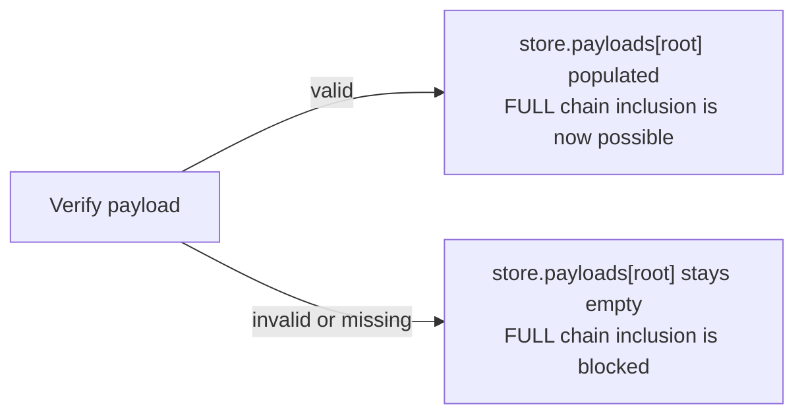
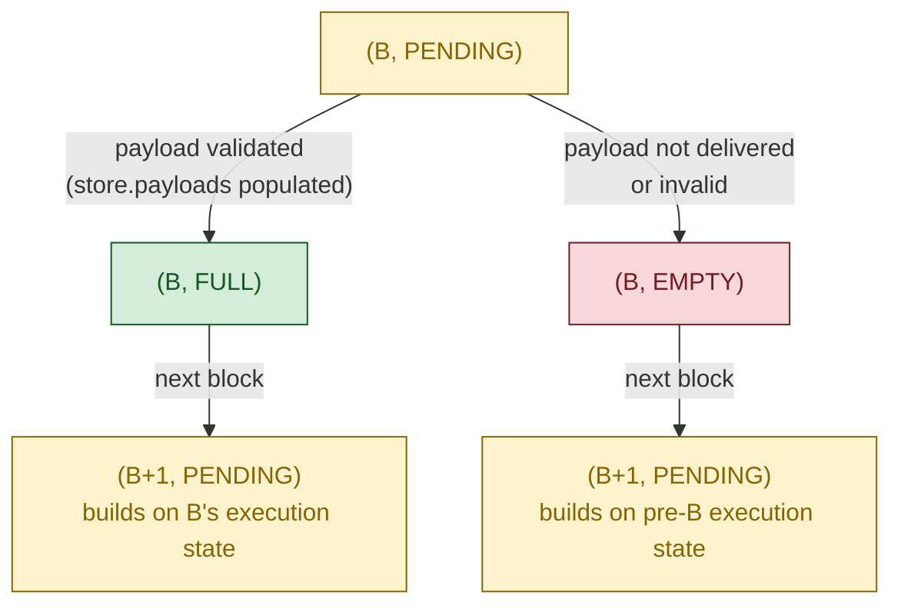
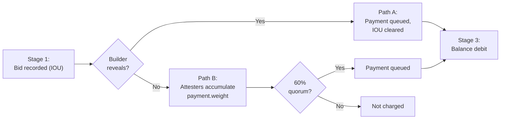

# ePBS: Overview, Lifecycle, and Properties

EIP-7732 enshrines proposer-builder separation into Ethereum's consensus protocol. This is a large change: it restructures how blocks are produced, introduces a new staked actor (the builder), splits each block into a beacon-block half (broadcast at slot start) and an execution-payload half (revealed separately by the builder), and creates an unconditional payment mechanism that removes the need for trusted relays.

This document is the first part of a security analysis of ePBS. We walk through the protocol's lifecycle, identify four externally observable properties that the design is meant to guarantee, and trace where in the spec code each guarantee is enforced. Where the argument requires facts about internal spec functions we have not fully presented here, we state those facts as explicit assumptions and show how the properties follow. A companion formal treatment — currently in progress — will discharge every assumption with line-level proofs against the complete spec pseudocode.

**Who should read this.** Anyone who wants a rigorous but readable account of how ePBS works: what changed from pre-ePBS, why, and what guarantees the protocol provides. We assume familiarity with Ethereum's consensus layer (Gasper, LMD-GHOST, FFG, attestation committees, fork choice). We do not assume prior knowledge of EIP-7732.

**Spec version.** This document targets [`ethereum/consensus-specs`](https://github.com/ethereum/consensus-specs) at commit [`fa8bb08`](https://github.com/ethereum/consensus-specs/commit/fa8bb08), Gloas fork: [`specs/gloas/`](https://github.com/ethereum/consensus-specs/tree/master/specs/gloas). The Gloas specs are work-in-progress and may differ from the EIP-7732 draft summary.

**Notation.** Code blocks use Python syntax at an abstracted level. An `...` in arguments or fields means "additional fields omitted for brevity." One convention is worth knowing upfront; the rest are reference material in the expandable table below.

- **`sign(x)` and `broadcast(x)`.** Standard BLS signing and gossip publication. The spec uses domain-specific named signers (`get_attestation_signature`, `get_proposer_preferences_signature`, `get_payload_attestation_message_signature`, `get_block_signature`); we use `sign(x)` as a uniform shorthand and `broadcast(x)` for the gossip layer.

The fork-choice-node tuple form `(root, payload_status)` is introduced in §5 Phase 5, where it first becomes load-bearing.

<details>
<summary><b>Full pedagogical-abstractions table</b> (click to expand)</summary>

Every name below is a pedagogical helper, not a spec function. Each one abstracts a piece of spec prose or a generic operation; the complete spec-grounded versions of these handlers appear in the [formal treatment](https://github.com/ethereum/epbs-security-analysis/blob/formal-treatment/ePBS-pseudocode.md).

*Proposer- and PTC-side helpers (Sections 4–5):*

| Name                                                                                        | Spec source                                                                                                                                                                                            |
| ------------------------------------------------------------------------------------------- | ------------------------------------------------------------------------------------------------------------------------------------------------------------------------------------------------------ |
| `collect_valid_bids(state, slot)`                                                         | "Listen to the `execution_payload_bid` gossip global topic and save an accepted `signed_execution_payload_bid` from a builder" (`validator.md`, §"Signed execution payload bid")                |
| `select_one_bid(bids)`                                                                    | "Select one bid …" (`validator.md`, §"Signed execution payload bid")                                                                                                                               |
| `aggregate_ptc_votes(slot - 1)`                                                           | "The proposer MUST aggregate all payload attestations with the same data" (`validator.md`, §"Payload attestations")                                                                                 |
| `construct_beacon_block(state, body)`                                                     | Standard `BeaconBlock` container construction with `slot`, `proposer_index`, `parent_root`, `state_root`, `body`.                                                                          |
| `get_parent_execution_requests(store, state)`                                             | Three-case logic in `validator.md` §"Parent execution requests" (empty if pre-Gloas, `store.payloads[parent_root].execution_requests` if `should_extend_payload` is true, empty otherwise).     |
| `is_head_of_chain(block, store)`                                                          | Shorthand for `get_head(store).root == hash_tree_root(block)` — the "head of the builder's chain" check from `builder.md` §"Honest payload withheld messages".                                   |
| `has_beacon_block_for_slot(store, slot)`, `get_beacon_block_root_for_slot(store, slot)` | Inline checks in `validator.md` §"Constructing the `PayloadAttestationMessage`": the PTC member checks whether it has seen any beacon block for the assigned slot and obtains its hash tree root. |
| `has_execution_payload_envelope(store, root)`                                             | Shorthand for `root in store.payloads` (equivalent to `is_payload_verified(store, root)` in `fork-choice.md`).                                                                                   |
| `check_blob_data(store, root)`                                                            | The spec function is `is_data_available(beacon_block_root)` (`fork-choice.md`); we keep `store` in the signature so reads are visible at the call site.                                          |
| `execution_engine.build_payload(...)`                                                     | The two-step spec flow `notify_forkchoice_updated(...) → engine_getPayloadV6(payload_id)`; we collapse to a single call returning the `(payload, execution_requests)` bundle.                     |

*Math notation in §8 (proof sketches):*

| Name                                                                                                  | Spec source                                                                                                                                                                                                                                                                                                                                                                                |
| ----------------------------------------------------------------------------------------------------- | ------------------------------------------------------------------------------------------------------------------------------------------------------------------------------------------------------------------------------------------------------------------------------------------------------------------------------------------------------------------------------------------ |
| `slot(B)`, `parent(B)`, `state(B)`                                                              | "the slot of block B", "the parent block of B", "the post-state of B" — i.e.,`B.slot`, `store.blocks[B.parent_root]`, and `store.block_states[hash_tree_root(B)]` respectively.                                                                                                                                                                                                     |
| `bid(B)`, `head(chain)`, `child(chain, B)`                                                                           | "the bid carried by block B" —`B.body.signed_execution_payload_bid.message` (so `bid(B).block_hash`, `bid(B).parent_block_hash`, etc. are the corresponding fields of the `ExecutionPayloadBid` SSZ container). `head(chain)` is the head block of a canonical chain — the latest block in the sequence. `child(chain, B)` is B's unique canonical child on `chain` (the block whose `parent_root` equals B's hash-tree root); defined formally in §3.                                                                       |
| `block_status(chain, B)`, `parentStatus(B)`                                                       | `block_status(chain, B)` is the FULL / EMPTY / undefined classifier defined in §3. `parentStatus(B)` is shorthand for "B's bid declares its parent as FULL or EMPTY" — i.e., FULL if `bid(B).parent_block_hash == state.latest_execution_payload_bid.block_hash` at B's processing time, EMPTY otherwise. Used in §7 / §8 to refer to a block's *declared* view of its parent. |
| `active_validators(store)`, `latest_message(v)`, `effective_balance(v)`, `child_blocks_of(r)` | Pedagogical helpers in the §8 G-assumption sketches; abbreviate `get_active_validator_indices(state, get_current_epoch(state))`, `store.latest_messages[v]`, `state.validators[v].effective_balance`, and the children-of-`r` filter that `get_node_children` (`fork-choice.md` line 534) applies, respectively.                                                              |

</details>

---

## 1. What is ePBS and why

> **TL;DR.** ePBS replaces MEV-Boost's trusted relays with a protocol-native builder role and a decentralized timeliness committee, and modifies fork-choice to handle the resulting two-phase block model.

Today, Ethereum block production already operates under a separation of concerns: validators (called **proposers** in this context) produce beacon blocks, while specialized **builders** construct the execution payloads inside them. This division of labor exists because building a profitable execution payload requires sophisticated MEV (Maximal Extractable Value) extraction strategies that most validators do not have the infrastructure to run. The current implementation, **MEV-Boost**, achieves this separation through **trusted relays**: builders submit blocks to relays, relays forward block headers to proposers, proposers commit to a header without seeing the full block, and relays then reveal the block to the network.

This works — over 90% of Ethereum blocks are produced through MEV-Boost — but it has fundamental problems:

- **Trust in relays.** Relays are single points of failure. Both proposers and builders must trust them: the proposer trusts the relay will reveal the block after signing, and the builder trusts the relay will not steal MEV. If a relay is malicious, crashes, or censors, liveness and fairness suffer.
- **No on-chain accountability.** Relays are not protocol participants. There is no on-chain mechanism to detect or punish relay misbehavior.
- **Censorship vector.** Relays can selectively refuse to forward certain blocks, enabling censorship at the relay level.

**Enshrined Proposer-Builder Separation (ePBS)**, specified in EIP-7732, integrates the builder-proposer interaction directly into Ethereum's consensus protocol, eliminating the need for trusted relays. The protocol itself mediates the exchange: builders are now staked on-chain participants, the bid commitment becomes a consensus object, and a dedicated committee of validators (the **Payload Timeliness Committee**, PTC) provides a decentralized signal about whether the builder delivered.

The goal of this document — and the broader project it belongs to — is to characterize ePBS rigorously: identify what the protocol is supposed to guarantee, formalize the algorithms that implement those guarantees, and prove that the guarantees actually hold under both honest and adversarial behavior.

---

## 2. The actors

> **TL;DR.** ePBS introduces the **builder** as a new staked actor, modifies attesters (`data.index` now signals payload status) and proposers (now select bids or self-build), and adds a per-slot **PTC** subcommittee that witnesses payload arrival.

ePBS introduces one new actor and modifies the role of existing ones.

**Proposer** — a validator selected for a slot. **Modified under ePBS.** The proposer typically *selects a builder's bid* and includes it in the beacon block (the expected case). Alternatively, the proposer can *self-build* — setting `builder_index = BUILDER_INDEX_SELF_BUILD`, `value = 0`, and signature `G2_POINT_AT_INFINITY` — to construct the execution payload directly. Self-build is the escape hatch when no acceptable bid is available.

**Attester** — a validator assigned to a slot's committee. **Modified under ePBS.** The `data.index` field is repurposed to signal payload status (0 = empty, 1 = full). For same-slot attestations (block from the attester's own slot), `data.index` must be 0 — the attester cannot have an opinion on the payload yet because it votes before the builder reveals.

**Builder** — *new*. A staked participant (separate from validators) that constructs execution payloads and bids for inclusion. Key properties:

- **Registration.** Builders deposit ETH on-chain with a dedicated withdrawal credential prefix (`0x03`), receive a `BuilderIndex`, and become active when their deposit is finalized.
- **Duties.** Builders do not attest or propose — they only build payloads. They are also responsible for broadcasting blob data (EIP-4844 data column sidecars) across the p2p network.
- **Not slashable.** Unlike validators, builders are not slashable: there is no `process_builder_slashing` handler. The protocol enforces accountability solely through *bid forfeit* — the `BuilderPendingPayment` IOU clears against the builder's stake at the epoch boundary even when the builder withholds, provided the beacon block reaches the 60% quorum (Path B, Lemmas 29–30 in the [formal treatment](https://github.com/ethereum/epbs-security-analysis/blob/formal-treatment/ePBS-pseudocode.md)).
- **Exit.** Builders may voluntarily exit (via `process_voluntary_exit`, which uses the bitwise `BUILDER_INDEX_FLAG` to distinguish builder indices from validator indices in the same wire format). There is no misbehaviour-driven exit — accountability is purely economic.

**PTC member** — *new role for existing validators*. A subcommittee of 512 ballot positions per slot, sampled from the slot's regular attestation committees by effective balance (a high-balance validator may occupy multiple positions; the >256-True threshold counts ballot positions, not distinct validators). Key properties:

- **PTC members are themselves attesters for the slot.** Every PTC member also belongs to one of the slot's attestation committees and casts the standard same-slot attestation at $T_{\mathrm{att}}$ in addition to the PTC witness statement at $T_{\mathrm{ptc}}$. Throughout this document and in the figures we draw the PTC as a separate column from Attesters — this is a *pedagogical* separation, not a mechanical one, isolating the witness-statement duty (a binary observation about payload arrival) from the head-vote duty (which drives fork-choice weight).
- **Distinct duty.** The PTC casts a **payload timeliness attestation** at 75% of the slot, reporting whether the member observed the `SignedExecutionPayloadEnvelope` arrive. The spec object is a `PayloadAttestationMessage` ([`beacon-chain.md`](https://github.com/ethereum/consensus-specs/blob/master/specs/gloas/beacon-chain.md)); we follow the PBS literature and use the shorthand **witness statement** (or **witness vote**) — the PTC is *witnessing* payload arrival, not judging payload validity.
- **Observation, not validation.** PTC members run `on_execution_payload_envelope` as part of normal node operation, but payload validity is *not* a precondition for the PTC vote. The vote is conditioned solely on payload observation.

---

## 3. How an execution payload becomes part of the chain

> **TL;DR.** ePBS splits each block into two pieces that propagate separately: the **beacon block** carries consensus data and the builder's bid; the **execution payload** is revealed later by the builder. The beacon chain stores **bids** (hashes), not payloads — so anything the protocol can guarantee about payloads is expressed in terms of hashes. We define a function `block_status(chain, B)` that yields FULL/EMPTY for a (chain, block) pair, and a **payload hash chain** — the sequence of `bid.block_hash` values from FULL blocks on the canonical chain. A payload hash is **on chain** iff it belongs to this chain. A revealed execution payload is considered fully delivered only when both the payload and the associated blob data are available; P4 (§4) promotes hash-on-chain to "payload available + valid + blob data available".

### Two pointers, two chains

**Each beacon block under ePBS carries two parent pointers, not one.**

- **`parent_root`** — the hash tree root of the previous beacon block. This is the **consensus parent**: the consensus chain is the sequence of beacon blocks linked by `parent_root`. It advances every slot a block is proposed (gaps only for missed slots).
- **`bid.parent_block_hash`** — the `block_hash` of the most recent revealed execution payload that the bid references as its parent. This is the **execution parent**: the execution chain is the sequence of execution payloads linked by `parent_block_hash`. It advances only at slots whose builder actually revealed an execution payload.

The two pointers point at different objects by design — `parent_root` is a beacon-block root, `bid.parent_block_hash` is an execution-payload `block_hash`. What can vary is the *slot* they correspond to: if every intervening builder revealed, both point at the immediately preceding slot; whenever a builder withheld in between, the execution parent is from an earlier slot than the consensus parent (the execution chain skips withheld slots, the consensus chain does not).


*Figure 1: Two-pointer structure across slots 97–100; slot 99's builder withholds. **The beacon chain stores hashes** (via the bid fields); revealed payloads live in node-local stores. Four hash-bearing fields connect the structures. The **payload hash chain** induced by this figure is the pair of `bid.block_hash` values committed by Block(97) and Block(98) — the two FULL blocks.*

- ***Consensus chain (orange, `parent_root`).*** Beacon blocks linked by the previous block's hash-tree-root; one per proposed slot — no gap at slot 99.
- ***Block → its own payload (gray, `bid.block_hash`).*** Each block commits to the hash of its future payload; `verify_execution_payload_envelope` checks the match at reveal. Slot 99 has no arrow (withhold); Block(100)'s payload is unrevealed in this snapshot.
- ***Block → previous payload (violet, `bid.parent_block_hash`).*** Each bid records the hash of the payload it references as its parent. Block(99) and Block(100) both point at Payload(98), and their paths merge above it — slot 99's withhold did not advance the execution chain tip.
- ***Execution chain (teal, `payload.parent_hash`).*** Revealed `ExecutionPayload` carries the previous payload's `block_hash` — same value as `bid.parent_block_hash`, stored in a different container, verified equal at reveal. Only Payload(98) → Payload(97) is visible.

**`state.latest_block_hash` tracks the execution chain tip.** It is the `block_hash` of the most recently revealed execution payload that has been integrated into the chain. It is updated only when `process_parent_execution_payload` confirms the parent block was FULL — i.e., applies the parent's execution effects. When a builder withholds, `latest_block_hash` does not advance, and the next slot's builder reads this older value as its `parent_block_hash`.

### What's actually on chain: bids and payload hashes

**The beacon chain stores bids, not payloads.** Every beacon block carries a `SignedExecutionPayloadBid` in its body — a small container holding the builder's signature over an `ExecutionPayloadBid` message. The bid commits to two hashes:

- `bid.block_hash` — the hash the builder commits to for its own future execution payload (the payload it will reveal in Phase 3, if it reveals).
- `bid.parent_block_hash` — the hash of the previous execution payload that the bid references as its parent.

The actual `ExecutionPayload` SSZ container (transactions, state root, withdrawals, …) is **not** stored on chain. The builder broadcasts it separately, and it lands in each node's local `store.payloads` only if received and verified. The beacon chain only records HASHES of payloads, via the two bid fields above.

**This shapes what we can formally guarantee.** Anything the protocol can promise about payloads from on-chain inspection alone — validity, availability, blob-data availability — must be expressible in terms of these hashes, because hashes are all the canonical chain stores. Payload-level claims are downstream of hash-level claims, and the strongest hash-level claim is *which hashes appear in which bid fields on the canonical chain*.

### Block status: a property of (chain, block)

We now define formally what it means for a block to be **FULL** or **EMPTY**.

*Notation reminder.* In the definitions below, `bid(X)` denotes the bid carried by block $X$ — the `ExecutionPayloadBid` message inside `X.body.signed_execution_payload_bid`. Its fields are accessed with the usual dot syntax: `bid(X).block_hash`, `bid(X).parent_block_hash`, etc. (See the abstractions table at the top of the doc for the full set of pedagogical helpers.)

> **Definition (Block status).** Write $B \prec \mathit{chain}$ to mean "$B$ is a non-head canonical block on $\mathit{chain}$", and let `child(chain, B)` denote $B$'s unique canonical child on $\mathit{chain}$ (the block whose `parent_root` equals $B$'s hash-tree root). Then `block_status(chain, B)` is:
>
> - **FULL** if $B \prec \mathit{chain}$ and `bid(child(chain, B)).parent_block_hash` equals `bid(B).block_hash`;
> - **EMPTY** if $B \prec \mathit{chain}$ and `bid(child(chain, B)).parent_block_hash` does not equal `bid(B).block_hash`;
> - **undefined** otherwise (i.e., $B$ is not on $\mathit{chain}$, or $B = \mathit{head}(\mathit{chain})$).
>
> **Why undefined at the head.** When $B = \mathit{head}(\mathit{chain})$, $B$'s `bid.block_hash` has been committed but no child exists yet to reference it. Status becomes defined once $B$'s child lands.

**Why the function takes the chain as an argument.** FULL/EMPTY is not an intrinsic property of $B$. The definition depends on $B$'s **child** in $\mathit{chain}$ — and the child is a property of the chain, not of $B$. A reorg that replaces $B$'s child can flip $B$'s status without $B$ changing. The explicit `chain` argument is a structural reminder that status is meaningful only relative to a fixed canonical branch.

**One more structural fact:**

- **FULL/EMPTY is retrospective.** $B$'s status is decided at slot N+1 (or later — at the next canonical slot after $B$) by $B$'s child's bid, not by $B$ itself at slot N. At slot N, $B$'s execution payload is in flight; until $B$'s child commits to building on it, $B$'s on-chain status is unsettled.

**Why the child alone determines the status.** Once $B$'s child $C$ declares EMPTY for $B$ (i.e., $C$'s `bid.parent_block_hash` does not equal $B$'s `bid.block_hash`), no later canonical block can declare FULL for $B$: `state.latest_block_hash` after $C$ no longer holds $B$'s `bid.block_hash`, and every subsequent block reads `state.latest_block_hash` to set its own `bid.parent_block_hash`. So the verdict is fixed by $C$ and cannot be revised by later blocks.

Throughout this document, when we say "$B$ is FULL on chain" without qualification we mean `block_status(canonical, B) = FULL`, where `canonical` is the current canonical beacon chain.

### The payload hash chain

Block statuses on the canonical chain induce a chain over payload hashes. This is the formal object that captures *which payload hashes are on chain*.

> **Definition (Payload hash chain).** The **payload hash chain** is the collection of `bid.block_hash` values committed by every FULL block on the canonical chain, inheriting the canonical chain's order. Equivalently, a payload hash $h$ belongs to the payload hash chain if and only if there exists a non-head canonical block $B^*$ such that $B^*$'s `bid.block_hash` equals $h$ AND $B^*$ is **FULL** on the canonical chain.
>
> (FULL is undefined at the head, so the head's `bid.block_hash` is *not* on chain — it only enters once a successor lands.)

**Inductive construction (head-to-genesis).** Given a head beacon block $B$ on the canonical chain, the payload hash chain can be enumerated by walking backwards from $B$. Let $h^{(0)}, h^{(1)}, h^{(2)}, \ldots$ be the sequence defined by:

- **Base case.** $h^{(0)}$ is $B$'s `bid.parent_block_hash` — the hash of the latest confirmed execution payload (the one referenced by $B$'s bid as its parent).
- **Recurrence (for each $k \geq 0$).** Let $B^{(k)}$ be the unique canonical ancestor of $B$ whose `bid.block_hash` equals $h^{(k)}$ — i.e., $B^{(k)}$ itself is the block whose bid committed to the payload with hash $h^{(k)}$. Then set $h^{(k+1)}$ to $B^{(k)}$'s `bid.parent_block_hash`.
- **Termination.** The recurrence stops when no such $B^{(k)}$ exists — i.e., when $h^{(k)}$ corresponds to a payload at or before genesis (or the slot before ePBS activation).

This enumeration produces the chain in *reverse* execution order (head-to-genesis): $h^{(0)}$ is the most recent, $h^{(k)}$ gets older as $k$ grows.

> **Definition (Payload hash on chain).** A payload hash $h$ is **on chain** if it belongs to the payload hash chain of the canonical beacon chain at the time of inspection.

This is the strongest hash-level statement we can extract from on-chain data alone: $h$ is on chain iff some canonical bid commits to $h$ *and* some subsequent canonical bid references $h$ as its parent. Both bids are visible in the canonical chain; their composition certifies $h$'s on-chain membership. P4 below promotes this hash-level fact to a payload-level guarantee: a hash on chain implies the corresponding payload (and its blob data) is available and valid.

### Data availability: payload + blob data

**When the builder reveals, it broadcasts two separate objects on two separate gossip channels** — the **payload** and the **blob data**. They are independent in propagation but jointly required for chain inclusion:

- **The payload** — the broadcast object carrying the transactions, state root, withdrawals, and delivery metadata (`builder_index`, `beacon_block_root`, `parent_beacon_block_root`, `execution_requests`). The spec name for this signed broadcast object is `SignedExecutionPayloadEnvelope`. It propagates on a dedicated gossip topic; the builder broadcasts it before the PTC deadline. Receiving nodes verify it via `verify_execution_payload_envelope` against the execution engine.
- **The blob data** — binary chunks attached to EIP-4844 transactions, used by rollups for cheap data availability. Each blob is erasure-coded into 128 **data columns** propagated as separate `DataColumnSidecar` objects on a distinct gossip topic via **PeerDAS**. No single node downloads all columns; each node samples the columns it is responsible for. The blob data is **not** carried inside the payload; only the **KZG commitments** authenticating the blobs live inside the payload's transactions, and they are mirrored in the bid (`bid.blob_kzg_commitments`) so nodes can check the commitments against the bid before the payload arrives.

**The payload and the blob data arrive via different channels and can diverge.** A node may have the payload but not all the blob columns it samples, or vice versa. The PTC vote at slot N reports both signals independently: `payload_present = True` confirms payload arrival; `blob_data_available = True` confirms the member's sampled blob columns arrived and pass KZG verification.

**Both halves are required for chain inclusion.** When slot N+1's `should_extend_payload` decides whether to favour FULL for block B, it requires PTC majority on both — `is_payload_timely` AND `is_payload_data_available`. If either fails (and no proposer-side fallback fires), no subsequent block declares B FULL and B is EMPTY on chain.

This is the foundation of Property P4 (Data availability for chain inclusion) below.

---

## 4. Properties

> **TL;DR.** Four properties P1–P4 capture the externally observable guarantees of ePBS — claims an observer with full visibility of network messages and on-chain state can verify, without inspecting any node's internal state. P1 protects the proposer; P2–P3 protect the builder; P4 ties chain inclusion to data availability. All four hold under β < 20% per committee.

Each property is stated here informally and revisited precisely as we walk through the lifecycle. Each is backed by lemmas in the companion formal treatment.

Each property below is also given as a single Python-style predicate `P_i(trace, ...)` that returns `Hypothesis(trace, ...) ⟹ Conclusion(trace, ...)`, where `Hypothesis` and `Conclusion` are named sub-predicates. The narrative statement is the readable form; the predicates are the form a verification tool (Coq, Dafny, K, …) would consume. They quantify over an *honest-view trace* — a sequence of honest-actor broadcast events paired with the resulting honest state — defined in the expandable block below. The predicates reference helpers introduced in §3 (`block_status`, `child`, payload-hash-chain membership) and the spec's `Store`, `BeaconState`, `BeaconBlock`, `ExecutionPayloadBid` containers verbatim.

<details>
<summary><b>Trace, actor, and event types</b> (click to expand)</summary>

```python
# Actor as a variant (sum) type - the Python analogue of a Dafny
# `datatype Actor = ValidatorActor(...) | BuilderActor(...)`. Each
# variant carries the spec's existing role-specific index type, so the
# type system itself enforces the role-index pairing; no flag bit or
# enum discriminator is needed.
@dataclass(frozen=True)
class ValidatorActor:
    index: ValidatorIndex                  # from consensus-specs

@dataclass(frozen=True)
class BuilderActor:
    index: BuilderIndex                    # from consensus-specs

Actor = Union[ValidatorActor, BuilderActor]

# Messages broadcast by honest actors on the gossip network.
Message = Union[
    SignedBeaconBlock,                  # validator (proposer)
    SignedExecutionPayloadBid,          # builder
    SignedExecutionPayloadEnvelope,     # builder
    Attestation,                        # validator (attester)
    PayloadAttestationMessage,          # validator (PTC member)
]

# A builder's local state - what submit_bid / reveal_payload in §5 Phase 0
# and Phase 3 read and write, plus the observations A6 cautious-reveal
# consults. Builders have no fork-choice Store; they observe the network
# directly.
@dataclass
class BuilderState:
    stored_payload:         Optional[ExecutionPayload]           # set in submit_bid, reused in reveal_payload (A1)
    stored_requests:        Optional[ExecutionRequests]
    observed_blocks:        Mapping[Root, SignedBeaconBlock]     # for is_head_of_chain (A5)
    observed_attestations:  Sequence[Attestation]                # for A6(ii) - >=40% real weight check
    observed_equivocations: Set[Tuple[ValidatorIndex, Slot]]     # for A6(iii) - equivocation visibility

# An event is a single honest-actor broadcast. Byzantine broadcasts are
# OUTSIDE the trace - we model only what honest actors emit. Their effects
# on honest stores show up in subsequent steps (delivered to recipients
# under synchrony S1).
@dataclass
class Event:
    time: float                         # absolute time (seconds since genesis)
    actor: Actor                        # honest broadcaster - role-tagged
    message: Message

# A trace step: the broadcast event plus the resulting honest state.
# Two dicts at the top level - validators and builders have different
# state types (Store vs BuilderState).
@dataclass
class TraceStep:
    event: Event
    validator_stores: Mapping[ValidatorIndex, Store]         # honest validators
    builder_states:   Mapping[BuilderIndex, BuilderState]    # honest builders

Trace = Sequence[TraceStep]             # in nondecreasing event.time order

# Step lookup at an arbitrary time. State changes only at event times, so
# step_at(trace, t) returns the latest step with event.time <= t.
def step_at(trace: Trace, t: float) -> TraceStep:
    candidates = [s for s in trace if s.event.time <= t]
    if not candidates:
        return initial_step(trace)
    return max(candidates, key=lambda s: s.event.time)

# An actor is honest IN A TRACE if every event with this actor follows
# the spec - the @Upon validator handlers in §5 for ValidatorActor, the
# @Upon builder handlers (submit_bid, reveal_payload) plus A1/A5/A6 for
# BuilderActor. Trace-level predicate, not intrinsic to the actor itself.
def is_honest(actor: Actor, trace: Trace) -> bool: ...

# Per-validator canonical chain - get_head walked back to genesis.
def honest_canonical(store: Store) -> Sequence[BeaconBlock]: ...

# Logical implication, used to keep the top-level predicates readable.
def implies(p: bool, q: bool) -> bool:
    return (not p) or q
```

</details>

**P1: Unconditional payment to the proposer.** If beacon block including a valid bid is proposed in a timely fashion, the bid amount is transferred from the builder to the proposer's fee recipient within at most two epochs after the bid's slot. The builder cannot commit to a bid and then avoid paying.

<details>
<summary><b>Pseudocode definition</b> (click to expand)</summary>

```python
# P1: Unconditional payment to proposer
#
# Hypothesis: B at slot N carries an admissible value-bearing bid AND B
#   is on the canonical chain of every honest validator from slot N+2 onward.
# Conclusion: by the end of epoch e+1 (+ Delta), every honest validator's
#   state for its head block records a BuilderPendingWithdrawal carrying
#   (bid.value, proposer's fee_recipient, bid.builder_index) - appended by
#   Path A (settle_builder_payment at slot N+1) or Path B
#   (process_builder_pending_payments at end of epoch e+1).

def P1(trace: Trace, B: BeaconBlock) -> bool:
    return implies(P1_hypothesis(trace, B), P1_conclusion(trace, B))


def P1_hypothesis(trace: Trace, B: BeaconBlock) -> bool:
    bid = B.body.signed_execution_payload_bid.message
    N = B.slot
    if not (bid.value > 0):
        return False                          # P1 covers value-bearing bids; self-build is vacuous
    t_settled = (N + 2) * SECONDS_PER_SLOT
    for s in trace:
        if s.event.time < t_settled:
            continue
        for _, store_v in s.validator_stores.items():
            if B not in honest_canonical(store_v):
                return False
    return True


def P1_conclusion(trace: Trace, B: BeaconBlock) -> bool:
    bid = B.body.signed_execution_payload_bid.message
    fee_recipient = B.body.proposer_fee_recipient
    N = B.slot
    e = N // SLOTS_PER_EPOCH
    t_deadline = (e + 2) * SLOTS_PER_EPOCH * SECONDS_PER_SLOT + DELTA

    step = step_at(trace, t_deadline)
    for _, store_v in step.validator_stores.items():
        head = honest_canonical(store_v)[-1]
        state = store_v.block_states[hash_tree_root(head)]
        if not any(
            w.amount == bid.value
            and w.fee_recipient == fee_recipient
            and w.builder_index == bid.builder_index
            for w in state.builder_pending_withdrawals
        ):
            return False
    return True
```

</details>

**P2: Builder revealing protection.** If an honest builder reveals, then its `bid.block_hash` is in the payload hash chain of the canonical beacon chain — equivalently, the block carrying its bid is FULL on chain (and by P4 below, the corresponding payload and blob data are available + valid).

<details>
<summary><b>Pseudocode definition</b> (click to expand)</summary>

```python
# P2: Builder revealing protection
#
# Hypothesis: the builder named in bid(B) is honest, broadcast an envelope
#   binding to bid(B).block_hash before slot N+1 begins, AND the slot-(N+1)
#   proposer is honest (S4 instance baked in).
# Conclusion: from the start of slot N+2 onward, every honest validator's
#   canonical chain contains B and declares B FULL.

def P2(trace: Trace, B: BeaconBlock) -> bool:
    return implies(P2_hypothesis(trace, B), P2_conclusion(trace, B))


def P2_hypothesis(trace: Trace, B: BeaconBlock) -> bool:
    bid = B.body.signed_execution_payload_bid.message
    N = B.slot

    honest_reveal = any(
        isinstance(s.event.actor, BuilderActor)
        and isinstance(s.event.message, SignedExecutionPayloadEnvelope)
        and s.event.actor.index == bid.builder_index
        and is_honest(s.event.actor, trace)
        and s.event.message.message.payload.block_hash == bid.block_hash
        and s.event.time < (N + 1) * SECONDS_PER_SLOT
        for s in trace
    )

    return honest_reveal and is_honest(proposer_for_slot(trace, N + 1), trace)


def P2_conclusion(trace: Trace, B: BeaconBlock) -> bool:
    # Why slot N+2 (not N+1): block_status(chain, B) is undefined when B is
    # the head. By slot N+2, the honest slot-(N+1) proposer's block has
    # landed at every honest v under S1+S2 - giving B a successor on the
    # canonical chain and pinning block_status(B) to FULL.
    t_final = (B.slot + 2) * SECONDS_PER_SLOT
    for s in trace:
        if s.event.time < t_final:
            continue
        for _, store_v in s.validator_stores.items():
            chain_v = honest_canonical(store_v)
            if B not in chain_v:
                return False
            if block_status(chain_v, B) != FULL:
                return False
    return True
```

</details>

**P3: Builder withholding protection.** An honest builder that withholds its execution payload is not charged, and the proposer is not paid.

<details>
<summary><b>Pseudocode definition</b> (click to expand)</summary>

```python
# P3: Builder withholding protection
#
# Hypothesis: the builder named in bid(B) is honest AND did NOT broadcast
#   an envelope for B during the reveal window (slot N through slot N+1
#   start).
# Conclusion: no BuilderPendingWithdrawal carrying (bid.value, bid.builder_index)
#   ever appears in any honest validator's state for the head, from the
#   epoch-(e+1) boundary forward - the BuilderPendingPayment is discarded
#   by process_builder_pending_payments rather than paid out.

def P3(trace: Trace, B: BeaconBlock) -> bool:
    return implies(P3_hypothesis(trace, B), P3_conclusion(trace, B))


def P3_hypothesis(trace: Trace, B: BeaconBlock) -> bool:
    bid = B.body.signed_execution_payload_bid.message
    N = B.slot
    builder_actor = BuilderActor(index=bid.builder_index)
    if not is_honest(builder_actor, trace):
        return False
    return not any(
        isinstance(s.event.message, SignedExecutionPayloadEnvelope)
        and s.event.actor == builder_actor
        and s.event.message.message.payload.block_hash == bid.block_hash
        and s.event.time < (N + 1) * SECONDS_PER_SLOT
        for s in trace
    )


def P3_conclusion(trace: Trace, B: BeaconBlock) -> bool:
    bid = B.body.signed_execution_payload_bid.message
    N = B.slot
    e = N // SLOTS_PER_EPOCH
    t_settled = (e + 2) * SLOTS_PER_EPOCH * SECONDS_PER_SLOT + DELTA

    for s in trace:
        if s.event.time < t_settled:
            continue
        for _, store_v in s.validator_stores.items():
            head = honest_canonical(store_v)[-1]
            state = store_v.block_states[hash_tree_root(head)]
            for w in state.builder_pending_withdrawals:
                if w.builder_index == bid.builder_index and w.amount == bid.value:
                    return False
    return True
```

</details>

**P4: Data availability for chain inclusion.** If a payload hash is in the payload hash chain of the canonical beacon chain (i.e., the hash is on chain in the §3 sense), then the corresponding execution payload is available and valid, and its associated blob data is also available.

<details>
<summary><b>Pseudocode definition</b> (click to expand)</summary>

```python
# P4: Data availability for chain inclusion
#
# Hypothesis: at some (time t*, honest validator v*), h belongs to the
#   payload hash chain of v*'s canonical chain, AND the slot-(N+1)
#   proposer is honest, AND the slot-(N+1) attestation super-majority is
#   honest (S4 instances baked in - N is the slot of the FULL block B*
#   that commits to h).
# Conclusion: for every (time t, honest v) at which h is in v's payload
#   hash chain, the payload sits in v's store.payloads with block_hash
#   == h, has passed verify_execution_payload_envelope, and its blob
#   data passed is_data_available. Co-temporal: 'whenever h is on chain
#   at v, it is available at v' (not a settled-by-time-t statement).

def P4(trace: Trace, h: Hash32) -> bool:
    return implies(P4_hypothesis(trace, h), P4_conclusion(trace, h))


def P4_hypothesis(trace: Trace, h: Hash32) -> bool:
    for s in trace:
        for _, store_v in s.validator_stores.items():
            chain_v = honest_canonical(store_v)
            B_star = full_block_committing_to(chain_v, h)
            if B_star is None:
                continue
            N = B_star.slot
            if (is_honest(proposer_for_slot(trace, N + 1), trace)
                    and honest_supermajority_attesters_for_slot(trace, N + 1)):
                return True
    return False


def P4_conclusion(trace: Trace, h: Hash32) -> bool:
    for s in trace:
        for _, store_v in s.validator_stores.items():
            chain_v = honest_canonical(store_v)
            B_star = full_block_committing_to(chain_v, h)
            if B_star is None:
                continue
            r = hash_tree_root(B_star)
            if r not in store_v.payloads:
                return False
            if store_v.payloads[r].payload.block_hash != h:
                return False
            if not is_payload_verified(store_v, r):
                return False
            if not is_data_available(r):
                return False
    return True
```

</details>

These four are the **externally checkable** guarantees: each can in principle be detected by an observer who sees only the network's messages and the on-chain state. The rest of this section discusses the fee-recipient destination and the adversarial model that the proofs rely on.

**Why the fee recipient and not the validator's balance.** *The bid is paid to the proposer's `fee_recipient` (an execution-layer address) rather than added to the validator's consensus-layer balance.* This follows the same convention used pre-ePBS for execution-layer fees: staking pools and similar operators rely on this separation because keeping consensus rewards apart from execution-layer revenue makes accounting and revenue distribution to delegators much simpler. Under ePBS, the only difference is *who* drives the credit (the builder, via `BuilderPendingWithdrawal`) — the destination address remains the same.

**Adversarial model.** Properties P1–P4 hold under the structural assumptions catalogued in §8.1: network synchrony (S1, Δ < T_att), a per-committee Byzantine bound of β < 20% (S2), and a PTC Byzantine bound < 50% (S3). Some properties additionally invoke per-instance honesty hypotheses (e.g., "honest slot-N+1 proposer") stated in the claim itself; these are formalised as S4 in §8.

The remainder of this document shows how the protocol's algorithms enforce each of P1–P4. §7 walks through the adversarial scenarios; §8 provides the formal-verification contract — a self-contained set of assumptions that, combined with the code in §5–§6, suffices to prove all four properties. The companion [formal treatment](https://github.com/ethereum/epbs-security-analysis/blob/formal-treatment/ePBS-pseudocode.md) discharges every §8 assumption as a lemma.

---

## 5. The slot, abstracted

> **TL;DR.** A slot under ePBS proceeds through five phases: pre-slot bid construction, beacon block publication, attestation, builder reveal, and PTC witness vote. The next slot's `get_head` resolves any FULL/EMPTY ambiguity. Each phase below shows the actor code, identifies the property it enforces, and depicts both happy and degraded paths.

**State and store.** *Two data structures recur throughout this section.* The **state** (`BeaconState`) is the consensus-layer snapshot associated with a specific block. It is computed deterministically: the state after block B is the result of applying B to the state of B's parent — `state(B) = process_block(state(parent(B)), B)`. No other input is needed: a node that knows the genesis state and the chain of blocks can recompute any block's state. Under ePBS, this computation is split in two: `process_block` applies the consensus-layer transition (including deferred execution effects from the parent's execution payload via `process_parent_execution_payload`, bid verification, attestation processing, withdrawals), while the current slot's execution payload is verified separately by `verify_execution_payload_envelope` when the builder reveals.

**The store reflects per-node observations, not deterministic state.** Unlike the state, which is per-block and deterministic, the store records what a particular node has observed from the network: all received blocks (`store.blocks`), the state after processing each block's consensus layer (`store.block_states`), attestations, PTC votes, and — new under ePBS — `store.payloads`, which maps a block root to the payload (spec: `ExecutionPayloadEnvelope`) that the builder revealed for that block. `store.payloads` is populated only when the node locally receives and verifies the payload, which is why it serves as the **structural gate** for the slot-N+1 chain-inclusion check that decides FULL/EMPTY on chain (§3) — a node-internal invariant that supports several externally observable properties (notably P2 and P4). Phase 5 makes this gate explicit when describing the fork-choice rule.

A slot under ePBS proceeds through five phases. Below we walk through the phases as a storyline, showing the abstracted code that each actor runs, and connecting each step to the formal property it enforces.

**How to read Figure 2.** The diagram uses a sequence-diagram convention: **each box names a *computation*** (the procedure or activation an actor performs), and **each arrow names a *transmission*** (the message broadcast from the box at the arrow's tail). Box *heights* are also meaningful — a tall box represents substantial computation (e.g., the Attesters' CL `Process block and update store`), while a short box represents a light step (the `Store block` boxes used by Builder and PTC for the same `on_block` handler they barely use; the brief `Check payload and blob data` store lookup the PTC runs before voting). In Phase 3, the Builder emits **two** outgoing transmissions: the **payload** (solid violet) and the **blob data** (dashed violet, separate PeerDAS gossip topic). Dashed horizontal lines mark the spec-mandated slot-time deadlines (Phase 1b, 2, 3, 4 ↔ $t = 0^+$, $T_{\mathrm{att}}$, the builder reveal window, $T_{\mathrm{ptc}}$). The figure depicts the **happy path**: every actor follows the protocol, the builder reveals on time, the PTC observes both signals before its deadline, and every message propagates within $\Delta$. Adversarial and degraded scenarios are surveyed in §7.


*Figure 2: Slot lifecycle under ePBS, happy path. Columns: Proposer (orange), Builder (violet), Attesters with CL/EL (blue/teal), PTC (red — a 512-member subcommittee of the slot's attesters; the dashed arrow at the top marks the subsampling). Phase-by-phase walkthroughs of every box and arrow follow below.*

### Phase 0 — Before the slot

*The proposer broadcasts preferences; the builder constructs the execution payload and submits a bid.*

**Happy path: external builder.**


*Figure 3a: Pre-slot exchange with an external builder. Proposer broadcasts `SignedProposerPreferences`; Builder constructs the full execution payload and submits a `SignedExecutionPayloadBid` (carrying `block_hash`, `value`, `parent_block_hash`) which arrives just before slot start.*

**Alternative: self-build.**


*Figure 3b: Pre-slot self-build. No external builder is involved (Builder column dashed); the Proposer runs `prepare_execution_payload` locally and assembles the bid with `builder_index = BUILDER_INDEX_SELF_BUILD`, `value = 0`, signature `G2_POINT_AT_INFINITY`. Nothing crosses the network in Phase 0 — the execution payload and bid are held until Phase 1.*

The proposer for an upcoming slot may broadcast a `SignedProposerPreferences` message specifying its preferred `fee_recipient` (where to receive payment) and `gas_limit`. Without this broadcast, the gossip network will not forward any builder bids for that slot.

The builder, observing the proposer's preferences, constructs an execution payload via its execution engine and broadcasts a bid:

> **A note on `@Upon`.** The code blocks that describe actor behavior (the builder's `submit_bid` and `reveal_payload`, the proposer's `propose`, the attester's `attest`, and the PTC member's `ptc_vote`) are written as **event-driven handlers**: each `@Upon` decorator declares the condition under which the code executes. In practice, a validator or builder runs client software that has a scheduler watching the clock and network events. When a condition is met — the clock reaches a specific point in the slot, or a message arrives on the gossip network — the client internally performs the corresponding steps. An actor is **honest** if its client follows these steps; an actor is **dishonest (Byzantine)** if its client deviates — for example, a validator signaling `data.index = 1` without having seen the execution payload, a builder revealing a different execution payload than the one it committed to, or a PTC member voting without observing the payload. Functions without `@Upon` (such as `process_block` and `get_head` shown later) are **spec functions**: they are not triggered directly by events, but called internally by the client whenever it receives a block, needs to compute the chain head, or otherwise processes protocol state.

```python
@Upon(received SignedProposerPreferences for upcoming_slot)
def submit_bid(builder, upcoming_slot, state, proposer_preferences):
    payload, execution_requests = execution_engine.build_payload(
        parent_hash=state.latest_block_hash,
        fee_recipient=proposer_preferences.fee_recipient,  # MUST match preferences
        gas_limit=proposer_preferences.gas_limit,          # MUST match preferences
        ...,
    )
    bid = ExecutionPayloadBid(
        block_hash=payload.block_hash,                          # The binding commitment
        value=builder.bid_amount,                               # Amount offered to proposer
        builder_index=builder.index,
        slot=upcoming_slot,
        parent_block_hash=state.latest_block_hash,
        execution_requests_root=hash_tree_root(execution_requests),
        ...,
    )
    broadcast(SignedExecutionPayloadBid(bid, sign(bid)))
    builder.stored_payload = payload                        # saved for reveal — same object used in reveal_payload
    builder.stored_requests = execution_requests            # execution requests come from the same bundle
```

**The builder constructs the full payload before submitting the bid, because `bid.block_hash` must equal the actual payload's hash.** This is a binding commitment: when the builder later reveals, the revealed execution payload must match this hash exactly. The other key field is `bid.parent_block_hash`, which declares which execution chain tip the builder built on — this is how the next block signals whether it treats its parent as FULL or EMPTY on chain (defined in §3).

**The builder simulates the *consensus-layer* application of the parent's execution payload locally to determine the correct execution chain tip.** The builder needs to know `state.latest_block_hash`, but at this point `apply_parent_execution_payload` (which updates `latest_block_hash`) has not yet run for the current slot — it runs inside `process_block` of the *next* block. The builder resolves this by calling `prepare_execution_payload`, which runs `apply_parent_execution_payload` on a **copy** of the state when building on FULL. The simulation does only what `apply_parent_execution_payload` does in the spec: it processes the parent's execution requests (deposits, withdrawals, consolidations), settles the parent's builder payment, sets `state.execution_payload_availability[parent_slot % SLOTS_PER_HISTORICAL_ROOT] = 1`, and advances `state.latest_block_hash = parent_bid.block_hash`. It does **not** re-execute the parent's transactions in the EVM (that happened when the parent's payload was first verified against the execution engine by `verify_execution_payload_envelope`) and it does **not** touch blob data (blob data participates only in PeerDAS availability sampling, never in the consensus state transition). The network's eventual `process_block` for the next block performs the same deterministic update.

> **Remark — bid commitments are binding.** An honest builder's revealed execution payload necessarily has `block_hash == bid.block_hash` because the same `stored_payload` is used in both phases. A dishonest builder revealing a different payload fails the equality check in `verify_execution_payload_envelope`. This is not a separate property in our list — it is a precondition underlying P3 (builder revealing protection) and a behavioural fact about honest builders that A1 in §8 promotes to a named assumption.

### Phase 1 — Slot start (t = 0): Proposer publishes the beacon block

*The proposer collects valid bids, selects one, and broadcasts a beacon block carrying the bid (not the execution payload).*

**Happy path: valid block proposed and received by all.**


*Figure 4a: Slot start, valid block. Proposer broadcasts the BeaconBlock to Builder, Attesters, and PTC; the body carries the bid (`signed_execution_payload_bid`) and the previous slot's aggregated PTC votes (`payload_attestations`) — both new under ePBS. The execution payload is not in the block; it arrives separately in Phase 3.*

**Alternative: missing or invalid block.**


*Figure 4b: Slot start, missing or invalid block. The Proposer is dashed (offline, delayed, or block rejected at every honest `on_block`); no slot-N consensus chain entry is created. Attesters fall back to the previous head (Figure 4d, Lemma H2); the slot-N PTC does not vote at all, since `has_beacon_block_for_slot(store, slot)` is False.*

At the beginning of the slot, the proposer collects valid bids from the gossip topic, selects one (typically the highest-value), and includes it in the beacon block:

```python
@Upon(time_in_slot == 0 and is_proposer(state, validator.index))
def propose(validator, slot, state):
    bids = collect_valid_bids(state, slot)
    selected_bid = select_one_bid(bids)              # Spec: just "select one bid"

    body = BeaconBlockBody(
        signed_execution_payload_bid = selected_bid,        # NEW under ePBS
        payload_attestations = aggregate_ptc_votes(slot - 1),  # NEW: prev-slot PTC votes
        parent_execution_requests = get_parent_execution_requests(store, state),  # NEW
        # ... existing fields: attestations, deposits, etc.
    )
    block = construct_beacon_block(state, body)
    broadcast(SignedBeaconBlock(block, sign(block)))
```

**The beacon block contains the bid, not the payload — this is the structural change that enables the two-phase model.** The actual `ExecutionPayload` will arrive separately. Two-phase processing is a node-internal mechanism (the consensus layer advances on the beacon block alone, with execution-layer effects applied separately when the builder reveals); it underwrites the externally observable properties below but is not itself one of them. The `parent_execution_requests` field is also new: it carries the execution requests (deposits, withdrawals, consolidations) from the parent's execution payload, which `process_parent_execution_payload` will apply as the first step of block processing. If the proposer is building on the parent's FULL payload, the requests come from `store.payloads[parent_root].execution_requests`; otherwise the field is empty.

### Phase 1b — Block receipt

*Every node runs `process_block`, which applies the parent's deferred execution effects, verifies the bid, and arms the unconditional payment IOU.*

**Happy path: block received and processed.**


*Figure 4c: Block receipt. All nodes run `Process block and update store`; the two new ePBS steps inside are `process_parent_execution_payload` (applies the parent's execution effects if the block declares FULL) and `process_execution_payload_bid` (verifies the bid and records the `BuilderPendingPayment` IOU — Property P1). The pipeline and store-update annotations beside the figure list the sub-steps.*

**Alternative: block missing or invalid; attest for previous head.**


*Figure 4d: Attestation fallback when the slot-N block is missing or invalid. No `Process block and update store` runs (`store.blocks[root]` is never written), but at $T_{\mathrm{att}}$ the attester still runs `get_head`, returns the previous head, and casts a **non-same-slot attestation** for the previous head with `data.index` set per Lemma H2. This is the fallback that keeps fork-choice progressing through missed slots; the missed-slot FULL/EMPTY resolution it enables is analysed in §5 Phase 5 (Case 2).*

When other nodes receive the beacon block, they run `process_block`. Here is what changed under ePBS:

```diff
 def process_block(state, block):
+    process_parent_execution_payload(state, block)     # NEW: apply parent's EL effects if FULL
     process_block_header(state, block)
     process_withdrawals(state)
-    process_execution_payload(state, block.body.execution_payload, ...)
+    process_execution_payload_bid(state, block)        # Verify the bid, arm payment
     process_randao(state, block.body)
     process_eth1_data(state, block.body)
-    process_operations(state, block.body)              # Same name, but modified internally
+    process_operations(state, block.body)              # Now also processes payload_attestations
     process_sync_aggregate(state, block.body.sync_aggregate)
```

> **Observe that** the very first step in `process_block` is `process_parent_execution_payload`: if the current block declares that its parent's execution payload was FULL (via `bid.parent_block_hash`), this function applies the parent's execution-layer effects — processing execution requests (deposits, withdrawals, consolidations), settling the builder payment, and advancing `state.latest_block_hash`. If the parent was EMPTY, it verifies that no execution requests are included and returns immediately. This is how ePBS integrates the parent's execution effects into the consensus-layer state transition.

> The `payload_attestations` processed inside `process_operations` are **PTC votes cast in the previous slot**, not votes about the current block's execution payload. When a node runs `process_block` for block N at t = 0 of slot N, slot N's PTC has not yet voted (PTC members vote at 75% of their slot). The votes included in block N's `payload_attestations` are slot N−1's PTC votes, aggregated by the slot N proposer before proposing. How the current slot's execution payload is verified (separately from `process_block`) is described in Phase 3 below.

The other key new function called here is `process_execution_payload_bid`, which verifies the builder's bid and arms the unconditional payment mechanism:

```python
def process_execution_payload_bid(state, block):
    signed_bid = block.body.signed_execution_payload_bid
    bid = signed_bid.message

    # 1. Verify the builder is eligible
    if bid.builder_index == BUILDER_INDEX_SELF_BUILD:
        assert bid.value == 0                                # Proposer doesn't pay itself
        assert signed_bid.signature == G2_POINT_AT_INFINITY  # Self-build sentinel signature
    else:
        assert is_active_builder(state, bid.builder_index)
        assert can_builder_cover_bid(state, bid.builder_index, bid.value)
        assert verify_execution_payload_bid_signature(state, signed_bid)

    # 2. Verify the bid matches the chain state
    assert bid.slot == block.slot
    assert bid.parent_block_hash == state.latest_block_hash    # Execution chain consistency
    assert bid.parent_block_root == block.parent_root          # Consensus chain consistency

    # 3. Record the IOU: builder owes proposer bid.value.
    #    The ring buffer indexes the bid's slot in the upper (current-epoch) half;
    #    the lower half holds the previous epoch's entries (§6).
    if bid.value > 0:
        slot_index = SLOTS_PER_EPOCH + (bid.slot % SLOTS_PER_EPOCH)
        payment = BuilderPendingPayment(weight=0, withdrawal=...)
        state.builder_pending_payments[slot_index] = payment

    # 4. Cache the bid for later verification
    state.latest_execution_payload_bid = bid
```

**The `BUILDER_INDEX_SELF_BUILD` branch is the escape hatch for solo validators.** A proposer that constructs its own execution payload (without an external builder) takes this branch: `bid.value` must be zero (the proposer does not pay itself), the signature check is skipped, and no IOU is recorded. ePBS does not force any validator to depend on the builder market.

> **Remark — builder solvency at bid time.** The check `can_builder_cover_bid` accounts for **all outstanding obligations** of the builder — both already-approved payments waiting in `builder_pending_withdrawals` and pending bids in `builder_pending_payments` from other slots. A builder cannot overbid across concurrent slots. This is a precondition for P1 (unconditional payment): without it, a builder could promise more than it owns and the on-chain payment would not settle.

> **Property P1: Unconditional payment is armed.** No money has moved yet, but the IOU (`BuilderPendingPayment`) is now in state. From this point forward, the builder **will pay** if the beacon block is widely attested, regardless of whether it reveals the execution payload.

### Phase 2 — Attestation deadline (t = 25%)

*Honest attesters cast same-slot attestations with `data.index = 0`; once the cautious-reveal threshold is met, the builder releases the payload.*

**Happy path: cautious threshold met, builder releases.**


*Figure 5a: Phase 2, attestation deadline (t = 25%). Attesters cast their votes (`data.index` per Lemmas H1/H2 — see annotation); the votes reach both peer attesters and the Builder. The Builder's three `Decide to release?` boxes model cautious-reveal (Assumption H7): the third evaluation crosses the ≥ 40% threshold and triggers payload construction in Phase 3.*

**Alternative: cautious threshold never met; builder withholds.**


*Figure 5b: Phase 2, cautious threshold never met. All three `Decide to release?` evaluations return "not enough yet" (light shade); cumulative real attestation weight never crosses ≥ 40% (Assumption H7). No payload is broadcast — the IOU persists and falls through to Path B (Lemma 10 if the 60% quorum is met, Lemma 16 / Property P3 otherwise).*

Honest attesters run the fork-choice function and broadcast their vote:

```python
@Upon(time_in_slot == T_ATT and validator in committee)
def attest(validator, slot, state, store):
    head = get_head(store)                      # head is a ForkChoiceNode (root, payload_status); see Phase 5
    head_block = store.blocks[head.root]
    data = AttestationData(slot=slot, beacon_block_root=head.root, ...)
    if head_block.slot == slot:                 # Same-slot attestation
        data.index = 0                          # signal zero — no payload opinion possible
    else:                                       # Non-same-slot attestation
        data.index = 1 if head.payload_status == FULL else 0  # signal FULL/EMPTY consistently
    broadcast(sign(data))
```

**Same-slot attesters are payload-neutral: `data.index = 0` always for the current slot's block.** The attester cannot know whether the payload will be revealed — the builder has until 75% of the slot, but the attester votes at 25%. Their votes count toward the block's overall canonical-chain weight (helping it win against competing blocks at the same slot) and toward ancestor branches via the chain structure, but they do not carry a payload-status opinion that the next-slot FULL/EMPTY decision can use.

**Same-slot payload-neutrality is a structural fact of the weight computation, not a property in our externally observable list.** A same-slot attester's vote contributes to the overall fork-choice weight of its block (helping it win against competing blocks at the same slot) but contributes nothing to the FULL/EMPTY resolution for that block — by construction of `is_supporting_vote` (see §8, G-Vote.1). This follows directly from the timing constraint: attesters vote at 25% of the slot while the builder has until 75% to reveal, so a same-slot attester cannot have a payload opinion. The behaviour is enforced internally by the fork-choice's weighing rules and is consumed by the slot-N+1 fork-choice resolution described in Phase 5 — including the missed-slot resolution (Case 2) discussed there.

### Phase 3 — Builder reveal window (t ∈ (0, 75%))

*The builder broadcasts the `SignedExecutionPayloadEnvelope`; nodes verify it and populate `store.payloads`, which is the structural gate for declaring the slot FULL on chain at slot N+1 (§3).*

**Happy path: builder reveals, all clients process the payload.**


*Figure 6a: Phase 3, builder reveals. Two separate objects are broadcast — the **payload** (solid violet) and the **blob data** (dashed violet, propagated as `DataColumnSidecar` columns via PeerDAS) — each going to both the Attesters' CL and the PTC. The cautious threshold has crossed, so the Builder broadcasts; Attesters run `Process payload and blob data` (CL: `on_execution_payload_envelope` checks `is_data_available` + invokes `verify_execution_payload` on the EL); PTC members observe both signals and (under vote-on-receipt) broadcast the witness vote immediately. If both checks succeed, `store.payloads[root]` is populated — the structural gate consumed by Properties P1 (Path A settlement requires the next block to declare the slot FULL on chain) and P2 (honest reveal opens the gate that the slot-N+1 fork-choice resolves in the builder's favour). The fork-choice mechanism that consumes this gate is described in Phase 5.*

**Alternative: builder withholds; no payload reaches the network.**


*Figure 6b: Phase 3, builder withholds (continuing Figure 5b). No payload crosses the network — Attesters never run `Process payload and blob data`, `store.payloads[root]` is never populated, and under honest majority no subsequent canonical block declares the slot FULL on chain (Lemma 1, §3 definition). PTC members vote `payload_present = False` (Lemma H4); the slot-N+1 fork-choice resolves the slot as EMPTY on chain (Lemma 6) and payment falls through to Path B (Lemma 10 / Lemma 16).*



*Figure 6c: The outcome of execution validation. If `verify_execution_payload_envelope` succeeds, `store.payloads[root]` is populated with the payload — this is the sole mechanism that lets a later block declare the slot FULL on chain (§3). If verification fails or the payload never arrives, `store.payloads[root]` stays empty and no honest successor can declare the slot FULL — regardless of PTC votes or proposer declarations. The fork-choice mechanism that enforces this is described in Phase 5.*

Some time after the beacon block is published — typically before the PTC deadline — the builder reveals the execution payload by broadcasting a `SignedExecutionPayloadEnvelope`:

```python
@Upon(received SignedBeaconBlock containing this bid)
def reveal_payload(builder, block, store):
    if not is_head_of_chain(block, store):
        return                                              # honest withholding when block is not local head
    # Non-normative cautious-reveal precondition — see callout below:
    #      wait until t_rev >= T_att AND >= 40% real attestation weight
    #      AND no proposer equivocation observed.
    envelope = ExecutionPayloadEnvelope(
        payload=builder.stored_payload,                     # same payload object as in submit_bid
        execution_requests=builder.stored_requests,
        builder_index=builder.index,
        beacon_block_root=hash_tree_root(block),
        parent_beacon_block_root=block.parent_root,
    )
    broadcast(SignedExecutionPayloadEnvelope(envelope, sign(envelope)))
```

**An honest builder reveals only when the beacon block is the fork-choice head; a dishonest builder may withhold strategically.** Honestly, if the block arrived late or a competing block won, revealing serves no purpose — the execution payload would not be used by the canonical chain. Dishonestly, a builder might withhold even when the block is canonical — for example, if the MEV opportunity that justified the bid has vanished. The unconditional payment mechanism (§6) ensures that strategic withholding does not let the builder avoid paying the proposer.

When nodes receive the payload, they run `on_execution_payload_envelope`. This verifies the execution payload against the execution engine and stores it — separately from the beacon block:

```python
def on_execution_payload_envelope(store, signed_envelope):
    envelope = signed_envelope.message
    assert envelope.beacon_block_root in store.block_states     # Block must be known
    assert is_data_available(envelope.beacon_block_root)        # Blob data must be retrievable
    state = store.block_states[envelope.beacon_block_root]
    verify_execution_payload_envelope(state, signed_envelope, EXECUTION_ENGINE)  # Verify EL validity
    store.payloads[envelope.beacon_block_root] = envelope       # Enables FULL chain inclusion at slot N+1
```

**The single line `store.payloads[root] = envelope` is the only place where the gate for FULL chain inclusion opens.** If `verify_execution_payload_envelope` fails (invalid execution payload, EL rejection, blob data unavailable), this line is never reached and `store.payloads[root]` stays empty. Note that `store.payloads` stores the payload itself (not a post-state) — the execution-layer state effects are applied later, inside `process_parent_execution_payload` when the next block is processed (see Phase 1b).

**Execution validity gates FULL chain inclusion — a structural invariant, not an external property.** Every honest node has `store.payloads[B.root]` populated *if and only if* B's execution payload was locally received and validated; PTC votes, attestation weight, and proposer declarations cannot create the underlying data that the slot-N+1 chain-inclusion check (§3) requires. This is the strongest structural guarantee in ePBS, but it is a per-node invariant: an external observer cannot directly inspect any node's store. They observe its consequences instead — most notably the fact that subsequent blocks declaring FULL on chain (via `bid.parent_block_hash`) only land on the canonical chain when the parent's execution payload was actually delivered, which is what Properties P2 (revealing protection) and P4 (data availability for chain inclusion) capture externally.

The builder's **payment** is not settled at this point. It is settled later, when the next block's `process_parent_execution_payload` → `apply_parent_execution_payload` → `settle_builder_payment` chain fires — this is Path A of the unconditional payment mechanism. The full mechanism, including what happens when the builder withholds, is described in §6.

> **Non-normative guidance: cautious builder reveal strategy.** The spec prescribes that an honest builder reveals when the block is timely and is the head of its chain ([`builder.md`](https://github.com/ethereum/consensus-specs/blob/master/specs/gloas/builder.md)). A cautious builder may adopt a stronger strategy: **reveal only when t_rev ≥ T_att AND ≥ 40% real attestation weight observed AND no proposer equivocation visible.**
>
> *Why 40%:* it equals the proposer boost (`PROPOSER_SCORE_BOOST = 40`), so a block with 40% real attestation weight cannot be reorged by the next proposer's boost alone.
>
> *Why check equivocation:* the proposer might broadcast a conflicting block $B''$ after the builder has already observed the original $B$ as the head. Waiting for equivocation evidence protects the builder. Under synchrony with $\Delta < T_{\mathrm{att}}$ this is sharper than it appears: either $B''$ surfaces early enough that the builder sees it before reveal time (and withholds, since the equivocation check fires), or $B''$ surfaces so late that honest attesters had already cast their votes for $B$ at $T_{\mathrm{att}}$ — in which case $B''$ cannot accumulate the $\geq 40\%$ real attestation weight that the cautious-reveal precondition requires. The two checks together cover both cases. The formal argument is in the [formal treatment](https://github.com/ethereum/epbs-security-analysis/blob/formal-treatment/ePBS-pseudocode.md), Lemma 7 Part (b).
>
> *Payment safety:* if the proposer equivocates and the builder withholds, `process_proposer_slashing` (Helper 22) clears the `BuilderPendingPayment` once a `ProposerSlashing` object is included on-chain. The builder is the natural publisher of that evidence — it observed the equivocation directly during cautious-reveal — and has direct incentive to include it in the next block to clear its own pending obligation. Combined with the Path B settlement timing established in §6 (a bid recorded at slot $N$ in epoch $e$ is settled at the end of epoch $e{+}1$, not $e$), this leaves at least one full epoch of headroom to land the slashing on-chain before the epoch-boundary quorum check runs. The full security argument is in the companion formal treatment.

### Phase 4 — PTC deadline (t = 75%)

*Each PTC member broadcasts a witness statement reporting whether it observed the payload and the blob data — a binary observation, never a validity judgment.*


*Figure 7: Phase 4 (t = 75%), PTC witness-vote deadline. Each of the 512 PTC members runs `Check payload arrival` and broadcasts a vote carrying two independent signals — `payload_present` and `blob_data_available` (decision tree on the right). The vote is a binary observation, not a validity judgment (behavioural assumption A4 / Lemma H4); the slot-N+1 chain-inclusion check `should_extend_payload` (described in Phase 5) requires PTC majority on **both** signals.*

An honest PTC member's slot-level duty consists of three handlers that fire on independent triggers: `on_block` (when the beacon block arrives), `on_execution_payload_envelope` (when the payload arrives, if it does), and `ptc_vote` (at $T_{\mathrm{ptc}}$). The first two are common to all nodes — every node processes blocks and payloads the same way. The third is PTC-specific. Below we focus on `ptc_vote`. The handler corresponds to the spec handler in [`validator.md`](https://github.com/ethereum/consensus-specs/blob/master/specs/gloas/validator.md) ("Constructing a payload attestation message"). The four lookup helpers — `has_beacon_block_for_slot`, `get_beacon_block_root_for_slot`, `has_execution_payload_envelope`, `check_blob_data` — are pedagogical names for the corresponding inline checks in the spec prose (the spec uses `is_data_available` for the blob-data check; the others are described in prose rather than as named helpers):

```python
@Upon(time_in_slot == T_PTC and validator.index in get_ptc(state, slot))
def ptc_vote(validator, slot, state, store):
    if not has_beacon_block_for_slot(store, slot):
        return                                              # No block, no vote
    block_root = get_beacon_block_root_for_slot(store, slot)
    msg = PayloadAttestationMessage(
        validator_index=validator.index,
        data=PayloadAttestationData(
            beacon_block_root=block_root,
            slot=slot,
            payload_present=has_execution_payload_envelope(store, block_root),  # report observation
            blob_data_available=check_blob_data(store, block_root),             # spec: is_data_available
        ),
        signature=sign(...),
    )
    broadcast(msg)
```

Three observations about this handler:

- **No block, no vote.** If no beacon block has arrived by $T_{\mathrm{ptc}}$, the early return fires — *absence of a block is not a vote with `payload_present = False`; it is no vote at all*.
- **Payload handling is best-effort.** A late or missing payload simply leaves `store.payloads` unpopulated, which is exactly what `has_execution_payload_envelope` reads here.
- **Vote-at-deadline vs vote-on-receipt are both spec-compliant.** The `@Upon(time_in_slot == T_PTC ...)` form above models vote-at-deadline (the member waits and evaluates the store at $T_{\mathrm{ptc}}$). Figures 2 and 6a depict the alternative — vote-on-receipt — where the witness vote is broadcast the moment the payload is observed. Both satisfy the spec contract that the broadcast happens by `get_payload_attestation_due_ms()`; they differ only in how soon a `payload_present = True` vote is committed once the evidence exists. The proofs in §8 and the formal treatment do not depend on the choice between the two.

**The PTC vote contains two independent signals, because the builder delivers two things:**

- **`payload_present`** — did the payload arrive (spec object: `SignedExecutionPayloadEnvelope`)? The payload carries the transactions, state root, withdrawals — the content that the execution engine validates.
- **`blob_data_available`** — did the blob data arrive? Blobs are large binary data chunks (EIP-4844) used by rollups for cheap temporary storage. Each blob is split into 128 data columns distributed across the p2p network via subnets; no single node downloads all columns. Each PTC member checks whether the columns it is responsible for arrived and pass KZG proof verification. The KZG commitments for these blobs are included in the builder's bid (`bid.blob_kzg_commitments`).

**The payload and the blob data arrive through separate gossip channels and can diverge.** The execution payload advances Ethereum's state (account balances, smart contracts); blob data provides temporary data availability for rollups. A PTC member might receive the payload but not yet have the blob columns, or vice versa.

**The PTC member reports what it observed, not what it judged.** It does not call `verify_execution_payload_envelope` or any validation function — it only checks arrival on the gossip network. This decoupling between observation (PTC) and validation (`verify_execution_payload_envelope`) is fundamental: it allows the PTC vote to be fast (no heavy execution required) while validity remains enforced separately by `store.payloads` (populated by `on_execution_payload_envelope` only after the execution engine verifies the execution payload — see Phase 3).

**The slot-N+1 chain-inclusion check requires PTC majority on both signals.** `should_extend_payload` (described in Phase 5) consults both `is_payload_timely` (majority voted `payload_present = True`) AND `is_payload_data_available` (majority voted `blob_data_available = True`). If either fails, the PTC-driven path of the check fails; Phase 5 describes the proposer-side fallbacks that may still fire in that case.

**Witness-statement semantics is a behavioral assumption (A4), not an external property.** Honest PTC members vote `payload_present = True` if and only if they locally observed the payload, and `blob_data_available = True` if and only if the blob data columns they are responsible for arrived and pass KZG verification — they never check execution validity. An external observer cannot tell from a PTC vote alone whether the member "actually saw" the payload; this is therefore an assumption about honest implementations (formalized as A4 / discharged by Lemma H4), not a property checkable from messages.

> **What if the PTC lies about a missing payload?** Suppose the builder for slot N never reveals, but a malicious PTC majority votes `payload_present = True`. This has no effect on chain inclusion. Under honest majority, no honest node has `store.payloads[B.root]` populated — `on_execution_payload_envelope` never ran. The slot-N+1 chain-inclusion check (which Phase 5 describes in detail via `should_extend_payload`) depends on this `store.payloads` entry; without it the check fails at every honest node, no honest successor sets `bid.parent_block_hash = bid_B.block_hash`, and B stays EMPTY on chain (§3) regardless of how the PTC voted. PTC votes can influence which existing branch wins among those the chain already considers, but they cannot create chain inclusion for a payload the execution engine never validated.

### Phase 5 — Slot N+1 starts: the fork-choice resolves

*At the start of the next slot, `get_head` traverses the fork-choice tree to pick the canonical head. Under ePBS the tree's nodes are `(root, payload_status)` pairs, so the traversal must also resolve the payload status of the previous slot's block — using PTC votes or, if those are unavailable, proposer-side fallbacks.*

#### The fork-choice tree is a tree of nodes, not blocks

The on-chain FULL/EMPTY notion of §3 — defined by comparing successor `bid.parent_block_hash` to predecessor `bid.block_hash` — describes what *the canonical chain* eventually records. The fork-choice rule needs to *decide* the canonical chain, so before any block has been finalized it must reason about both possibilities. This is the structural change that ePBS makes inside the fork-choice tree.

> **Definition (fork-choice node).** Under ePBS, the fork-choice tree is a tree of *nodes*, where each node is a `(root, payload_status)` pair with `payload_status ∈ {PENDING, FULL, EMPTY}`. The node — not the block — is the primary fork-choice abstraction.

**Multiple nodes can reference the same block, each carrying a different payload status.** Pre-ePBS, each block maps to exactly one node. Under ePBS, because the execution payload arrives separately from the beacon block and may or may not arrive at all, the fork-choice tree represents both possibilities:

- **PENDING** — the node represents a block whose payload-delivery outcome has not yet been decided by the fork-choice.
- **FULL** — the node represents the world where the block's execution payload was revealed and validated.
- **EMPTY** — the node represents the world where the block's execution payload was not delivered.

**The tree alternates between PENDING nodes and payload-status nodes.** A PENDING node branches into FULL and EMPTY children (both if the payload was validated locally; only EMPTY otherwise), and each FULL or EMPTY node branches into PENDING nodes for the next blocks in the chain. The fork-choice traversal makes two kinds of decisions at each level: "which payload status?" (choosing between the FULL and EMPTY nodes for a given block) and "which next block?" (choosing among PENDING child nodes).



*Figure 8: The ePBS fork-choice tree around block B. Pre-ePBS, B maps to one node; under ePBS, three distinct nodes reference B — `(B, PENDING)`, `(B, FULL)`, `(B, EMPTY)`. The `(B, FULL)` node exists only if `store.payloads` has been populated for B — i.e., only if the execution engine locally accepted B's execution payload (see Phase 3). The next block's PENDING node descends from whichever payload-status node it builds on, declared via `bid.parent_block_hash`.*

**Relation to §3's on-chain FULL/EMPTY.** §3 defines FULL/EMPTY as a retrospective property of the canonical chain. Phase 5's fork-choice nodes are the *forward-looking* version: at slot N+1 the tree carries both `(B, FULL)` and `(B, EMPTY)` as candidate worlds, and `get_head` picks one. The chosen branch becomes canonical; the next canonical block's `bid.parent_block_hash` then records that choice on chain, which is what §3's definition observes after the fact.

#### `get_head` traversal

**ePBS extends LMD-GHOST without replacing it.** Ethereum's existing fork-choice function selects the head by iteratively picking the child with the highest attestation weight; the ePBS modification is that the tree now carries multiple nodes per block, so the traversal must resolve payload status in addition to choosing between competing blocks. The two kinds of decisions:

- At a PENDING node: branch into FULL and EMPTY children (only FULL exists if `is_payload_verified(store, root)` returns true — which, by Phase 3, requires the execution engine to have verified the payload)
- At a FULL or EMPTY node: branch into the next blocks in the chain (children whose `bid.parent_block_hash` matches the parent's committed status)

```python
def get_head(store):
    tree = get_filtered_block_tree(store)
    head = (store.justified_checkpoint.root, PENDING)
    while True:
        children = get_node_children(store, tree, head)
        if not children:
            return head
        head = max(children, key=lambda c: (
            get_weight(store, c),                    # Attestation weight
            c.root,                                  # Lexicographic tiebreaker
            get_payload_status_tiebreaker(store, c), # PTC-based tiebreaker (only for prev slot)
        ))
```

**`get_head` picks the child with the highest value of a three-key sort.** First `get_weight` (attestation weight), then block root (lexicographic, for determinism), then **the payload-status tiebreaker** — a PTC-based priority function that matters only when the first two keys tie. Internally, `get_payload_status_tiebreaker` consults `should_extend_payload` for the immediately previous slot's block (see below).

#### How FULL vs. EMPTY is decided

**The FULL vs. EMPTY decision for a block depends on how old the block is.** There are two cases.

**Case 1: The immediately previous slot's block.** Same-slot attesters set `data.index = 0` — they have no payload opinion (same-slot payload-neutrality, see §5 Phase 2). The protocol returns weight 0 for both FULL and EMPTY (the *zero-return rule*) and delegates to the **tiebreaker**, which reads the PTC votes. This is the normal path: the PTC is the informed signal for the most recent block.

**Case 2: Older blocks (missed slot).** If slot N+1 is missed, slot N+1's attesters make non-same-slot attestations for block B (from slot N). They observed B's execution payload, so they set `data.index = 1`. At slot N+2, the zero-return rule no longer applies to B, and `get_weight` computes full attestation scores — FULL wins by weight, no tiebreaker needed. This is why `data.index = 1` exists: a missed slot prevents the PTC from being consulted, so the protocol falls back to attestation-derived weight from the slot-N+1 attesters who voted on slot N's head.

> **Concrete example.** Block B at slot 50, builder reveals. Slot 51 missed. Slot 51's attesters vote for B with `data.index = 1`. At slot 52, `slot(B) + 1 = 51 ≠ 52`, so the zero-return rule does not apply. `get_weight(B, FULL)` counts slot 51's attesters; `get_weight(B, EMPTY) = 0`. FULL wins.

In practice, most FULL/EMPTY decisions are resolved by the tiebreaker (Case 1) at slot N+1. Case 2 is the fallback for missed slots.

Let us look at how the tiebreaker works in Case 1:

```python
def should_extend_payload(store, root):
    # Guard: execution payload must have been locally verified
    if not is_payload_verified(store, root):
        return False
    # Primary path: PTC majority confirms the execution payload arrived
    return (
        (is_payload_timely(store, root) and is_payload_data_available(store, root))
        # Fallback (a): no block proposed yet for the new slot — default to FULL
        or store.proposer_boost_root == Root()
        # Fallback (b): proposed block is on a different branch — irrelevant
        or store.blocks[store.proposer_boost_root].parent_root != root
        # Fallback (c): proposed block declares parent was FULL — agree
        or is_parent_node_full(store, store.blocks[store.proposer_boost_root])
    )
```

**`should_extend_payload` first checks a hard precondition, then evaluates four independent conditions.** The function decides whether to favor FULL for a specific block — call it B. The hard precondition is `is_payload_verified(store, root)` — the node must have locally verified B's execution payload via `on_execution_payload_envelope`. If it fails, the function returns False immediately. This hard guard exists primarily to protect the fallback conditions below: the PTC primary path already checks `is_payload_verified` internally, but the fallbacks do not — without the hard guard, fallback (a), (b), or (c) could favor FULL for a payload the node has never received. If the hard guard passes, the function evaluates four independent conditions — any one returning True is sufficient. The intuition behind each condition:

- **PTC primary path** — "The committee confirms both the payload and the blob data arrived." Two independent PTC majority signals must hold: `is_payload_timely` (a majority of PTC members voted `payload_present = True`, confirming the payload arrived) AND `is_payload_data_available` (a majority voted `blob_data_available = True`, confirming the blob data columns arrived). These are two separate checks on two separate PTC vote arrays — the payload and the blob data arrive through different gossip channels and can diverge. This is direct evidence of full delivery — the strongest signal available.
- **Fallback (a): no block proposed yet for the next slot** — "Nobody has said otherwise, so give B's builder the benefit of the doubt." If the slot N+1 proposer has not published a block yet, there is no contrary declaration about B's execution payload. Defaulting to EMPTY would punish B's builder before anyone has even claimed B's execution payload is missing, so the protocol defaults to FULL for B.
- **Fallback (b): the slot N+1 block is on a different branch** — "The slot N+1 proposer is not building on B at all." A block was proposed for slot N+1, but its parent is some other block, not B. The slot N+1 proposer's FULL/EMPTY declaration says nothing about B — it is about a different part of the tree. Default to FULL for B.
- **Fallback (c): the slot N+1 block builds on B and declares B was FULL** — "The slot N+1 proposer agrees that B's execution payload was delivered." The slot N+1 block is a child of B and its `bid.parent_block_hash` matches B's committed `block_hash`, meaning the slot N+1 builder read B's execution state and built on top of it. The proposer is confirming delivery.

**The function returns False only when both the PTC and the slot N+1 proposer claim B's execution payload was not delivered.** All four conditions must fail simultaneously: the PTC says the payload did not arrive, a slot N+1 block exists, that block is a child of B, and that block declares B was EMPTY. This requires two colluding parties.

**The interplay between the PTC primary path and the proposer-based fallbacks is the core security argument.** The four cases:

| PTC                     | Next-slot proposer         | Outcome | Mechanism                                                                   |
| ----------------------- | -------------------------- | ------- | --------------------------------------------------------------------------- |
| Honest (votes True)     | Honest (declares FULL)     | FULL    | Both the PTC primary path and fallback (c) confirm                          |
| Honest (votes True)     | Malicious (declares EMPTY) | FULL    | **PTC primary path overrides** the proposer's false EMPTY declaration |
| Malicious (votes False) | Honest (declares FULL)     | FULL    | Fallback (c) (proposer's honest FULL declaration) overrides the lying PTC   |
| Malicious (votes False) | Malicious (declares EMPTY) | EMPTY   | Both attack vectors required — only successful attack                      |

> **Why the PTC exists.** Without the PTC, a single malicious next-slot proposer could force EMPTY for any block, because the only fallback that survives the proposer's EMPTY declaration is the PTC primary path. With the PTC, an honest 512-member committee overrides the single proposer. The colluding attack succeeds only when **both** the PTC majority and the next-slot proposer act maliciously — this is what underwrites P3 (an honest builder's reveal stays on chain) on the fork-choice side.

---

## 6. Unconditional payment

> **TL;DR.** The IOU is recorded at bid time; settlement happens via **Path A** (next block, when the builder reveals) or **Path B** (end of epoch *e+1*, gated by a 60% attestation quorum). Path A suppresses Path B, so the proposer is paid exactly once. End-to-end, payment is settled within at most two epochs of the bid's slot — the timeframe is part of P1. Path B's quorum is what makes P3 (builder withholding protection) work: a builder who withholds in the absence of honest support is not charged.

**Unconditional payment (P1) is the core economic guarantee that makes ePBS work.** A proposer can commit to a builder's bid without trusting the builder, because the payment will arrive regardless of the builder's behaviour.

**Payment under ePBS is deferred — but bounded to a couple of epochs.** Pre-ePBS the proposer's MEV revenue arrived immediately. Under ePBS two settlement paths defer it: Path A fires at the *next* block when the builder reveals; Path B fires at the *end of epoch e+1* when the builder withholds and the beacon block reaches the 60% quorum. The actual on-chain debit (builder side) and credit (proposer side) happen later, when `apply_withdrawals` processes the `BuilderPendingWithdrawal` queue in a subsequent block. End-to-end, the proposer's `fee_recipient` receives the bid value within at most two epochs of the bid's slot — slightly slower than pre-ePBS in exchange for unconditionality (this is the timing bound that is part of P1).

The payment mechanism has **three stages** with **two paths**:



*Figure 9: Three-stage unconditional payment. Stage 1 records the IOU; Stage 2 settles via Path A (next block, when the builder reveals — clears the IOU and suppresses Path B, so the proposer is paid exactly once) or Path B (epoch-boundary 60% quorum check — protects the builder when withholding, per P3); Stage 3 debits the builder's balance via `apply_withdrawals` in a subsequent block.*

**Path A** is the happy path. When the builder reveals a valid execution payload, the next block's processing chain — `process_parent_execution_payload` → `apply_parent_execution_payload` → `settle_builder_payment` — appends the payment to `builder_pending_withdrawals`:

```python
# Inside settle_builder_payment (invoked by apply_parent_execution_payload,
# itself called by process_parent_execution_payload when parent was FULL):
payment = state.builder_pending_payments[payment_index]
if payment.withdrawal.amount > 0:
    state.builder_pending_withdrawals.append(payment.withdrawal)
state.builder_pending_payments[payment_index] = BuilderPendingPayment()  # Clear
```

**Path B** is the unconditional path. If the builder withholds, the IOU sits in `builder_pending_payments`. As same-slot attesters vote for the beacon block, `process_attestation` accumulates their effective balance into `payment.weight`:

```python
# Inside process_attestation (the new ePBS step):
if (will_set_new_flag
        and is_attestation_same_slot(state, data)
        and payment.withdrawal.amount > 0):
    payment.weight += state.validators[index].effective_balance
```

At every epoch boundary, `process_builder_pending_payments` checks whether accumulated weight has crossed the 60% quorum threshold for the entries in the *lower* half of the 2-epoch ring, then shifts the buffer:

```python
def process_builder_pending_payments(state):
    quorum = get_builder_payment_quorum_threshold(state)  # 60% of per-slot active balance
    for payment in state.builder_pending_payments[:SLOTS_PER_EPOCH]:
        if payment.weight >= quorum:
            state.builder_pending_withdrawals.append(payment.withdrawal)
    # ... shift the 2-epoch window
```

**Path B fires one full epoch after the bid's own epoch ends.** `builder_pending_payments` is a ring buffer of size `2 * SLOTS_PER_EPOCH`, and `process_execution_payload_bid` writes a bid at slot N (in epoch *e*) into the *upper* half (index `SLOTS_PER_EPOCH + (N mod SLOTS_PER_EPOCH)`). Only the *lower* half is checked above. So at the end of epoch *e* the bid is shifted down but not yet examined; throughout epoch *e+1* attestations referencing block N keep accumulating into `payment.weight`; and at the end of epoch *e+1* the bid finally faces the quorum check — settled or discarded. The 2-epoch buffer is sized precisely for this delay so that attestations included up to one epoch after slot N can still count.

**The 60% threshold is what makes P3 work.** Under β < 20% per committee, Byzantine validators alone can contribute at most 20% to `payment.weight`. The quorum is set so that 60% = 40% (real honest support threshold) + 20% (Byzantine budget): if the beacon block has < 40% honest attestation weight, no combination of Byzantine voters can push the quorum over 60%, so a withholding builder is not charged. The threshold lives in this section because it is an implementation parameter; the property it underwrites (P3) is stated in §4 without referring to the specific 60%/40%/20% calibration.

> **Property P1 — Unconditional payment.** For a block at slot N with `bid.value > 0` proposed in a timely fashion, the proposer's payment is queued within at most two epochs of slot N: at slot N+1 via Path A when the builder reveals and a subsequent block declares the slot FULL on chain, or at the end of epoch *e+1* via Path B when the builder withholds and the beacon block reaches the 60% quorum. After the IOU is cleared by either path, no second payment is ever produced: `process_attestation` skips zero-`amount` entries and `process_builder_pending_payments` checks `weight ≥ quorum` on a zeroed entry, which fails. The payment is therefore single and bounded in time.

> **Property P3 — Builder withholding protection.** If the builder withholds and the beacon block does not reach the quorum, the builder is not charged. The 60% threshold + β < 20% calibration ensures Byzantine voters alone cannot drive the quorum over the threshold without honest participation.

**A note on the free option.** *The same binding-bid mechanism that gives the proposer unconditional payment also gives the builder a short option.* Between bid commitment (`t = 0`, IOU recorded) and the PTC deadline (`t ≈ 9s`), the builder can observe new market information (e.g., centralized-exchange price moves) and choose whether to reveal. If the builder withholds and the beacon block meets the Path B quorum, the builder still pays `bid.value` — exercising the option is not free; its premium is the bid value. This is a strategic concern, not a positive property, and is therefore not stated as one of P1–P4; it is bounded formally by Lemmas 29–30 in the [formal treatment](https://github.com/ethereum/epbs-security-analysis/blob/formal-treatment/ePBS-pseudocode.md), §12.6.

---

## 7. Adversarial summary

> **TL;DR.** Tables enumerate every PTC × proposer combination for delivered and withheld payloads. The only successful attack is *malicious PTC + colluding proposer*. The damage is bounded — the proposer is still paid via Path B, no honest validator is slashed, and the FULL branch persists structurally — but the protocol does not force re-selection of the FULL branch by subsequent honest proposers.

We close with a comprehensive table summarizing what happens under each combination of adversarial behavior. The table covers both the case where the builder delivered a valid execution payload and the case where the builder withheld.

**Payload delivered** (`store.payloads[r]` populated, FULL node exists):

| PTC               | Next-slot proposer | Outcome         | Why                                                                                                                                    |
| ----------------- | ------------------ | --------------- | -------------------------------------------------------------------------------------------------------------------------------------- |
| Honest (True)     | Honest (FULL)      | FULL            | Both the PTC primary path and fallback (c) confirm                                                                                     |
| Honest (True)     | Malicious (EMPTY)  | FULL            | PTC primary path overrides the proposer's false EMPTY                                                                                  |
| Malicious (False) | Honest (FULL)      | FULL            | Fallback (c) overrides the lying PTC                                                                                                   |
| Malicious (False) | Malicious (EMPTY)  | **EMPTY** | Only successful attack — slot N+1 decides EMPTY; bounded damage (proposer still paid, no slashing, FULL branch persists structurally) |

**Payload withheld or invalid** (`store.payloads[r]` not populated, FULL node does not exist):

| PTC              | Next-slot proposer | Outcome | Why                                                                        |
| ---------------- | ------------------ | ------- | -------------------------------------------------------------------------- |
| Honest (False)   | Honest (EMPTY)     | EMPTY   | Correct outcome                                                            |
| Honest (False)   | Malicious (FULL)   | EMPTY   | `on_block` rejects the block — `is_payload_verified` fails for parent |
| Malicious (True) | Honest (EMPTY)     | EMPTY   | FULL node doesn't exist regardless of PTC                                  |
| Malicious (True) | Malicious (FULL)   | EMPTY   | Same —`is_payload_verified` is the gate, PTC cannot create branches     |

**Independent of fork-choice — the payment mechanism:**

| Builder behavior                  | Beacon block attested? | Outcome                                                            |
| --------------------------------- | ---------------------- | ------------------------------------------------------------------ |
| Reveals valid execution payload   | Yes (any quorum)       | Builder pays (Path A)                                              |
| Withholds                         | Yes (60% quorum)       | Builder pays (Path B)                                              |
| Withholds                         | No (< 60% quorum)      | Builder does NOT pay                                               |
| Reveals invalid execution payload | Yes (60% quorum)       | Builder pays (Path B; invalid execution payload doesn't clear IOU) |

The rows highlighted as the "only successful attack" and "no builder payment" cases are the core results that justify the design choices behind the PTC, the fallback conditions, and the 60% quorum. A follow-up formal treatment will provide line-level proofs of each row.

### Concrete example: the only successful attack

#### Setup

**Suppose at slot 100 the builder reveals a valid execution payload for block B.** All honest nodes validate it and populate `store.payloads[B.root]`. A malicious PTC majority (at least 256 of 512 members) votes `payload_present = False`, and the slot 101 proposer colludes by declaring `parentStatus = EMPTY`. (The threshold is 256 because `is_payload_timely` returns True only when `sum(True votes) > PAYLOAD_TIMELY_THRESHOLD = 256`; equivalently, the check fails when `sum(True votes) ≤ 256`, which obtains as soon as at least 256 of the 512 votes are non-True (False or absent).)

#### The honest builder for slot 101

**An honest builder for slot 101 sees B-FULL as the head — the PTC alone cannot force EMPTY.** Running `get_head` to determine which state to build on, the builder sees the malicious PTC votes — the PTC primary path of `should_extend_payload` fails. However, no block has been proposed for slot 101 yet (`proposer_boost_root` is the zero root), so **fallback (a) fires** and `should_extend_payload` returns True despite the lying PTC. This illustrates the role of the PTC: it alone cannot force EMPTY — it needs a colluding proposer to also publish a block that causes all fallbacks to fail. (This is the mechanism behind P3 — an honest builder's reveal survives a malicious PTC because the next-slot proposer can still pull the chain onto FULL via fallback (c).)

**The honest builder's FULL-declaring bid goes unused, but it costs nothing.** The builder reads `state.latest_block_hash` from the FULL state — which equals `bid(B).block_hash` — and sets its bid's `parent_block_hash` accordingly. The malicious proposer will not include a FULL-declaring bid (it would place the block on the B-FULL branch, defeating the attack). Instead, the malicious proposer **self-builds** (with `BUILDER_INDEX_SELF_BUILD` and `value = 0`) on the B-EMPTY state, producing block C. The honest builder's bid goes unused — no IOU is created, no payment is owed, the builder is not economically harmed.

#### The attack at slot 101

**At slot 101, all four `should_extend_payload` conditions fail and the colluders succeed for this slot.** The PTC primary path fails (False majority), fallback (a) fails (block C was proposed), fallback (b) fails (C is a child of B), fallback (c) fails (C declares EMPTY). Result: `get_head` picks (B, EMPTY) → (C, PENDING).

#### What happens after the attack succeeds

**The EMPTY chain attracts honest weight and the protocol does not force a return to FULL.** Honest attesters at slot 101 run `get_head`, see C as the head, and vote for C with `data.index = 0` (same-slot, no payload opinion). Through `get_ancestor` (Algorithm 3 in the formal treatment), their votes are attributed to B-EMPTY at the ancestor level — the chain passes through C, which declared EMPTY. At slot 102 the zero-return rule no longer applies to B (`slot(B) + 1 = 101 ≠ 102`), so `get_weight` computes full attestation scores. B-EMPTY carries the weight of all slot-101 honest attesters; B-FULL has none. An honest proposer at slot 102 running `get_head` sees B-EMPTY → C as the winning chain and extends it. The fork-choice rule does not unilaterally re-select B-FULL: `get_head` follows the heaviest chain, and the EMPTY branch is now heavier.

**Whether the FULL branch is ever re-selected is outside the protocol's enforcement scope.** Re-selection would require an honest proposer to build on B-FULL *against* the fork-choice head — a choice the spec does not require and `get_head` does not produce. Out-of-protocol mechanisms (off-chain coordination, alternative tie-break heuristics, social-layer intervention) could in principle re-anchor the chain on B-FULL, but no in-protocol guarantee covers this.

#### Bounded damage

**Damage is bounded: the slot-100 proposer is still paid via Path B, and no honest validator is slashed.** Three structural guarantees survive the attack:

- **Proposer payment delivered.** The slot-100 beacon block was widely attested by honest validators, so `payment.weight` reaches the 60% quorum and `process_builder_pending_payments` queues the payment at the epoch boundary via Path B.
- **No honest validator slashed.** Slot-101 honest attesters followed `get_head` honestly. The protocol does not slash for following the fork-choice rule, regardless of which branch wins.
- **FULL branch persists structurally.** `store.payloads[B.root]` exists in every honest node's store and cannot be removed. The `(B.root, FULL)` node remains in the fork-choice tree forever, even if it is never re-selected as canonical.

The colluders extract no economic advantage at the proposer's expense — they merely impose a wrong FULL/EMPTY decision at slot 101 and force the canonical chain onto the EMPTY branch from that point forward. Whether this matters in practice depends on downstream applications that expected slot 100's execution payload contents to be canonical.

---

## 8. From intuition to proof

> **TL;DR.** §8 is the formal-verification contract for this document. Every step in the proof of P1–P4 is a citation to either (i) a line of code shown in Phases 0–5 (§5) or in §6, or (ii) one of the assumptions catalogued in §8.1–§8.3. Assumptions come in three categories: **structural** (S1–S4, network and adversary model), **behavioural** (A1–A6, what honest actors do), and **algorithmic** (G-prefix, what unseen spec helpers do). The companion formal treatment discharges every §8 assumption as a lemma.

**§8 is self-contained.** P1–P4 are not proved here from first principles; they are proved from the conjunction of:

- the handler code shown in §5 (Phases 0–5) and the payment mechanism shown in §6;
- the structural, behavioural, and algorithmic assumptions catalogued in §8.1, §8.2, §8.3 respectively.

The proof of each property is a finite chain of citations into these two sources. A reader — or a verifier — can mechanically check that no step uses anything outside this contract. Some properties' claims add a per-instance hypothesis (e.g., "the slot-N+1 proposer is honest"); these are stated explicitly in the claim, and **S4** below records this pattern.

The follow-up [formal treatment](https://github.com/ethereum/epbs-security-analysis/blob/formal-treatment/ePBS-pseudocode.md) provides the full spec-grounded implementations of every G-assumption and proves every A- and G-assumption as a lemma; the structural assumptions become standing hypotheses in that document.

---

### 8.1 Structural assumptions

*S1–S4 fix the network and adversary model.*

**(S1) Network synchrony.** The synchrony delay $\Delta$ satisfies $\Delta < T_{\mathrm{att}}$. Equivalently: every message broadcast by an honest actor before time $t$ is delivered to every honest actor by time $t + \Delta$. In particular, honest attestations cast at $T_{\mathrm{att}}$ propagate to every honest node before the PTC deadline $T_{\mathrm{ptc}}$.

*Why an assumption:* Synchrony is a property of the network, not of any spec function — no protocol code can enforce a delivery-delay bound. External model.

**(S2) Per-committee Byzantine bound.** $\beta < 20\%$ — for any slot, the Byzantine fraction of the slot's attestation committee, measured by effective balance, is less than 20%.

*Why an assumption:* β is an external bound on the adversary's share of the validator set. Balance-weighted committee sampling yields the per-committee version w.h.p. from this global β (formal treatment, Lemmas 25–26), but the global β itself is external.

**(S3) PTC Byzantine bound.** The Byzantine fraction of any slot's PTC committee is less than 50% — i.e., a strict majority of the 512 PTC members at every slot is honest.

*Why an assumption:* External, same character as **S2**, restricted to the PTC.

**(S4) Per-property honesty hypotheses.** Some properties name an honest slot-N+1 proposer, an honest PTC majority, or an honest super-majority of slot-N+1 attesters as a hypothesis of the claim. The named hypothesis is the slot-specific instantiation of the relevant Byzantine bound — **S2** for the proposer / attestation super-majority cases (under β < 20% the slot's committee is honest with high probability, and S4 names the specific slot at which the property is invoked) and **S3** for the PTC-majority case (under PTC β < 50% a majority of the 512-member PTC is honest, and S4 names the specific slot). **P2** and **P4** invoke **S4**; **P1** and **P3** do not.

*Why an assumption:* **S2/S3** bound the *fraction* of slots whose named actor is honest, not *which* specific slots. S4 names the slot at which the property is invoked; without it, P2/P4 could only be stated probabilistically, not deterministically.

---

### 8.2 Behavioural assumptions

*A1–A6 fix what honest actors do. Each one names the line of the §5 handlers where the behaviour is implemented.*

**Three entities are referenced:** honest **builder** (A1, A5, A6), honest **attester** (A2, A3), and honest **PTC member** (A4). Each A-assumption below pins a specific line of the corresponding `@Upon` handler in §5: `submit_bid` and `reveal_payload` (Phases 0 and 3), `attest` (Phase 2), and `ptc_vote` (Phase 4). The *Grounding* pointer in each assumption names the handler and line it corresponds to.

**(A1) Honest builder bid-reveal consistency.** An honest builder stores the payload at bid time (`builder.stored_payload = payload` in `submit_bid`, Phase 0) and reveals the same object in `reveal_payload` (Phase 3). Therefore, an honest builder's revealed execution payload has `block_hash == bid.block_hash`.

*Grounding:* Phase 0, `submit_bid` (`builder.stored_payload = payload`) and Phase 3, `reveal_payload` (`payload = builder.stored_payload`). The same Python object is used in both phases, so the hash is identical.

*Why an assumption:* The handler shows what honest builders do; the protocol does not audit handler conformance — a Byzantine builder could store one payload and reveal another. A1 names the bridge "honest ⟹ runs handler" for citation in proofs (the equality check in `verify_execution_payload_envelope` would catch a mismatch, but P2 needs A1 *up front* to argue the equality check passes).

**(A2) Honest same-slot attesters signal zero.** An honest attester whose fork-choice head is a block from the attester's own slot sets `data.index = 0`.

*Grounding:* Phase 2, `attest` (`if head_block.slot == slot: data.index = 0` where `head_block = store.blocks[head.root]`). No other branch is reachable in that arm.

*Why an assumption:* The handler shows the honest behavior, but a Byzantine attester can set `data.index = 1` in a same-slot vote anyway. A2 names the same bridge as A1.

**(A3) Honest non-same-slot attesters signal consistently.** An honest attester whose fork-choice head is a block from a previous slot sets `data.index = 1` if `head.payload_status == FULL`, and `data.index = 0` otherwise.

*Grounding:* Phase 2, `attest` (`else: data.index = 1 if head.payload_status == FULL else 0`).

*Why an assumption:* Same shape as A2, in `attest`'s non-same-slot branch.

**(A4) Honest PTC members report observation, not validity.** An honest PTC member sets `payload_present = True` if and only if it has locally observed a `SignedExecutionPayloadEnvelope` for the block; it sets `blob_data_available = True` if and only if the blob data columns it is responsible for arrived and pass KZG verification. The PTC vote handler does not call `verify_execution_payload_envelope` or any execution validation function — the vote is conditioned on payload arrival, not on validity. (PTC members, being full nodes, do run `on_execution_payload_envelope` as part of normal operation, but this is independent of their PTC duty.)

*Grounding:* Phase 4, `ptc_vote` lines 10–11 (`payload_present=has_execution_payload_envelope(...)`, `blob_data_available=check_blob_data(...)`). Neither function invokes the execution engine.

*Why an assumption:* The handler defines the witness-statement contract for honest members; a Byzantine member can emit arbitrary `payload_present` / `blob_data_available` values. A4 names the same bridge as A1.

**(A5) Honest builder withholding is conditional.** An honest builder withholds the execution payload only if the beacon block containing its bid is not the head of the builder's chain.

*Grounding:* Phase 3, `reveal_payload` lines 2–3 (`if not is_head_of_chain(block, store): return`). This is the only early-return path.

*Why an assumption:* The early-return shows when an honest builder withholds; a Byzantine builder can withhold for any reason. A5 names the bridge.

**(A6) Honest builder reveals cautiously.** An honest builder broadcasts the `SignedExecutionPayloadEnvelope` only after **all three** conditions hold: (i) the builder's local clock satisfies `t_rev ≥ T_att`; (ii) at least `PROPOSER_SCORE_BOOST = 40%` of a slot committee's effective balance in real attestations supporting the block; (iii) no proposer equivocation by `block.proposer_index` for `block.slot` is visible. A6 is strictly stronger than A5: A5 only says "withhold if the block is not the local head", whereas A6 also says "wait until the attestation deadline AND for real attestation weight to accumulate AND for no equivocation to surface". Condition (i) closes the synchrony gap that would otherwise allow an equivocation broadcast strictly before `T_att - Δ` to split honest attesters at `T_att` without being visible to the builder before reveal time: at `t_rev ≥ T_att`, synchrony guarantees that anything broadcast before `t_rev - Δ ≥ T_att - Δ` is in the builder's view.

*Grounding:* §5 Phase 3 "Non-normative guidance: cautious builder reveal strategy". The spec ([`builder.md`](https://github.com/ethereum/consensus-specs/blob/master/specs/gloas/builder.md)) does not strictly mandate this strategy — it only says an honest builder *may* withhold when the block "is not the head of the builder's chain". A6 is the strengthening that the proof sketches below (P1, P2, P3, P4) and the formal lemmas it discharges (Assumption H7) rely on whenever they need a concrete anti-reorg or Path-A-fires guarantee under β < 20%.

*Why an assumption (strengthening).* A6 is **strictly stronger than what `builder.md` mandates** — the spec only requires A5's minimal rule. A6 adds three further conditions (cautious-reveal: $t_{\mathrm{rev}} \geq T_{\mathrm{att}}$, ≥ 40% real attestation weight, no equivocation) that no spec assertion checks. P2 and P3 depend on this strengthening; without it the proofs deliver only the weaker A5-only conclusions. The formal treatment exhibits this as **Assumption H7** rather than deriving it as a lemma.

---

### 8.3 Algorithmic assumptions

*Each G-assumption pins down the behaviour of an internal spec function. Each is given as a pseudocode definition that captures the assumption's content for the purposes of proving P1–P4 — pedagogical pseudocode rather than the full spec body. The follow-up formal treatment discharges every G-assumption as a lemma using the spec.*

The G-assumptions split into two groups: **fork-choice machinery** (G-Struct, G-Weight, G-Vote.1, G-Vote.2, G-Tiebreaker, G-BlockAdmit) and **payment + slashing machinery** (G-PayAttest, G-PayEpoch, G-Solvency, G-BidAdmit, G-Settle, G-Slashing). Each subsection lists the assumption, its statement, and a collapsible pseudocode definition.

**(G-Struct)** `get_node_children` returns `{(r, EMPTY), (r, FULL)}` for a PENDING input (with the FULL child present only if `is_payload_verified(store, r)` is true) and only `(r', PENDING)` nodes for a FULL/EMPTY input. Consequently, `(r, FULL)` is reachable in the tree only as a child of `(r, PENDING)`.

*Why an assumption:* `get_node_children`'s body is not shown in this document. The pseudocode definition below captures the structural alternation P4 cites.

<details>
<summary><b>Pseudocode definition</b> (click to expand)</summary>

```python
def get_node_children(store, node):
    (r, status) = node
    if status == PENDING:
        children = [(r, EMPTY)]                          # always
        if is_payload_verified(store, r):                # (G-Struct) FULL only if payload was received & verified
            children.append((r, FULL))
        return children
    else:  # status in {FULL, EMPTY}
        # (G-Struct) FULL/EMPTY children are always PENDING. The actual
        # spec also restricts to children whose declared parent payload
        # status (via get_parent_payload_status) matches the parent node's
        # status; that filter is omitted here for clarity since the
        # property we use is just the structural alternation.
        return [(r_child, PENDING)
                for r_child in child_blocks_of(r)]
    # Consequence: (r, FULL) exists in the tree only as a child of (r, PENDING).
```

</details>

**(G-Weight)** `get_weight(store, (r, s))` returns 0 when `s ∈ {FULL, EMPTY}` and `slot(B_r) + 1 = current_slot` (the zero-return rule). For all other nodes, it computes the sum of effective balances of validators whose latest vote supports the node.

*Why an assumption:* `get_weight`'s body is not shown in this document. P2's anti-reorg arithmetic cites both the zero-return rule and the weight-summation rule.

<details>
<summary><b>Pseudocode definition</b> (click to expand)</summary>

```python
def get_weight(store, (r, status)):
    # (G-Weight) zero-return rule: payload-status nodes whose block is from
    # the slot immediately before current_slot get weight 0. Reason: the
    # attesters of slot(B_r) are same-slot voters and have data.index = 0,
    # which is not yet a payload-status signal (same-slot payload-neutrality); only
    # non-same-slot attesters can express a FULL/EMPTY opinion (Lemma H2).
    if status in {FULL, EMPTY} and slot(B_r) + 1 == current_slot:
        return 0

    # Otherwise: sum effective balances of validators whose latest vote
    # supports this node (per is_supporting_vote, see G-Vote.1 / G-Vote.2).
    return sum(effective_balance(v) for v in active_validators(store)
               if is_supporting_vote(latest_message(v), (r, status)))
```

</details>

**(G-Vote.1)** In `is_supporting_vote` Case 1 (`vote.root = r`): if `s = PENDING`, the vote supports. If `s ∈ {FULL, EMPTY}` and `vote.slot = slot(B_r)`, the vote does **not** support (same-slot votes are excluded from payload-status weight). If `s ∈ {FULL, EMPTY}` and `vote.slot > slot(B_r)`, the vote supports `(r, FULL)` iff `payload_present = True`, and `(r, EMPTY)` iff `payload_present = False`.

**(G-Vote.2)** In `is_supporting_vote` Case 2 (`vote.root ≠ r`, descendant votes): the FULL/EMPTY attribution at an ancestor is derived from the chain-structural `parentStatus` declarations read by `get_ancestor`, never from the voter's `payload_present` field.

*Why an assumption (G-Vote.1 and G-Vote.2):* `is_supporting_vote`'s body is not shown in this document. The two cases together fully specify how votes are attributed across the FULL/EMPTY tree — G-Vote.1 for direct same-block votes (the same-slot exclusion that **G-Weight**'s zero-return rule depends on), G-Vote.2 for descendant votes attributed by chain-structural `parentStatus`.

<details>
<summary><b>Pseudocode definition</b> (click to expand)</summary>

```python
def is_supporting_vote(vote, (r, status)):
    if vote.root == r:                                   # ── Case 1: direct vote on this block
        if status == PENDING:
            return True                                  # (G-Vote.1) PENDING: every vote supports
        if vote.slot == slot(B_r):
            return False                                 # (G-Vote.1) same-slot: NOT counted for FULL/EMPTY
        # Non-same-slot (vote.slot > slot(B_r)): voter expresses an opinion
        if status == FULL:
            return vote.payload_present is True          # (G-Vote.1) FULL counts True voters
        if status == EMPTY:
            return vote.payload_present is False         # (G-Vote.1) EMPTY counts False voters

    else:                                                # ── Case 2: vote on a descendant of B_r
        # (G-Vote.2) FULL/EMPTY attribution at an ancestor uses the chain's
        # structural parentStatus declarations (via get_ancestor), NOT the
        # voter's own payload_present field. The vote contributes to the
        # branch shape determined by the descendants' chain-structural
        # declarations, not the voter's payload opinion at vote.root.
        anc_root, parent_status = get_ancestor(store, vote.root, slot(B_r))
        if anc_root != r:
            return False
        if status == PENDING:
            return True
        return parent_status == status                   # (G-Vote.2) chain says FULL/EMPTY, not voter
```

</details>

**(G-Tiebreaker)** `get_head` consults `should_extend_payload` via the tiebreaker only between children actually returned by `get_node_children`. No other code path can override the tiebreaker's verdict.

*Why an assumption:* §5 Phase 5 shows `get_head`'s loop structure, but the body of `get_payload_status_tiebreaker` (the helper invoked inside the three-key sort) and the "no other code path overrides the tiebreaker" invariant are not derivable from that schematic. P2's "FULL declared on chain" step cites this assumption to argue the honest slot-N+1 proposer's `get_head` picks FULL.

<details>
<summary><b>Pseudocode definition</b> (click to expand)</summary>

```python
def get_head(store):
    head = (root(justified_checkpoint), PENDING)
    while True:
        children = get_node_children(store, head)        # bounded by G-Struct
        if not children:
            return head
        if len(children) == 1:
            head = children[0]                           # no choice to make
        else:
            # (G-Tiebreaker) The tiebreaker is the ONLY arbiter between
            # the children produced by G-Struct, after weight and the
            # lexicographic root tie-break. The payload-status tiebreaker
            # (which internally consults should_extend_payload for the
            # immediately previous slot's block) determines the next head
            # deterministically; no other code path overrides its verdict.
            head = max(children, key=lambda c:
                       (get_weight(store, c),
                        c.root,                          # lexicographic
                        get_payload_status_tiebreaker(store, c)))
```

</details>

**(G-PayAttest)** `process_attestation` increments `payment.weight` by `effective_balance(i)` exactly when (a) at least one new participation flag is set for validator `i`, (b) the attestation is same-slot, and (c) `payment.withdrawal.amount > 0`. No other code path modifies `payment.weight`.

*Why an assumption:* The full body of `process_attestation` is not shown in this document; §6 displays only the new ePBS payment-weight step. The three preconditions and the "no other path mutates `payment.weight`" invariant are what P1's Part 3 (no double-charge) and P3's Case 1 (quorum unreachable) both cite.

<details>
<summary><b>Pseudocode definition</b> (click to expand)</summary>

```python
def process_attestation(state, attestation):
    for i in get_attesting_indices(state, attestation):
        will_set_new_flag = update_participation_flags(state, i, attestation.data)

        payment_index = attestation.data.slot % SLOTS_PER_EPOCH
        payment = state.builder_pending_payments[SLOTS_PER_EPOCH + payment_index]

        # (G-PayAttest) Three exact preconditions to credit payment.weight:
        if (will_set_new_flag                                       # (a) new flag set
                and is_attestation_same_slot(state, attestation.data)  # (b) same-slot
                and payment.withdrawal.amount > 0):                 # (c) IOU still pending
            payment.weight += effective_balance(i)

    # (G-PayAttest) NO other code path mutates payment.weight; this is the
    # sole accumulator. settle_builder_payment (Path A) clears the entry
    # to zero, but does not modify the weight field directly except by
    # replacing the BuilderPendingPayment with a fresh empty one.
```

</details>

**(G-PayEpoch)** `process_builder_pending_payments` appends a previous-epoch entry to `builder_pending_withdrawals` if and only if `payment.weight ≥ quorum`. The fallthrough path discards the entry during the epoch shift without debiting the builder.

*Why an assumption:* §6 shows only the quorum-check loop; the ring-buffer shift and the discard path on quorum failure are described only in prose. G-PayEpoch names the gate condition formally.

<details>
<summary><b>Pseudocode definition</b> (click to expand)</summary>

```python
def process_builder_pending_payments(state):
    quorum = get_builder_payment_quorum_threshold(state)

    # (G-PayEpoch) Iff `weight >= quorum`, the entry is queued for withdrawal.
    # Otherwise it is silently discarded during the epoch shift below — no
    # debit, no protocol-level penalty (this is the builder-protection
    # mechanism that supports Property P4).
    for payment in state.builder_pending_payments[:SLOTS_PER_EPOCH]:
        if payment.weight >= quorum:
            state.builder_pending_withdrawals.append(payment.withdrawal)
        # else: discarded by the shift on the next two lines

    # Shift the 2-epoch ring buffer: lower half ← upper half; upper ← empty.
    old_upper = state.builder_pending_payments[SLOTS_PER_EPOCH:]
    new_upper = [BuilderPendingPayment() for _ in range(SLOTS_PER_EPOCH)]
    state.builder_pending_payments = old_upper + new_upper
```

</details>

**(G-Solvency)** `get_pending_balance_to_withdraw_for_builder(state, builder_index)` returns the sum of all amounts in `builder_pending_withdrawals` for that builder plus all `amount` fields in `builder_pending_payments` whose `builder_index` matches. No obligation type is omitted.

*Why an assumption:* `get_pending_balance_to_withdraw_for_builder`'s body is not shown in this document. P1's solvency precondition cites this assumption.

<details>
<summary><b>Pseudocode definition</b> (click to expand)</summary>

```python
def get_pending_balance_to_withdraw_for_builder(state, builder_index):
    total = 0

    # (G-Solvency) Both obligation queues are checked; nothing is omitted.

    # Queue 1: payments already approved (Path A or Path B settlement),
    # awaiting the actual debit by apply_withdrawals.
    for w in state.builder_pending_withdrawals:
        if w.builder_index == builder_index:
            total += w.amount

    # Queue 2: IOUs still pending the quorum check at end of epoch e+1
    # (§6). Even if the quorum is later not met, can_builder_cover_bid
    # MUST treat these as obligations to prevent over-commitment.
    for p in state.builder_pending_payments:
        if p.withdrawal.builder_index == builder_index:
            total += p.withdrawal.amount

    return total
    # This sum is what `can_builder_cover_bid` compares against the
    # builder's stake when validating a new bid (the solvency precondition under P2).
```

</details>

**(G-BidAdmit) `process_execution_payload_bid` IOU creation.** `process_execution_payload_bid` accepts a bid only when (a) the bid signature is valid, (b) the builder is active, and (c) `can_builder_cover_bid(state, builder_index, bid.value)` returns True (the solvency precondition; cf. **G-Solvency**). When accepted, it caches the bid (`state.latest_execution_payload_bid = bid`) and — for non-self-build bids with `bid.value > 0` — creates exactly one `BuilderPendingPayment` IOU at `state.builder_pending_payments[SLOTS_PER_EPOCH + (slot % SLOTS_PER_EPOCH)]` with `withdrawal.amount = bid.value`, `withdrawal.builder_index = bid.builder_index`, and `weight = 0`. No IOU is created for `bid.value = 0` (self-build). (The `fee_recipient` and `gas_limit` match against the proposer's preferences is a gossip-layer obligation on the builder, enforced by `builder.md`'s broadcast rule — not by this function.) The full body of `process_execution_payload_bid` is shown in §5 Phase 1b; this assumption names the contract.

*Why an assumption (special case):* The full body of `process_execution_payload_bid` *is* shown in §5 Phase 1b — but G-BidAdmit promotes its behaviour to a named formal contract so P1's proof can cite "**G-BidAdmit**" rather than "by inspection of Phase 1b line N". This is a citation convenience, not a hidden body.

<details>
<summary><b>Pseudocode definition</b> (click to expand)</summary>

```python
def process_execution_payload_bid(state, block):
    bid = block.body.signed_execution_payload_bid.message

    # (G-BidAdmit) Admission preconditions
    if bid.builder_index != BUILDER_INDEX_SELF_BUILD:
        assert is_active_builder(state, bid.builder_index)
        assert can_builder_cover_bid(state, bid.builder_index, bid.value)
        assert verify_execution_payload_bid_signature(state, block.body.signed_execution_payload_bid)
    assert bid.slot == block.slot
    assert bid.parent_block_hash == state.latest_block_hash
    assert bid.parent_block_root == block.parent_root

    # (G-BidAdmit) Record IOU exactly once for non-self-build, bid.value > 0
    if bid.value > 0:
        slot_index = SLOTS_PER_EPOCH + (bid.slot % SLOTS_PER_EPOCH)
        state.builder_pending_payments[slot_index] = BuilderPendingPayment(
            weight=0,
            withdrawal=BuilderPendingWithdrawal(
                amount=bid.value,
                builder_index=bid.builder_index,
                fee_recipient=...))

    state.latest_execution_payload_bid = bid
```

</details>

**(G-Settle) `apply_parent_execution_payload` payment settlement.** When a block at slot M declares `parentStatus = FULL` for its parent at slot N (i.e., `bid.parent_block_hash == state.latest_execution_payload_bid.block_hash`), `process_parent_execution_payload` runs `apply_parent_execution_payload`, which invokes `settle_builder_payment(state, payment_index)` (shown in §6). The `payment_index` is computed from N's slot: if N's epoch equals the current epoch, `payment_index = SLOTS_PER_EPOCH + (N % SLOTS_PER_EPOCH)` (upper half); if N's epoch equals the previous epoch, `payment_index = N % SLOTS_PER_EPOCH` (lower half); otherwise, the payment is appended directly to `state.builder_pending_withdrawals`. After settlement, the targeted `BuilderPendingPayment` entry is zeroed (`weight = 0`, `withdrawal.amount = 0`).

*Why an assumption:* `settle_builder_payment`'s body is shown in §6, but its calling chain (`process_parent_execution_payload → apply_parent_execution_payload`, with the slot-index computation by epoch) is described only in prose. G-Settle names the chain and the index rule formally so P1's Path A step is a single citation.

<details>
<summary><b>Pseudocode definition</b> (click to expand)</summary>

```python
def apply_parent_execution_payload(state, requests):
    parent_bid = state.latest_execution_payload_bid
    parent_slot = parent_bid.slot
    parent_epoch = compute_epoch_at_slot(parent_slot)

    # ... process parent execution requests (deposits/withdrawals/consolidations) ...

    # (G-Settle) Index selection: where is the IOU?
    if parent_epoch == get_current_epoch(state):
        payment_index = SLOTS_PER_EPOCH + (parent_slot % SLOTS_PER_EPOCH)
        settle_builder_payment(state, payment_index)        # §6 code zeros & queues
    elif parent_epoch == get_previous_epoch(state):
        payment_index = parent_slot % SLOTS_PER_EPOCH
        settle_builder_payment(state, payment_index)
    elif parent_bid.value > 0:
        # Older than previous epoch — IOU evicted by ring shift; append directly.
        state.builder_pending_withdrawals.append(
            BuilderPendingWithdrawal(amount=parent_bid.value,
                                     builder_index=parent_bid.builder_index,
                                     fee_recipient=parent_bid.fee_recipient))

    state.execution_payload_availability[parent_slot % SLOTS_PER_HISTORICAL_ROOT] = 1
    state.latest_block_hash = parent_bid.block_hash
```

</details>

**(G-Slashing) `process_proposer_slashing` IOU clear.** When a valid `ProposerSlashing` for a proposer at slot N is processed on-chain within the 2-epoch `builder_pending_payments` window, the corresponding `BuilderPendingPayment` IOU is cleared: `weight = 0`, `withdrawal.amount = 0`. The cleared entry is therefore not queued by `process_builder_pending_payments` at the epoch boundary. This protects an honest builder that withheld in response to the slashing evidence (A6 condition (iii) failed).

*Why an assumption:* `process_proposer_slashing`'s body is not shown in this document. P3's Case 2 cites this assumption to argue the IOU is cleared before the epoch-boundary quorum check runs.

<details>
<summary><b>Pseudocode definition</b> (click to expand)</summary>

```python
def process_proposer_slashing(state, slashing):
    # ... validate the slashing evidence and slash the proposer ...

    # (G-Slashing) Clear any pending BuilderPendingPayment for the slashed slot.
    slot = slashing.signed_header_1.message.slot
    slot_epoch = compute_epoch_at_slot(slot)
    if slot_epoch == get_current_epoch(state):
        payment_index = SLOTS_PER_EPOCH + (slot % SLOTS_PER_EPOCH)
    elif slot_epoch == get_previous_epoch(state):
        payment_index = slot % SLOTS_PER_EPOCH
    else:
        return                                              # IOU already evicted
    state.builder_pending_payments[payment_index] = BuilderPendingPayment()  # zeros
```

</details>

**(G-BlockAdmit) `on_block` parent-FULL assertion.** When a block declares `parentStatus = FULL` for its parent (via `bid.parent_block_hash == state.latest_execution_payload_bid.block_hash`), `on_block` asserts `is_payload_verified(store, block.parent_root)` — i.e., `block.parent_root ∈ store.payloads`. If the assertion fails, the block is rejected. This enforces the two-world model: a block cannot claim FULL ancestry without the parent's payload actually existing in the local store.

*Why an assumption:* `on_block`'s body is not shown — §5 Phase 1b shows only the inside of `process_block`. P4 cites G-BlockAdmit to argue a malicious slot-N+1 proposer cannot smuggle a FULL declaration past honest nodes when `store.payloads[B.root]` is missing.

<details>
<summary><b>Pseudocode definition</b> (click to expand)</summary>

```python
def on_block(store, signed_block):
    block = signed_block.message
    assert block.parent_root in store.block_states
    if is_parent_node_full(store, block):                   # parent declared FULL?
        # (G-BlockAdmit) Hard assertion — block rejected if parent's
        # payload was never received or was invalid.
        assert is_payload_verified(store, block.parent_root)
    # ... rest of on_block (state transition, store update) ...
```

</details>

---

### 8.4 Proof sketches

*Each sketch states the claim and presents a finite chain of citations into the assumptions of §8.1–§8.3 and the handler code shown in §5–§6.*

The argument is valid **given** the stated assumptions; the follow-up formal treatment discharges every assumption as a lemma.

**P1 (Unconditional payment to the proposer).**

*Claim:* For a block at slot N with `bid.value > 0` proposed in a timely fashion (i.e., reaching the 60% same-slot attestation quorum among honest attesters), the bid amount is transferred from the builder to the proposer's `fee_recipient` within at most two epochs of slot N, and the payment is single (no double-charge). The case `bid.value = 0` (self-build) is vacuously covered: by **G-BidAdmit**, no IOU is created, and no payment is owed.

<details>
<summary><b>Proof sketch</b> (click to expand)</summary>

*Proof.* By **G-BidAdmit**, processing block N at every honest node creates exactly one `BuilderPendingPayment` IOU at `state.builder_pending_payments[SLOTS_PER_EPOCH + (slot % SLOTS_PER_EPOCH)]` with `withdrawal.amount = bid.value`, `weight = 0`. The proof proceeds in three parts.

*Part 1 (settlement).* Two cases.

- *Case 1a (Path A — FULL declared next slot).* A subsequent canonical block declares the slot FULL on chain (in the §3 sense — its `bid.parent_block_hash` equals this slot's `bid.block_hash`). By **G-Settle**, `process_parent_execution_payload → apply_parent_execution_payload` runs and calls `settle_builder_payment` with the `payment_index` for slot N. The code of `settle_builder_payment` shown in §6 then appends a `BuilderPendingWithdrawal` (unconditional under `withdrawal.amount > 0`) and zeroes the IOU.
- *Case 1b (Path B — quorum gate at epoch boundary).* No subsequent canonical block declares the slot FULL. The IOU persists. By **G-PayAttest**, same-slot attesters accumulate `payment.weight`. By the 60%-quorum hypothesis of the claim, `payment.weight ≥ get_builder_payment_quorum_threshold(state)` at the end of epoch *e+1*. By **G-PayEpoch**, `process_builder_pending_payments` appends a `BuilderPendingWithdrawal` at that epoch boundary.

In both cases the proposer receives a `BuilderPendingWithdrawal`.

*Part 2 (timing — at most two epochs).* Case 1a fires at slot N+1 — one slot. Case 1b fires at the end of epoch *e+1*: by **G-BidAdmit**, the IOU is written to the upper half (`SLOTS_PER_EPOCH + (slot % SLOTS_PER_EPOCH)`) at slot N in epoch *e*; by **G-PayEpoch**, the entry shifts to the lower half at the epoch-*e* boundary and faces the quorum check at the epoch-*e+1* boundary — at most two epochs after slot N.

*Part 3 (single payment — no double-charge).* After Path A queues the payment, **G-Settle** + §6's `settle_builder_payment` zero the entry (`weight = 0`, `withdrawal.amount = 0`). By **G-PayAttest**, `process_attestation` skips zero-`amount` entries — no further weight accrues. By **G-PayEpoch**, `process_builder_pending_payments` checks `weight ≥ quorum` on the zeroed entry, which fails. No second payment is produced.

*Solvency precondition.* By **G-BidAdmit** condition (c) plus **G-Solvency**, the bid was admitted at slot N only after `can_builder_cover_bid` verified the builder's balance covers all outstanding obligations. Otherwise the admission assertion fails and no IOU exists.

*Assumptions used:* **G-BidAdmit**, **G-Settle**, **G-PayAttest**, **G-PayEpoch**, **G-Solvency**.

</details>

---

**P2 (Builder revealing protection).**

*Claim:* Under **S1** (synchrony), **S2** (β < 20%), and the **S4** hypotheses that the slot-N PTC majority is honest and the slot-N+1 proposer is honest: if an honest builder reveals its payload at slot N (call the block $B$), then `bid(B).block_hash` is added to the payload hash chain of the canonical beacon chain — equivalently, $B$ is **FULL** on the canonical chain once the slot-N+1 block lands.

<details>
<summary><b>Proof sketch</b> (click to expand)</summary>

*Proof.* Two parts: (i) the slot-N beacon block stays canonical at slot N+1 (no boost-only reorg); (ii) the slot-N+1 fork-choice declares the slot FULL on chain.

*Part (i) — beacon block stays canonical.* By **A6**, an honest builder reveals only when (a) $t_{\mathrm{rev}} \geq T_{\mathrm{att}}$, (b) ≥ 40% real attestation weight has accumulated for the block at reveal time, (c) no proposer equivocation is visible.

Let $W$ denote a slot committee's effective balance. By **S1**, every honest slot-$N$ validator receives the original block $B$ by $T_{\mathrm{att}}$ and casts an attestation supporting $B$ at $T_{\mathrm{att}}$; by $T_{\mathrm{att}} + \Delta < T_{\mathrm{ptc}}$ those attestations propagate to every honest node. By **S2**, the honest weight on $B$ at slot $N+1$ is at least $(1-\beta) W > 0.8 W$. A boost-only reorg attempt at slot $N+1$ would require some competitor $B'$ to outweigh $B$; $B'$ receives proposer boost (40% $W$) plus at most $\beta W < 20\% W$ of Byzantine attestation, total $< 60\% W < 80\% W$. By **G-Weight** (weight arithmetic) and **G-Tiebreaker** (the fork-choice rule's selection), no boost-only reorg succeeds.

*Part (ii) — FULL declared on chain.* By **A1**, the honest builder reveals the same payload object whose hash was committed in the bid. By inspection of `on_execution_payload_envelope` (§5 Phase 3), every honest node that receives the payload passes `is_data_available` (the builder broadcasts the blob columns honestly) and `verify_execution_payload_envelope` (the payload's `block_hash` matches `bid.block_hash` by **A1**), and populates `store.payloads[block_root]`.

By **G-Struct**, `(B, FULL)` is now a child of `(B, PENDING)` in the fork-choice tree. By the honest-PTC-majority hypothesis (**S4**) and **A4**, the slot-N+1 `should_extend_payload(B)` evaluates True via the PTC primary path: `is_payload_timely` holds (honest PTC majority voted `payload_present = True`) and `is_payload_data_available` holds (honest PTC majority voted `blob_data_available = True`). By **G-Tiebreaker**, the honest slot-N+1 proposer's `get_head` picks the FULL branch for slot N, and the proposer's bid sets `bid.parent_block_hash = bid(B).block_hash` — declaring the slot FULL on chain (§3 definition).

*Assumptions used:* **S1**, **S2**, **S4** (honest slot-N PTC majority + honest slot-N+1 proposer), **A1**, **A4**, **A6**, **G-Struct**, **G-Weight**, **G-Tiebreaker**.

*Remark on adversarial fallback.* If the slot-N+1 proposer is malicious (declaring EMPTY despite the FULL gate being open), the §7 "only successful attack" can succeed under colluding PTC+proposer. In that case the payload is NOT included in the canonical chain at slot N+1, and P2 fails — but the proposer is still paid via Path B (P1) and the builder is still protected (P3). P2's guarantee requires the honest-slot-N+1-proposer hypothesis under **S4**.

</details>

---

**P3 (Builder withholding protection).**

*Claim:* Under **S2** (β < 20%): an honest builder that withholds is not charged.

<details>
<summary><b>Proof sketch</b> (click to expand)</summary>

*Proof.* By **A6**, the honest builder withholds whenever one of the three A6 preconditions fails. We split on which precondition failed.

*Case 1 (no-weight withhold — A6 (ii) failed).* The builder withholds because < 40% real attestation weight has accumulated. The builder does not call `reveal_payload`, so **G-Settle** never fires for this slot. By **G-BidAdmit**, the IOU sits in `builder_pending_payments` with initial `weight = 0`. By **G-PayAttest**, `payment.weight` accumulates only from same-slot attesters who voted for the beacon block. By the case hypothesis, the honest contribution is < 40% of a slot committee's balance. By **S2**, the Byzantine contribution is < 20%. Total `payment.weight < 40% + 20% = 60%`, the quorum threshold. By **G-PayEpoch**, `process_builder_pending_payments` discards the entry at the epoch boundary; no `BuilderPendingWithdrawal` is created.

*Case 2 (equivocation-driven withhold — A6 (iii) failed).* The builder withholds because a `ProposerSlashing` against `block.proposer_index` for `block.slot` is visible. In this case the original block may still have ≥ 40% honest weight, so Case 1's quorum argument does not apply. Instead: the builder is the natural publisher of the equivocation evidence (it observed both conflicting blocks during cautious reveal) and has direct economic incentive to include the `ProposerSlashing` in the next block to clear its own pending obligation. By **G-Slashing**, when the slashing is included on-chain within the 2-epoch `builder_pending_payments` window, `process_proposer_slashing` clears the `BuilderPendingPayment` entry — overriding whatever weight had accumulated. By **G-PayEpoch**, the zeroed entry is not queued at the epoch boundary. The builder's balance is never debited.

In both cases, the path to charging the builder requires either a quorum reached by honest weight alone (Case 1: impossible by the hypothesis under **S2**) or a non-cleared IOU at epoch boundary (Case 2: cleared by **G-Slashing**).

*Assumptions used:* **S2**, **A6**, **G-BidAdmit**, **G-PayAttest**, **G-PayEpoch**, **G-Slashing**.

</details>

---

**P4 (Data availability for chain inclusion).**

*Claim:* Under **S2** (β < 20%) and the **S4** hypothesis that the slot-N+1 super-majority and slot-N+1 proposer are honest: if a payload hash $h$ belongs to the payload hash chain of the canonical beacon chain, then the corresponding execution payload is available (some honest super-majority node has the `SignedExecutionPayloadEnvelope` with `block_hash == h` in `store.payloads`), valid (it passed `verify_execution_payload_envelope` at that node), and its associated blob data is available (passed `is_data_available`).

<details>
<summary><b>Proof sketch</b> (click to expand)</summary>

*Proof.* Suppose $h$ is on chain. By the §3 equivalent characterization, there exist canonical blocks $B^*$ (with $B^*$'s `bid.block_hash` equal to $h$) and $C$, $B^*$'s child in the canonical chain, satisfying $C$'s `bid.parent_block_hash` equal to $h$. Since $C$ declares $\texttt{parentStatus}(B^*) = \mathrm{FULL}$, by **G-BlockAdmit** every honest node that admitted $C$ into its canonical chain must have $B^*.\texttt{root} \in \texttt{store.payloads}$ at $C$'s admission time. Under **S2** (β < 20%) and **S4** (honest super-majority of slot-(N+1) attesters and honest slot-N+1 proposer, where $B^*$ is at slot N), $C$ was admitted by every honest super-majority node — so every such node has $B^*.\texttt{root} \in \texttt{store.payloads}$.

The only path to populating $\texttt{store.payloads}[B^*.\texttt{root}]$ is `on_execution_payload_envelope` (§5 Phase 3), which requires (i) `is_data_available(envelope.beacon_block_root)` to pass at line 4 — the blob data the node sampled arrived and passed KZG verification — and (ii) `verify_execution_payload_envelope` to pass at line 6 — the payload was validated by the execution engine. Hence the payload with hash $h$ is *available* (it sits in `store.payloads`), *valid* (passed `verify_execution_payload_envelope`), and its blob data is *available* (passed `is_data_available`).

*Contrapositive (unavailability ⟹ hash not on chain):* if either the payload or the sampled blob data is unavailable to the honest super-majority, then no honest super-majority node populates `store.payloads[B.root]`; by **G-Struct**, the `(B, \mathrm{FULL})` node is absent from those nodes' fork-choice trees; the honest slot-N+1 proposer's `should_extend_payload(B)` fails at the `is_payload_verified` hard guard, and its bid declares EMPTY; a malicious slot-N+1 proposer could declare FULL nevertheless, but **G-BlockAdmit** rejects that block at every honest super-majority node. So no canonical successor declares $B$ FULL — equivalently, `bid(B).block_hash` is not in the payload hash chain.

*Assumptions used:* **S2**, **S4** (honest slot-N+1 super-majority + honest slot-N+1 proposer), **G-Struct**, **G-BlockAdmit**. **A4** (honest PTC) is consistent with this picture but not load-bearing — the structural argument routes through `on_block` and `on_execution_payload_envelope`, not the PTC tiebreaker.

*Remark on the bidirectional reading.* P4's forward direction is "hash on chain ⟹ payload + blob data available + valid" (proved above). The contrapositive is "either unavailable ⟹ hash not on chain" — also useful as a direct chain-inclusion statement. The §3 hash-chain definition makes the two readings equivalent: hash in payload hash chain ⟺ a FULL block exists ⟺ on_block / on_execution_payload_envelope assertions passed at honest nodes ⟺ availability + validity. P4 names the bidirectional fact; the formal treatment develops the full biconditional as Lemma 18b.

</details>

---

### 8.5 Summary

The following table shows which assumptions each property depends on:

| Property | Structural (S) | Behavioural (A) | Algorithmic (G)                                           |
| -------- | -------------- | --------------- | --------------------------------------------------------- |
| P1       | —             | —              | G-BidAdmit, G-Settle, G-PayAttest, G-PayEpoch, G-Solvency |
| P2       | S1, S2, S4     | A1, A4, A6      | G-Struct, G-Weight, G-Tiebreaker                          |
| P3       | S2             | A6              | G-BidAdmit, G-PayAttest, G-PayEpoch, G-Slashing           |
| P4       | S2, S4         | —              | G-Struct, G-BlockAdmit                                    |

Every entry in the **Algorithmic (G)** column is illustrated by a pseudocode sketch in §8.3 (with the full body discharged as a lemma in the formal treatment). Every entry in the **Behavioural (A)** column is grounded in a specific line of the §5 handlers (see §8.2). The **Structural (S)** column lists the standing system-level assumptions invoked.

The companion [formal treatment](https://github.com/ethereum/epbs-security-analysis/blob/formal-treatment/ePBS-pseudocode.md) discharges every A- and G-assumption as a lemma:

- **A1 → Lemma H3, A2 → Lemma H1, A3 → Lemma H2, A4 → Lemma H4, A5 → Lemma H5, A6 → Assumption H7** (non-normative).
- **G-Struct → Lemma 1**; **G-Weight → Lemma 4** + LMD-GHOST weight arithmetic; **G-Vote.1 → Lemma 2**; **G-Vote.2 → Lemma 5**; **G-Tiebreaker → Algorithm 1 + Definition 13**.
- **G-PayAttest → Helper 15**; **G-PayEpoch → Helper 14**; **G-Solvency → Helper 20** (via Helper 6); **G-BidAdmit → Helper 8** (`process_execution_payload_bid`); **G-Settle → Helpers 12a–12c** (`settle_builder_payment`, `apply_parent_execution_payload`, `process_parent_execution_payload`); **G-Slashing → Helper 22** (`process_proposer_slashing`); **G-BlockAdmit → Algorithm 7** (`on_block` line 5).

The S1–S4 structural assumptions become standing hypotheses in the formal treatment: S1 = synchrony, S2 = β-bound from balance-weighted committee sampling (Lemmas 25–26), S3 = PTC-specific bound, S4 = per-lemma honest-actor hypotheses.

---

## 9. What comes next

> **TL;DR.** The companion [formal treatment](https://github.com/ethereum/epbs-security-analysis/blob/formal-treatment/ePBS-pseudocode.md) (on the `formal-treatment` branch, Section 12) discharges every A- and G-assumption introduced here and proves all four externally observable properties as lemmas.

**This document makes four externally observable claims, traces their enforcement, and surfaces every unresolved assumption.** Each property rests on at least one algorithmic assumption about an internal spec function (the G-prefix assumptions in §8). Several internal mechanisms — two-phase block processing, `store.payloads` gating the FULL node, same-slot payload-neutrality of the weight computation, witness-statement semantics of honest PTC voting, bid commitments being binding — are treated as *descriptions* in §3 and §5 or as behavioural assumptions in §8, not as Properties, because they are not directly verifiable from network messages alone.

The companion [formal treatment](https://github.com/ethereum/epbs-security-analysis/blob/formal-treatment/ePBS-pseudocode.md) (Section 12) discharges every A- and G-assumption and proves all four properties as formal lemmas. Concretely, it provides:

- **Definitions 1–17**, fixing the model (slot structure, payload status, fork-choice node, vote, store, ancestor, supporting vote, weight, zero-return rule, tiebreaker, plus the option-window vocabulary in Section 12.6).
- **Algorithms 1–9** with Python pseudocode for `get_head`, `get_node_children`, `get_ancestor`, `is_supporting_vote`, `get_weight`, `should_extend_payload`, `on_block`, `on_execution_payload_envelope`, and `on_payload_attestation_message`.
- **Helpers 1–31** covering all referenced beacon-chain processing functions, including builder lifecycle (Helpers 23–28) and the balance-weighted PTC selection (Helper 30).
- **Lemmas H1–H6, Assumption H7, and Lemmas 1–30**: H1–H6 (plus Assumption H7) discharge the behavioral A-assumptions (A1→H3, A2→H1, A3→H2, A4→H4, A5→H5, A6→H7 — H7 is exhibited as an assumption rather than derived as a lemma, since it formalises a cautious-reveal strategy that is non-normative in the spec); Lemmas 1–12c prove the structural, honest-case, and payment-mechanism properties (including builder solvency at bid time in Lemma 12b and the builder-exit / pending-obligations interaction in Lemma 12c); Lemmas 13–24 cover the adversarial cases and liveness; Lemmas 25–28 cover sampling, PTC vote idempotence, and empty-slot safety; Lemmas 29–30 (Section 12.6) bound the free option problem (cost-of-withhold and option-window length).
- **Adversarial model**: derives the β < 20% per-committee bound from balance-weighted PTC sampling (Lemmas 25–26), shows the 60% quorum = 40% reveal threshold + 20% adversary budget calibration, and traces the proposer equivocation + boost attack.
