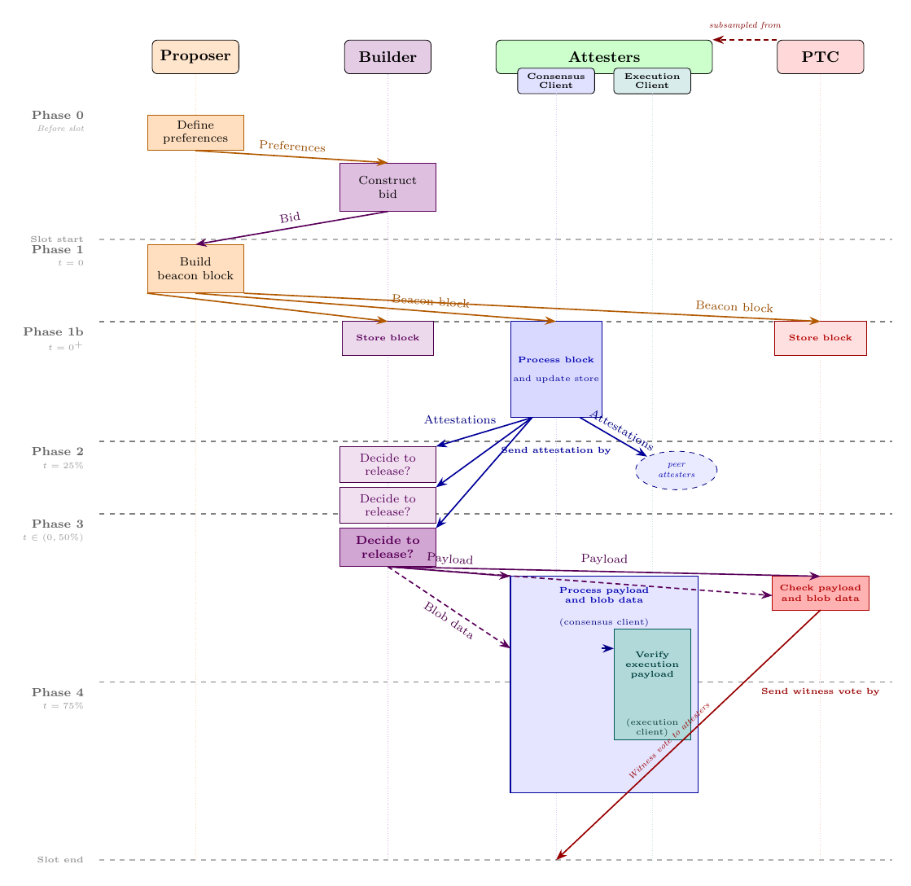
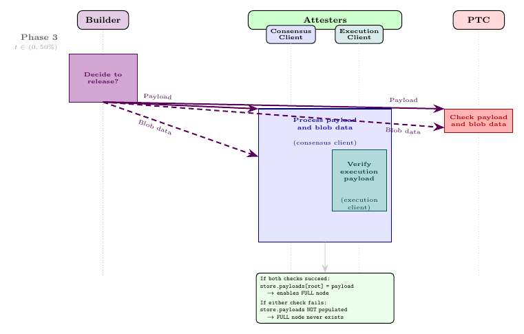
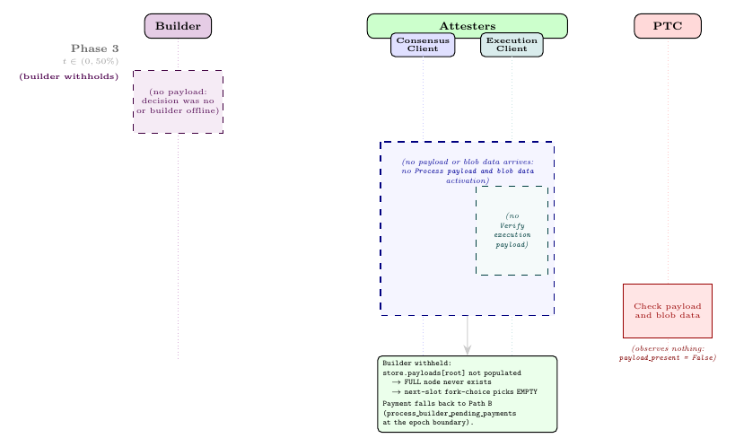
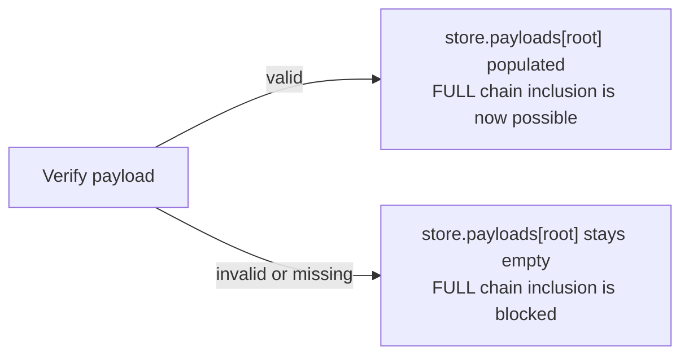
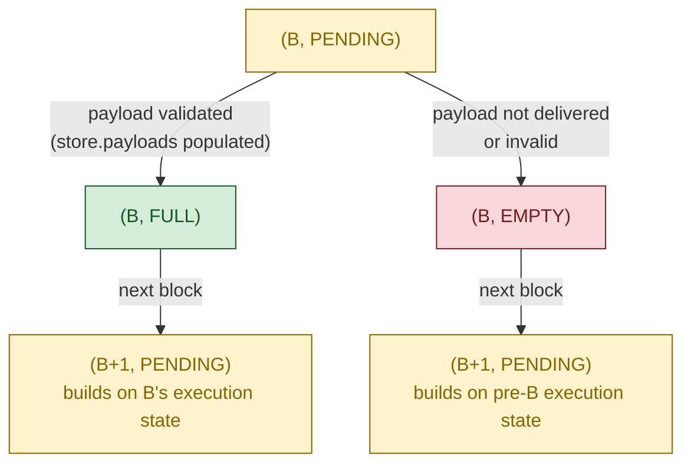
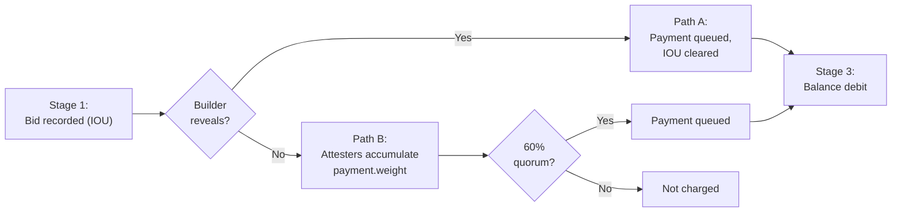

# ePBS: From Spec to Security Properties

EIP-7732 enshrines proposer-builder separation into Ethereum's consensus protocol. This is a large change: it restructures how blocks are produced, introduces a new staked actor (the builder), splits each block into a beacon-block half (broadcast at slot start) and an execution-payload half (revealed separately by the builder), and creates an unconditional payment mechanism that removes the need for trusted relays.

This document is a security analysis of ePBS. We walk through the protocol's lifecycle, identify ten externally observable properties (organised in three categories) that the design is meant to guarantee — two of them (the Category B pair) also stated in a parametric non-trustless variant — and trace where in the spec code each guarantee is enforced. Where the argument requires facts about internal spec functions we have not fully presented here, we state those facts as explicit assumptions and show how the properties follow. Assumptions that have been discharged are proved as lemmas against the spec in Appendix A.

**Who should read this.** Anyone who wants a rigorous but readable account of how ePBS works: what changed from pre-ePBS, why, and what guarantees the protocol provides. We assume familiarity with Ethereum's consensus layer (Gasper, LMD-GHOST, FFG, attestation committees, fork choice). We do not assume prior knowledge of EIP-7732.

**Spec version.** This document targets [`ethereum/consensus-specs`](https://github.com/ethereum/consensus-specs) at commit [`a82d5a2f9`](https://github.com/ethereum/consensus-specs/commit/a82d5a2f989085031d5c1843afc00954b88cd1e6), Gloas fork: [`specs/gloas/`](https://github.com/ethereum/consensus-specs/tree/a82d5a2f989085031d5c1843afc00954b88cd1e6/specs/gloas); inline spec-file references are to that commit. The Gloas specs are work-in-progress and may differ from the EIP-7732 draft summary.

**Notation.** Code blocks use Python syntax at an abstracted level. An `...` in arguments or fields means "additional fields omitted for brevity." One convention is worth knowing upfront; the rest are reference material in the expandable table below.

- **`sign(x)` and `broadcast(x)`.** Standard BLS signing and gossip publication. The spec uses domain-specific named signers (`get_attestation_signature`, `get_signed_proposer_preferences`, `get_payload_attestation_message_signature`, `get_block_signature`); we use `sign(x)` as a uniform shorthand and `broadcast(x)` for the gossip layer.

The fork-choice node abstraction used in §6 is the spec container `ForkChoiceNode(root, payload_status)`: a beacon-block root paired with the payload-status branch that fork choice is evaluating.

<details>
<summary><b>Full pedagogical-abstractions table</b> (click to expand)</summary>

Every name below is a pedagogical helper, not a spec function. Each one abstracts a piece of spec prose or a generic operation.

*Proposer- and PTC-side helpers (Sections 4–5):*

- **`collect_valid_bids(state, slot)`** — "Listen to the `execution_payload_bid` gossip global topic and save an accepted `signed_execution_payload_bid` from a builder" (`validator.md`, §"Signed execution payload bid").
- **`select_one_bid(bids)`** — "Select one bid …" (`validator.md`, §"Signed execution payload bid").
- **`aggregate_ptc_votes(slot - 1)`** — "The proposer MUST aggregate all payload attestations with the same data" (`validator.md`, §"Payload attestations").
- **`construct_beacon_block(state, body)`** — Standard `BeaconBlock` container construction with `slot`, `proposer_index`, `parent_root`, `state_root`, `body`.
- **`get_parent_execution_requests(store, state)`** — Three-case logic in `validator.md` §"Parent execution requests" with `head = get_head(store)`: empty `ExecutionRequests()` if the parent block is pre-Gloas; `store.payloads[head.root].execution_requests` if `should_build_on_full(store, head)` returns True; empty `ExecutionRequests()` otherwise.
- **`is_head_of_chain(block, store)`** — Shorthand for `get_head(store).root == hash_tree_root(block)`, the "head of the builder's chain" check from `builder.md` §"Honest payload withheld messages".
- **`has_beacon_block_for_slot(store, slot)`, `get_beacon_block_root_for_slot(store, slot)`** — Inline checks in `validator.md` §"Constructing the `PayloadAttestationMessage`": the PTC member checks whether it has seen any beacon block for the assigned slot and obtains its hash tree root.
- **`has_execution_payload_envelope(store, root)`** — Shorthand for "the node observed a `SignedExecutionPayloadEnvelope` for `root` on gossip strictly before `get_payload_due_ms()` milliseconds into the slot" (spec: `validator.md` §"Constructing a payload attestation message"). This is the predicate the honest PTC member evaluates at vote time to decide `data.payload_present`. It is *independent* of blob-data availability: blob arrival is reported by the separate `data.blob_data_available` signal, which is evaluated against `is_data_available(beacon_block_root)`. The two signals are conceptually distinct because the payload envelope and the blob columns travel on different gossip topics and can diverge. (`store.payloads[root]` is the *stronger* condition "envelope observed AND `is_data_available` passed AND `verify_execution_payload_envelope` passed", populated by `on_execution_payload_envelope`; that is the gate the fork-choice tree's FULL node uses (§6), but it is **not** the gate the PTC's `payload_present` vote uses.)
- **`check_blob_data(store, root)`** — The spec function is `is_data_available(beacon_block_root)` (`fork-choice.md`); we keep `store` in the signature so reads are visible at the call site.
- **`execution_engine.build_payload(...)`** — The two-step spec flow `notify_forkchoice_updated(...) → engine_getPayloadV6(payload_id)`; we collapse to a single call returning the `(payload, execution_requests)` bundle.
- **`update_participation_flags(state, i, data)`** — Abstracts the inline flag-update loop in `process_attestation` (`beacon-chain.md`): for each participation flag set by this attestation that validator `i` has not yet set, set the flag on `epoch_participation[i]` and accumulate the proposer reward. Returns `True` iff at least one new flag was set. Used inside the §9.2 G-PayAttest pseudocode body.
- **`deliver_bid_to_proposer(signed_bid)`** — Pedagogical wrapper for the two delivery channels of §3: `broadcast` on the public `execution_payload_bid` gossip topic when `signed_bid.message.execution_payment == 0`, or off-protocol transport otherwise (cf. p2p-interface.md gossip `REJECT` rule). Replaces the unqualified `broadcast` in the Phase 0 `submit_bid` code; either channel results in the same `SignedExecutionPayloadBid` reaching the proposer.

*Math notation in §9 (proofs):*

- **`slot(B)`, `parent(B)`, `state(B)`** — "the slot of block B", "the parent block of B", "the post-state of B"; i.e., `B.slot`, `store.blocks[B.parent_root]`, and `store.block_states[hash_tree_root(B)]` respectively.
- **`bid(B)`, `head(chain)`, `child(chain, B)`** — "the bid carried by block B", i.e., `B.body.signed_execution_payload_bid.message` (so `bid(B).block_hash`, `bid(B).parent_block_hash`, etc. are the corresponding fields of the `ExecutionPayloadBid` SSZ container). `head(chain)` is the head block of a canonical chain (the latest block in the sequence). `child(chain, B)` is B's unique canonical child on `chain` (the block whose `parent_root` equals B's hash-tree root); defined formally in §3.
- **`block_status(chain, B)`, `parentStatus(B)`** — `block_status(chain, B)` is the FULL / EMPTY / undefined classifier defined in §3. `parentStatus(B)` is shorthand for "B's bid declares its parent as FULL or EMPTY": FULL if `bid(B).parent_block_hash == bid(parent(B)).block_hash`, EMPTY otherwise. Used in §8 / §9 to refer to a block's *declared* view of its parent.
- **`active_validators(store)`, `latest_message(v)`, `effective_balance(v)`, `child_blocks_of(blocks, r)`** — Pedagogical helpers in the §6 fork-choice machinery and §9 G-assumption definitions; abbreviate `get_active_validator_indices(state, get_current_epoch(state))`, `store.latest_messages[v]`, `state.validators[v].effective_balance`, and the children-of-`r` filter (over the filtered block tree `blocks`) that `get_node_children` (`fork-choice.md`) applies, respectively.
- **`epoch(N)`** — The epoch containing slot $N$, equal to `compute_epoch_at_slot(N) = N // SLOTS_PER_EPOCH`. We write $`\mathsf{epoch}(N)`$ in math notation and `epoch(N)` in prose.
- **"$`B'`$ will remain canonical forever"** — The strengthening canonicity precondition embedded in P_can, P_rev (trustless case), P_withhold (trustless case), and P_pay's statements (§4), where $`B'`$ is the canonical block at slot $`N{-}1`$. Rules out a configuration where a Byzantine slot-$`N`$ proposer publishes $`B`$ late and fragments honest votes between $`B`$'s branch and a competing branch under an older common ancestor, causing parent($`B`$) to lose canonicity. **Read operationally, not only extensionally:** the clause fixes the *configuration*, not merely the outcome — besides $`B'`$ staying canonical at every later time, no branch conflicting with $`B'`$ attracts online honest slot-$`N`$ attestation weight (equivalently, at $`T_{\mathrm{att}}`$ of slot $`N`$ every online honest validator's local head descends from $`B'`$). The proofs use this containment form where they keep honest slot-$`N`$ votes inside $`B'`$'s subtree (P_can's attestation step, inherited by P_pay; P_rev trustless, the *$`B`$ extends $`B'`$* derivation); P_withhold (trustless) needs only the outcome reading (its Preliminary routes through **L_head**). The §4 fold-out explains why the two readings are expected to coincide under S1 + S2. The companion missing-slot configuration (a colluding slot-$`N{-}1`$ / slot-$`N`$ Byzantine pair exploiting a missing intervening slot) is excluded automatically: $`B'`$'s existence at slot $`N{-}1`$ leaves no missing slot to exploit. The fact that $`B`$ extends $`B'`$ is derived from the other hypotheses in each property (automatic for an honest proposer in P_can/P_pay; derived from A1a (ii) plus $`B'`$'s canonicity in P_rev trustless; an explicit precondition in P_withhold trustless, where A1a (ii) may fail and so cannot supply it). P_rev's non-trustless case substitutes the confirmation rule's $`\Sigma_R`$ (§5 Phase 3 A1b) for this hypothesis. Not a spec function; see §4 for full motivation and open work to weaken it.

*Symbols used in the §5 A1a / A1b pseudocode blocks (declared here for strict-correspondence compliance):*

- **`T_att`, `T_ptc`, `T_payload_due`, `Delta`** — Wall-clock constants and the synchrony bound. `T_att = get_attestation_due_ms() = ATTESTATION_DUE_BPS_GLOAS · SLOT_DURATION_MS / 10000` (currently 25% = 3000 ms = 3 s). `T_payload_due = get_payload_due_ms()` (currently 50% = 6000 ms = 6 s) and `T_ptc = get_payload_attestation_due_ms()` (currently 75% = 9000 ms = 9 s). `SLOT_DURATION_MS` is the spec constant for slot duration in milliseconds (`phase0/fork-choice.md`); the `*_BPS` basis-point constants are in `validator.md` and the `get_*_due_ms()` accessors in `fork-choice.md`. `Delta` is the synchrony delay $\Delta$ from S1 (an external network bound, not a spec constant).
- **`W`** — The spec's per-slot balance denominator, `get_total_active_balance(state) // SLOTS_PER_EPOCH`. This is the denominator used by proposer boost and `get_builder_payment_quorum_threshold`. When the proofs speak about 40% / 60% / 80% of a slot's weight, **S2** supplies the committee-regularity and online-participation link between actual same-slot attesting weight and this spec denominator.
- **`time_in_slot()`** — The wall-clock offset within the current slot at the calling node, i.e. `compute_time_at_slot(state, ...)`-derived; used by the builder's reveal-time check. Client-scheduler primitive.
- **`real_attestation_weight(store, B)`** — Sum of effective balances of validators with a real (validator-cast) `Attestation` for `B` in `store`, *excluding* the synthetic proposer-boost vote. Builder-side observation derived from `store.latest_messages` plus the slot's `Attestation` queue.
- **`equivocation_visible(store, proposer_index, slot)`** — Returns True iff `store` contains two distinct `SignedBeaconBlockHeader`s for `(proposer_index, slot)` (i.e., evidence sufficient for a `ProposerSlashing`). Builder-side observation.
- **`R_confirms(rule, store, B)`** — The confirmation predicate of an external rule $R$ applied to $B$ at the calling node's view (A1b only); parametric — see §5 Phase 3.
- **`reveal_time_safe_for_next_slot(t, B)`** — Returns True iff $`t + \Delta < T_{\mathrm{payload\_due}}`$ (network delivery only: the envelope reaches honest PTC members and the slot-$`N{+}1`$ proposer before their respective deadlines under S1). A1b's analogue of A1a's reveal-time upper bound; local DA/EL processing is covered separately by **L_verify** in §9.1.

</details>

---

## 1. What is ePBS and why

> **TL;DR.** ePBS replaces MEV-Boost's trusted relays with a protocol-native builder role and a decentralized timeliness committee, and modifies fork-choice to handle the resulting two-phase block model.

Today, Ethereum block production already operates under a separation of concerns: validators (called **proposers** in this context) produce beacon blocks, while specialized **builders** construct the execution payloads inside them. This division of labor exists because building a profitable execution payload requires sophisticated MEV (Maximal Extractable Value) extraction strategies that most validators do not have the infrastructure to run. The current implementation, **MEV-Boost**, achieves this separation through **trusted relays**: builders submit blocks to relays, relays forward block headers to proposers, proposers commit to a header without seeing the full block, and relays then reveal the block to the network.

This works (as of late 2025, around 90% of Ethereum mainnet blocks are produced through MEV-Boost — see the live dashboards at [Rated&#39;s relay landscape](https://explorer.rated.network/relays?network=mainnet&timeWindow=1d) and [Relayscan](https://www.relayscan.io/) for current numbers), but it has fundamental problems:

- **Trust in relays.** Relays are single points of failure. Both proposers and builders must trust them: the proposer trusts the relay will reveal the block after signing, and the builder trusts the relay will not steal MEV. If a relay is malicious, crashes, or censors, liveness and fairness suffer.
- **No on-chain accountability.** Relays are not protocol participants. There is no on-chain mechanism to detect or punish relay misbehavior.
- **Censorship vector.** Relays can selectively refuse to forward certain blocks, enabling censorship at the relay level.

**Enshrined Proposer-Builder Separation (ePBS)**, specified in EIP-7732, integrates the builder-proposer interaction directly into Ethereum's consensus protocol, eliminating the need for trusted relays. The protocol itself mediates the exchange: builders are now staked on-chain participants, the bid commitment becomes a consensus object, and a dedicated committee of validators (the **Payload Timeliness Committee**, PTC) provides a decentralized signal about whether the builder delivered.

The goal of this document, and of the broader project it belongs to, is to characterize ePBS rigorously: identify what the protocol is supposed to guarantee, formalize the algorithms that implement those guarantees, and prove that the guarantees actually hold under both honest and adversarial behavior.

---

## 2. The actors

> **TL;DR.** ePBS introduces the **builder** as a new staked actor, modifies attesters (`data.index` now signals payload status) and proposers (now select bids or self-build), and adds a per-slot **PTC** subcommittee that witnesses payload arrival.

ePBS introduces one new actor and modifies the role of existing ones.

**Proposer** — a validator selected for a slot. **Modified under ePBS.** The proposer typically *selects a builder's bid* and includes it in the beacon block (the expected case). Alternatively, the proposer can *self-build* by setting `builder_index = BUILDER_INDEX_SELF_BUILD`, `value = 0`, and signature `bls.G2_POINT_AT_INFINITY`, constructing the execution payload directly. Self-build is the escape hatch when no acceptable bid is available.

**Attester** — a validator assigned to a slot's committee. **Modified under ePBS.** The `data.index` field is repurposed to signal payload status (0 = empty, 1 = full). For same-slot attestations (block from the attester's own slot), `data.index` must be 0: the attester cannot have an opinion on the payload yet because it votes before the builder reveals.

**Builder** — *new*. A staked participant (separate from validators) that constructs execution payloads and bids for inclusion. Key properties:

- **Registration.** Builders register by submitting an execution-layer `BuilderDepositRequest` (EIP-8282), processed by `process_builder_deposit_request`. The request's `withdrawal_credentials` must begin with the builder-withdrawal prefix `BUILDER_WITHDRAWAL_PREFIX` (`0xB0`) — deposits lacking it are ignored (`is_builder_withdrawal_credential`) — and hold the withdrawal execution address in its last 20 bytes; the builder's `version` is forced to `PAYLOAD_BUILDER_VERSION = 0` (not read from the credentials), which `process_execution_payload_bid` asserts on every bid. Processing assigns a `BuilderIndex`, and the builder becomes active once their deposit is finalized. (A one-time fork-time path, `onboard_builders_from_pending_deposits`, also onboards builders with `0xB0`-credentialed (`BUILDER_WITHDRAWAL_PREFIX`) pending deposits already in the validator-deposit queue at the Gloas fork; post-fork, `BuilderDepositRequest` is the only path.)
- **Stake floor.** There is no protocol-enforced minimum at registration time — a `BuilderDepositRequest` with any positive `amount` creates an entry. The floor is instead enforced at *every bid*: `can_builder_cover_bid` requires `builder.balance ≥ MIN_DEPOSIT_AMOUNT + (sum of outstanding obligations) + bid.value`, where `MIN_DEPOSIT_AMOUNT = 10⁹ Gwei = 1 ETH` (inherited from the validator deposit floor). A builder with less than 1 ETH balance is registered but cannot bid. In practice, **1 ETH is the minimum functional stake**; competitive builders hold orders of magnitude more, sized to their bid strategy across the 2-epoch ring-buffer window (§7). Unlike validators, builders have no `MIN_ACTIVATION_BALANCE = 32 ETH` activation gate and no `MAX_EFFECTIVE_BALANCE` cap — the entire `builder.balance` is collateral against bid commitments.
- **Duties.** Builders do not attest or propose; they only build payloads. They are also responsible for broadcasting blob data (EIP-4844 data column sidecars) across the p2p network.
- **Not slashable.** Unlike validators, builders are not slashable: there is no `process_builder_slashing` handler. The protocol enforces accountability solely through *bid forfeit*: the `BuilderPendingPayment` IOU clears against the builder's stake at the epoch boundary even when the builder withholds, provided the slot's pending-payment weight reaches the 60% quorum (Path B). **Bid forfeit only applies to the trustless `value` field**; the non-trustless `execution_payment` field (introduced in §3) has no protocol enforcement at all, only off-protocol reputation.
- **Exit.** Builders exit by submitting an execution-layer `BuilderExitRequest` (EIP-8282), processed by `process_builder_exit_request`. The request is authorised by the builder's `execution_address` (not a BLS signature); the gate requires the builder to be active and to have zero `get_pending_balance_to_withdraw_for_builder` (i.e., no outstanding `value` obligations across `builder_pending_payments` and `builder_pending_withdrawals`). On acceptance, `initiate_builder_exit` arms the standard withdrawability delay. There is no misbehaviour-driven exit: builders are never forcibly removed from the registry. The bid-forfeit mechanism described in the previous bullet is the protocol's only enforcement lever, and only on the trustless field. (The bitwise `BUILDER_INDEX_FLAG` constant still exists in the spec, but only as the wire-format flag distinguishing `BuilderIndex` from `ValidatorIndex` in shared-format payloads — it is not part of the exit mechanism.)

> **On "builder" terminology in this document.** The Gloas spec attaches a `version: uint8` field to each `Builder` and reserves it for future builder roles. Currently exactly one value is defined: `PAYLOAD_BUILDER_VERSION = 0`, the **payload builder** — the staked actor that bids for the right to construct an execution payload, reveals it before $T_{\mathrm{ptc}}$, and gets paid via the trustless or non-trustless channel of its bid. Both `process_execution_payload_bid` and the `execution_payload_bid` gossip topic assert this version on every bid. **Throughout this document, "builder" means "payload builder" — i.e., a registered `Builder` with `version == PAYLOAD_BUILDER_VERSION = 0`.** Bids from any future non-payload builder role would be rejected at admission under the current spec; that surface is out of scope here.

**PTC member** — *new role for existing validators*. A subcommittee of 512 ballot positions per slot, sampled from the slot's regular attestation committees by effective balance (a high-balance validator may occupy multiple positions; the >256-True threshold counts ballot positions, not distinct validators). Key properties:

- **PTC members are themselves attesters for the slot.** Every PTC member also belongs to one of the slot's attestation committees and casts the standard same-slot attestation at $T_{\mathrm{att}}$ in addition to the PTC witness statement at $T_{\mathrm{ptc}}$. Throughout this document and in the figures we draw the PTC as a separate column from Attesters. This is a *pedagogical* separation, not a mechanical one, isolating the witness-statement duty (a binary observation about payload arrival) from the head-vote duty (which drives fork-choice weight).
- **Distinct duty.** The PTC casts a **payload timeliness attestation** at 75% of the slot, reporting two independent signals: `payload_present` (whether the member observed the `SignedExecutionPayloadEnvelope` arrive) and `blob_data_available` (whether the member's sampled blob data columns arrived and passed KZG verification). Both are binary observations, never validity judgments. The spec object is a `PayloadAttestationMessage` ([`beacon-chain.md`](https://github.com/ethereum/consensus-specs/blob/a82d5a2f989085031d5c1843afc00954b88cd1e6/specs/gloas/beacon-chain.md)); we follow the PBS literature and use the shorthand **witness statement** (or **witness vote**), since the PTC is *witnessing* payload and blob-data arrival, not judging execution validity. Phase 4 (§5) details the two-signal mechanics.
- **Observation, not validation.** PTC members run `on_execution_payload_envelope` as part of normal node operation, but payload validity is *not* a precondition for the PTC vote. The vote is conditioned solely on payload observation.

---

## 3. How an execution payload becomes part of the chain

> **TL;DR.** ePBS splits each block into two pieces that propagate separately: the **beacon block** carries consensus data and the builder's bid; the **execution payload** is revealed later by the builder. The beacon chain stores **bids** (hashes), not payloads, so anything the protocol can guarantee about payloads is expressed in terms of hashes. We define a function `block_status(chain, B)` that yields FULL/EMPTY for a (chain, block) pair, and a **payload hash chain**: the sequence of `bid.block_hash` values from FULL blocks on the canonical chain. A payload hash is **on chain** iff it belongs to this chain. A revealed execution payload is considered fully delivered only when both the payload and the associated blob data are available; P_DA (§4) promotes hash-on-chain to "payload available + valid + blob data available".

### Consensus chain and execution chain

An incoming block makes exactly one structural choice — which beacon block to extend — and the hash it commits to as its execution parent (the previous execution payload its bid points at) is then constrained to one of exactly two values, both already visible in the parent's bid.

Each beacon block $B$ under ePBS carries:

- **`parent_root`** — the hash-tree root of $B$'s parent beacon block, `parent(B)`. This is $B$'s choice: which beacon block to extend.
- **`bid.parent_block_hash`** — the `block_hash` of the execution payload $B$'s bid references as its parent. `parent(B)`'s bid itself carries two hash fields: `block_hash` (the hash of `parent(B)`'s own future execution payload) and `parent_block_hash` (the hash `parent(B)` inherited as its execution parent). **$B$'s `bid.parent_block_hash` must equal one of these two values**, and which value it takes corresponds to `parent(B)`'s **payload status** — either **FULL** (the execution chain advances *through* `parent(B)`'s payload) or **EMPTY** (the execution chain *skips past* `parent(B)`, inheriting `parent(B)`'s own execution parent):
  - **`bid(parent(B)).block_hash`** → $B$ declares `parent(B)` as **FULL**.
  - **`bid(parent(B)).parent_block_hash`** → $B$ declares `parent(B)` as **EMPTY**.

No third value is admissible; `process_execution_payload_bid` rejects any block that violates this constraint. So the binary FULL/EMPTY structure is not an emergent property — it is directly visible in the on-chain layout: a block's bid points its execution parent at one of the two hashes its parent's bid already exposes.

**The two-chain picture is the consequence of accumulating these binary choices across a sequence of blocks.** The **consensus chain** (beacon blocks linked by `parent_root`) advances every slot a block is proposed. The **execution chain** (sequence of revealed execution payloads, linked by their `block_hash` values) advances exactly at slots a successor declared FULL — and stays put across slots declared EMPTY. When a builder withholds, the successor declares its parent EMPTY, the execution chain stays at the most recent FULL ancestor, and the two chains drift apart by one slot.

<details>
<summary><b>Equivalent state-machine view</b> (click to expand)</summary>

The same constraint is enforced at the state-machine level by `process_execution_payload_bid`, which asserts `bid.parent_block_hash == state.latest_block_hash`. The field `state.latest_block_hash` carries the `block_hash` of the most recent FULL ancestor — so the two admissible values listed above (`bid(parent(B)).block_hash` and `bid(parent(B)).parent_block_hash`) are exactly the two values `state.latest_block_hash` can hold when $B$ is processed, depending on whether `parent(B)`'s payload effects were applied during $B$'s `process_parent_execution_payload` step.

*On the construction side:* when the slot-$N$ builder constructs $B$'s bid, it does not pick from the two-element set directly. The execution head is determined by the same `should_build_on_full(store, head)` decision that the proposer later uses to accept bids. If it returns True, `prepare_execution_payload` simulates `apply_parent_execution_payload` on a copy of state, advances the execution head to `bid(parent(B)).block_hash`, and the bid uses that value as `bid.parent_block_hash`. If it returns False, construction uses the parent's EMPTY variant and the bid uses `bid(parent(B)).parent_block_hash`. So the bid-layer constraint (one of two values) is a *consequence* of the construction mechanism, not a direct choice.

We prefer the bid-layer framing in the main text because it is directly inspectable on-chain — there are exactly two hashes in `parent(B)`'s bid, and $B$'s bid takes one of them. This avoids reasoning about the precise moment in the state transition at which `state.latest_block_hash` is updated — a subtlety handled by deferring execution-payload processing to the next block via `process_parent_execution_payload`. The bid-layer constraint holds regardless of those state-machine timing details.

</details>


*Figure 1: Two-chain structure across slots 97–100; slot 99's builder withholds, so Block(100) declares Block(99) EMPTY by setting its `bid.parent_block_hash` to Block(99)'s `bid.parent_block_hash` (one of the two admissible values) rather than to Block(99)'s `bid.block_hash`. **The beacon chain stores hashes** (via the bid fields); revealed payloads live in node-local stores. The **payload hash chain** induced by this figure is the pair of `bid.block_hash` values committed by Block(97) and Block(98), the two FULL blocks.*

- ***Consensus chain (orange, `parent_root`).*** Beacon blocks linked by the previous block's hash-tree-root; one per proposed slot, with no gap at slot 99.
- ***Block → its own payload (gray, `bid.block_hash`).*** Each block commits to the hash of its future payload; `verify_execution_payload_envelope` checks the match at reveal. Slot 99 has no arrow (withhold); Block(100)'s payload is unrevealed in this snapshot.
- ***Block → previous payload (violet, `bid.parent_block_hash`).*** Each bid records the hash of the payload it references as its parent, drawn from one of the two hashes in its parent's bid. Block(99) and Block(100) both point at Payload(98), and their paths merge above it; slot 99's withhold did not advance the execution chain tip.
- ***Execution chain (teal, `payload.parent_hash`).*** Revealed `ExecutionPayload` carries the previous payload's `block_hash`, the same value as `bid.parent_block_hash`, stored in a different container and verified equal at reveal. Only Payload(98) → Payload(97) is visible.

**`state.latest_block_hash` tracks the execution chain tip.** It is the `block_hash` of the most recently revealed execution payload that has been integrated into the chain. It is updated only when `process_parent_execution_payload` confirms the parent block was FULL (i.e., applies the parent's execution effects). When a builder withholds, `latest_block_hash` does not advance, and the next slot's builder reads this older value as its `parent_block_hash`.

### What's actually on chain: bids and payload hashes

**The beacon chain stores bids, not payloads.** Every beacon block carries a `SignedExecutionPayloadBid` in its body, a small container holding the builder's signature over an `ExecutionPayloadBid` message. The bid commits to two hashes:

- `bid.block_hash` — the hash the builder commits to for its own future execution payload (the payload it will reveal in Phase 3, if it reveals).
- `bid.parent_block_hash` — the hash of the previous execution payload that the bid references as its parent.

The actual `ExecutionPayload` SSZ container (transactions, state root, withdrawals, …) is **not** stored on chain. The builder broadcasts it separately, and it lands in each node's local `store.payloads` only if received and verified. The beacon chain only records HASHES of payloads, via the two bid fields above.

**This shapes what we can formally guarantee.** Anything the protocol can promise about payloads from on-chain inspection alone (validity, availability, blob-data availability) must be expressible in terms of these hashes, because hashes are all the canonical chain stores. Payload-level claims are downstream of hash-level claims, and the most we can claim at the hash level is *which hashes appear in which bid fields on the canonical chain*.

### What the payload hash commits to

The builder reveals a `SignedExecutionPayloadEnvelope`: a signed wrapper around the `ExecutionPayload` plus the companion `ExecutionRequests` and delivery metadata. The `ExecutionPayload` is the execution block being revealed: transactions, withdrawals, execution roots, gas fields, timing fields, and the carried `block_hash`. That `block_hash` is an execution-layer block-header hash, not an SSZ root of the `ExecutionPayload` container. At reveal time, `verify_execution_payload_envelope` first checks the carried field against the bid:

```python
assert payload.block_hash == bid.block_hash
```

The execution engine then checks that `payload.block_hash` is correctly computed from the execution header. Schematically:

```text
payload.block_hash == keccak256(rlp(execution_header))
```

For the Gloas payload shape, the header is built from the execution-payload fields and the envelope inputs that the execution layer treats as header commitments:

- `payload.parent_hash`, the execution parent hash. This is the same execution tip that the bid exposes as `bid.parent_block_hash`.
- `payload.fee_recipient`, `payload.state_root`, `payload.receipts_root`, `payload.logs_bloom`, `payload.prev_randao`, `payload.block_number`, `payload.gas_limit`, `payload.gas_used`, `payload.timestamp`, `payload.extra_data`, and `payload.base_fee_per_gas`.
- the post-Merge constants for `ommers_hash`, `difficulty`, and `nonce`.
- the transaction trie root computed from `payload.transactions`. The transaction list itself is not a header field; the header commits to its trie root.
- the EL withdrawals root computed from `payload.withdrawals`.
- `payload.blob_gas_used` and `payload.excess_blob_gas`.
- the block-access-list hash computed from the RLP-encoded `payload.block_access_list`.
- `payload.slot_number`.
- `envelope.parent_beacon_block_root`.
- `requests_hash(get_execution_requests_list(envelope.execution_requests))`, the execution-layer commitment to the request data carried beside the payload.

The fields above are spread across the Gloas `ExecutionPayload`, `ExecutionPayloadEnvelope`, and `ExecutionPayloadBid` containers in [`beacon-chain.md`](consensus-specs/specs/gloas/beacon-chain.md), while `ExecutionRequests` and `get_execution_requests_list` are defined in the Electra execution-request machinery in [`beacon-chain.md`](consensus-specs/specs/electra/beacon-chain.md).

The carried field `payload.block_hash` is not itself an input to that hash. Nor are the bid signature, envelope signature, `builder_index`, PTC votes, or blob sidecars direct header fields. Blob data is represented indirectly: blob transactions commit to versioned blob hashes, the bid mirrors the KZG commitments in `bid.blob_kzg_commitments`, and the blob sidecars are checked by the data-availability machinery rather than by being inserted directly into the execution header.

This gives three distinct checks that are easy to conflate:

```text
hash-consistency:  does the received payload actually hash to bid.block_hash?
request binding:   do the revealed ExecutionRequests match bid.execution_requests_root?
execution validity: if the EL executes the payload, do the claimed roots/effects match?
```

`verify_execution_payload_envelope` performs the request-binding check with:

```python
assert hash_tree_root(envelope.execution_requests) == bid.execution_requests_root
```

and then delegates hash-consistency and execution validity to `execution_engine.verify_and_notify_new_payload(...)`.

**`ExecutionPayload` versus `ExecutionRequests`.** `ExecutionRequests` is the separate request object returned with the payload by the execution engine and carried beside it in the `ExecutionPayloadEnvelope`. In the current spec it contains the Electra request lists plus the EIP-8282 builder lifecycle requests:

```python
class ExecutionRequests(Container):
    deposits: DepositRequests
    withdrawals: WithdrawalRequests
    consolidations: ConsolidationRequests
    builder_deposits: BuilderDepositRequests   # EIP-8282
    builder_exits: BuilderExitRequests          # EIP-8282
```

These requests are not transactions. They are execution-layer-originated requests that the consensus layer later processes if the parent payload is accepted as FULL. The slot-N bid commits to them by `bid.execution_requests_root`; the slot-N envelope reveals them; and a FULL-declaring successor carries them as `parent_execution_requests`, where `process_parent_execution_payload` checks the same root before applying them.

### Block status: a property of (chain, block)

We now define formally what it means for a block to be **FULL** or **EMPTY**.

*Notation reminder.* In the definitions below, `bid(X)` denotes the bid carried by block $X$, i.e., the `ExecutionPayloadBid` message inside `X.body.signed_execution_payload_bid`. Its fields are accessed with the usual dot syntax: `bid(X).block_hash`, `bid(X).parent_block_hash`, etc. (See the abstractions table at the top of the doc for the full set of pedagogical helpers.)

> **Definition (Block status).** Write $`B \prec \mathit{chain}`$ to mean "$`B`$ is a non-head canonical block on $`\mathit{chain}`$", and let `child(chain, B)` denote $`B`$'s unique canonical child on $`\mathit{chain}`$ (the block whose `parent_root` equals $`B`$'s hash-tree root). Then `block_status(chain, B)` is:
>
> - **FULL** if $B \prec \mathit{chain}$ and `bid(child(chain, B)).parent_block_hash` equals `bid(B).block_hash`;
> - **EMPTY** if $B \prec \mathit{chain}$ and `bid(child(chain, B)).parent_block_hash` does not equal `bid(B).block_hash`;
> - **undefined** otherwise (i.e., $`B`$ is not on $`\mathit{chain}`$, or $`B = \mathit{head}(\mathit{chain})`$).
>
> **Why undefined at the head.** When $`B = \mathit{head}(\mathit{chain})`$, $B$'s `bid.block_hash` has been committed but no child exists yet to reference it. Status becomes defined once $B$'s child lands.

**Why the function takes the chain as an argument.** FULL/EMPTY is not an intrinsic property of $B$. The definition depends on $B$'s **child** in $\mathit{chain}$, and the child is a property of the chain, not of $B$. A reorg that replaces $B$'s child can flip $B$'s status without $B$ changing. The explicit `chain` argument is a reminder that status is meaningful only relative to a fixed canonical branch.

**One more fact:**

- **FULL/EMPTY is retrospective.** $B$'s status is decided at slot N+1 (or later, at the next canonical slot after $`B`$) by $B$'s child's bid, not by $B$ itself at slot N. At slot N, $B$'s execution payload is in flight; until $B$'s child commits to building on it, $B$'s on-chain status is unsettled.

**Why the child alone determines the status.** Once $B$'s child $C$ declares EMPTY for $B$ (i.e., $C$'s `bid.parent_block_hash` does not equal $B$'s `bid.block_hash`), no later canonical block can declare FULL for $B$: `state.latest_block_hash` after $C$ no longer holds $B$'s `bid.block_hash`, and every subsequent block reads `state.latest_block_hash` to set its own `bid.parent_block_hash`. So the verdict is fixed by $C$ and cannot be revised by later blocks.

**An equivalent form of EMPTY, and a useful invariant.** Let $`C = `$ `child(chain, B)`. Then $`B`$ is EMPTY on chain iff `bid(C).parent_block_hash` equals `bid(B).parent_block_hash` — that is, $`C`$ stamps the *same* execution-layer tip its parent stamped, because `state.latest_block_hash` did not advance across $`B`$. More generally, for any non-head canonical block $`B`$ on $`\mathit{chain}`$, `bid(B).parent_block_hash` equals the `block_hash` of the **most recent FULL ancestor** of $`B`$ on $`\mathit{chain}`$ (or genesis if none). A run of consecutive EMPTY blocks all stamp the same upstream FULL ancestor; the stamp updates only when an ancestor is FULL.

Throughout this document, when we say "$`B`$ is FULL on chain" without qualification we mean `block_status(canonical, B) = FULL`, where `canonical` is the current canonical beacon chain.

### The payload hash chain

Block statuses on the canonical chain induce a chain over payload hashes. This is the formal object that captures *which payload hashes are on chain*.

> **Definition (Payload hash chain).** The **payload hash chain** is the collection of `bid.block_hash` values committed by every FULL block on the canonical chain, inheriting the canonical chain's order. Equivalently, a payload hash $`h`$ belongs to the payload hash chain if and only if there exists a non-head canonical block $`B^*`$ such that $`B^*`$'s `bid.block_hash` equals $`h`$ AND $`B^*`$ is **FULL** on the canonical chain.
>
> (FULL is undefined at the head, so the head's `bid.block_hash` is *not* on chain; it only enters once a successor lands.)

<details>
<summary><b>Inductive construction (head-to-genesis)</b> (click to expand)</summary>

Given a head beacon block $B$ on the canonical chain, the payload hash chain can be enumerated by walking backwards from $B$. Let $h^{(0)}, h^{(1)}, h^{(2)}, \ldots$ be the sequence defined by:

- **Base case.** $h^{(0)}$ is $B$'s `bid.parent_block_hash`: the hash of the latest confirmed execution payload (the one referenced by $B$'s bid as its parent).
- **Recurrence (for each $`k \geq 0`$).** Let $B^{(k)}$ be the unique canonical ancestor of $B$ whose `bid.block_hash` equals $h^{(k)}$ (i.e., $B^{(k)}$ is the block whose bid committed to the payload with hash $`h^{(k)}`$). Then set $h^{(k+1)}$ to $B^{(k)}$'s `bid.parent_block_hash`.
- **Termination.** The recurrence stops when no such $B^{(k)}$ exists, i.e., when $h^{(k)}$ corresponds to a payload at or before genesis (or the slot before ePBS activation).

This enumeration produces the chain in *reverse* execution order (head-to-genesis): $h^{(0)}$ is the most recent, $h^{(k)}$ gets older as $k$ grows.

</details>

> **Definition (Payload hash on chain).** A payload hash $h$ is **on chain** if it belongs to the payload hash chain of the canonical beacon chain at the time of inspection.

This is as much as we can say from on-chain data alone: $h$ is on chain iff some canonical bid commits to $h$ *and* some subsequent canonical bid references $h$ as its parent. Both bids are visible in the canonical chain; their composition certifies $h$'s on-chain membership. P_DA below promotes this hash-level fact to a payload-level guarantee: a hash on chain implies the corresponding payload (and its blob data) is available and valid.

### Data availability: payload + blob data

**When the builder reveals, it broadcasts two separate objects on two separate gossip channels**: the **payload** and the **blob data**. They are independent in propagation but jointly required for chain inclusion:

- **The payload** — the broadcast object carrying the transactions, state root, withdrawals, and delivery metadata (`builder_index`, `beacon_block_root`, `parent_beacon_block_root`, `execution_requests`). The spec name for this signed broadcast object is `SignedExecutionPayloadEnvelope`. It propagates on a dedicated gossip topic; the builder broadcasts it before the payload deadline `get_payload_due_ms()` (50% of the slot). Receiving nodes verify it via `verify_execution_payload_envelope` against the execution engine.
- **The blob data** — binary chunks attached to EIP-4844 transactions, used by rollups for cheap data availability. Each blob is erasure-coded into 128 **data columns** propagated as separate `DataColumnSidecar` objects on a distinct gossip topic via **PeerDAS**. No single node downloads all columns; each node samples the columns it is responsible for. The blob data is **not** carried inside the payload; only the **KZG commitments** authenticating the blobs live inside the payload's transactions, and they are mirrored in the bid (`bid.blob_kzg_commitments`) so nodes can check the commitments against the bid before the payload arrives.

**The payload and the blob data arrive via different channels and can diverge.** A node may have the payload but not all the blob columns it samples, or vice versa. The PTC vote at slot N reports both signals independently: `payload_present = True` confirms payload arrival; `blob_data_available = True` confirms the member's sampled blob columns arrived and pass KZG verification.

**Both halves are required for local FULL admission.** A node can only admit a FULL-declaring successor for block B after B's payload envelope has been locally verified and B's blob data has passed the node's `is_data_available` check. The PTC primary path for the slot-N+1 FULL/EMPTY decision also requires majority support on **both** signals: payload arrival and blob-data availability. If that primary path does not fire, §6 describes the fallback and honest-construction rules that determine whether B is treated as FULL or EMPTY on chain.

This is the foundation of Property P_DA (Data availability for chain inclusion) below.

### The bid container and its two payment fields

> **TL;DR.** A bid carries two distinct payment fields: `value` (trustless: the protocol settles it via the unconditional-payment mechanism) and `execution_payment` (non-trustless: an advertised promise the protocol does not enforce). The public bid gossip topic rejects non-zero `execution_payment`; bids with non-zero `execution_payment` must travel through some off-protocol channel. Properties in §4 split along this divide: some hold regardless of which field a builder uses, others apply only when one of the two is set.

We've referred to "the builder's bid" loosely; we now make the object concrete. The bid is the `ExecutionPayloadBid` SSZ container, wrapped in `SignedExecutionPayloadBid` for transport. Spec source: [`beacon-chain.md`](https://github.com/ethereum/consensus-specs/blob/a82d5a2f989085031d5c1843afc00954b88cd1e6/specs/gloas/beacon-chain.md) §`ExecutionPayloadBid`. The fields:

```python
class ExecutionPayloadBid(Container):
    parent_block_hash: Hash32              # execution-chain parent (§3)
    parent_block_root: Root                # consensus-chain parent (§3)
    block_hash: Hash32                     # commitment to this slot's payload (§3)
    prev_randao: Bytes32
    fee_recipient: ExecutionAddress        # destination of the payment
    gas_limit: uint64
    builder_index: BuilderIndex
    slot: Slot
    value: Gwei                            # TRUSTLESS payment
    execution_payment: Gwei                # NON-TRUSTLESS payment
    blob_kzg_commitments: ProgressiveList[KZGCommitment]
    execution_requests_root: Root
```

Three of these fields are the ones §3 has been using all along: `parent_block_hash`, `parent_block_root`, and `block_hash` define the two-chain layout and the FULL/EMPTY classifier. The next two fields, `value` and `execution_payment`, are the two payment fields the rest of the document will reason about.

**`value` — the trustless payment.** This is the amount, in gwei, that the builder commits to pay the proposer's `fee_recipient` if the bid is accepted. The protocol enforces it directly. When `value > 0`, `process_execution_payload_bid` (`beacon-chain.md`) records a `BuilderPendingPayment` IOU in state; from that moment, the unconditional-payment mechanism (§7) takes over. The common settlement paths are **Path A** at slot N+1 if the builder reveals and a successor declares the slot FULL, and **Path B** at the end of epoch *e+1* if the slot's pending-payment weight reaches the 60% same-slot quorum. Section 7 also identifies a rare **Path C** old-parent branch for the missed-slot corner where the IOU has aged out but a later canonical block declares the parent FULL. In all settlement paths, an on-chain commitment to credit the proposer is recorded out of the builder's on-chain stake (the actual execution-layer transfer follows in a later accepted FULL payload whose expected withdrawals include this entry): *the builder cannot avoid this commitment under P_pay's stated liveness and inclusion hypotheses*. This is the design that removes the need for trusted relays.

**`execution_payment` — the non-trustless payment.** This is also an amount in gwei, but the protocol does **not** enforce it. `process_execution_payload_bid` never reads `execution_payment`. No IOU is created, no balance is locked, no Path A or Path B applies. The field is metadata: a builder advertises an intended off-protocol payment, and the proposer chooses whether to believe it. Delivery has to happen through some other channel, most plausibly a transaction inside the revealed execution payload that pays `fee_recipient` from the builder's execution-layer address. If the builder doesn't honor it, the proposer has no protocol-level recourse.

**Non-zero `execution_payment` cannot be gossiped.** The public `execution_payload_bid` gossip topic carries a [`REJECT`](consensus-specs/specs/gloas/p2p-interface.md) validation rule: *`bid.execution_payment == 0`*. Bids with non-zero `execution_payment` are dropped at the gossip layer. They cannot reach the proposer via the canonical bid topic; they must travel via some off-protocol transport (a relay-style HTTP service, a direct builder ↔ proposer connection, a side-protocol). The consensus-layer admission in `process_execution_payload_bid` does not check `execution_payment`, so once such a bid is in a beacon block by *some* path, the block processes normally. The spec does not specify what that path looks like.

**Why a builder might prefer non-trustless payment.** Two structural reasons:

- **No solvency lock.** `can_builder_cover_bid` (`beacon-chain.md`) checks the builder's stake against the sum of all outstanding `value` obligations. `execution_payment` is not in that sum. A builder can issue unlimited `execution_payment` promises across slots without the protocol noticing they've overcommitted.
- **No unconditional-payment exposure.** With `value`, even withholding triggers Path B if the slot's pending-payment weight reaches the 60% same-slot quorum. The only escapes are low same-slot payment weight that leaves the quorum unreachable, or proposer slashing via `ProposerSlashing` (which clears the IOU). With `execution_payment`, the builder controls reveal *and* payment: they only pay if they reveal *and* honor the off-protocol promise. The reveal decision becomes purely strategic, with no protocol exposure to a withholding choice.

**Why a proposer might accept it.** A non-trustless bid can advertise a higher headline number than a trustless bid from the same builder, because the builder accepts no protocol-side risk. The proposer is making a reputation-based trade (trust this specific staked builder to deliver) in exchange for upside the trustless market cannot match. The proposer remains a staked, identifiable consensus participant; the builder remains a staked, identifiable builder-registry participant; the missing piece is the protocol's enforcement of the payment between them.

**The builder identity is on-chain either way.** Whether the bid arrives via gossip or via an off-protocol channel, `process_execution_payload_bid` enforces `is_active_builder(state, bid.builder_index)` and `verify_execution_payload_bid_signature` (`beacon-chain.md`). The only escape is the self-build branch (`BUILDER_INDEX_SELF_BUILD`, `value = 0`, signature `bls.G2_POINT_AT_INFINITY`), which is the proposer building for themselves. Off-protocol does **not** mean "off-chain builder identity"; it means "off-protocol bid transport".

**This split structures §4.** Properties in §4 are organised into three groups. Some hold regardless of which payment field a bid uses (the always-on layer). Some hold only in the trustless case (`value > 0`). Some hold only in the non-trustless case (`execution_payment > 0` with `value = 0`), under different assumption sets. The next section is where this split is made explicit.

---

## 4. Properties

> **TL;DR.** Ten externally observable properties, organised in three categories. **Category A — payment-trustlessness-independent**: P_can (block safety), P_exec (payload execution deadline is the beginning of the next slot), P_DA (data availability for chain inclusion), and P_valid (chain validity), plus a **lifecycle-liveness** family — P_exit_validator, P_exit_builder, and P_join_builder (exited validators and builders eventually recover their remaining stake, and a valid builder registration eventually activates); these hold regardless of which payment field the builder uses. **Category B — payment-trustlessness-dependent**: P_rev (builder revealing protection) and P_withhold (builder withholding protection); each has a unified conclusion with two assumption-set cases, one per case. **Category C — trustless-payment-only**: P_pay (unconditional payment), which has no analogue when `execution_payment` is used. All ten are claims an observer with full visibility of network messages and on-chain state can verify, without inspecting any node's internal state.

Each property is stated here informally and revisited precisely as we walk through the lifecycle. The two cases are introduced in §3 ("The bid container and its two payment fields"); we refer to them here as the *trustless case* (when `bid.value > 0`) and the *non-trustless case* (when `bid.execution_payment > 0` and `bid.value = 0`, delivered off-protocol).

Some statements below rely on **proof-specific side conditions** — external inclusion/liveness assumptions written `L_…` (liveness; e.g. `L_parent`, `L_verify`, `L_withdraw`) and `I_…` (inclusion; e.g. `I_slash`). Where a property names one, we gloss what it means in parentheses at its first use; the formal statement of every side condition is catalogued in §9.1. (The four global structural assumptions `S1`–`S4` are described under "Adversarial model" below.)

### Category A — payment-trustlessness-independent properties

These hold regardless of which payment field the builder uses. They are pure consensus-layer properties: ePBS does not weaken what was already true about beacon-block canonicity, and the new two-phase model preserves data-availability guarantees for any payload that does land on chain.

**P_can: Block safety.** Let $`B`$ be a block proposed in slot $`N`$ by an **honest proposer** — so $`B`$ is **timely** ($`t + \Delta < T_{\mathrm{att}}`$; §9.1) and non-equivocating — extending a block $`B'`$. Assume that $`B'`$'s slot is $`N{-}1`$, that $`B'`$ will remain canonical forever, **S1** (synchrony), **S2** (β < 20%), and **L_parent** (parent-status uniformity, §9.1 — clause (a) when $`B`$ declares its parent $`B'`$ FULL: every online honest node locally verifies $`B'`$'s execution payload before $`T_{\mathrm{att}}`$, and `on_block` re-evaluates a block first rejected by its parent-FULL assertion once that payload is locally verified; clause (b) when $`B`$ declares $`B'`$ EMPTY: no online honest node resolves $`B'`$ as FULL at the slot-$`N`$ vote). If $`B`$ includes a valid bid, then $`B`$ remains in the canonical chain at every later time.

> **Why P_can is stated this way.** What we really want to claim is stronger: *ePBS does not introduce any new reorg attack against a block proposed by an honest proposer*. Proving that directly would require running the same execution on both pre-ePBS and ePBS and showing the canonical chains agree, which is too complex for this kind of document. So we prove P_can instead: under the same conditions that would have made $`B`$ canonical pre-ePBS (parent stays canonical, proposer is honest), $`B`$ is still canonical under ePBS. P_can is what we prove in place of the "no new reorg attacks" claim. *Note: an honest slot-$`N`$ proposer (a) broadcasts $`B`$ at slot start (hence timely in the §9.1 sense, $`t + \Delta < T_{\mathrm{att}}`$) and (b) does not equivocate (publishes a single block at slot $`N`$).*

**P_exec: Payload execution deadline is the beginning of the next slot.**
Let $B$ be a block proposed in slot $N$ and $P$ be the payload associated with $B$ (i.e. `bid(B).block_hash = P.block_hash`).
With the only possible exception of builders, the protocol does not require any other honest actor to complete the execution of $P$ before the beginning of slot $N+1$.

**P_DA: Data availability for chain inclusion.** Assume **S2** (β < 20%, giving an honest super-majority). If a payload hash is in the payload hash chain of the canonical beacon chain (i.e., the hash is on chain in the §3 sense), then the corresponding payload and blob data were available to at least one honest node. More precisely, some honest node successfully processed, via `on_block`, a canonical block that declared the corresponding beacon block FULL. At that node, the corresponding execution-payload envelope was in `store.payloads`, its payload was valid, and its associated blob data was available in the spec-local sense required by `is_data_available`.

**P_valid: Chain validity.** For every block $B$ on the canonical chain, $B$'s `bid.parent_block_hash` equals either `bid(parent(B)).block_hash` (declaring `parent(B)` FULL) or `bid(parent(B)).parent_block_hash` (declaring `parent(B)` EMPTY). Equivalently: a block's bid commits its execution parent to exactly one of the two hashes already on chain in its parent's bid; no third value is admissible.

#### Lifecycle liveness: exit, withdrawal, and registration

The four properties above are *safety* claims. ePBS also makes a family of *liveness* claims about actors entering and leaving their roles — committed stake can be recovered, and new participants can join. These remain **payment-trustlessness-independent** (they hold regardless of which payment field a builder ever used), so they sit in Category A; but unlike the safety properties they are **eventual** guarantees, conditional on continued block production (the chain-liveness side condition **L_withdraw**, already used by P_pay) — and, for builder activation, on finality continuing to advance (**L_finality**, §9.1). An observer verifies them from on-chain withdrawals and the builder registry, so they remain externally observable.

**P_exit_validator: Exited-validator withdrawal liveness.** Assume **L_withdraw** (canonical FULL blocks keep being produced). If a validator with **execution-layer withdrawal credentials** has exited and become withdrawable, its full remaining balance is **eventually** withdrawn to its withdrawal address. (The credential qualifier is load-bearing: the sweep's `is_fully_withdrawable_validator` check skips a validator still on BLS `0x00` credentials until it rotates them — such a validator has no withdrawal address to pay.)

**P_exit_builder: Exited-builder withdrawal liveness.** Assume **L_withdraw** and the builder-sweep budget side condition **L_payment_drain** (§9.1). If a builder has exited and become withdrawable, its full remaining balance is **eventually** withdrawn to its `execution_address`.

**P_join_builder: Builder registration liveness.** Assume **L_withdraw** and **L_finality** (finalized checkpoints keep advancing; §9.1). A **valid builder registration** — a `BuilderDepositRequest` whose pubkey is not already in the builder registry, with a valid deposit signature, builder-withdrawal credentials (prefix `BUILDER_WITHDRAWAL_PREFIX` = `0xB0`), and an amount above the bidding floor (§2) — **eventually** results in a registered builder that becomes active and able to bid.

The withdrawal-sweep machinery these rest on — the per-block sweep budget and stage ordering, the validator-vs-builder sweep asymmetry, and the ≈6.8-hour builder withdrawability delay — is described in §7; the proofs, the shared **sweep-progress** lemma, and the **L_payment_drain** and **L_finality** side conditions are in §9.

### Category B — payment-trustlessness-dependent properties

Each property here has one conclusion with two possible assumptions — one when the builder uses trustless payment, one when the builder uses non-trustless payment. The protocol that an honest builder can follow to guarantee these properties is detailed in §5 Phase 3.

**P_rev: Builder revealing protection.** Under the assumptions listed below, there exists a protocol an honest builder can follow such that, if the builder decides to reveal payload $P$ in slot $N$, then `P.block_hash` is in the payload hash chain of the canonical beacon chain (equivalently, $B$ is FULL on chain; and by P_DA, the corresponding payload and blob data are available and valid).

- *Trustless (`bid.value > 0`).* Assume there exists a canonical block $`B'`$ at slot $`N{-}1`$ that remains canonical forever, **S1** (synchrony), the **reveal-window synchrony bound** $`\Delta < (T_{\mathrm{payload\_due}} - T_{\mathrm{att}})/2`$ (stronger than S1; ensures A1a's reveal interval is non-empty — §5 Phase 3), **S2** (β < 20%), **S3** (slot-$`N`$ PTC majority is honest and online, and honest online PTC members wait to observe both the payload and the blob data before voting), **L_verify** (local payload/DA checks and DA/EL verification finish before the relevant PTC/successor decisions; §9.1), **L_successor** (a canonical successor following the FULL decision is eventually produced; §9.1), **L_parent** (parent-status uniformity, §9.1 — clause (a) when $`B`$ declares its parent $`B'`$ FULL: uniform local verification before $`T_{\mathrm{att}}`$ plus the `on_block` admission retry; clause (b) when $`B`$ declares $`B'`$ EMPTY: no online honest node resolves $`B'`$ as FULL at the slot-$`N`$ vote), and $`B`$ is timely (Definition in §9.1: $`t + \Delta < T_{\mathrm{att}}`$).
- *Non-trustless (`bid.execution_payment > 0`, `bid.value = 0`).* Assume **S1** (synchrony), **S3** (slot-$`N`$ PTC majority is honest and online, and honest online PTC members wait to observe both the payload and the blob data before voting), **L_verify** (local payload/DA checks and DA/EL verification finish before the relevant PTC/successor decisions; §9.1), **L_successor** (a canonical successor following the FULL decision is eventually produced; §9.1), and the builder knows of a confirmation rule that relies on a set of assumptions that hold.

**P_withhold: Builder withholding protection.** Under the assumptions listed below, there exists a protocol an honest builder can follow such that, if the builder withholds its execution payload, the protocol does not charge it.

- *Trustless (`bid.value > 0`).* Let $`B`$ at slot $`N`$ extend a block $`B'`$ at slot $`N{-}1`$ with $`B'`$ canonical forever. Assume **S1** (synchrony), the **reveal-window synchrony bound** $`\Delta < (T_{\mathrm{payload\_due}} - T_{\mathrm{att}})/2`$ (stronger than S1; ensures A1a's reveal interval is non-empty, so condition (i) is never by itself the reason an honest builder withholds — §5 Phase 3), **S2** (β < 20%), **L_head** (the builder's fork-choice view at reveal time reflects all messages delivered to it; §9.1), and **I_slash** (slashing inclusion, for the equivocation subcase; §9.1). Unlike P_can/P_rev/P_pay, only the *parent* $`B'`$ need be canonical — $`B`$ itself may end up EMPTY-on-chain or reorged (either way the builder is not charged). The guarantee is therefore **conditional on prudent bidding** — an honest builder declines to bid into a reorg-prone or skipped-slot configuration (§4 adversarial-model fold-out) — rather than unconditional.
- *Non-trustless (`bid.execution_payment > 0`, `bid.value = 0`).* No assumptions needed; no IOU is ever created (degenerate).

### Category C — trustless-payment-only properties

This category contains exactly one property: the unconditional-payment guarantee that defines the trustless case. There is no analogue in the non-trustless case: the protocol does not enforce `execution_payment` at all, so no on-chain mechanism can guarantee the proposer is paid.

**P_pay: Unconditional payment to the proposer.** Given the same set of assumptions as **P_can**, plus `bid.value > 0`, that the accepted bid pays the proposer's own advertised `fee_recipient` (automatic for gossip-admitted bids, an honest-proposer duty for off-protocol bids — see the §9.3 P_pay remark), that all attestations cast by online honest validators at slot $N$ are included on the canonical chain before the start of epoch $\mathsf{epoch}(N)+2$, and **L_withdraw** (the withdrawal-pipeline liveness condition; §9.1). The proposer's `fee_recipient` is eventually credited with the bid amount.

P_pay commits the chain to paying — a `BuilderPendingWithdrawal` is enqueued by the settlement mechanism detailed in §7 (normally Path A or Path B, with a rare Path C missed-slot corner). The actual **EL credit** — the moment the proposer's `fee_recipient` receives the funds at the execution layer — follows when a subsequent canonical FULL block drains the queue, includes the resulting `Withdrawal` in its execution payload, and that payload is accepted by the EL; its timing depends on chain state at settlement time. §7 includes a fold-out that works through the drain rate and the best- and worst-case settlement timing.

The remainder of this section discusses the fee-recipient destination, the adversarial model the proofs rely on, and the strengthening hypothesis embedded in P_can, P_rev (trustless case), P_withhold (trustless case), and P_pay.

**Why the fee recipient and not the validator's balance.** *The bid is paid to the proposer's `fee_recipient` (an execution-layer address) rather than added to the validator's consensus-layer balance.* This follows the same convention used pre-ePBS for execution-layer fees: staking pools and similar operators rely on this separation because keeping consensus rewards apart from execution-layer revenue makes accounting and revenue distribution to delegators much simpler. Under ePBS, the only difference is *who* drives the credit (the builder, via `BuilderPendingWithdrawal`); the destination address remains the same. The same `fee_recipient` field is the destination for both `value` and `execution_payment`; the difference is only in *how* the payment lands there.

**Adversarial model.** Four structural assumptions are catalogued in §9.1: network synchrony with honest relay (**S1**, Δ < $`T_{\mathrm{att}}`$; honest nodes relay any gossip-valid message), a per-slot online-participation / adversarial-weight bound against the spec denominator $W$ (**S2**), a PTC honest-online majority bound (**S3**), and an adversarial-delivery network model (**S4**, the companion to S1 for the adversary's own messages). **S1, S2, S3 are *enabling* assumptions:** each property's statement lists exactly the subset its proof uses, and not every property uses all three (P_exec uses none; P_DA and P_valid use only S2). The list is therefore informative — it tells the reader how much network and participation strength each guarantee actually costs — so these are stated per-property, not assumed globally. **S4 is a *restrictive* bound on the adversary**, in force globally for the adversarial analysis (§8) and never a per-property premise: a restrictive assumption only ever shrinks the attack surface, so it is not something a positive proof "uses." P_rev's non-trustless case imports the rule-specific assumption set $\Sigma_R$ associated with the builder's confirmation rule.

<details>
<summary><b>Why the strengthening precondition is needed for P_can, P_rev (trustless case), P_withhold (trustless case), and P_pay</b> (click to expand)</summary>

The clause "**$`B'`$ will remain canonical forever**", embedded in P_can, P_rev (trustless case), P_withhold (trustless case), and P_pay, rules out a reorg scenario where the property would otherwise fail even when the builder behaved honestly. Without this clause, a Byzantine slot-$`N`$ proposer can publish $`B`$ late in the slot so that some honest validators don't see $`B`$ in time. Those validators vote for a different descendant of an older ancestor (a sibling of parent($`B`$)), pulling enough weight away from $`B`$'s branch that parent($`B`$) loses canonicity at the next slot, and $`B`$ goes with it.

**Operational reading (what the proofs actually use).** The proofs read the clause as fixing the *configuration*, not only the outcome: at $`T_{\mathrm{att}}`$ of slot $`N`$, every online honest validator's local head descends from $`B'`$ — no competing branch attracts online honest slot-$`N`$ votes. The outcome-only reading ("$`B'`$ happens to stay canonical") would not by itself exclude a transient honest minority voting a conflicting branch while $`B'`$ survives on the strength of the remaining majority; the containment clause is what licenses the proof steps that keep honest slot-$`N`$ votes inside $`B'`$'s subtree (P_can's attestation step, inherited by P_pay; P_rev trustless, the *$`B`$ extends $`B'`$* derivation). Under **S1** + **S2** the two readings are expected to coincide: honest views at $`T_{\mathrm{att}}`$ differ only by messages delivered in the final $`\Delta`$, honest `get_head` is deterministic on its inputs, and a branch conflicting with $`B'`$ holds less than $`\beta W < 20\%\,W`$ of adversarial latest messages — so assembling a substantial online-honest bloc on it would require a pre-existing near-tie among honest views, which cannot bootstrap from a converged configuration by releasing under $`20\%\,W`$ in the final $`\Delta`$. The document states the containment as part of the hypothesis rather than proving that convergence induction; discharging it formally is part of the open work to weaken this precondition.

For **P_withhold (trustless)** the same precondition plays a *different* role — not protecting $`B`$'s canonicity, but bounding what an honest builder can be *charged* for. Without it, the builder can withhold honestly via **A1a**'s `not is_head_of_chain` early return (because $`B`$ trails at reveal time) while $`B`$ — having skipped or out-raced a slot-$`N{-}1`$ block — later becomes canonical with $`\geq 40\%`$ same-slot support, so Path B charges it. Fixing the parent ($`B`$ extends a canonical-forever $`B'`$) forces $`B`$ to be the unique slot-$`N`$ child of a stable parent, so it is on the canonical head whenever it is not displaced by a slot-$`N`$ equivocation or by a parent-status *declaration mismatch* (a late-revealing slot-$`N{-}1`$ builder flipping the parent's resolved status after $`B`$'s bid was fixed); a not-head withhold therefore reduces to the equivocation case (handled by **I_slash**) or to the mismatch case, in which $`B`$ never becomes canonical and no canonical IOU exists; see §9.3 P_withhold, Case 0.

**On the missing-slot configuration.** A separate attack — the *missing-slot configuration* — is also closed by the same hypothesis. Without it, a colluding Byzantine pair at slots $`N{-}1`$ and $`N`$ could mount the following: the slot-$`N{-}1`$ proposer withholds; the slot-$`N`$ proposer publishes $`B`$ parented at $`H`$ from slot $`N{-}2`$, skipping $`N{-}1`$; the slot-$`N{-}1`$ proposer simultaneously releases a withheld sibling $`B^*`$ parented at $`H`$; honest slot-$`N`$ attestations split between $`B`$ and $`B^*`$; at slot $`N{+}1`$ with proposer boost reset, $`B^*`$ outweighs $`B`$ and reorgs it. The hypothesis "there exists a canonical $`B'`$ at slot $`N{-}1`$ that remains canonical forever" forecloses this directly: $`B'`$'s existence means slot $`N{-}1`$ is not missing, so the attack has no missing slot to exploit. (That $`B`$ extends $`B'`$, rather than skipping past it, then follows from the other hypotheses of each property: automatic for an honest proposer in P_can/P_pay; derived from A1a (ii) plus $`B'`$'s canonicity in P_rev trustless; an *explicit* precondition in P_withhold trustless, where A1a (ii) may fail in the no-weight subcase and so cannot supply it. See the §9.3 P_rev trustless proof for the latter derivation.)

**An honest builder can self-enforce these conditions.** Under network synchrony, an honest builder observes the gossip layer by bid-construction time. If parent($`B`$) is at risk of reorg (e.g., late-published or with low attestation support) or any slot between the canonical head and $N$ is observably empty, the builder declines to bid: forgoing one slot's MEV is strictly safer than bidding into a configuration where the trustless guarantees are known to fail.

**Why P_rev's non-trustless case does not embed the same strengthening.** With non-trustless payment, the honest builder uses a confirmation rule $R$ that *itself* certifies "the block will remain canonical forever" before revealing. So if the rule has any of the reorg attacks above as a counter-example, the rule would not have returned `confirmed` in the first place. The attacks are ruled out by what $R$ means, not by an extra hypothesis we add. The price is that the builder must wait until $R$ confirms, so the reveal window is tighter.

</details>

The remainder of this document shows how the protocol's algorithms enforce each of these properties. §5 Phase 3 presents the cautious-reveal protocols an honest builder can follow in each case. §8 walks through the adversarial scenarios in the trustless case. §9 (work-in-progress) catalogues a self-contained set of assumptions and gives proofs that, combined with the code in §5–§7, justify the properties above.

---

## 5. The slot, abstracted

> **TL;DR.** A slot under ePBS proceeds through five phases: pre-slot bid construction, beacon block publication, attestation, builder reveal, and PTC witness vote. Phases 0–4 are described in this section. Phase 5 (the slot-N+1 `get_head` resolution that picks the canonical head and decides any FULL/EMPTY ambiguity for slot N) is covered in §6 along with the full fork-choice and construction machinery (`get_node_children`, `get_weight`, `get_payload_status_tiebreaker`, `should_build_on_full`, `get_supported_node`, `is_ancestor`, `on_block`). Each phase below shows the actor code, identifies the property it enforces, and depicts both happy and degraded paths.

**State and store.** *Two data structures recur throughout this section.* The **state** (`BeaconState`) is the consensus-layer snapshot associated with a specific block. It is computed deterministically: the state after block B is the result of applying B to the state of B's parent, i.e., `state(B) = process_block(state(parent(B)), B)`. No other input is needed: a node that knows the genesis state and the chain of blocks can recompute any block's state. Under ePBS, this computation is split in two: `process_block` applies the consensus-layer transition (including deferred execution effects from the parent's execution payload via `process_parent_execution_payload`, bid verification, attestation processing, withdrawals), while the current slot's execution payload is verified separately by `verify_execution_payload_envelope` when the builder reveals.

**The store reflects per-node observations, not deterministic state.** Unlike the state, which is per-block and deterministic, the store records what a particular node has observed from the network: all received blocks (`store.blocks`), the state after processing each block's consensus layer (`store.block_states`), attestations, PTC votes, and (new under ePBS) `store.payloads`, which maps a block root to the payload (spec: `ExecutionPayloadEnvelope`) that the builder revealed for that block. `store.payloads` is populated only when the node locally receives and verifies the payload, which is why it serves as the **gate** for the slot-N+1 chain-inclusion check that decides FULL/EMPTY on chain (§3); a node-internal invariant that supports several externally observable properties (notably P_DA data availability and P_rev revealing protection in both cases). Phase 5 makes this gate explicit when describing the fork-choice rule.

A slot under ePBS proceeds through five phases. Below we walk through the phases as a storyline, showing the abstracted code that each actor runs, and connecting each step to the formal property it enforces.

> **Convention: `...` in code blocks.** Throughout this document, `...` inside a function signature, parameter list, or function body marks parts of the code that are **immaterial to the property being analysed**. The spec-defined logic may be anything in those positions and the conclusions still hold. Concretely, in `def submit_bid(state, slot, ...) -> ...`, the omitted parameters and return type can be any spec-defined values; in a function body, `...` collapses spec-mandated steps (validation, signature checks, etc.) that don't affect the property the surrounding code is meant to demonstrate. Read as: "any spec-defined fill here is fine".

**How to read Figure 2.** The diagram uses a sequence-diagram convention: **each box names a *computation*** (the procedure or activation an actor performs), and **each arrow names a *transmission*** (the message broadcast from the box at the arrow's tail). Box *heights* are also meaningful: a tall box represents substantial computation (e.g., the Attesters' CL `Process block and update store`), while a short box represents a light step (the `Store block` boxes used by Builder and PTC for the same `on_block` handler they barely use; the brief `Check payload and blob data` store lookup the PTC runs before voting). In Phase 3, the Builder emits **two** outgoing transmissions: the **payload** (solid violet) and the **blob data** (dashed violet, separate PeerDAS gossip topic). Dashed horizontal lines mark the spec-mandated slot-time deadlines (Phase 1b, 2, 3, 4 ↔ $t = 0^+$, $T_{\mathrm{att}}$, the builder reveal window, $`T_{\mathrm{ptc}}`$). The figure depicts the **happy path**: every actor follows the protocol, the builder reveals on time, the PTC observes both signals before its deadline, and every message propagates within $\Delta$. Adversarial and degraded scenarios are surveyed in §8.



*Figure 2: Slot lifecycle under ePBS, happy path. Columns: Proposer (orange), Builder (violet), Attesters with CL/EL (blue/teal), PTC (red; a 512-member subcommittee of the slot's attesters, with the dashed arrow at the top marking the subsampling). Phase-by-phase walkthroughs of every box and arrow follow below.*

### Phase 0 — Before the slot

*The proposer broadcasts preferences; the builder constructs the execution payload and submits a bid.*

**Happy path: external builder.**


*Figure 3a: Pre-slot exchange with an external builder. Proposer broadcasts `SignedProposerPreferences`; Builder constructs the full execution payload and submits a `SignedExecutionPayloadBid` (carrying `block_hash`, `value`, `parent_block_hash`) which arrives just before slot start.*

**Alternative: self-build.**


*Figure 3b: Pre-slot self-build. No external builder is involved (Builder column dashed); the Proposer runs `prepare_execution_payload` locally and assembles the bid with `builder_index = BUILDER_INDEX_SELF_BUILD`, `value = 0`, signature `bls.G2_POINT_AT_INFINITY`. Nothing crosses the network in Phase 0; the execution payload and bid are held until Phase 1.*

The proposer for an upcoming slot may broadcast a `SignedProposerPreferences` message specifying its preferred `fee_recipient` (where to receive payment) and `target_gas_limit` (the desired gas-limit target; bids whose actual `gas_limit` is not compatible with this target via `is_gas_limit_target_compatible(parent_gas_limit, bid.gas_limit, target_gas_limit)` are filtered at the gossip layer). Without this broadcast, the gossip network will not forward any builder bids for that slot.

The builder, observing the proposer's preferences, constructs an execution payload via its execution engine and broadcasts a bid:

> **A note on `@Upon` handlers (pedagogical, not spec).** Five names appear in code blocks below decorated with `@Upon(condition)`: the builder's **`submit_bid`** and **`reveal_payload`**, the proposer's **`propose`**, the attester's **`attest`**, and the PTC member's **`ptc_vote`**. **None of these are functions defined in the consensus specs.** They are pedagogical handlers we introduce for three reasons:
>
> 1. **Some actor duties live in spec prose, not in named functions.** Builder bid construction, builder payload reveal, and PTC vote construction are described as numbered prose lists under headings in `builder.md` and `validator.md` (e.g., "Constructing the `SignedExecutionPayloadBid`", "Constructing the `SignedExecutionPayloadEnvelope`", "Constructing a `PayloadAttestationMessage`"). We wrap those lists into named handlers so the reader has one place to cite in proofs and reasoning.
> 2. **Timing triggers become explicit.** The `@Upon(condition)` decorator makes the trigger condition inspectable at a glance: `@Upon(time_in_slot == T_ptc)` says "this code runs at the PTC deadline". The spec expresses the same trigger in prose ("broadcast within the first `get_payload_attestation_due_ms()` ms of the slot"); the decorator surfaces it as structure.
> 3. **Honest vs Byzantine is a property of the handler.** An actor is **honest** iff its client runs exactly these steps when the condition fires; **dishonest (Byzantine)** if its client deviates (e.g., a validator signalling `data.index = 1` for a payload it has not imported — which honest nodes now ignore at gossip until they have themselves verified that payload (`is_payload_verified`) — a builder revealing a different payload than committed, or a PTC member voting without observing the payload). Honest-actor facts that the proofs need (same-slot attesters set `data.index = 0`, PTC members vote from local observation, etc.) are read off the relevant phase code directly; the proofs cite "by Phase 2 attest code" or similar. Two cautious-reveal protocols extend what the spec's minimal honest rule mandates, named **A1a** (trustless case) and **A1b** (non-trustless case), and are presented as pseudocode in the §5 Phase 3 reveal section.
>
> **Functions without `@Upon` in the lifecycle sections are real spec functions.** `process_block`, `get_head`, `on_block`, `process_attestation`, `verify_execution_payload_envelope`, etc. are defined in the spec under `def NAME(...):` and are called internally by the client whenever it receives a block, needs to compute the chain head, or processes protocol state. Later §9 G-assumption snippets are labelled separately as proof pseudocode.

```python
@Upon(received SignedProposerPreferences for upcoming_slot)
def submit_bid(builder, upcoming_slot, state, proposer_preferences):
    head = get_head(store)
    parent_bid = state.latest_execution_payload_bid
    parent_hash = (
        parent_bid.block_hash
        if should_build_on_full(store, head)
        else parent_bid.parent_block_hash
    )
    payload, execution_requests = execution_engine.build_payload(
        parent_hash=parent_hash,
        fee_recipient=proposer_preferences.fee_recipient,         # MUST match preferences
        target_gas_limit=proposer_preferences.target_gas_limit,   # compatibility (not equality) with target, checked at gossip
        ...,
    )
    bid = ExecutionPayloadBid(
        block_hash=payload.block_hash,                          # The binding commitment
        value=builder.trustless_amount,                         # TRUSTLESS payment (§3)
        execution_payment=builder.nontrustless_amount,          # NON-TRUSTLESS payment (§3)
        builder_index=builder.index,
        slot=upcoming_slot,
        parent_block_hash=parent_hash,
        execution_requests_root=hash_tree_root(execution_requests),
        ...,
    )
    # Delivery: public gossip topic if execution_payment == 0; off-protocol channel otherwise (§3).
    deliver_bid_to_proposer(SignedExecutionPayloadBid(bid, sign(bid)))
    builder.stored_payload = payload                        # saved for reveal, same object used in reveal_payload
    builder.stored_requests = execution_requests            # execution requests come from the same bundle
```

`deliver_bid_to_proposer` collapses the gossip-vs-off-protocol delivery distinction introduced in §3: bids with `execution_payment == 0` may be `broadcast` on the public `execution_payload_bid` gossip topic; bids with `execution_payment > 0` are rejected by that topic and must travel via some other transport (a relay-style HTTP service, a direct builder ↔ proposer connection, etc.). Either path lands the same `SignedExecutionPayloadBid` object at the proposer; from `process_execution_payload_bid`'s perspective they are indistinguishable.

**The builder constructs the full payload before submitting the bid, because `bid.block_hash` must equal the actual payload's hash.** This is a binding commitment: when the builder later reveals, the revealed execution payload must match this hash exactly. The other key field is `bid.parent_block_hash`, which declares which execution chain tip the builder built on. This is how the next block signals whether it treats its parent as FULL or EMPTY on chain (defined in §3).

**The builder simulates the *consensus-layer* application of the parent's execution payload locally to determine the correct execution chain tip.** The builder needs to know the execution head for the new payload, but at this point `apply_parent_execution_payload` (which updates `latest_block_hash`) has not yet run for the current slot; it runs inside `process_block` of the *next* block. The builder resolves this by following the `should_build_on_full(store, head)` branch used by `prepare_execution_payload`: when building on FULL, it runs `apply_parent_execution_payload` on a **copy** of the state; otherwise it uses the parent's EMPTY execution head. The FULL simulation does only what `apply_parent_execution_payload` does in the spec: it processes the parent's execution requests (deposits, withdrawals, consolidations, plus the EIP-8282 builder deposits and builder exits), settles the parent's builder payment, sets `state.execution_payload_availability[parent_slot % SLOTS_PER_HISTORICAL_ROOT] = 0b1`, and advances `state.latest_block_hash = parent_bid.block_hash`. It does **not** re-execute the parent's transactions in the EVM (that happened when the parent's payload was first verified against the execution engine by `verify_execution_payload_envelope`) and it does **not** touch blob data (blob data participates only in PeerDAS availability sampling, never in the consensus state transition). The network's eventual `process_block` for the next block performs the same deterministic update.

> **Remark on bid commitments.** An honest builder's revealed execution payload necessarily has `block_hash == bid.block_hash` because the builder reveals the same payload object it constructed at bid time (the `builder.stored_payload` line in the `submit_bid` pseudocode is the runtime-process variable holding it across phases — not a spec field). A dishonest builder revealing a different payload fails the equality check in `verify_execution_payload_envelope`. This is not a separate property in our list; it is a precondition underlying P_rev (builder revealing protection in both cases) that follows from the Phase 0 / Phase 3 honest-builder code by construction.

### Phase 1 — Slot start (t = 0): Proposer publishes the beacon block

*The proposer collects valid bids, selects one, and broadcasts a beacon block carrying the bid (not the execution payload).*

**Happy path: valid block proposed and received by all.**


*Figure 4a: Slot start, valid block. Proposer broadcasts the BeaconBlock to Builder, Attesters, and PTC; the body carries the bid (`signed_execution_payload_bid`) and the previous slot's aggregated PTC votes (`payload_attestations`), both new under ePBS. The execution payload is not in the block; it arrives separately in Phase 3.*

**Alternative: missing or invalid block.**


*Figure 4b: Slot start, missing or invalid block. The Proposer is dashed (offline, delayed, or block rejected at every honest `on_block`); no slot-N consensus chain entry is created. Attesters fall back to the previous head (Figure 4d); the slot-N PTC does not vote at all, since `has_beacon_block_for_slot(store, slot)` is False.*

At the beginning of the slot, the proposer collects valid bids from the gossip topic, selects one (typically the highest-value), and includes it in the beacon block:

```python
@Upon(time_in_slot == 0 and is_proposer(state, validator.index))
def propose(validator, slot, state):
    head = get_head(store)
    bids = collect_valid_bids(state, slot)
    selected_bid = select_one_bid(bids)              # Spec: just "select one bid"

    body = BeaconBlockBody(
        signed_execution_payload_bid = selected_bid,        # NEW under ePBS
        payload_attestations = aggregate_ptc_votes(slot - 1),  # NEW: prev-slot PTC votes
        parent_execution_requests = get_parent_execution_requests(store, state),  # NEW
        # ... remaining operation fields: attestations, slashings, exits, etc.
    )
    block = construct_beacon_block(state, body)
    broadcast(SignedBeaconBlock(block, sign(block)))
```

**The beacon block contains the bid, not the payload; this is the change that enables the two-phase model.** The actual `ExecutionPayload` will arrive separately. Two-phase processing is a node-internal mechanism (the consensus layer advances on the beacon block alone, with execution-layer effects applied separately when the builder reveals); it is what makes the externally observable properties below work, but is not itself one of them. The `should_build_on_full(store, head)` decision fixes the block's parent-execution view: if it returns True, the selected bid must use `state.latest_execution_payload_bid.block_hash` as `bid.parent_block_hash`, the `parent_execution_requests` field comes from `store.payloads[head.root].execution_requests`, and self-build payload construction uses the parent's FULL execution state. Otherwise, the selected bid must use `state.latest_execution_payload_bid.parent_block_hash`, `parent_execution_requests` is empty, and self-build payload construction uses the parent's EMPTY variant.

### Phase 1b — Block receipt

*Every node runs `process_block`, which applies the parent's deferred execution effects, verifies the bid, and arms the unconditional payment IOU.*

**Happy path: block received and processed.**


*Figure 4c: Block receipt. All nodes run `Process block and update store`; the two new ePBS steps inside are `process_parent_execution_payload` (applies the parent's execution effects if the block declares FULL) and `process_execution_payload_bid` (verifies the bid and records the `BuilderPendingPayment` IOU; Property P_pay). The pipeline and store-update annotations beside the figure list the sub-steps.*

**Alternative: block missing or invalid; attest for previous head.**


*Figure 4d: Attestation fallback when the slot-N block is missing or invalid. No `Process block and update store` runs (`store.blocks[root]` is never written), but at $`T_{\mathrm{att}}`$ the attester still runs `get_head`, returns the previous head, and casts a **non-same-slot attestation** for the previous head with `data.index` set according to whether the parent declared FULL or EMPTY. This is the fallback that keeps fork-choice progressing through missed slots; the missed-slot FULL/EMPTY resolution it enables is analysed in §6 (Case 2).*

When other nodes receive the beacon block, they run `process_block`. Here is what changed under ePBS:

```diff
 def process_block(state, block):
+    process_parent_execution_payload(state, block)     # NEW: apply parent's EL effects if FULL
     process_block_header(state, block)
     process_withdrawals(state)
-    process_execution_payload(state, block.body.execution_payload, ...)
+    process_execution_payload_bid(state, block.body.signed_execution_payload_bid)  # Verify the bid, arm payment
     process_randao(state, block.body)
     process_eth1_data(state, block.body)
-    process_operations(state, block.body)              # Same name, but modified internally
+    process_operations(state, block.body)              # Processes payload_attestations; direct execution-request ops are removed
     process_sync_aggregate(state, block.body.sync_aggregate)
```

> **Observe that** the first step in `process_block` is `process_parent_execution_payload`: if the current block declares that its parent's execution payload was FULL (via `bid.parent_block_hash`), this function applies the parent's execution-layer effects: processing execution requests (deposits, withdrawals, consolidations), settling the builder payment, and advancing `state.latest_block_hash`. If the parent was EMPTY, it verifies that no execution requests are included and returns immediately. This is how ePBS integrates the parent's execution effects into the consensus-layer state transition.

> The `payload_attestations` processed inside `process_operations` are **PTC votes cast in the previous slot**, not votes about the current block's execution payload. When a node runs `process_block` for block N at t = 0 of slot N, slot N's PTC has not yet voted (PTC members vote at 75% of their slot). The votes included in block N's `payload_attestations` are slot N−1's PTC votes, aggregated by the slot N proposer before proposing. How the current slot's execution payload is verified (separately from `process_block`) is described in Phase 3 below.

The other key new function called here is `process_execution_payload_bid`, which verifies the builder's bid and arms the unconditional payment mechanism:

```python
def process_execution_payload_bid(
    state: BeaconState, signed_bid: SignedExecutionPayloadBid
) -> None:
    bid = signed_bid.message
    builder_index = bid.builder_index
    amount = bid.value

    # For self-builds, amount must be zero regardless of withdrawal credential prefix
    if builder_index == BUILDER_INDEX_SELF_BUILD:
        assert amount == 0
        assert signed_bid.signature == bls.G2_POINT_AT_INFINITY
    else:
        # Verify that the builder is active
        assert is_active_builder(state, builder_index)
        # Verify that the builder is a payload builder
        assert state.builders[builder_index].version == PAYLOAD_BUILDER_VERSION
        # Verify that the builder has funds to cover the bid
        assert can_builder_cover_bid(state, builder_index, amount)
        # Verify that the bid signature is valid
        assert verify_execution_payload_bid_signature(state, signed_bid)

    # Verify commitments are under limit
    assert (
        len(bid.blob_kzg_commitments)
        <= get_blob_parameters(get_current_epoch(state)).max_blobs_per_block
    )

    # Verify that the bid is for the current slot
    assert bid.slot == state.slot
    assert state.slot > GENESIS_SLOT
    # Verify that the bid is for the right parent block
    assert bid.parent_block_hash == state.latest_block_hash
    assert bid.parent_block_root == get_block_root_at_slot(state, Slot(state.slot - 1))
    assert bid.prev_randao == get_randao_mix(state, get_current_epoch(state))

    # Record the pending payment if there is some payment
    if amount > 0:
        pending_payment = BuilderPendingPayment(
            weight=0,
            withdrawal=BuilderPendingWithdrawal(
                fee_recipient=bid.fee_recipient,
                amount=amount,
                builder_index=builder_index,
            ),
            proposer_index=get_beacon_proposer_index(state),  # the slot's proposer (used by G-Slashing)
        )
        state.builder_pending_payments[SLOTS_PER_EPOCH + bid.slot % SLOTS_PER_EPOCH] = (
            pending_payment
        )

    # Cache the signed execution payload bid
    state.latest_execution_payload_bid = bid
```

Fee-recipient equality, gas-limit-target compatibility, and the rule that `bid.slot` is greater than the slot of `bid.parent_block_root` are builder/gossip-side obligations, enforced by `builder.md` and the `p2p-interface.md` topic validators. They are not beacon-chain assertions inside `process_execution_payload_bid`.

**The `BUILDER_INDEX_SELF_BUILD` branch is the escape hatch for solo validators.** A proposer that constructs its own execution payload (without an external builder) takes this branch: `bid.value` must be zero (the proposer does not pay itself), the signature check is skipped, and no IOU is recorded. ePBS does not force any validator to depend on the builder market.

> **Remark on builder solvency at bid time.** The check `can_builder_cover_bid` accounts for **all outstanding `value` obligations** of the builder: both already-approved payments waiting in `builder_pending_withdrawals` and pending bids in `builder_pending_payments` from other slots. A builder cannot overbid across concurrent slots *in the trustless field*. `execution_payment` is **not** in the sum (cf. §3), so the solvency check only constrains trustless commitments. This is a precondition for P_pay (unconditional payment): without it, a builder could promise more `value` than it owns and the on-chain payment would not settle.

> **Property P_pay: Unconditional payment is armed.** No money has moved yet, but the IOU (`BuilderPendingPayment`) is now in state. From this point forward, the builder **will pay** if the beacon block is widely attested, regardless of whether it reveals the execution payload. (This callout applies only to the trustless case; in the non-trustless case no IOU is created; cf. P_withhold non-trustless case in §9.3.)

### Phase 2 — Attestation deadline (t = 25%)

*Honest attesters cast same-slot attestations with `data.index = 0`; once the cautious-reveal threshold is met, the builder releases the payload.*

**Happy path: cautious threshold met, builder releases.**


*Figure 5a: Phase 2, attestation deadline (t = 25%), trustless case. Attesters cast their votes (`data.index` set by the Phase 2 `attest` code; see annotation); the votes reach both peer attesters and the Builder. The Builder's three `Decide to release?` boxes model trustless cautious-reveal (Assumption A1a): the third evaluation crosses the ≥ 40% threshold and triggers payload construction in Phase 3. Under the non-trustless case (A1b) the decision predicate is a confirmation rule $`R`$ rather than the 40% threshold, but the figure's structure is the same.*

**Alternative: cautious threshold never met; builder withholds.**


*Figure 5b: Phase 2, cautious threshold never met (trustless case). All three `Decide to release?` evaluations return "not enough yet" (light shade); cumulative real attestation weight never crosses ≥ 40% (Assumption A1a). No payload is broadcast; the IOU persists and falls through to Path B (settled if the 60% quorum is later met; otherwise discarded, per Property P_withhold).*

Honest attesters run the fork-choice function and broadcast their vote:

```python
@Upon(time_in_slot == T_att and validator in committee)
def attest(validator, slot, state, store):
    head = get_head(store)                      # head is a ForkChoiceNode (root, payload_status); see Phase 5
    head_block = store.blocks[head.root]
    data = AttestationData(slot=slot, beacon_block_root=head.root, ...)
    if head_block.slot == slot:                 # Same-slot attestation
        data.index = 0                          # signal zero, no payload opinion possible
    else:                                       # Non-same-slot attestation
        data.index = 1 if head.payload_status == FULL else 0  # signal FULL/EMPTY consistently
    broadcast(sign(data))
```

**Same-slot attesters are payload-neutral: `data.index = 0` always for the current slot's block.** The attester cannot know whether the payload will be revealed: the builder has until 50% of the slot (6 s), but the attester votes at 25%. Their votes count toward the block's overall canonical-chain weight (helping it win against competing blocks at the same slot) and toward ancestor branches via the chain structure, but they do not carry a payload-status opinion that the next-slot FULL/EMPTY decision can use.

> **Note on reading the gossip-validation bullets.** The p2p-interface entries are written as predicates that must pass, with `[REJECT]` naming the failure action if they do not. Read that way, `data.index < 2` and `data.index == 0 if block.slot == attestation.data.slot` are consistent with the same-slot rule in `validator.md` §"Attestation" and with `fork-choice.md`: `validate_on_attestation` enforces the same-slot zero index, `get_supported_node` maps same-slot latest messages to `PENDING`, and `is_ancestor` does not let a `PENDING` direct vote support a `FULL` or `EMPTY` node for the same root.

**Same-slot payload-neutrality is a fact about the weight computation, not a property in our externally observable list.** A same-slot attester's vote contributes to the overall fork-choice weight of its block (helping it win against competing blocks at the same slot) but contributes nothing to the FULL/EMPTY resolution for that block, by construction of `get_supported_node` and `is_ancestor` (see §6, Fork-choice machinery in detail). This follows directly from the timing constraint: attesters vote at 25% of the slot while the builder has until 50% to reveal, so a same-slot attester cannot have a payload opinion. The behaviour is enforced internally by the fork-choice's weighing rules and is consumed by the slot-N+1 fork-choice resolution described in Phase 5, including the missed-slot resolution (Case 2) discussed there.

### Phase 3 — Builder reveal window (t ∈ (0, 50%))

*The builder broadcasts the `SignedExecutionPayloadEnvelope`; nodes verify it and populate `store.payloads`, which is the gate for declaring the slot FULL on chain at slot N+1 (§3).*

**Happy path: builder reveals, all clients process the payload.**



*Figure 6a: Phase 3, builder reveals. Two separate objects are broadcast: the **payload** (solid violet) and the **blob data** (dashed violet, propagated as `DataColumnSidecar` columns via PeerDAS), each going to both the Attesters' CL and the PTC. The cautious threshold has crossed, so the Builder broadcasts; Attesters run `Process payload and blob data` (CL: `on_execution_payload_envelope` checks `is_data_available` + invokes `verify_execution_payload_envelope`, which in turn calls the EL via `verify_and_notify_new_payload`); PTC members observe both signals and (under vote-on-receipt) broadcast the witness vote immediately. If both checks succeed, `store.payloads[root]` is populated; this is the gate consumed by Properties P_pay (Path A settlement requires the next block to declare the slot FULL on chain) and P_rev (honest reveal opens the gate that the slot-N+1 fork-choice resolves in the builder's favour, in both cases). The fork-choice mechanism that consumes this gate is described in Phase 5.*

**Alternative: builder withholds; no payload reaches the network.**



*Figure 6b: Phase 3, builder withholds (continuing Figure 5b). No payload crosses the network: Attesters never run `Process payload and blob data`, `store.payloads[root]` is never populated, and under honest majority no subsequent canonical block declares the slot FULL on chain (§3 definition). PTC members vote `payload_present = False` per the Phase 4 `ptc_vote` code (no observed envelope ⇒ False); the slot-N+1 fork-choice resolves the slot as EMPTY on chain and payment falls through to Path B.*



*Figure 6c: The outcome of execution validation. If `verify_execution_payload_envelope` succeeds, `store.payloads[root]` is populated with the payload; this is the sole mechanism that lets a later block declare the slot FULL on chain (§3). If verification fails or the payload never arrives, `store.payloads[root]` stays empty and no honest successor can declare the slot FULL, regardless of PTC votes or proposer declarations. The fork-choice mechanism that enforces this is described in Phase 5.*

Some time after the beacon block is published — before the payload deadline `get_payload_due_ms()` (50% of the slot), for the payload to count as timely — the builder reveals the execution payload by broadcasting a `SignedExecutionPayloadEnvelope`:

```python
@Upon(received SignedBeaconBlock containing this bid)
def reveal_payload(builder, block, store):
    if not is_head_of_chain(block, store):
        return                                              # honest withholding when block is not local head
    # Non-normative cautious-reveal precondition (see callout below):
    #      wait until T_att + Delta <= t_rev < T_payload_due - Delta
    #      AND >= 40% real attestation weight AND no proposer equivocation observed.
    envelope = ExecutionPayloadEnvelope(
        payload=builder.stored_payload,                     # same payload object as in submit_bid
        execution_requests=builder.stored_requests,
        builder_index=builder.index,
        beacon_block_root=hash_tree_root(block),
        parent_beacon_block_root=block.parent_root,
    )
    broadcast(SignedExecutionPayloadEnvelope(envelope, sign(envelope)))
```

**An honest builder reveals only when the beacon block is the fork-choice head; a dishonest builder may withhold strategically.** Honestly, if the block arrived late or a competing block won, revealing serves no purpose: the execution payload would not be used by the canonical chain. Dishonestly, a builder might withhold even when the block is canonical (for example, if the MEV opportunity that justified the bid has vanished). The unconditional payment mechanism (§7) ensures that strategic withholding does not let the builder avoid paying the proposer.

When nodes receive the payload, they run `on_execution_payload_envelope`. This verifies the execution payload against the execution engine and stores it, separately from the beacon block:

```python
def on_execution_payload_envelope(
    store: Store, signed_envelope: SignedExecutionPayloadEnvelope
) -> None:
    """
    Run ``on_execution_payload_envelope`` upon receiving a new execution payload envelope.
    """
    envelope = signed_envelope.message
    # The corresponding beacon block root needs to be known
    assert envelope.beacon_block_root in store.block_states

    # Check if blob data is available
    # If not, this payload MAY be queued and subsequently considered when blob data becomes available
    assert is_data_available(envelope.beacon_block_root)

    state = store.block_states[envelope.beacon_block_root]

    # Verify the execution payload envelope
    verify_execution_payload_envelope(state, signed_envelope, EXECUTION_ENGINE)

    # Add execution payload envelope to the store
    store.payloads[envelope.beacon_block_root] = envelope
```

**The single line `store.payloads[root] = envelope` is the only place where the gate for FULL chain inclusion opens.** If blob data is unavailable, or if `verify_execution_payload_envelope` fails (invalid signature, beacon-block mismatch, bid mismatch, invalid execution payload, or EL rejection), this line is never reached and `store.payloads[root]` stays empty. Note that `store.payloads` stores the payload itself (not a post-state); the execution-layer state effects are applied later, inside `process_parent_execution_payload` when the next block is processed (see Phase 1b).

> **What "verify" means at the EL boundary.** `verify_execution_payload_envelope` (`fork-choice.md`) ends in `execution_engine.verify_and_notify_new_payload(NewPayloadRequest(...))` (`fork-choice.md`). The EL has no fast path that checks validity without running the transactions: it executes the payload against the parent's EL state, computes the resulting state root, and returns `True` only if the executed result matches what the payload claims. So "EL verification" here means **execute and check**, atomically. The stronger `store.payloads[B.root]` gate opens only after the whole `on_execution_payload_envelope` path succeeds: blob data is available, the envelope passes all consensus-side consistency checks, and the EL has executed and accepted B's payload. Throughout the rest of the document, every phrase like "verified", "validated", "EL accepts the payload", or "payload locally available" denotes the relevant part of this successful envelope-admission path, not a PTC vote or a mere byte-level receipt.

**Execution validity gates FULL chain inclusion: a structural invariant, not an external property.** Every honest node has `store.payloads[B.root]` populated *if and only if* B's execution payload was locally received and validated; PTC votes, attestation weight, and proposer declarations cannot create the underlying data that the slot-N+1 chain-inclusion check (§3) requires. This is the strongest structural guarantee ePBS makes, but it is a per-node invariant: an external observer cannot directly inspect any node's store. They observe its consequences instead, most notably the fact that subsequent blocks declaring FULL on chain (via `bid.parent_block_hash`) only land on the canonical chain when the parent's execution payload was actually delivered, which is what Properties P_DA (data availability for chain inclusion) and P_rev (revealing protection, both cases) capture externally.

The builder's **payment** is not settled at this point. It is settled later, when the next block's `process_parent_execution_payload` → `apply_parent_execution_payload` → `settle_builder_payment` chain fires; this is Path A of the unconditional payment mechanism. The full mechanism, including what happens when the builder withholds, is described in §7.

#### Cautious-reveal protocols an honest builder can follow

The spec prescribes only the minimal honest rule: reveal when the block is timely and is the head of the local chain ([`builder.md`](https://github.com/ethereum/consensus-specs/blob/a82d5a2f989085031d5c1843afc00954b88cd1e6/specs/gloas/builder.md)). The §4 property statements (P_rev, P_withhold) reference *cautious-reveal protocols* that strengthen this minimum. Two protocols, one per case; an honest builder picks the one that matches their bid's payment field:

**Protocol A1a — trustless cautious-reveal (`bid.value > 0`).** Reveal only when all three conditions hold: (i) $T_{\mathrm{att}} + \Delta \leq t_{\mathrm{rev}} < T_{\mathrm{payload\_due}} - \Delta$ — a lower bound (the cautious-reveal floor, used to close the equivocation window) and an upper bound (network reveal-timing safety: the envelope reaches every honest PTC member before `get_payload_due_ms()` under **S1**; **L_verify** supplies the separate local payload/DA/EL processing liveness needed by P_rev); (ii) at least `PROPOSER_SCORE_BOOST` = 40% of $W$ in real attestations supporting the block; (iii) no proposer equivocation by `block.proposer_index` for `block.slot` is visible. The lower bound on (i) ensures any equivocation $B''$ broadcast at $t_{\mathrm{eq}} \leq T_{\mathrm{att}}$ is delivered to the builder by $t_{\mathrm{rev}}$ (S1), so (iii) sees it. The upper bound is the analogue of **A1b**'s reveal-timing-safety condition.

> *The 40% weight in (ii) is read from individual attestations, not aggregates.* Attestations are broadcast at $`T_{\mathrm{att}}`$ and reach the builder by $`T_{\mathrm{att}} + \Delta`$; aggregates are published later (around 50% of the slot, at or after $`T_{\mathrm{payload\_due}}`$). A cautious builder that waited for aggregates would already be past the reveal deadline, so it must tally the 40% threshold from the individual attestations it observes directly. This is what keeps the A1a (i) interval usable at the current calibration. (A self-building proposer plays no part in this: it holds its own payload, reveals nothing over the network, and so has no reveal-timing game — the cautious-reveal timing concern is specific to external builders.)

> *Feasibility of the A1a (i) interval.* The window $`[T_{\mathrm{att}} + \Delta,\; T_{\mathrm{payload\_due}} - \Delta)`$ has width $T_{\mathrm{payload\_due}} - T_{\mathrm{att}} - 2\Delta$, which is positive **iff $`\Delta < (T_{\mathrm{payload\_due}} - T_{\mathrm{att}})/2`$**. At the calibration $`(T_{\mathrm{att}}, T_{\mathrm{payload\_due}}) = (25\%, 50\%)`$ this is $`\Delta < 12.5\%`$ of a slot — a **stronger** synchrony bound than **S1**'s $`\Delta < T_{\mathrm{att}} = 25\%`$. So a non-empty A1a (i) interval is **not** implied by S1 alone: the cautious-reveal window is usable only under the tighter condition $`\Delta < (T_{\mathrm{payload\_due}} - T_{\mathrm{att}})/2`$. P_rev's trustless case relies on this bound wherever it needs the A1a window to be non-empty (§9.3 P_rev, Part (ii)); if it fails, an A1a builder has no compliant reveal time and defaults to withholding. P_withhold's trustless case relies on it symmetrically: with an empty window an A1a builder would withhold via condition (i) even for a fully supported block, and Path B would charge it — so the bound appears in P_withhold's assumption list too (§9.3 P_withhold). *In practice the bound is comfortably met:* payload and attestation propagation on the gossip network is typically sub-second, well under the $`12.5\%`$ (≈ 1.5 s) ceiling, so the interval is empty only under severely degraded synchrony — the bound tightens the theoretical requirement without constraining a healthy network.

<details>
<summary><b>Pseudocode (A1a)</b> (click to expand)</summary>

```python
@Upon(received SignedBeaconBlock containing this bid)
def reveal_payload(builder, block, ...):
    if not is_head_of_chain(block, store):
        return                                  # spec-minimal withhold rule

    # (A1a) Trustless cautious-reveal: three additional conditions.
    t_rev = time_in_slot()
    if not (
        T_att + Delta <= t_rev < T_payload_due - Delta          # (i) reveal window: lower bound = cautious-reveal floor,
                                                                #     upper bound = reveal-timing safety so envelope reaches
                                                                #     honest PTC before T_payload_due
        and real_attestation_weight(store, block) >= 0.40 * W   # (ii) >=40% real weight
        and not equivocation_visible(store,
                                     block.proposer_index,
                                     block.slot)                # (iii) no equivocation
    ):
        return                                  # withhold pending cautious-reveal conditions
    ...
    broadcast(envelope)
```

</details>

**Protocol A1b — non-trustless cautious-reveal (`bid.execution_payment > 0`, `bid.value = 0`).** Fix a *confirmation rule* $`R`$: a function that, given a node's view of the gossip layer and beacon-chain state, returns `confirmed` or `unconfirmed` for a beacon block. Fix the rule's *assumption set* $`\Sigma_R`$: the network-and-adversary assumptions under which $`R`$ is sound. We say $`R`$ is **provably secure under $`\Sigma_R`$** if, under every execution satisfying $`\Sigma_R`$, every block confirmed with $`R`$ remains in the canonical chain at every later time. A1b says: reveal only when (i) $`R(\text{view}, B)`$ returns `confirmed` at $`t_{\mathrm{rev}}`$, and (ii) $`t_{\mathrm{rev}}`$ is early enough that the broadcast payload + blob data reach the slot-$`N{+}1`$ builder, proposer, and PTC before their respective deadlines under **S1** (the 50% payload-arrival deadline `get_payload_due_ms()`, the 75% PTC-vote deadline, and the slot-$`N{+}1`$ bid-construction time).

*Concrete example.* The **[Fast Confirmation Rule (FCR)](https://fastconfirm.it)** is one provably-secure choice for $R$. Its $\Sigma_{\mathrm{FCR}}$ is the conjunction of network synchrony, a Byzantine-fraction bound, and a quorum-threshold predicate on the block's accumulated attestations. An honest builder choosing FCR for $R$ inherits $\Sigma_{\mathrm{FCR}}$ as the assumption set under which P_rev's non-trustless case holds. Other confirmation rules with different $\Sigma_R$ (e.g., trading network strength for adversarial strength) are equally admissible; the property P_rev is parametric in $R$.

<details>
<summary><b>Pseudocode (A1b)</b> (click to expand)</summary>

```python
@Upon(received SignedBeaconBlock containing this bid)
def reveal_payload(builder, block, ...):
    if not is_head_of_chain(block, store):
        return                                  # spec-minimal withhold rule

    # (A1b) Non-trustless cautious-reveal: confirm under R, broadcast in time.
    if not R_confirms(builder.confirmation_rule, store, block):
        return                                  # withhold pending R-confirmation
    if not reveal_time_safe_for_next_slot(time_in_slot(), block):
        return                                  # withhold if too late for slot N+1 actors
    ...
    broadcast(envelope)
```

</details>

> **Why 40% specifically (trustless case):** it equals the proposer boost (`PROPOSER_SCORE_BOOST = 40`), so a block with 40% real attestation weight cannot be reorged by the next proposer's boost alone.
>
> **Why check equivocation (trustless case):** the proposer might broadcast a conflicting block $B''$ after the builder has already observed the original $B$ as the head. Waiting for equivocation evidence protects the builder. Under synchrony with $\Delta < T_{\mathrm{att}}$ and A1a (i)'s reveal-time floor of $t_{\mathrm{rev}} \geq T_{\mathrm{att}} + \Delta$, the equivocation broadcast time $t_{\mathrm{eq}}$ splits into two cases:
>
> - $t_{\mathrm{eq}} \leq T_{\mathrm{att}}$. By **S1**, $B''$ reaches the builder by $t_{\mathrm{eq}} + \Delta \leq T_{\mathrm{att}} + \Delta \leq t_{\mathrm{rev}}$. The builder's A1a (iii) equivocation check fires; the builder withholds.
> - $`t_{\mathrm{eq}} > T_{\mathrm{att}}`$. Online honest slot-$`N`$ attesters voted at $`T_{\mathrm{att}}`$ before any of them received $`B''`$, so they all voted for $`B`$. $`B''`$ accumulates no online honest real weight; A1a (ii)'s 40% threshold cannot be met by Byzantine alone (capped at $`\beta W < 20\% W`$).
>
> Either way, $`B''`$ cannot threaten $`B`$'s canonicity: in the first case the builder withholds (so no payment is owed for a payload that might end up off-chain), in the second case $`B`$ retains $`\geq (1-\beta) W`$ online honest real weight while $`B''`$ has none. The reveal-time floor $`T_{\mathrm{att}} + \Delta`$ is exactly the smallest reveal time at which "no equivocation visible to the builder" implies "no equivocation visible to any honest slot-$`N`$ validator at $`T_{\mathrm{att}}`$".
>
> **Payment safety (trustless case):** if the proposer equivocates and the builder withholds, `process_proposer_slashing` clears the `BuilderPendingPayment` once a `ProposerSlashing` object is included and processed on the canonical chain. The builder is the obvious publisher of that evidence (it observed the equivocation directly during cautious-reveal) and has direct incentive to get it included to clear its own pending obligation. Combined with the Path B settlement timing established in §7 (a bid recorded at slot $N$ in epoch $e$ is settled at the end of epoch $e{+}1$, not $`e`$), this leaves at least one full epoch of headroom to process the slashing before the epoch-boundary quorum check runs. The spec supplies the clearing rule; the proof of P_withhold separately assumes timely inclusion and processing of the valid slashing in the equivocation-driven subcase where a canonical IOU for this builder bid remains. The no-weight subcase instead relies on the head-binding of `is_attestation_same_slot` (only same-slot attestations *for the canonical slot-$`N`$ block* credit the slot-$`N`$ payment) together with **L_head** (the builder's reveal-time support measurement reflects all delivered votes), which jointly bound `payment.weight` below the 60% quorum without any payment-weight-alignment assumption.
>
> **Why no payment safety in the non-trustless case:** the protocol records no `BuilderPendingPayment` IOU when `bid.value = 0`, so there is nothing for `process_proposer_slashing` to clear. The builder's reveal decision is purely about chain inclusion and reputation, not protocol exposure.

### Phase 4 — PTC deadline (t = 75%)

*Each PTC member broadcasts a witness statement reporting whether it observed the payload and the blob data: a binary observation, never a validity judgment.*


*Figure 7: Phase 4 (t = 75%), PTC witness-vote deadline. Each of the 512 PTC members runs `Check payload arrival` and broadcasts a vote carrying two independent signals: `payload_present` and `blob_data_available` (decision tree on the right). The vote is a binary observation, not a validity judgment (the Phase 4 `ptc_vote` code never calls the execution engine); the PTC primary path inside the slot-N+1 chain-inclusion check `should_extend_payload` (described in Phase 5) requires majority support on **both** signals.*

An honest PTC member's slot-level duty consists of three handlers that fire on independent triggers: `on_block` (when the beacon block arrives), `on_execution_payload_envelope` (when the payload arrives, if it does), and `ptc_vote` (at $`T_{\mathrm{ptc}}`$). The first two are common to all nodes; every node processes blocks and payloads the same way. The third is PTC-specific. Below we focus on `ptc_vote`. The handler corresponds to the spec handler in [`validator.md`](https://github.com/ethereum/consensus-specs/blob/a82d5a2f989085031d5c1843afc00954b88cd1e6/specs/gloas/validator.md) ("Constructing a payload attestation message"). The four lookup helpers (`has_beacon_block_for_slot`, `get_beacon_block_root_for_slot`, `has_execution_payload_envelope`, `check_blob_data`) are pedagogical names for the corresponding inline checks in the spec prose (the spec uses `is_data_available` for the blob-data check; the others are described in prose rather than as named helpers):

```python
@Upon(time_in_slot == T_ptc and validator.index in get_ptc(state, slot))
def ptc_vote(validator, slot, state, store):
    if not has_beacon_block_for_slot(store, slot):
        return                                              # No block, no vote
    block_root = get_beacon_block_root_for_slot(store, slot)
    msg = PayloadAttestationMessage(
        validator_index=validator.index,
        data=PayloadAttestationData(
            beacon_block_root=block_root,
            slot=slot,
            payload_present=has_execution_payload_envelope(store, block_root),  # report observation
            blob_data_available=check_blob_data(store, block_root),             # spec: is_data_available
        ),
        signature=sign(...),
    )
    broadcast(msg)
```

A few observations about this handler:

- **No block, no vote.** If no beacon block has arrived by $T_{\mathrm{ptc}}$, the early return fires. *Absence of a block is not a vote with `payload_present = False`; it is no vote at all*.
- **The vote is tied to the assigned slot's block.** Gossip validation ignores a `payload_attestation_message` unless the referenced block is at `data.slot` (`block.slot == data.slot`), and `on_payload_attestation_message` returns early if `data.slot != state.slot`. A PTC vote for slot $N$ therefore reports on a slot-$N$ beacon block; it cannot redirect the assigned-slot vote to an inherited head from an earlier slot when slot $N$ has no block.
- **The vote names the block, not the payload.** `PayloadAttestationData` carries `beacon_block_root` and the two booleans — there is no `block_hash` or payload identifier in it. Before recording a vote, `on_payload_attestation_message` requires `beacon_block_root` to be a known block whose slot matches `data.slot` and the voter to be in *that* block's PTC; votes are then tallied **per root** in `store.payload_timeliness_vote[beacon_block_root]`. So a `payload_present` quorum certifies "the committee saw *a* payload for this block," **not** "the committee saw *this* payload" — it cannot distinguish a valid envelope from an invalid/decoy one that passed gossip (gossip checks `payload.block_hash == bid.block_hash` as a field, not execution validity); both register as `payload_present = True` for the same root. The quorum is bound to the **block**; the payload's identity never enters the vote.
- **Payload handling is best-effort.** A late or missing envelope simply leaves the PTC's `payload_present` signal at `False` — the member never observed an envelope on gossip before the deadline. The separate `blob_data_available` signal is similarly best-effort against `is_data_available`. (`store.payloads`, populated only after the envelope passes both DA and execution-validity checks, is a *stronger* condition that the slot-N+1 fork-choice gate uses (§6); it is not the gate the PTC vote uses.)
- **The vote can be cast at the PTC deadline or earlier on receipt.** The `@Upon(time_in_slot == T_ptc ...)` form above shows a PTC member that waits until $T_{\mathrm{ptc}}$ and evaluates the store at that moment. A member is also allowed to broadcast its witness vote earlier (as drawn in Figures 2 and 6a) — but the two signals `payload_present` and `blob_data_available` are evaluated at message construction time, so a member that votes immediately on envelope arrival, before its sampled blob columns have come in, will commit to `(payload_present = True, blob_data_available = False)` even if the blobs would have arrived by the deadline. The proofs in §9 therefore assume an honest PTC member that votes before $T_{\mathrm{ptc}}$ waits until both signals are positive locally; a member that has not seen both by $T_{\mathrm{ptc}}$ votes at the deadline on whatever it has. This is not a spec requirement — the spec only mandates the vote be broadcast by `get_payload_attestation_due_ms()` — but it is the honest-actor reading the proofs adopt.
- **Two separate deadlines.** The spec distinguishes the **payload-arrival deadline** `get_payload_due_ms()` (parameter `PAYLOAD_DUE_BPS = 5000`, currently 50% of the slot = 6 s) from the **PTC-vote deadline** `get_payload_attestation_due_ms()` (parameter `PAYLOAD_ATTESTATION_DUE_BPS = 7500`, 75% = 9 s). The PTC member sets `data.payload_present = True` only if the envelope arrived strictly **before `get_payload_due_ms()`** (the 50% mark), not merely at any point before the vote is cast at 75%. This gap closes a builder-side ex-ante reorg vector: a builder cannot release the payload right before the vote deadline to ensure timeliness while leaving the next proposer with no time to import it — the payload must be in by 50%, a full quarter-slot before the PTC votes.

**The PTC vote contains two independent signals, because the builder delivers two things:**

- **`payload_present`** — did the payload arrive (spec object: `SignedExecutionPayloadEnvelope`)? The payload carries the transactions, state root, withdrawals: the content that the execution engine validates.
- **`blob_data_available`** — did the blob data arrive? Blobs are large binary data chunks (EIP-4844) used by rollups for cheap temporary storage. Each blob is split into 128 data columns distributed across the p2p network via subnets; no single node downloads all columns. Each PTC member checks whether the columns it is responsible for arrived and pass KZG proof verification. The KZG commitments for these blobs are included in the builder's bid (`bid.blob_kzg_commitments`).

**The payload and the blob data arrive through separate gossip channels and can diverge.** The execution payload carries the transactions that update Ethereum's state (account balances, smart contracts); blob data provides temporary data availability for rollups. A PTC member might receive the payload but not yet have the blob columns, or vice versa.

**The PTC member reports what it observed, not what it judged.** It does not call `verify_execution_payload_envelope` or any validation function; it only checks arrival on the gossip network. This decoupling between observation (PTC) and validation (`verify_execution_payload_envelope`) is fundamental: it allows the PTC vote to be fast (no heavy execution required) while validity remains enforced separately by `store.payloads` (populated by `on_execution_payload_envelope` only after the execution engine verifies the execution payload; see Phase 3).

**The PTC primary path requires majority support on both signals.** `should_extend_payload` (described in Phase 5) consults both `payload_timeliness(store, root, timely=True)` (majority voted `payload_present = True`) AND `payload_data_availability(store, root, available=True)` (majority voted `blob_data_available = True`). If either fails, the PTC-driven path of the check fails; Phase 5 describes the proposer-side fallbacks that may still fire in that case.

**Witness-statement semantics is honest-handler behaviour, not an external property.** Honest PTC members vote `payload_present = True` if and only if they locally observed the payload, and `blob_data_available = True` if and only if the blob data columns they are responsible for arrived and pass KZG verification; they never check execution validity. This is what the Phase 4 `ptc_vote` code does (it does not call `verify_execution_payload_envelope`). An external observer cannot tell from a PTC vote alone whether the member "actually saw" the payload; the proofs cite the Phase 4 code when they need this fact, but it is not externally checkable from messages.

> **What if the PTC lies about a missing payload?** Suppose the builder for slot N never reveals, but a malicious PTC majority votes `payload_present = True`. This has no effect on chain inclusion. Under honest majority, no honest node has `store.payloads[B.root]` populated; `on_execution_payload_envelope` never ran. The slot-N+1 chain-inclusion check (which Phase 5 describes in detail via `should_extend_payload`) depends on this `store.payloads` entry; without it the check fails at every honest node, no honest successor sets `bid.parent_block_hash = bid_B.block_hash`, and B stays EMPTY on chain (§3) regardless of how the PTC voted. PTC votes can influence which existing branch wins among those the chain already considers, but they cannot create chain inclusion for a payload the execution engine never validated.

---

## 6. Phase 5 and Fork Choice

> **TL;DR.** At the start of slot N+1, `get_head` traverses the fork-choice tree to pick the canonical head. Under ePBS the tree's nodes are `(root, payload_status)` pairs, so the traversal must also resolve the payload status of slot N, using PTC votes or (if those are unavailable) proposer-side fallbacks. This section walks through the Phase-5 outcome and then provides the full body of every fork-choice function the traversal calls.

### Phase 5 — Slot N+1 starts: the fork-choice resolves

*At the start of the next slot, `get_head` traverses the fork-choice tree to pick the canonical head. Under ePBS the tree's nodes are `(root, payload_status)` pairs, so the traversal must also resolve the payload status of the previous slot's block, using PTC votes or (if those are unavailable) proposer-side fallbacks.*

#### The fork-choice tree is a tree of nodes, not blocks

The on-chain FULL/EMPTY notion of §3 (defined by comparing successor `bid.parent_block_hash` to predecessor `bid.block_hash`) describes what *the canonical chain* eventually records. The fork-choice rule needs to *decide* the canonical chain, so before any block has been finalized it must reason about both possibilities. This is the change ePBS makes inside the fork-choice tree.

> **Definition (fork-choice node).** Under ePBS, the fork-choice tree is a tree of *nodes*, where each node is a `ForkChoiceNode(root, payload_status)` with `payload_status ∈ {PENDING, FULL, EMPTY}`. The node, not the block, is the primary fork-choice abstraction. For readability, figures and prose often write the same object as `(root, payload_status)`.

**Multiple nodes can reference the same block, each carrying a different payload status.** Pre-ePBS, each block maps to exactly one node. Under ePBS, because the execution payload arrives separately from the beacon block and may or may not arrive at all, the fork-choice tree represents both possibilities:

- **PENDING** — the node represents a block whose payload-delivery outcome has not yet been decided by the fork-choice.
- **FULL** — the node represents the world where the block's execution payload was revealed and validated.
- **EMPTY** — the node represents the world where the block's execution payload was not delivered.

**The tree alternates between PENDING nodes and payload-status nodes.** A PENDING node branches into FULL and EMPTY children (both if the payload was validated locally; only EMPTY otherwise), and each FULL or EMPTY node branches into PENDING nodes for the next blocks in the chain. The fork-choice traversal makes two kinds of decisions at each level: "which payload status?" (choosing between the FULL and EMPTY nodes for a given block) and "which next block?" (choosing among PENDING child nodes).



*Figure 8: The ePBS fork-choice tree around block B. Pre-ePBS, B maps to one node; under ePBS, three distinct nodes reference B: `(B, PENDING)`, `(B, FULL)`, `(B, EMPTY)`. The `(B, FULL)` node exists only if `store.payloads` has been populated for B (i.e., only if the execution engine locally accepted B's execution payload; see Phase 3). The next block's PENDING node descends from whichever payload-status node it builds on, declared via `bid.parent_block_hash`.*

**Relation to §3's on-chain FULL/EMPTY.** §3 defines FULL/EMPTY as a retrospective property of the canonical chain. Phase 5's fork-choice nodes are the *forward-looking* version: at slot N+1 the tree carries both `(B, FULL)` and `(B, EMPTY)` as candidate worlds, and `get_head` picks one. The chosen branch becomes canonical; the next canonical block's `bid.parent_block_hash` then records that choice on chain, which is what §3's definition observes after the fact.

#### `get_head` traversal

**ePBS extends LMD-GHOST without replacing it.** Ethereum's existing fork-choice function selects the head by iteratively picking the child with the highest attestation weight; the ePBS modification is that the tree now carries multiple nodes per block, so the traversal must resolve payload status in addition to choosing between competing blocks. The two kinds of decisions:

- At a PENDING node: branch into FULL and EMPTY children (only FULL exists if `is_payload_verified(store, root)` returns true, which by Phase 3 requires the execution engine to have verified the payload)
- At a FULL or EMPTY node: branch into the next blocks in the chain (children whose `bid.parent_block_hash` matches the parent's committed status)

```python
def get_head(store: Store) -> ForkChoiceNode:
    # Get filtered block tree that only includes viable branches
    blocks = get_filtered_block_tree(store)
    # Execute the LMD-GHOST fork-choice
    head = ForkChoiceNode(
        root=store.justified_checkpoint.root,
        payload_status=PAYLOAD_STATUS_PENDING,
    )

    while True:
        children = get_node_children(store, blocks, head)
        if len(children) == 0:
            return head
        # Sort by latest attesting balance with ties broken lexicographically
        head = max(
            children,
            key=lambda child: (
                get_weight(store, child),
                child.root,
                get_payload_status_tiebreaker(store, child),
            ),
        )
```

**`get_head` picks the child with the highest value of a three-key sort.** First `get_weight` (attestation weight), then block root (lexicographic, for determinism), then **the payload-status tiebreaker**: a PTC-based priority function that matters only when the first two keys tie. Internally, `get_payload_status_tiebreaker` consults `should_extend_payload` only for FULL/EMPTY payload-decision nodes whose block is exactly one slot behind the current slot.

#### How FULL vs. EMPTY is decided

**The FULL vs. EMPTY decision for a block depends on how old the block is.** There are two cases.

**Case 1: The immediately previous slot's block.** Same-slot attesters set `data.index = 0`: they have no payload opinion (same-slot payload-neutrality, see §5 Phase 2). The protocol returns weight 0 for both FULL and EMPTY (the *zero-return rule*) and delegates to the **tiebreaker**, which reads the PTC votes. This is the normal path: the PTC is the informed signal for the most recent block.

**Case 2: Older blocks (missed slot).** If slot N+1 is missed, slot N+1's attesters make non-same-slot attestations for block B (from slot N). They observed B's execution payload, so they set `data.index = 1`. At slot N+2, the zero-return rule no longer applies to B, and `get_weight` computes full attestation scores; FULL wins by weight, no tiebreaker needed. This is why `data.index = 1` exists: a missed slot prevents the PTC from being consulted, so the protocol falls back to attestation-derived weight from the slot-N+1 attesters who voted on slot N's head.

> **Concrete example.** Block B at slot 50, builder reveals. Slot 51 missed. Slot 51's attesters vote for B with `data.index = 1`. At slot 52, `slot(B) + 1 = 51 ≠ 52`, so the zero-return rule does not apply. `get_weight(B, FULL)` counts slot 51's attesters; `get_weight(B, EMPTY) = 0`. FULL wins, and an honest proposer building on that FULL head has `should_build_on_full(store, head) = True` because the head is older than the immediately previous slot.

In practice, most FULL/EMPTY decisions are resolved by the tiebreaker (Case 1) at slot N+1. Case 2 is the fallback for missed slots.

Let us look at how the tiebreaker works in Case 1:

```python
def is_previous_slot_payload_decision(store: Store, node: ForkChoiceNode) -> bool:
    is_previous_slot = store.blocks[node.root].slot + 1 == get_current_slot(store)
    is_payload_decision = node.payload_status in [PAYLOAD_STATUS_EMPTY, PAYLOAD_STATUS_FULL]
    return is_previous_slot and is_payload_decision


def get_payload_status_tiebreaker(store: Store, node: ForkChoiceNode) -> uint8:
    if is_previous_slot_payload_decision(store, node):
        if node.payload_status == PAYLOAD_STATUS_EMPTY:
            return 1
        if should_extend_payload(store, node.root):
            return 2
        return 0
    else:
        return node.payload_status


def should_extend_payload(store: Store, root: Root) -> bool:
    assert store.blocks[root].slot + 1 == get_current_slot(store)
    if not is_payload_verified(store, root):
        return False
    proposer_root = store.proposer_boost_root
    payload_is_timely = payload_timeliness(store, root, timely=True)
    payload_data_is_available = payload_data_availability(store, root, available=True)
    return (
        (payload_is_timely and payload_data_is_available)
        or proposer_root == Root()
        or store.blocks[proposer_root].parent_root != root
        or is_parent_node_full(store, store.blocks[proposer_root])
    )
```

**`should_extend_payload` first checks a hard precondition, then evaluates four independent conditions.** The function decides whether to favor FULL for a specific block, call it B. The hard precondition is `is_payload_verified(store, root)`: the node must have locally verified B's execution payload via `on_execution_payload_envelope`. If it fails, the function returns False immediately. This hard guard exists primarily to protect the fallback conditions below: the PTC primary path already checks `is_payload_verified` internally, but the fallbacks do not. Without the hard guard, fallback (a), (b), or (c) could favor FULL for a payload the node has never received. If the hard guard passes, the function evaluates four independent conditions, and any one returning True is sufficient. The intuition behind each condition:

- **PTC primary path** — "The committee confirms both the payload and the blob data arrived." Two independent PTC majority signals must hold: `payload_timeliness(store, root, timely=True)` (a majority of PTC members voted `payload_present = True`, confirming the payload arrived in time) AND `payload_data_availability(store, root, available=True)` (a majority voted `blob_data_available = True`, confirming the blob data columns arrived). These are two separate checks on two separate PTC vote arrays, because the payload and the blob data arrive through different gossip channels and can diverge. This is direct evidence of full delivery, the strongest signal available. (Each helper takes a boolean second argument because the same predicate is also used to count "not-timely" / "not-available" votes when the proposer needs to decide whether to *reorg* an unavailable block; see `should_build_on_full` below.)
- **Fallback (a): no proposer-boost block recorded** — "Nobody with proposer boost has said otherwise, so give B's builder the benefit of the doubt." If no timely proposer-boost block has been recorded (`store.proposer_boost_root == Root()` — which includes the case where a slot N+1 block exists but arrived too late, was not the first, or failed the same-dependent-root check, so it never earned boost), there is no boosted contrary declaration about B's execution payload. Defaulting to EMPTY would punish B's builder before any boosted block has claimed B's execution payload is missing, so the protocol defaults to FULL for B.
- **Fallback (b): the proposer-boost block is on a different branch** — "The boosted slot N+1 proposer is not building on B at all." A proposer-boost block exists (`store.proposer_boost_root != Root()`), but its parent is some other block, not B (`store.blocks[proposer_root].parent_root != root`). Its FULL/EMPTY declaration says nothing about B; it is about a different part of the tree. Default to FULL for B.
- **Fallback (c): the proposer-boost block builds on B and declares B was FULL** — "The boosted slot N+1 proposer agrees that B's execution payload was delivered." The proposer-boost block is a child of B and `is_parent_node_full(store, store.blocks[proposer_root])` holds (its `bid.parent_block_hash` matches B's committed `block_hash`), meaning the boosted slot N+1 builder read B's execution state and built on top of it. The proposer is confirming delivery.

> **Which fallback is live at which time.** Fallbacks (b) and (c) require `proposer_root != Root()`, so only the PTC primary path and **fallback (a)** are reachable from the slot-N+1 proposer's *own* `get_head` at construction time (when `on_tick_per_slot` has just reset `proposer_boost_root`). Fallback (a) can make `get_head` select FULL when the parent payload is locally verified and no slot-N+1 block has yet made a contrary declaration. That fork-choice result is then filtered by `should_build_on_full`: for an immediately previous-slot FULL head, an honest proposer builds EMPTY if the PTC has a negative quorum on either payload timeliness or blob-data availability. Fallbacks (b) and (c) only become reachable afterward, once every other honest node runs `get_head` against the now-broadcast slot-N+1 block, and the proposer's `parentStatus` declaration determines which of them fires for the rest of the network.

**`should_extend_payload` returns False under two disjunctive conditions:** (i) `is_payload_verified(store, B.root)` is False, meaning this node has not locally validated B's payload, so FULL is not a sound choice for this node's fork-choice; OR (ii) the hard guard passes but all four conditions of the disjunction fail: PTC primary fails AND a proposer-boost block exists AND it builds on B AND it declares EMPTY.

**`should_build_on_full`: the proposer's stricter constraint.** `should_extend_payload` is the tiebreaker every node consults inside `get_head`. The slot N+1 proposer, in addition, must consult a stricter helper before constructing its block:

```python
def should_build_on_full(store: Store, head: ForkChoiceNode) -> bool:
    assert head.payload_status != PAYLOAD_STATUS_PENDING
    if store.blocks[head.root].slot + 1 != get_current_slot(store):
        return head.payload_status == PAYLOAD_STATUS_FULL
    if head.payload_status == PAYLOAD_STATUS_EMPTY:
        return False
    if payload_timeliness(store, head.root, timely=False):
        return False
    if payload_data_availability(store, head.root, available=False):
        return False
    return True
```

The slot N+1 proposer uses this helper before constructing the parts of its block that depend on the parent's execution state. If `head` is EMPTY, the proposer builds on EMPTY. If `head` is FULL and older than the immediately previous slot, the proposer builds on FULL because fork choice has already resolved that payload branch by weight. If `head` is the immediately previous slot's FULL node, either negative PTC quorum is enough to make the proposer build on EMPTY: `blob_data_available = False` via `payload_data_availability(..., available=False)`, or `payload_present = False` via `payload_timeliness(..., timely=False)`. Otherwise, the proposer builds on FULL.

The same decision fixes accepted bid construction. When `should_build_on_full(store, head)` is True, the selected bid's `parent_block_hash` must be `state.latest_execution_payload_bid.block_hash`; when it is False, the selected bid's `parent_block_hash` must be `state.latest_execution_payload_bid.parent_block_hash`. Thus external bids, `parent_execution_requests`, and self-build payload preparation all describe the same FULL/EMPTY parent state.

**Local verification versus PTC-wide construction vetoes.** Two signal families operate in the protocol and can disagree:

- **Local payload verification** (`is_payload_verified(store, root)`, populated by `on_execution_payload_envelope`; see §5 Phase 3): a per-node gate requiring the payload envelope, blob-data availability, and execution-engine verification. It determines whether the FULL node can exist locally and whether a FULL-declaring successor passes `on_block`'s parent-FULL assertion at this node.
- **PTC aggregate observations** (`payload_timeliness(store, root, timely=True/False)` and `payload_data_availability(store, root, available=True/False)`): quorum signals derived from the previous slot's PTC votes. They decide the PTC primary path inside `should_extend_payload`, and their negative forms constrain honest proposer construction through `should_build_on_full`.

Under asymmetric delivery, the two can disagree: a proposer may locally verify B's payload while the PTC majority reports that the payload envelope or blob data did not arrive as required. For an immediately previous-slot FULL head, `should_build_on_full` resolves the honest construction choice in favor of the negative PTC quorum: the proposer builds on EMPTY even if its own local copy of B's payload passes verification. This helper is an honest-construction rule, not an `on_block` admission rule; a FULL-declaring successor is admitted at a node exactly when that node has locally verified the parent payload.

**Combined interaction: what determines FULL on chain at slot N+1.** Assuming the builder revealed and `store.payloads[B.root]` is populated at honest nodes, the slot-N+1 outcome depends on the PTC's two-dimensional vote and the proposer's behaviour:

| PTC`payload_present` (timeliness) | PTC`blob_data_available` (DA) | Slot N+1 proposer          | Outcome         | Mechanism                                                                                                    |
| ----------------------------------- | ------------------------------- | -------------------------- | --------------- | ------------------------------------------------------------------------------------------------------------ |
| Majority True                       | Majority True                   | Honest (declares FULL)     | FULL            | PTC primary path AND fallback (c) confirm                                                                    |
| Majority True                       | Majority True                   | Malicious (declares EMPTY) | FULL            | PTC primary path overrides the proposer's false EMPTY                                                        |
| Majority False                      | Majority True                   | Honest (builds on EMPTY)   | **EMPTY** | `should_build_on_full` returns False on the negative timeliness quorum                                     |
| Majority False                      | Majority True                   | Malicious (declares EMPTY) | **EMPTY** | Primary path and all fallbacks fail                                                                          |
| Majority False                      | Majority True                   | Malicious (declares FULL)  | FULL            | The FULL-declaring successor passes the parent-FULL assertion under this table's premise; fallback (c) fires |
| any                                 | **Majority False**        | Honest (builds on EMPTY)   | **EMPTY** | `should_build_on_full` returns False on the negative DA quorum                                             |
| any                                 | **Majority False**        | Malicious (declares EMPTY) | **EMPTY** | Primary path and all fallbacks fail                                                                          |
| any                                 | **Majority False**        | Malicious (declares FULL)  | FULL            | The FULL-declaring successor passes the parent-FULL assertion under this table's premise; fallback (c) fires |

In the rows where a malicious successor "declares EMPTY" forces EMPTY, that successor must be the **timely proposer-boost block** (the block recorded in `store.proposer_boost_root`); a late or otherwise unboosted EMPTY-declaring slot-N+1 block leaves `store.proposer_boost_root == Root()`, so fallback (a) still fires and FULL wins.

> **The PTC's bidirectional authority.** The fork-choice rule treats the PTC as the network's authoritative previous-slot delivery witness, with two-sided authority:
>
> - A **malicious slot-N+1 proposer alone cannot force EMPTY**: an honest-online PTC majority producing True-quorums on both signals overrides the proposer via the PTC primary path.
> - A **malicious PTC majority producing a negative quorum on either signal can force an honest successor to build EMPTY** for an immediately previous-slot FULL head: `should_build_on_full` returns False on either `payload_present = False` or `blob_data_available = False`.
> - A **malicious slot-N+1 proposer can still declare FULL** despite a negative PTC quorum if the parent-FULL assertion passes locally. `should_build_on_full` constrains honest construction; it is not a protocol admission check.
>
> Under the structural assumption **S3** (honest-online PTC majority), no negative quorum on either signal arises against an honestly **and timely** revealed payload (broadcast before `get_payload_due_ms()`, as A1a/A1b mandate), so honest builders are protected (this is the PTC-honesty setting used by P_rev). Outside S3, a malicious PTC majority can force an honest successor to build EMPTY without proposer collusion: the cost of treating the PTC's collective observations as authoritative.

### Fork-choice machinery in detail

*The traversal above (`get_head`) calls a handful of helpers whose bodies are described in prose by `fork-choice.md`. We give the operative pseudocode for each, so the verification reasoning further down can cite a concrete function body. `get_head`, `is_previous_slot_payload_decision`, `get_payload_status_tiebreaker`, `should_extend_payload`, and `should_build_on_full` were shown above; the remaining helpers (`get_node_children`, `get_weight`, `get_supported_node`, `is_ancestor`, proposer-boost update, and the `on_block` admission check) are below.*

**`get_node_children`.** Returns `{(r, EMPTY), (r, FULL)}` for a PENDING input (with the FULL child present only if `is_payload_verified(store, r)` is true) and only `(r', PENDING)` nodes for a FULL/EMPTY input. Consequently, `(r, FULL)` is reachable in the tree only as a child of `(r, PENDING)`.

```python
def get_node_children(
    store: Store, blocks: Dict[Root, BeaconBlock], node: ForkChoiceNode
) -> Sequence[ForkChoiceNode]:
    if node.payload_status == PAYLOAD_STATUS_PENDING:
        children = [ForkChoiceNode(root=node.root, payload_status=PAYLOAD_STATUS_EMPTY)]
        if is_payload_verified(store, node.root):
            children.append(ForkChoiceNode(root=node.root, payload_status=PAYLOAD_STATUS_FULL))
        return children
    else:
        return [
            ForkChoiceNode(root=root, payload_status=PAYLOAD_STATUS_PENDING)
            for root in blocks
            if (
                blocks[root].parent_root == node.root
                and node.payload_status == get_parent_payload_status(store, blocks[root])
            )
        ]
```

**`get_weight`.** Returns 0 exactly when `is_previous_slot_payload_decision(store, node)` is true: the node is FULL or EMPTY, and its block is exactly one slot behind the current slot. For all other nodes, it computes the inherited LMD attestation score **plus** the proposer-boost weight: `PROPOSER_SCORE_BOOST` (currently 40% of one slot's committee), applied when the node is an ancestor of `ForkChoiceNode(store.proposer_boost_root, PENDING)`.

```python
def get_weight(store: Store, node: ForkChoiceNode) -> Gwei:
    if is_previous_slot_payload_decision(store, node):
        return Gwei(0)

    state = store.checkpoint_states[store.justified_checkpoint]
    attestation_score = get_attestation_score(store, node, state)
    if not should_apply_proposer_boost(store):
        return attestation_score

    proposer_score = Gwei(0)
    proposer_boost_node = ForkChoiceNode(
        root=store.proposer_boost_root, payload_status=PAYLOAD_STATUS_PENDING
    )
    if is_ancestor(store, proposer_boost_node, node):
        proposer_score = get_proposer_score(store)

    return attestation_score + proposer_score
```

**`get_supported_node` and `is_ancestor`.** These two helpers define when a latest message supports a fork-choice node. `get_supported_node` first turns the latest message into a `ForkChoiceNode`: direct same-slot messages map to `PENDING`, while non-same-slot messages map to `FULL` or `EMPTY` according to `message.payload_present`. Then `get_attestation_score` counts the message for a candidate node exactly when that candidate is an ancestor of the supported node under `is_ancestor`.

*Direct vote on the same block.* If `message.root = r` and `message.slot = slot(B_r)`, `get_supported_node` returns `(r, PENDING)`: the vote supports the block's PENDING node, but not its FULL or EMPTY node. If `message.root = r` and `message.slot > slot(B_r)`, `get_supported_node` returns `(r, FULL)` iff `message.payload_present = True`, and `(r, EMPTY)` iff `message.payload_present = False`.

*Descendant vote.* If the vote is on a descendant of $B_r$, `get_ancestor` walks the chain back to `slot(B_r)` and reads the chain's structural `parentStatus` declarations. The voter's own `payload_present` field only determines the status of the block it directly voted for when that vote is non-same-slot; ancestor FULL/EMPTY attribution comes from the chain.

```python
def get_supported_node(store: Store, message: LatestMessage) -> ForkChoiceNode:
    """
    Return a node supported by the ``message``.
    """
    block = store.blocks[message.root]
    if block.slot < message.slot:
        if message.payload_present:
            payload_status = PAYLOAD_STATUS_FULL
        else:
            payload_status = PAYLOAD_STATUS_EMPTY
    else:
        payload_status = PAYLOAD_STATUS_PENDING
    return ForkChoiceNode(root=message.root, payload_status=payload_status)

def is_ancestor(store: Store, node: ForkChoiceNode, ancestor: ForkChoiceNode) -> bool:
    node_ancestor = get_ancestor(store, node, store.blocks[ancestor.root].slot)
    if node_ancestor.root != ancestor.root:
        return False

    return (
        node_ancestor.payload_status == ancestor.payload_status
        or ancestor.payload_status == PAYLOAD_STATUS_PENDING
    )
```

**Proposer boost update.** A block receives proposer boost only if it is the first boosted block for the slot, it arrived before the attestation deadline, and its dependent root matches the dependent root of the pre-insertion head. The dependent-root check keeps proposer boost aligned with the canonical chain's shuffling dependency.

```python
def get_shuffling_dependent_root(store: Store, root: Root, epoch: Epoch) -> Root:
    if epoch <= MIN_SEED_LOOKAHEAD:
        return Root()

    node = ForkChoiceNode(
        root=root,
        payload_status=PAYLOAD_STATUS_PENDING,
    )
    dependent_slot = Slot(compute_start_slot_at_epoch(epoch - MIN_SEED_LOOKAHEAD) - 1)
    return get_ancestor(store, node, dependent_slot).root


def update_proposer_boost_root(store: Store, head: Root, root: Root) -> None:
    is_first_block = store.proposer_boost_root == Root()
    is_timely = store.block_timeliness[root][ATTESTATION_TIMELINESS_INDEX]
    epoch = get_current_store_epoch(store)
    head_dependent_root = get_shuffling_dependent_root(store, head, epoch)
    block_dependent_root = get_shuffling_dependent_root(store, root, epoch)
    is_same_dependent_root = head_dependent_root == block_dependent_root

    if is_timely and is_first_block and is_same_dependent_root:
        store.proposer_boost_root = root
```

**`on_block` (fork-choice's block-admission entry point).** `on_block` is the function each honest node runs whenever a new `SignedBeaconBlock` arrives via gossip. It is *the* gate between the network and the local view: a block becomes part of the node's chain only after `on_block` admits it. The structure is a sequence of admission checks, followed by `state_transition` (which applies the block to compute the post-state), followed by store updates. All admission checks run **before** `state_transition` — so a failed admission check prevents `state_transition` (and everything it triggers, including `process_block` → `process_parent_execution_payload`) from running at this node.

The parent-FULL admission check is the **parent-FULL assertion**: when a block declares `parentStatus = FULL` for its parent (via `bid.parent_block_hash == state.latest_execution_payload_bid.block_hash`), `on_block` asserts `is_payload_verified(store, block.parent_root)`, i.e., `block.parent_root ∈ store.payloads`. If the assertion fails, the block is rejected. This is how the spec enforces the two-world model: a block cannot claim FULL ancestry without the parent's payload actually existing in the local store. Crucially, this check runs *before* `state_transition`.

For proposer boost, `on_block` computes the fork-choice head before inserting the new block into the store and passes that pre-insertion head to `update_proposer_boost_root`. The boost check therefore compares the new block's dependent root against the dependent root of the canonical chain head as it stood before the block was admitted.

```python
def on_block(store: Store, signed_block: SignedBeaconBlock) -> None:
    """
    Run ``on_block`` upon receiving a new block.
    """
    block = signed_block.message
    # Parent block must be known
    assert block.parent_root in store.block_states

    # If this block builds on the parent's full payload, that payload must
    # have been verified by on_execution_payload_envelope
    if is_parent_node_full(store, block):
        assert is_payload_verified(store, block.parent_root)

    # Blocks cannot be in the future. If they are, their consideration must be delayed until they are in the past.
    current_slot = get_current_slot(store)
    assert current_slot >= block.slot

    # Check that block is later than the finalized epoch slot (optimization to reduce calls to get_ancestor)
    finalized_slot = compute_start_slot_at_epoch(store.finalized_checkpoint.epoch)
    assert block.slot > finalized_slot
    # Check block is a descendant of the finalized block at the checkpoint finalized slot
    finalized_checkpoint_block = get_checkpoint_block(
        store,
        block.parent_root,
        store.finalized_checkpoint.epoch,
    )
    assert store.finalized_checkpoint.root == finalized_checkpoint_block

    # Make a copy of the state to avoid mutability issues
    state = copy(store.block_states[block.parent_root])

    # Check the block is valid and compute the post-state
    block_root = hash_tree_root(block)
    state_transition(state, signed_block, validate_result=True)

    # Compute head before applying the block
    head = get_head(store)
    # Add new block to the store
    store.blocks[block_root] = block
    # Add new state for this block to the store
    store.block_states[block_root] = state
    # Add a new PTC voting for this block to the store
    store.payload_timeliness_vote[block_root] = [None] * PTC_SIZE
    store.payload_data_availability_vote[block_root] = [None] * PTC_SIZE

    # Notify the store about the payload_attestations in the block
    notify_ptc_messages(store, state, block.body.payload_attestations)

    record_block_timeliness(store, block_root)
    update_proposer_boost_root(store, head.root, block_root)

    # Update checkpoints in store if necessary
    update_checkpoints(store, state.current_justified_checkpoint, state.finalized_checkpoint)

    # Eagerly compute unrealized justification and finality.
    compute_pulled_up_tip(store, block_root)
```

---

## 7. Payment mechanism (trustless case)

> **TL;DR.** This section describes the mechanism that implements **P_pay** (unconditional payment) and **P_withhold** (builder withholding protection, trustless). The IOU is recorded at bid time (only when `bid.value > 0`); queueing for transfer normally happens via **Path A** (next block, when the builder reveals) or **Path B** (epoch boundary, gated by a 60% attestation quorum), with a rare **Path C** old-parent branch in the missed-slot corner. Path A suppresses Path B, so the proposer is paid exactly once. End-to-end, the `BuilderPendingWithdrawal` is **eventually queued** under P_pay's attestation-inclusion hypothesis; the actual EL credit follows when a subsequent canonical FULL block drains the queue and its execution payload is accepted (typically a few slots later under standard liveness). Path B's quorum is what makes P_withhold work: because same-slot payment weight is head-bound to the canonical slot-$`N`$ block (`is_attestation_same_slot`), a builder who withholds for lack of support keeps `payment.weight` below the 60% quorum and is not charged (§9.3 P_withhold, Case 1).
>
> **Scope.** This section applies only to the trustless case (`bid.value > 0`). In the non-trustless case (`bid.execution_payment > 0`, `bid.value = 0`) no IOU is recorded, no path fires, and there is no corresponding mechanism to document: P_rev's non-trustless case reveal-protection argument routes through canonicity ($`\Sigma_R`$) and chain-inclusion (**S3**, honest slot-$`N`$ PTC majority) rather than through any payment machinery, and P_withhold's non-trustless case is degenerate (cf. §9.3). There is no §7-analogue for the non-trustless case because the protocol has no payment machinery to describe there.

**The payment mechanism is what gives the trustless case its name.** A proposer that accepts a trustless bid (`bid.value > 0`) can commit to it without trusting the builder, because the payment will arrive regardless of what the builder does under P_pay's stated assumptions. The mechanism below (IOU, Path A, Path B, the Path C missed-slot corner, and the 60% quorum) is what makes this work. With non-trustless payment, none of this machinery exists, and the proposer is back to trusting the builder.

**Payment under ePBS is deferred.** Pre-ePBS the proposer's MEV revenue arrived immediately. Under ePBS the two common settlement paths defer it: Path A fires at the *next* block when the builder reveals; Path B fires at the first canonical block at slot $\geq$ start of epoch $\mathsf{epoch}(N)+2$ when the builder withholds and the slot's pending-payment weight reaches the 60% quorum. A rare Path C direct append can fire if all intermediate slots are missed and a later canonical block declares the old parent FULL after the IOU aged out. **All settlement paths only enqueue** a `BuilderPendingWithdrawal` in `state.builder_pending_withdrawals`. The actual CL debit happens later when `apply_withdrawals` (called from `process_block`) processes the queue in a subsequent FULL block; the proposer-side EL credit lands when that block's execution payload, carrying the expected withdrawal, is accepted. *Typical timing under standard liveness (not a claim of P_pay):* Path A fires one slot after $N$ and Path B fires shortly after the start of epoch $\mathsf{epoch}(N)+2$; the EL credit follows within a few additional slots — slightly slower than pre-ePBS in exchange for unconditionality.

The payment mechanism has **three stages** with **two common paths**:



*Figure 9: Three-stage unconditional payment (trustless case). Stage 1 records the IOU; Stage 2 normally settles via Path A (next block, when the builder reveals; clears the IOU and suppresses Path B, so the proposer is paid exactly once) or Path B (epoch-boundary 60% quorum check; protects the builder when withholding, per P_withhold); the Path C missed-slot corner is described below. Stage 3 debits the builder's balance via `apply_withdrawals` in a subsequent FULL block and credits the proposer when that block's execution payload is accepted.*

**Path A** is the happy path. When the builder reveals a valid execution payload, the next block's processing chain (`process_parent_execution_payload` → `apply_parent_execution_payload` → `settle_builder_payment`) appends the payment to `builder_pending_withdrawals`:

```python
# Inside settle_builder_payment (invoked by apply_parent_execution_payload,
# itself called by process_parent_execution_payload when parent was FULL):
payment = state.builder_pending_payments[payment_index]
if payment.withdrawal.amount > 0:
    state.builder_pending_withdrawals.append(payment.withdrawal)
state.builder_pending_payments[payment_index] = BuilderPendingPayment()  # Clear
```

**Path B** is the unconditional path. If the builder withholds, the IOU sits in `builder_pending_payments`. As same-slot attestations for slot $N$ are included on chain, `process_attestation` accumulates the participating validators' effective balance into `payment.weight` for that slot:

```python
# Inside process_attestation (the new ePBS step):
if (will_set_new_flag
        and is_attestation_same_slot(state, data)
        and payment.withdrawal.amount > 0):
    payment.weight += state.validators[index].effective_balance
```

At every epoch boundary, `process_builder_pending_payments` checks whether accumulated weight has crossed the 60% quorum threshold for the entries in the *lower* half of the 2-epoch ring, then shifts the buffer:

```python
def process_builder_pending_payments(state: BeaconState) -> None:
    """
    Processes the builder pending payments from the previous epoch.
    """
    quorum = get_builder_payment_quorum_threshold(state)
    for payment in state.builder_pending_payments[:SLOTS_PER_EPOCH]:
        if payment.weight >= quorum:
            state.builder_pending_withdrawals.append(payment.withdrawal)

    old_payments = state.builder_pending_payments[SLOTS_PER_EPOCH:]
    new_payments = [BuilderPendingPayment() for _ in range(SLOTS_PER_EPOCH)]
    state.builder_pending_payments = old_payments + new_payments
```

**Path B fires one full epoch after the bid's own epoch ends.** `builder_pending_payments` is a ring buffer of size `2 * SLOTS_PER_EPOCH`, and `process_execution_payload_bid` writes a bid at slot N (in epoch *e*) into the *upper* half (index `SLOTS_PER_EPOCH + (N mod SLOTS_PER_EPOCH)`). Only the *lower* half is checked above. So at the end of epoch *e* the bid is shifted down but not yet examined; throughout epoch *e+1* same-slot attestations for slot N keep accumulating into `payment.weight`; and at the end of epoch *e+1* the bid finally faces the quorum check, settled or discarded. The 2-epoch buffer is sized precisely for this delay so that attestations included up to one epoch after slot N can still count.

**The 60% threshold is what makes P_withhold work.** Under **S2**, Byzantine validators alone can contribute at most 20% of $W$ to `payment.weight`. The quorum is set so that 60% = 40% (honest low-weight boundary) + 20% (Byzantine budget). Because payment-weight crediting is **head-bound** to the canonical slot-$`N`$ block (`is_attestation_same_slot`, precondition (b) of **G-PayAttest**, §9.2), only attestations *for that block* count; when an honest builder withholds for lack of support (A1a (ii) failed), that support is < 40% of $W$ — and by **L_head** the builder's reveal-time view captures it in full — so no combination of Byzantine voters can push the quorum over 60% of $W$, and a withholding builder is not charged. Section 4 states the headline P_withhold property; §9.1 names the proof-specific side conditions **L_head** and **I_slash** that are used after the withholding proof splits into subcases.

> **Property P_pay: Unconditional payment.** For a block at slot N with `bid.value > 0` that is timely (under P_pay's preconditions: $`B`$ extends $`B'`$ at slot $`N{-}1`$ and $`B'`$ remains canonical forever), and given P_pay's attestation-inclusion hypothesis (all online honest slot-$`N`$ attestations are included on the canonical chain before the start of epoch $`\mathsf{epoch}(N)+2`$), the proposer's payment is **eventually** queued by Path A or Path B: Path A when a canonical successor declares the slot FULL while the IOU is still in the 2-epoch buffer, or Path B when a canonical block at slot $`\geq`$ start of epoch $`\mathsf{epoch}(N)+2`$ runs `process_epoch` and the slot-N pending-payment weight meets the 60% same-slot quorum. In the Path B case, `payment.weight` reaches the 60% quorum because timeliness + the canonicity precondition + S1 + S2 force at least $`(1-\beta) W > 0.8 W`$ of honest-online same-slot attestation weight for the beacon block, and the inclusion hypothesis puts those attestations on chain; see §9.3 P_pay proof Case 1b. Path C is a separate revealed-payload missed-slot edge case: it can still queue the payment when the attestation-inclusion hypothesis fails because all intermediate slots were missed.

> **Property P_withhold: Builder withholding protection (trustless).** If the builder withholds and the slot's pending payment does not reach the quorum, the builder is not charged. The 60% threshold + β < 20% calibration ensures Byzantine voters alone cannot drive the quorum over the threshold without honest participation; because crediting is head-bound to the canonical slot-$`N`$ block, that honest participation is just the support for $`B`$, which an honest builder finds below 40% before withholding (the **L_head** and slashing-inclusion **I_slash** side conditions named in §9.1).

<details>
<summary><b>From on-chain commitment to EL credit: when does the proposer's <code>fee_recipient</code> actually receive the funds?</b> (click to expand)</summary>

P_pay promises that the proposer's `fee_recipient` is **eventually credited**. The protocol delivers this in two steps: *(i)* a `BuilderPendingWithdrawal` entry is appended to `state.builder_pending_withdrawals` via Path A, Path B, or the rare Path C missed-slot branch; *(ii)* a later canonical FULL block drains that entry during `process_withdrawals`, debits the builder's CL balance, commits the corresponding `Withdrawal` into that block's expected execution-payload withdrawals, and the block's accepted execution payload credits the proposer's `fee_recipient` at the EL. Step (ii) requires **L_withdraw**: future canonical FULL blocks with accepted payloads continue until the queue entry is drained. Step (i) is bounded by the structural ring-buffer layout in the normal Path A / Path B cases; Path C is the missed-slot exception described below. Step (ii)'s timing depends on chain state at settlement time (queue position, FULL/EMPTY mix of subsequent slots) and **cannot be precisely bounded by the protocol** — only "eventually". The rest of this drop-down works through the drain rate and best- and worst-case settlement timing.

**The withdrawal queue drains at a fixed rate per FULL block.** The path from a queued `BuilderPendingWithdrawal` to actual EL credit goes through the spec's standard withdrawal pipeline, which is invoked as part of every block's state transition. Specifically, `process_block` calls `process_withdrawals(state)` (`beacon-chain.md`) once per block. This function first checks `state.latest_block_hash != state.latest_execution_payload_bid.block_hash` to detect whether the parent block declared EMPTY (its execution payload wasn't applied) and **early-returns if so** — EMPTY-declaring blocks do not drain any withdrawal queue. On a FULL-parent block, it proceeds to call `get_expected_withdrawals(state)` (`beacon-chain.md`) to assemble the planned withdrawals for this slot.

`get_expected_withdrawals` returns a list of at most `MAX_WITHDRAWALS_PER_PAYLOAD = 16` withdrawals by calling four sub-routines in order: `get_builder_withdrawals` (the builder pending-payment queue — what we care about for P_pay's payments), `get_pending_partial_withdrawals` (validator partial-balance withdrawals), `get_builders_sweep_withdrawals` (the periodic sweep over builders below their withdrawable threshold), and `get_validators_sweep_withdrawals` (the standard validator sweep). The first call, `get_builder_withdrawals` (`beacon-chain.md`), drains entries FIFO from the front of `state.builder_pending_withdrawals` but stops at `withdrawals_limit = MAX_WITHDRAWALS_PER_PAYLOAD - 1 = 15` — the remaining slot of the 16-entry payload budget is reserved for the other categories. **So per FULL block, at most 15 builder-pending withdrawals are drained.**

Once `get_expected_withdrawals` returns the list, `apply_withdrawals(state, expected.withdrawals)` (`beacon-chain.md`) decrements each builder's CL balance (`state.builders[i].balance -= amount`). `update_payload_expected_withdrawals` records the same `Withdrawal` objects as the withdrawals that this block's execution payload must carry; when that payload is accepted by the EL on the canonical FULL branch, the EL credits each `fee_recipient` address with the corresponding amount. Finally, `update_builder_pending_withdrawals(state, processed_count)` shifts the queue, removing the entries that were drained.

Two effects then make the EL-credit timing depend on chain state:

- *Queue position matters.* If `state.builder_pending_withdrawals` already holds $K$ entries when a new `BuilderPendingWithdrawal` is appended, the new entry sits at position $K{+}1$ and is drained by the $\lceil (K{+}1) / 15 \rceil$-th subsequent FULL block.
- *Only FULL blocks drain.* `process_withdrawals` (`beacon-chain.md`) early-returns when the parent block declared EMPTY (no execution payload was applied). EMPTY-declaring blocks do not drain the queue.

**Best case** (empty queue + every subsequent slot FULL with accepted payloads): the proposer's `fee_recipient` is credited within a few slots of the on-chain commitment being recorded — typically at the very next FULL block whose payload is accepted.

**Worst case** (deep queue from prior backlog): if a stretch of missed/EMPTY slots produced a backlog (each Path B settlement can enqueue up to 32 builder withdrawals at the epoch boundary, plus Path A entries from individual FULL declarations and any third-branch entries), the queue can hold thousands of entries. The container is an unbounded `ProgressiveList` (EIP-7688, `beacon-chain.md`) — there is no type-level cap and appends never fail — so the cost of a backlog is purely drain time: at 15 builder withdrawals per FULL block, a million-entry backlog would take $\sim 70{,}000$ FULL blocks ($`\approx 10`$ days at standard 12-second slots) to clear.

**Bottom line.** P_pay promises that the proposer's `fee_recipient` is eventually credited with the bid amount under **L_withdraw**. The protocol delivers this in two steps: queueing (normally within $\sim 2$ epochs of slot $N$ under the attestation-inclusion hypothesis, later only in the Path C missed-slot corner) and EL credit (once a canonical FULL block drains the IOU and its payload is accepted, rate-limited by the 15-per-FULL-block cap and depending on how many other proposers are queued ahead of $B$'s proposer plus the FULL/EMPTY mix of subsequent slots). Under standard liveness with a healthy chain, the gap between queueing and EL credit is small (one to a handful of slots); under heavy backlog or extended periods of missed/EMPTY slots, the gap can be much larger.

</details>

<details>
<summary><b>Edge case: third-branch settlement (the "Path C" corner)</b> (click to expand)</summary>

A third settlement path exists alongside Path A and Path B, hidden inside `apply_parent_execution_payload` (`beacon-chain.md`):

```python
elif parent_bid.value > 0:
    # Parent is older than the previous epoch, its payment entry has been
    # evicted from builder_pending_payments. Append the withdrawal directly.
    state.builder_pending_withdrawals.append(BuilderPendingWithdrawal(...))
```

This branch fires when a current block declares `parentStatus = FULL` for a parent $B$ that is **more than two epochs old**, AND **no intermediate canonical block exists between $B$ and the current block** (otherwise `state.latest_execution_payload_bid` would have been overwritten by some intermediate bid). It appends the `BuilderPendingWithdrawal` directly, **bypassing the 60% quorum check** that Path B normally enforces.

The configuration that triggers it: all slots from $`N{+}1`$ to $`M{-}1`$ are missed, then a block $`C`$ at slot $`M \geq`$ start-of-epoch$`(\mathsf{epoch}(N) + 2)`$ declares FULL for $`B`$. With no intermediate blocks, no slot-$`N`$ attestations are ever included on chain, `payment.weight` stays at 0, Path B's quorum check at end of epoch $`\mathsf{epoch}(N) + 1`$ discards the IOU — and then the third branch resurrects the payment when $`C`$ arrives. This requires $`\geq 32`$ consecutive missed slots. **S2** does not assign a probability to that event, because missed slots are a proposer-availability/liveness matter rather than just an attester-weight matter.

**Why P_withhold (Builder withholding protection) is preserved.** The third branch is downstream of `apply_parent_execution_payload`, which itself is reached only via `process_parent_execution_payload` → `process_block` → `state_transition`. As described in §6, `state_transition` runs only after `on_block` admits the block. `on_block`'s parent-FULL assertion (`assert is_payload_verified(store, block.parent_root)`) rejects any FULL-declaring $C$ at every honest node where the parent's payload isn't locally verified. If the builder honestly withholds, no honest node has the payload, so the assertion fails everywhere honest, $C$ is rejected, `state_transition` never runs, the third branch is structurally unreachable. The only way the third branch can fire on the honest chain is if the builder actually revealed (so `on_block`'s gate passes at some honest node) — in which case charging the builder is the protocol's intent anyway.

**How P_pay's "eventually credited" guarantee interacts with this corner.** The all-slots-missed configuration affects P_pay differently depending on whether the builder revealed:

- *Builder revealed + all slots $`N{+}1`$ to $`M{-}1`$ missed*: $`C`$ at slot $`M`$ declares FULL, `on_block`'s gate passes (payload locally verified at some honest nodes), the third branch fires and queues the payment $`M - N`$ slots after $`N`$. P_pay's "eventually credited" guarantee holds in this sub-case; the payment is still recorded, just later than the typical Path A / Path B timing.
- *Builder withheld + all slots $`N{+}1`$ to end-of-epoch-$`(\mathsf{epoch}(N) + 1)`$ missed*: no slot-$`N`$ attestations are ever included on chain, so `payment.weight` stays at 0 and Path B's quorum check fails when it eventually fires. No FULL declaration is admissible at honest nodes (the `on_block` gate), so the third branch cannot fire either. **No payment is recorded.** The stronger assumption-free reading of P_pay would fail in this sub-case; the formal P_pay statement excludes it through the attestation-inclusion hypothesis. The protocol's response is the only sound one given the information void: the chain cannot tell whether slot $`N`$ had enough online honest same-slot attesting weight, since no attestations were ever included.

Both sub-cases require $\geq 32$ consecutive missed slots. The document does not derive a probability for that event from **S2** alone; a probability bound would require a separate proposer-availability/schedule model. The §9.3 P_pay statement reflects this through its attestation-inclusion hypothesis, which fails in the second sub-case above (no attestations are ever included).

</details>

**A note on the free option (trustless case).** *The same binding-bid mechanism that gives the proposer unconditional payment also gives the builder a short option.* Between bid commitment (`t = 0`, IOU recorded) and the payload-reveal deadline (`t ≈ 6s`), the builder can observe new market information (e.g., centralized-exchange price moves) and choose whether to reveal. If the builder withholds and the slot's pending payment meets the Path B quorum, the builder still pays `bid.value`: exercising the option is not free; its premium is the bid value. The non-trustless case has no such option because no exercise price exists: a non-trustless builder can withhold freely without protocol-side cost. This is a strategic concern, not a positive property, and is therefore not stated as one of the properties above.

### The withdrawal pipeline and its two sweeps

> **TL;DR.** A builder payment is one kind of **withdrawal** — a protocol-generated consensus-layer→execution-layer transfer, applied automatically during block processing, never a transaction. Each block carries at most **16** withdrawals (`MAX_WITHDRAWALS_PER_PAYLOAD`), produced by four routines run in a fixed order: builder payments, validators' partial-withdrawal requests, the **builder sweep**, and the **validator sweep**. The first three each cap at 15, so the validator sweep is always left **at least one slot** — honest validator withdrawals can be slowed under contention but are never fully starved. The builder sweep returns an exited builder's remaining stake to its address; because an exited builder stays in the registry and any deposit to it re-arms a ~6.8-hour withdrawability delay, this sweep cannot be recycled into a cheap denial-of-service on the shared budget.

**A withdrawal moves stake back to the execution layer.** A `Withdrawal` is a small record — `index`, `validator_index`, `address`, `amount` — meaning "reduce this staker's beacon-chain balance by `amount` and credit `amount` to this execution address." It is applied in two halves: the CL debit happens immediately in `apply_withdrawals` (`beacon-chain.md`), and the matching EL credit lands when the block's execution payload (which must carry the identical list) is executed — the EIP-4895 push-withdrawal mechanism, with no transaction and no gas. Builder indices occupy a reserved region of the validator-index space, so the *same* container and the *same* `apply_withdrawals` loop carry both builder and validator payouts.

**Four producers share one 16-slot budget.** `get_expected_withdrawals` (`beacon-chain.md`) fills the at-most-`MAX_WITHDRAWALS_PER_PAYLOAD = 16` (`capella/beacon-chain.md`) budget by calling four routines **in order**:

1. **`get_builder_withdrawals`** (`beacon-chain.md`) — drains `builder_pending_withdrawals` FIFO: the settled builder→proposer payments this section is about (the proposer-credit timing this queue drives is detailed in the drop-down above).
2. **`get_pending_partial_withdrawals`** (`electra/beacon-chain.md`) — validators' *requested* partial withdrawals whose delay has matured.
3. **`get_builders_sweep_withdrawals`** (`beacon-chain.md`) — the **builder sweep**: a round-robin over the builder registry that pays out exited builders' leftover balance.
4. **`get_validators_sweep_withdrawals`** (`electra/beacon-chain.md`) — the **validator sweep**: a round-robin over the validator registry returning exited validators' full balance and skimming active validators' excess.

Each stage stops once the running total hits its cap, so a heavy earlier stage crowds later ones out of the shared 16 slots.

**The validator sweep always keeps at least one slot.** Stages 1–3 each cap at `MAX_WITHDRAWALS_PER_PAYLOAD - 1 = 15`, while the validator sweep caps at the full 16 and asserts that a slot remains (`electra/beacon-chain.md`). So no matter how busy the three earlier stages are, the validator sweep runs **at least one** withdrawal per block: honest validator exits and skims can be *slowed* under contention but are structurally guaranteed **non-zero** progress every block.

**What the two sweeps are for.** Both sweeps are the "return leftover stake to those who left" machinery — distinct from stages 1–2, which pay proposers and honor explicit requests. The **builder sweep** pays out any builder that has exited, passed its withdrawability delay, and still holds a balance (`withdrawable_epoch <= epoch and builder.balance > 0`, `beacon-chain.md`), sending the **entire balance** to the builder's `execution_address`. Builders have no partial/skim notion — the whole balance is collateral, so once withdrawable it is returned in full. The **validator sweep** handles both exited validators (full balance) and active validators whose balance sits above the effective-balance cap (skim the excess).

**Why the builder sweep is not a cheap denial-of-service lever.** The builder sweep pays out builder-controlled addresses and its inputs are builder-controllable, so it is worth asking whether an adversary could monopolize the shared 16-slot budget and throttle the validator sweep down to its reserved single slot. Two facts about the builder lifecycle make that expensive rather than free:

- **Exiting does not remove a builder.** `initiate_builder_exit` (`beacon-chain.md`) only sets `withdrawable_epoch`; the `Builder` entry persists in `state.builders` indefinitely, in a permanently-withdrawable state. An exited builder is therefore a standing, refillable sweep target.
- **A deposit to an exited, swept builder re-arms the delay.** A deposit to an existing builder credits its balance (`process_builder_deposit_request`, `beacon-chain.md`). If that builder had exited and been fully swept (`balance == 0`), the deposit *also* resets `withdrawable_epoch = current_epoch + MIN_BUILDER_WITHDRAWABILITY_DELAY` (`beacon-chain.md`) — roughly **6.8 hours** (`MIN_BUILDER_WITHDRAWABILITY_DELAY = 64` epochs, `beacon-chain.md`).

Together these bound the recycling loop. The sweep zeroes a builder's balance; refilling it does not put it straight back into the sweep, because the top-up pushes `withdrawable_epoch` ~6.8 hours into the future — so a fixed pool of stake can occupy builder-sweep slots at most once per delay window, not continuously. The delay makes recycling *rate-limited* rather than free — a soft barrier; the **hard** guarantee, independent of the delay's length, is the reserved validator-sweep slot — honest validator withdrawals keep draining at least one per block no matter how contended the builder side is.

---

## 8. Adversarial summary

> **TL;DR.** Reading off the §6 combined-interaction table, a malicious PTC majority can force an honest successor to build EMPTY against an honestly and timely delivered previous-slot payload by producing a negative quorum on either PTC signal. A malicious proposer alone cannot force EMPTY against an honest-online PTC True/True quorum. A payload revealed **late** (after `get_payload_due_ms()`, 50%) is locally verifiable yet EMPTY'd by an *honest* PTC — the correct outcome, with the builder still charged via Path B if the slot meets the quorum. Damage is bounded (the proposer is still paid via Path B in the trustless case, no honest validator is slashed, and the FULL branch persists structurally) but the protocol does not force re-selection of the FULL branch by subsequent honest proposers.

We close with a prose summary of adversarial behaviour against an honestly delivered payload, followed by the withheld-payload table and the payment table.

**Scope: trustless case (`bid.value > 0`).** The fork-choice analysis below reads only hashes and PTC votes; it does not consult `value` or `execution_payment`, so it applies identically in the non-trustless case. The payment table is **trustless-only**: in the non-trustless case no `BuilderPendingPayment` IOU is recorded, so payment collapses to "no protocol payment in either direction, regardless of builder behaviour" (cf. P_withhold non-trustless case in §9.3; degenerate). Off-protocol `execution_payment` outcomes are outside the protocol's scope.

**Payload delivered (`store.payloads[r]` populated at honest nodes, FULL node exists in the fork-choice tree).** The outcome-relevant enumeration over PTC vote × proposer behaviour is the *combined-interaction table* in §6 (lines after `should_build_on_full`). Reading off that table, one PTC-driven path forces EMPTY against an honestly **and timely** revealed previous-slot payload when the successor follows honest construction:

1. **Malicious PTC majority producing a negative quorum on either signal.** For an immediately previous-slot FULL head, `should_build_on_full` makes the honest proposer build on EMPTY if the PTC majority reports either `payload_present = False` or `blob_data_available = False`. Fallback (c) of `should_extend_payload` is then absent, and EMPTY wins. **No proposer collusion needed.**

**A second EMPTY path is builder-driven, not an attack: the late reveal (locally available but PTC-late).** Neither `on_execution_payload_envelope` nor the `execution_payload` gossip topic carries a slot-time deadline, while an honest PTC member sets `payload_present = True` only for an envelope observed strictly before `get_payload_due_ms()` (the 50% mark; §5 Phase 4). A payload revealed in the window between 50% and the PTC vote is therefore locally verified at honest nodes — the FULL node exists in the tree, and a FULL-declaring successor would pass the parent-FULL assertion — yet draws an **honest** negative timeliness quorum, and `should_build_on_full` makes the honest successor build EMPTY. No malicious PTC is involved: the negative quorum is the committee correctly reporting late delivery. The builder is still charged via Path B if the slot meets the 60% quorum (payment table below). This is the intended outcome for a late reveal, not a failure of builder protection: A1a/A1b's reveal-time upper bounds keep an honest builder out of this window.

Another path is *not* a viable EMPTY attack: a malicious slot-N+1 proposer alone, against an honest PTC producing True/True quorums, is overridden by the PTC primary path. The proposer's lone EMPTY declaration has no effect.

**On the symmetric direction (forcing FULL when honest construction says EMPTY).** A successor that declares FULL is governed by `on_block`'s parent-FULL assertion, not by `should_build_on_full`. If an honest node has not locally verified the parent payload, the FULL-declaring successor is rejected at that node regardless of PTC votes. If the parent payload is locally verified, a malicious successor can declare FULL despite a negative PTC quorum; once admitted, fallback (c) of `should_extend_payload` yields FULL. The reason this attack exists at all is that `should_build_on_full` is an honest-construction constraint, not a protocol-enforced admission rule.

> **The PTC's bidirectional authority (recap of §6).** A malicious proposer alone cannot force EMPTY: an honest-online PTC True/True quorum overrides it. A malicious PTC alone *can* force an honest successor to build EMPTY via a negative quorum on either signal, because `should_build_on_full` strips the honest proposer's discretion for an immediately previous-slot FULL head. Under **S3** (honest-online PTC majority), no negative quorum arises against an honestly **and timely** delivered payload (revealed before `get_payload_due_ms()`), so honest builders are protected (the PTC-honesty setting used by P_rev). Outside S3, the cost of treating the PTC's collective delivery observations as authoritative is the PTC-negative EMPTY attack.

**Damage is bounded** in the PTC-negative EMPTY path: the proposer is still paid via Path B in the trustless case, no honest validator is slashed, and the FULL branch persists structurally in the fork-choice tree. But the protocol does not automatically force re-selection of the FULL branch by subsequent honest proposers.

**Payload withheld or invalid** (`store.payloads[r]` not populated, FULL node does not exist):

| PTC              | Next-slot proposer | Outcome | Why                                                                      |
| ---------------- | ------------------ | ------- | ------------------------------------------------------------------------ |
| Honest (False)   | Honest (EMPTY)     | EMPTY   | Correct outcome                                                          |
| Honest (False)   | Malicious (FULL)   | EMPTY   | `on_block` rejects the block: `is_payload_verified` fails for parent |
| Malicious (True) | Honest (EMPTY)     | EMPTY   | FULL node doesn't exist regardless of PTC                                |
| Malicious (True) | Malicious (FULL)   | EMPTY   | Same:`is_payload_verified` is the gate, PTC cannot create branches     |

**Independent of fork-choice: the payment mechanism:**

| Builder behavior                  | Settlement trigger                           | Outcome                                                            |
| --------------------------------- | -------------------------------------------- | ------------------------------------------------------------------ |
| Reveals valid execution payload   | Next block declares slot N FULL on chain     | Builder pays (Path A)                                              |
| Withholds                         | Slot-N pending-payment weight reaches ≥ 60% | Builder pays (Path B)                                              |
| Withholds                         | Slot-N pending-payment weight remains < 60%  | Builder does NOT pay                                               |
| Reveals invalid execution payload | Slot-N pending-payment weight reaches ≥ 60% | Builder pays (Path B; invalid execution payload doesn't clear IOU) |
| Reveals valid execution payload late (after `get_payload_due_ms()`) | Slot resolves EMPTY (honest negative timeliness quorum; no canonical FULL declaration clears the IOU); slot-N pending-payment weight reaches ≥ 60% | Builder pays (Path B) |

The PTC-negative EMPTY path and the "Builder does NOT pay" row of the payment table are the core results that justify the design choices behind the PTC, the fallback conditions, the `should_build_on_full` proposer-side constraint, and the 60% quorum. Note that under **S3** (honest-online PTC majority) this EMPTY path is inaccessible: no negative quorum on either `payload_present` or `blob_data_available` arises against an honestly and timely delivered payload.

---

## 9. From intuition to proof (WIP)

> **TL;DR.** §9 catalogues every assumption needed to justify the §4 properties and gives proofs that route through them. Every step in those proofs is a citation to either (i) a line of code shown in Phases 0–4 (§5, including the cautious-reveal protocols A1a/A1b in Phase 3), the Phase 5 + fork-choice machinery (§6), or the payment mechanism (§7), or (ii) one of the assumptions catalogued in §9.1–§9.2. Assumptions come in two categories: **structural** (S1–S4, network and adversary model) and **algorithmic** (G-prefix, what unseen spec helpers do). The honest builder's cautious-reveal strategy is treated as a *protocol* defined in Phase 3 (A1a / A1b), not as a separate behavioural-assumption category.
>
> *This section is work-in-progress and is the most likely part of the document to evolve.*

**§9 is self-contained.** The §4 properties are not proved here from first principles; they are proved from the conjunction of:

- the handler code shown in §5 (Phases 0–4, including A1a/A1b protocols in Phase 3), the Phase 5 + fork-choice machinery shown in §6, and the payment mechanism shown in §7;
- the structural and algorithmic assumptions catalogued in §9.1 and §9.2 respectively.

The proof of each property is a finite chain of citations into these two sources. A reader (or a verifier) can mechanically check that no step uses anything outside this contract.

<details>
<summary><b>Key concepts for the proofs (click to expand)</b></summary>

The proofs below reference concepts introduced across §1–§8. A condensed refresher, with section pointers:

**Data model**

- **state.** A `BeaconState` snapshot deterministically associated with a specific block, computed by applying `process_block` to the parent's state. Per-block, not per-node. (§5 intro)
- **store.** Each node's local fork-choice state — what it has *observed*. Per-node, not deterministic. Includes `store.blocks`, `store.block_states`, `store.payloads`, `store.latest_messages`, `store.payload_timeliness_vote[r]`, `store.payload_data_availability_vote[r]`. (§5 intro)
- **`store.payloads[root]`.** The local gate for FULL chain inclusion. Populated by `on_execution_payload_envelope` *only after* `is_data_available` AND `verify_execution_payload_envelope` both pass. (§5 Phase 3)

**On-chain meaning of payload delivery**

- **`bid.parent_block_hash` vs `bid.block_hash`.** A bid declares which execution chain tip its payload extends (`parent_block_hash`) and commits to the hash its payload will have (`block_hash`). (§3, §5 Phase 0)
- **`parentStatus(B)`.** FULL if `bid(B).parent_block_hash == bid(parent(B)).block_hash`, EMPTY otherwise. The on-chain classifier read off the bid alone. (§3 *Block status*)
- **Payload hash chain.** A payload hash $h$ is "on chain" iff some canonical bid commits to $h$ as `block_hash` AND some subsequent canonical bid references $h$ as its `parent_block_hash`. (§3)

**Actors and the two-dimensional PTC vote**

- **Attester vs PTC member.** Same validator may be both. Attesters vote at $T_{\mathrm{att}}$ on the head (`data.beacon_block_root`, `data.index ∈ {0, 1}`). PTC members vote at $T_{\mathrm{ptc}}$ on payload arrival. (§2)
- **`payload_present`, `blob_data_available`.** The PTC's two binary signals on the slot's payload. Independent observations; both required for the PTC primary path. (§5 Phase 4)
- **Four PTC quorum predicates.** `payload_timeliness(store, r, timely=True/False)` and `payload_data_availability(store, r, available=True/False)`. The True forms gate `should_extend_payload`'s primary path; the False forms gate `should_build_on_full`'s construction veto for an immediately previous-slot head. (§6)

**Fork-choice rules**

- **`should_extend_payload(store, r)`.** Tiebreaker every node consults inside `get_head` for the immediately previous slot's FULL/EMPTY decision. PTC primary path + three proposer-based fallbacks. (§6)
- **`should_build_on_full(store, head)`.** Honest-construction rule consulted by the slot-N+1 proposer. For an immediately previous-slot FULL head, a negative PTC quorum on either signal forces the proposer to build EMPTY. **Not** an admission rule. (§6)
- **`on_block` parent-FULL assertion.** Admission rule: a block declaring `parentStatus = FULL` is rejected by an honest node unless that node already has `store.payloads[parent_root]`. This is the structural gate; PTC votes do not override it. (§6)

**Payment**

- **`BuilderPendingPayment` (IOU).** Recorded at bid time when `bid.value > 0` by `process_execution_payload_bid` into `state.builder_pending_payments`. (§5 Phase 1b, §7)
- **Path A / Path B / Path C.** Settlement paths: Path A fires when a successor declares the slot FULL; Path B fires when the slot's same-slot pending-payment weight reaches the 60% quorum at the epoch boundary; Path C is the rare missed-slot fallback in `apply_parent_execution_payload`. Path A clears Path B. (§7)
- **The 60% quorum.** `get_builder_payment_quorum_threshold(state) = (get_total_active_balance(state) // SLOTS_PER_EPOCH) * 6 // 10`, i.e. `floor(0.6 · W) ≤ 0.6 · W` (per-slot active balance). Calibrated as `0.4 (cautious-reveal threshold) + 0.2 (Byzantine budget)`. (§7)

**Honest-reveal strategies**

- **A1a (trustless cautious-reveal).** Reveals when (i) the reveal window is open, (ii) ≥ 40% real attestation weight has been observed on the block, and (iii) no proposer equivocation is visible. Anchors canonicity via P_can. (§5 Phase 3)
- **A1b (non-trustless cautious-reveal).** Reveals when (i) a confirmation rule $R$ returns `confirmed` for the block under $R$'s assumption set $\Sigma_R$, and (ii) reveal-timing safety. Anchors canonicity via $\Sigma_R$ directly. (§5 Phase 3)

**Strengthening hypothesis used by P_can, P_rev (trustless), P_withhold (trustless), and P_pay**

- **"$`B'`$ at slot $`N{-}1`$ will remain canonical forever."** Closes two reorg vectors that A1a's 40% threshold alone does not: (i) a Byzantine slot-$N$ proposer publishing $B$ late and split-voting honest attesters across two branches of $\mathrm{parent}(B)$; (ii) a colluding slot-$(N{-}1)$/slot-$N$ pair exploiting a missing slot $N{-}1$. In P_can/P_rev/P_pay it protects $B$'s own canonicity; in P_withhold (trustless) it instead bounds what the builder can be *charged* for (only the parent $B'$ need be canonical). Read *operationally* (§4 fold-out): besides the outcome, it fixes that every online honest slot-$`N`$ head at $`T_{\mathrm{att}}`$ descends from $`B'`$. (§4 *Adversarial model* fold-out)

</details>

---

### 9.1 Structural assumptions

*S1–S4 fix the network and adversary model.*

**(S1) Network synchrony (with honest relay).** The synchrony delay $\Delta$ satisfies $\Delta < T_{\mathrm{att}}$. Equivalently: every message that has been **received and gossip-validated by some honest actor** by time $t$ is delivered to every honest actor by time $t + \Delta$.

*Remarks (commentary on S1, not part of the assumption).* This is the faithful abstraction of libp2p gossipsub — honest nodes relay any message that passes a topic's `[REJECT]`/`[IGNORE]` validation, regardless of who originated it — and it **subsumes** the weaker honest-origination guarantee that every message an honest actor *originates* is delivered to all honest actors within $\Delta$ (an honest actor's own broadcast is, trivially, a message it has received and validated at send time). Two consequences the proofs use: honest attestations cast at $T_{\mathrm{att}}$ reach every honest node before the PTC deadline $T_{\mathrm{ptc}}$; and a valid `SignedExecutionPayloadEnvelope` held by *any one* honest node reaches every honest node within $\Delta$, even if a Byzantine builder originated it and delivered it to that node alone.

*Scope — delivery, not verification; and the S4 interaction.* S1 bounds *delivery* of message bytes only. It does **not** bound the per-node *local processing* that some checks gate on: populating `store.payloads[root]` requires the receiving node to complete `is_data_available` + `verify_execution_payload_envelope` *after* delivery, and that completion is a separate per-node liveness (see **L_verify**, **L_parent**), not supplied by S1. S1 governs a message once it is held by an honest node; **S4** governs the adversary's *own* delivery of a message not yet held by any honest node (the adversary picks the initial marginal fraction, role-obliviously). The two are coherent: for any gossip-valid message, the moment one honest node holds it, S1's relay collapses S4's fraction to *all* honest nodes within $\Delta$ — so a sustained honest-visible split is only possible for objects that are *not* relayed gossip messages (e.g. the per-node `store.payloads` map) or before any honest node holds the message.

*Why an assumption:* Synchrony and honest relay are properties of the network and the gossipsub deployment, not of any spec function; no protocol code can enforce a delivery-delay bound. gossipsub is best-effort, so S1 is the post-GST synchrony idealization the analyses assume. External model.

**Definition (timely block).** A beacon block at slot $`N`$ is **timely** iff it is broadcast at a time $`t`$ satisfying $`t + \Delta < T_{\mathrm{att}}`$. By **S1**, every online honest validator receives a timely block before $`T_{\mathrm{att}}`$, hence before casting its slot-$`N`$ attestation. A non-timely block (broadcast at $`t \geq T_{\mathrm{att}} - \Delta`$) is delivered only partially to online honest validators by $`T_{\mathrm{att}}`$: some receive it in time and vote for it, others do not and vote for the previous head. This split visibility is what enables the late-block reorg vector against blocks that fall outside this definition; P_can and P_pay condition their conclusions on $`B`$ being timely in this sense.

**(S2) Per-slot participation and adversarial-weight bound.** Let $W$ = `get_total_active_balance(state) // SLOTS_PER_EPOCH`, the spec denominator used by proposer boost and the builder-payment quorum. For any slot named in a property, Byzantine same-slot attesting weight is strictly less than $\beta W$ with $\beta < 20\%$; moreover, when a timely block is the honest local head, online honest same-slot attesters contribute at least $(1-\beta)W$ weight to it.

*Why an assumption:* β bundles two external facts the spec cannot enforce: an adversarial-weight bound and an online-participation lower bound for the relevant slot duties. Offline or late honest validators are not Byzantine, but they also do not contribute same-slot weight; their missing weight must fit inside the non-participating/adversarial budget implicit in S2. The comparison to $W$ also includes the usual committee-balance regularity statement: the realised committee's effective balance is close enough to the spec's per-slot denominator for the 40% / 60% / 80% arithmetic below. Balance-weighted committee sampling helps with the adversarial-weight part; online participation is an operational liveness assumption.

*Why 20%.* The tighter bound is a consequence of ePBS's choice of proposer-boost and same-slot quorum parameters, not a free design knob. The same-slot quorum threshold used to settle Path B (§7) is 60% of $W$ (`get_builder_payment_quorum_threshold`). For the threshold to separate a withholding builder (Path B should *not* fire) from a settling builder (Path B should fire), Byzantine voters acting alone must be unable to drive the weight past the threshold; i.e. the Byzantine budget must be strictly less than $60\% - 40\% = 20\%$ of $W$, where $40\%$ is the proposer boost (`PROPOSER_SCORE_BOOST`). For P_can/P_rev/P_pay, the same assumption also says the online honest side supplies the large supporting weight used in the anti-reorg and quorum arguments. Equivalently: the boost calibrates S2; S2 calibrates the 60% quorum.

**(S3) PTC honest-online majority.** A strict majority of the 512 PTC positions at every slot are controlled by honest validators that are online for the PTC duty and follow the Phase 4 voting discipline. Offline or late PTC members count against this honest-online majority just like Byzantine members do.

*Why an assumption:* External, same character as **S2**, restricted to the PTC.

<details>
<summary><em>Why holding with overwhelming probability.</em></summary>

The PTC is a 512-position sample drawn from the slot's attestation committees by effective balance. If the global Byzantine stake fraction is $\beta < 20\%$, then the number of Byzantine PTC positions is dominated by $`\mathrm{Bin}(512, 0.20)`$ with mean $102.4$. Hoeffding's bound gives $`\Pr[\mathrm{Bin}(512, 0.20) > 256] \le \exp(-2 \cdot 512 \cdot 0.30^2) = \exp(-92.16) \approx 10^{-40}`$. A tighter Chernoff bound via the binomial KL divergence gives $\exp(-512 \cdot D(0.5 \| 0.2)) \approx \exp(-114) \approx 10^{-50}$. So under the adversarial-weight part of **S2**, the event that any single slot's PTC has a Byzantine majority is astronomically unlikely; summed over a year of slots ($`\approx 2.6 \times 10^6`$) the union bound is still bounded by $\approx 10^{-44}$. **S3** is stated as an explicit assumption because the document's proofs are deterministic (they require an honest-online PTC majority at the named slot, not only with high probability), because $\beta$ is itself an external bound, and because online participation is not supplied by the sampling calculation. The calculation above explains why the adversarial part of S3 is a reasonable assumption to make under S2; the online part remains an operational liveness assumption.

*Note on the iid simplification.* The bound above treats PTC positions as $`\mathrm{Bin}(512, 0.20)`$ — i.e., as independent Bernoulli draws with success probability $\beta$. The actual sampling, via `compute_balance_weighted_selection(..., shuffle_indices=False)` over the slot's attestation committees, is not iid: positions are drawn deterministically from a finite pool with *possible duplicates*, so a high-balance Byzantine validator can occupy several PTC slots at once. This makes the realised distribution more concentrated than the binomial model (Byzantine mass is lumpier; a single high-balance Byzantine validator captures several positions in one draw rather than each draw being an independent coin-flip), and the $10^{-40}$ tail estimate is therefore a first-order heuristic for the order of magnitude rather than a sharp bound on the true sampling tail. The conclusion is robust at the magnitudes considered.

PTC gossip validation and `on_payload_attestation_message` both tie each payload attestation to a block at the message's own `data.slot`, so the sampled committee's vote is about the assigned slot's beacon block; if the slot has no block, the Phase 4 handler has no inherited-head vote to cast.

</details>

**(S4) Role-oblivious adversarial delivery.** For a message under Byzantine control, the adversary may choose the marginal fraction of honest validators that have received it by time $`t`$, but not choose recipients as a function of their committee role. In particular, delivery is not targeted by PTC membership, next-slot proposer role, or attester assignment: these actors are sampled from the same underlying delivery pattern, up to ordinary sampling variation.

*Why an assumption:* Without it, a builder could use a role-targeted split to create an ex-ante reorg: the PTC sees enough evidence to report the previous slot's payload as present, the next proposer lacks a usable payload and builds EMPTY, while enough next-slot attesters see the usable payload and vote according to the FULL view.

**Proof-specific inclusion/liveness side conditions.** These are not additional spec rules; they are external liveness assumptions used only by the named properties below.

*Listed in order of first use across the §9.3 proofs.*

- **(L_parent) Parent-status uniformity (P_can; P_rev trustless).** In **P_can** and the **trustless case of P_rev**, every online honest node's slot-$`N`$ resolution of $`B'`$'s payload status agrees with the status $`B`$'s bid declares. Two clauses, one per declaration.
  **Clause (a) — $`B`$ declares $`B'`$ FULL** (i.e., `bid(B).parent_block_hash = bid(B').block_hash`): every online honest node completes local verification of $`B'`$'s execution payload — `is_data_available` and `verify_execution_payload_envelope`, populating `store.payloads[B'.root]` — before $`T_{\mathrm{att}}`$; and `on_block` re-evaluates a block first rejected by its parent-FULL assertion (`is_payload_verified(block.parent_root)`, fork-choice.md) once that payload becomes locally verified. This is needed because a FULL-declaring $`B`$ is *rejected* at `on_block` by any honest node lacking $`B'`$'s payload, so without uniform local verification (plus the admission retry) the honest slot-$`N`$ vote can split off $`B`$ and reorg it.
  **Clause (b) — $`B`$ declares $`B'`$ EMPTY** (no parent-FULL assertion fires, so admission is unconditional): no online honest node holds, by $`T_{\mathrm{att}}`$, both a locally verified copy of $`B'`$'s payload and PTC True-timeliness and True-DA quorums for $`B'`$ — equivalently, no online honest node's slot-$`N`$ tiebreaker resolves $`(B', \mathrm{FULL})`$. This is needed because once the boosted EMPTY-declaring $`B`$ is in the store, `should_extend_payload`'s three proposer fallbacks are all dead for $`B'`$ (boost is non-empty, its parent is $`B'`$, and it declares EMPTY) and the PTC primary path (locally verified payload + both True quorums; §6) is the only remaining route to FULL. Without clause (b), a *declaration mismatch* can orphan an honestly constructed $`B`$ with no adversary at all: a slot-$`(N{-}1)`$ payload revealed before `get_payload_due_ms()` and verified at most honest nodes — but not at the slot-$`N`$ proposer by bid-selection time, so the proposer honestly declares EMPTY via `should_build_on_full` — makes every verified node resolve $`(B', \mathrm{FULL})`$ at $`T_{\mathrm{att}}`$ and vote off $`B`$'s branch. (This is the proposer-side twin of the declaration mismatch that P_withhold's Case 0a handles for the builder via **L_head**'s coincidence clause.)
  **S1** supplies envelope *delivery* — under honest gossip relay, $`B'`$'s payload reaches every honest node within $`\Delta`$ once any honest node holds it (in P_can that holder is the honest slot-$`N`$ proposer, which must locally hold $`B'`$'s payload to declare it FULL; in P_rev, where the slot-$`N`$ proposer may be Byzantine, it is the slot-$`(N{-}1)`$ builder's reveal of $`B'`$'s payload); **L_parent** supplies the local DA/EL *completion*, the admission *retry*, and clause (b)'s resolution agreement, none of which delivery alone provides. This is the parent-payload analogue of **L_verify**, applied to the parent payload before the slot-$`N`$ vote rather than to $`B`$'s payload before the successor decision; both P_can and P_rev (trustless) need it for an identical reason — seating $`B`$ as every online honest node's head candidate at the slot-$`N`$ vote.
- **(L_withdraw) Withdrawal-pipeline liveness (lifecycle-liveness family; P_pay).** Canonical FULL blocks with accepted execution payloads keep being produced: `process_withdrawals` runs its withdrawal stages only in a block whose predecessor's payload was applied (it returns early otherwise), so without an ongoing supply of such blocks every withdrawal queue and sweep freezes. In P_pay, one further clause is used: after a `BuilderPendingWithdrawal` is queued, such blocks continue often enough to drain the builder-pending-withdrawal queue. (No spare-capacity clause is needed: `builder_pending_withdrawals` is an unbounded `ProgressiveList` (EIP-7688), so settlement appends cannot fail for capacity reasons.) The block that drains the entry also has its execution payload accepted by the EL, so the `Withdrawal` emitted for the proposer's `fee_recipient` is actually credited on the execution layer.
- **(L_payment_drain) Builder-sweep budget non-starvation (P_exit_builder).** Infinitely often, a canonical FULL block reaches the builder sweep with a strictly positive budget: the two stages that run before `get_builders_sweep_withdrawals` in `get_expected_withdrawals` — the builder-payment stage `get_builder_withdrawals` and the pending-partial stage `get_pending_partial_withdrawals` — jointly contribute fewer than `MAX_WITHDRAWALS_PER_PAYLOAD - 1` withdrawals in that block. This is required because the builder sweep has **no reserved slot**: each earlier stage caps the *running total* at `MAX_WITHDRAWALS_PER_PAYLOAD - 1`, so whenever the two of them jointly reach that cap the sweep scans zero builders and `state.next_withdrawal_builder_index` does not move; were that to happen in every FULL block forever, exited builders would never be paid. The condition is about the **combined** occupancy of both earlier stages, not the payment queue alone — a payment-arrival rate below the payout ceiling does *not* by itself guarantee sweep budget, because the pending-partial stage (capped at `MAX_PENDING_PARTIALS_PER_WITHDRAWALS_SWEEP` = 8 per block) shares the same budget. It is plausible under normal operation: settled payments enter the queue at most one per block via Path A plus at most `SLOTS_PER_EPOCH` per epoch boundary via Path B (§7), so when FULL blocks arrive at a rate comparable to bidding slots the two stages jointly sit well below the 15-entry ceiling; sustained saturation requires *both* a persistent partial-withdrawal backlog *and* a payment-settlement rate near the ceiling, the latter only possible when FULL blocks are much rarer than settled bids. The validator sweep needs no analogue — it is structurally reserved a slot (see the P_exit_validator proof).
- **(L_finality) Finality progress (P_join_builder).** The chain keeps finalizing: for every epoch $`e`$, the canonical `state.finalized_checkpoint.epoch` eventually exceeds $`e`$. Required because builder activation is gated on the registration's placement being finalized — `is_active_builder` requires `builder.deposit_epoch < state.finalized_checkpoint.epoch` — so block production alone (**L_withdraw**) is not enough: a chain that stays live but stops finalizing admits registrations that never activate. This is the standard finality-liveness assumption (sustained ≥ 2/3 honest-online participation), strictly stronger than **L_withdraw**'s block-production clause.
- **(L_verify) Payload-processing liveness.** In P_rev, after an honest builder reveals a valid payload and blob sidecars within A1a/A1b's reveal-time-safety window, online honest PTC members complete the local payload/blob observations needed for their True/True Phase 4 vote before the PTC deadline. Also, the honest nodes needed for the first canonical successor decision complete `on_execution_payload_envelope` for the parent block before that successor is proposed or voted on. The latter includes both `is_data_available` and `verify_execution_payload_envelope`, so `store.payloads[B.root]` is populated in time. **S1** supplies network delivery; **L_verify** supplies the local payload/DA/EL processing bound.
- **(L_successor) P_rev successor liveness.** In P_rev, after honest fork choice favours the FULL child of $B$, canonical block production continues long enough for some proposer following that fork-choice decision to publish a canonical successor that declares $B$ FULL. This is the usual chain-liveness / honest-proposer-schedule condition needed to turn a fork-choice preference into an on-chain child; without any subsequent canonical block, $B$ has no retrospective FULL/EMPTY status.
- **(L_head) Builder fork-choice processing liveness (P_withhold).** At the honest builder's reveal-decision time $`t_{\mathrm{rev}}`$, the builder's local fork-choice store reflects every beacon block and attestation delivered to it by $`t_{\mathrm{rev}}`$ (including the PTC votes that resolve the parent's FULL/EMPTY status); consequently `is_head_of_chain(B)`, `real_attestation_weight(store, B)`, and the parent payload-status resolution evaluated at $`t_{\mathrm{rev}}`$ account for every message **S1** has delivered by then, and coincide with the canonical resolution. This is the fork-choice analogue of **L_verify** (which bounds local payload/DA/EL processing): **S1** supplies delivery, **L_head** supplies the local block/attestation processing into the store. P_withhold needs it so that (a) a `not is_head_of_chain` withhold reflects $`B`$ genuinely not being the canonical head rather than processing lag, and (b) an **A1a** (ii) no-weight withhold reflects $`B`$'s genuine same-slot support rather than an undercount. *Scope note — the coincidence clause is stronger than processing liveness.* The clause "coincide with the canonical resolution" does not follow from the builder's own processing being up to date: it additionally assumes the network's eventual canonical resolution does not diverge from the builder's $`t_{\mathrm{rev}}`$ view. Divergence is possible in principle because `store.payloads` is per-node *processing* state, which **S1** does not uniformize (see the S1 scope remark above) — e.g., a slot-$`(N{-}1)`$ builder revealing late can leave $`B'`$'s payload verified at only part of the honest network by the slot-$`N`$ vote, splitting the parent's payload-status resolution across honest nodes and letting later weight dynamics overturn the builder's $`t_{\mathrm{rev}}`$ resolution. **L_head** excludes such an overturn by assumption; P_withhold's Case 0a relies on exactly this exclusion. The `< 40%` payment-weight bound P_withhold's Case 1 relies on is not assumed: it is *derived* (§9.3 P_withhold Case 1) from the head-binding of `is_attestation_same_slot` (precondition (b) of **G-PayAttest**, §9.2) together with **S1** / **S2** / **L_head**.
- **(I_slash) P_withhold slashing inclusion.** In the equivocation-driven P_withhold subcase where the honest builder withholds because it observed valid proposer-equivocation evidence, and a canonical IOU for this builder bid remains, some valid `ProposerSlashing` for $`B`$'s slot-$`N`$ proposer is included and processed on the canonical chain before the `builder_pending_payments` entry for slot $`N`$ is checked at the $`\mathsf{epoch}(N)+1 \to \mathsf{epoch}(N)+2`$ boundary. The spec guarantees that processing the slashing clears the IOU; this hypothesis supplies the inclusion-and-processing event.
  *On "checked at the boundary".* This phrasing is happy-path shorthand: there is no spec function that fires on a wall-clock boundary. In practice the slot-$`N`$ entry is checked when the first canonical block at slot $`\geq`$ start of $`\mathsf{epoch}(N)+2`$ is processed via `on_block`. Its `state_transition` advances `state.slot` past the boundary by running `process_slots`, which runs `process_epoch` at the boundary it crosses, which calls `process_builder_pending_payments`. Under standard Gasper liveness (S1 + S2 + an honest proposer schedule) such a block exists eventually; P_pay's Case 1b proof spells out the same liveness step explicitly.

---

### 9.2 Algorithmic assumptions

*Each G-assumption pins down the behaviour of an internal spec function. Each is given as a pseudocode definition that captures the assumption's content for the purposes of proving the Category B and Category C properties (P_rev, P_withhold, P_pay): pedagogical pseudocode rather than the full spec body. Category A (P_can, P_exec, P_DA, P_valid) cites few or none of these; each proof in §9.3 lists the assumptions it uses.*

The remaining G-assumptions cover **payment + slashing machinery** (G-Solvency, G-BidAdmit, G-PayAttest, G-PayEpoch, G-Settle, G-Slashing). The fork-choice machinery (`get_node_children`, `get_weight`, `get_supported_node`, `is_ancestor`, `on_block`'s parent-FULL assertion) is shown directly in §6 and is therefore not carried as a G-assumption here; proofs cite the §6 code by function name. Each subsection below lists the remaining assumption, its statement, and a collapsible pseudocode definition.

**(G-Solvency)** *(proved as Lemma A.1, Appendix A.)* `get_pending_balance_to_withdraw_for_builder(state, builder_index)` returns the sum of all amounts in `builder_pending_withdrawals` for that builder plus all `amount` fields in `builder_pending_payments` whose `builder_index` matches. No obligation type is omitted.

*Status — proved as Lemma A.1 (Appendix A).* The helper body is shown below, but its load-bearing claim — that **no obligation type is omitted** — is a completeness statement the body alone does not establish. Appendix A discharges it against the spec: a sweep of every `BeaconState` field that can hold a builder obligation (only `builder_pending_payments` and `builder_pending_withdrawals` do, both summed) plus a grep for every writer of the two queues across the full inheritance hierarchy, together with the exclusion of `execution_payment` and of the validator-only `pending_partial_withdrawals`. This is the guarantee P_pay's solvency step cites.

<details>
<summary><b>Pseudocode definition</b> (click to expand)</summary>

```python
def get_pending_balance_to_withdraw_for_builder(
    state: BeaconState, builder_index: BuilderIndex
) -> Gwei:
    return sum(
        withdrawal.amount
        for withdrawal in state.builder_pending_withdrawals
        if withdrawal.builder_index == builder_index
    ) + sum(
        payment.withdrawal.amount
        for payment in state.builder_pending_payments
        if payment.withdrawal.builder_index == builder_index
    )
```

</details>

**(G-BidAdmit)** *(proved as Lemma A.2, Appendix A.)* `process_execution_payload_bid` admits a **non-self-build** bid only when (a) the bid signature is valid, (b) the builder is active, (b') the builder's `version` equals `PAYLOAD_BUILDER_VERSION = 0` (the EIP-8282 payload-builder gate; also enforced at the `execution_payload_bid` gossip topic), and (c) `can_builder_cover_bid(state, builder_index, bid.value)` returns True (the solvency precondition; cf. **G-Solvency**); a **self-build** bid (`builder_index == BUILDER_INDEX_SELF_BUILD`) is admitted instead under `bid.value == 0` and an infinity signature, bypassing (a)–(c), and creates no IOU. When accepted, it caches the bid (`state.latest_execution_payload_bid = bid`) and (for non-self-build bids with `bid.value > 0`) creates exactly one `BuilderPendingPayment` IOU at index `SLOTS_PER_EPOCH + (slot % SLOTS_PER_EPOCH)` in `state.builder_pending_payments` (the *upper half* of the 2-epoch ring buffer; the lower half holds the previous epoch's entries facing the quorum check, cf. §7), with `withdrawal.amount = bid.value`, `withdrawal.builder_index = bid.builder_index`, `weight = 0`, and `proposer_index = get_beacon_proposer_index(state)` (the slot's proposer, recorded for **G-Slashing**'s clear). No IOU is created for `bid.value = 0` (which includes both self-build bids and non-trustless bids `bid.execution_payment > 0, bid.value = 0`). (The `fee_recipient` equality and `is_gas_limit_target_compatible(parent_gas_limit, bid.gas_limit, target_gas_limit)` compatibility check against the proposer's preferences are builder/gossip-side obligations, enforced by `builder.md`'s broadcast rule and the `p2p-interface.md` topic validators. The check that `bid.slot` is greater than the slot of `bid.parent_block_root` is also a `p2p-interface.md` topic validation. None of these is part of this beacon-chain function.) The full body of `process_execution_payload_bid` is shown in §5 Phase 1b; this assumption names the contract.

*Status — proved as Lemma A.2 (Appendix A).* The full body of `process_execution_payload_bid` is shown in §5 Phase 1b; Appendix A promotes its behaviour to a named lemma, discharging the branch-scoped admission gate, the exactly-one-IOU effect, and the frame — a grep for every writer of `builder_pending_payments` and of the bid cache `latest_execution_payload_bid` across the full inheritance hierarchy, establishing that `process_execution_payload_bid` is the only spec path that creates a positive-amount IOU and the only per-block writer of the cache. These are the guarantees P_pay's setup and solvency steps and P_withhold's Case 1 and non-trustless `bid.value = 0` case cite.

<details>
<summary><b>Pseudocode definition</b> (click to expand)</summary>

```python
def process_execution_payload_bid(
    state: BeaconState, signed_bid: SignedExecutionPayloadBid
) -> None:
    bid = signed_bid.message
    builder_index = bid.builder_index
    amount = bid.value

    # (G-BidAdmit) Admission preconditions
    if builder_index == BUILDER_INDEX_SELF_BUILD:
        assert amount == 0
        assert signed_bid.signature == bls.G2_POINT_AT_INFINITY
    else:
        assert is_active_builder(state, builder_index)
        assert state.builders[builder_index].version == PAYLOAD_BUILDER_VERSION
        assert can_builder_cover_bid(state, builder_index, amount)
        assert verify_execution_payload_bid_signature(state, signed_bid)
    assert bid.slot == state.slot
    assert bid.parent_block_hash == state.latest_block_hash
    assert bid.parent_block_root == get_block_root_at_slot(state, Slot(state.slot - 1))
    ...    # spec checks elided: state.slot > GENESIS_SLOT, blob-KZG-commitment count cap, and bid.prev_randao == get_randao_mix(...); not relied on by G-BidAdmit. (Fee-recipient equality, gas-limit-target compatibility, and a gossip-side prev_randao check are builder/gossip-side; `bid.slot` greater than the slot of `bid.parent_block_root` is also a gossip-side check. They are not part of this beacon-chain function.)

    # (G-BidAdmit) Record IOU exactly once for non-self-build, bid.value > 0
    if amount > 0:
        slot_index = SLOTS_PER_EPOCH + (bid.slot % SLOTS_PER_EPOCH)
        state.builder_pending_payments[slot_index] = BuilderPendingPayment(
            weight=0,
            withdrawal=BuilderPendingWithdrawal(
                amount=amount,
                builder_index=builder_index,
                fee_recipient=bid.fee_recipient),     # P_pay destination
            proposer_index=get_beacon_proposer_index(state))  # the slot's proposer, used by G-Slashing

    state.latest_execution_payload_bid = bid
```

</details>

**(G-PayAttest)** *(proved as Lemma A.3, Appendix A.)* `process_attestation` selects the pending-payment entry for `attestation.data.slot` from the upper half of `builder_pending_payments` when the attestation target is in the current epoch, and from the lower half when the target is in the previous epoch. It increments that entry's `payment.weight` by `effective_balance(i)` exactly when (a) at least one new participation flag is set for validator `i`, (b) `is_attestation_same_slot(state, data)` holds, and (c) `payment.withdrawal.amount > 0`. No other code path increments `payment.weight`; settlement and slashing can only replace the whole entry with a fresh zero entry. **Precondition (b) is *head-binding*, not merely slot-keyed:** for `data.slot > 0`, `is_attestation_same_slot` returns True only when the attestation's `beacon_block_root` equals the canonical block at `data.slot` (and differs from the previous slot's), so an attestation credits the slot-`data.slot` entry *only if it votes for that slot's canonical block* — votes for a sibling, an older head, or a skipped slot credit nothing. (At the genesis slot `data.slot = 0` the helper short-circuits to True, but no IOU exists there, so precondition (c) credits nothing — see Lemma A.3.)

*Status — proved as Lemma A.3 (Appendix A).* The full body of `process_attestation` is not shown inline; §7 displays only the new ePBS payment-weight step. Appendix A discharges the three preconditions and the "no other path increments `payment.weight`" invariant against the spec — including a frame grep for every writer of `payment.weight` across the full inheritance hierarchy. These are the guarantees P_pay's Part 3 (no double-charge) and P_withhold's Case 1 (quorum unreachable) both cite.

<details>
<summary><b>Pseudocode definition</b> (click to expand)</summary>

```python
def process_attestation(state: BeaconState, attestation: Attestation) -> None:
    data = attestation.data
    # ... validate attestation, compute participation flags, and select epoch participation ...

    if data.target.epoch == get_current_epoch(state):
        payment_index = SLOTS_PER_EPOCH + data.slot % SLOTS_PER_EPOCH
    else:
        payment_index = data.slot % SLOTS_PER_EPOCH
    payment = state.builder_pending_payments[payment_index]

    for i in get_attesting_indices(state, attestation):
        will_set_new_flag = update_participation_flags(state, i, data)

        # (G-PayAttest) Three exact preconditions to credit payment.weight:
        if (will_set_new_flag                              # (a) new flag set
                and is_attestation_same_slot(state, data)  # (b) same-slot
                and payment.withdrawal.amount > 0):        # (c) IOU still pending
            payment.weight += effective_balance(i)

    state.builder_pending_payments[payment_index] = payment

    # ... reward proposer ...

    # (G-PayAttest) NO other code path increments payment.weight; this is
    # the sole accumulator. settlement/slashing may replace the whole
    # BuilderPendingPayment with a fresh empty one.
```

</details>

**(G-PayEpoch)** *(proved as Lemma A.4, Appendix A.)* `process_builder_pending_payments` appends a previous-epoch entry to `builder_pending_withdrawals` if and only if `payment.weight ≥ quorum`. The fallthrough path discards the entry during the epoch shift without debiting the builder.

*Status — proved as Lemma A.4 (Appendix A).* §7 shows only the quorum-check loop; the ring-buffer shift and the discard path on quorum failure are described only in prose. Appendix A discharges the gate condition and frame against the spec — including a grep for every writer of `builder_pending_withdrawals` across the full inheritance hierarchy, establishing that `process_builder_pending_payments` is the *only* spec path that queues a lower-half entry at the epoch boundary, and that the discard path performs no balance debit. These are the guarantees P_withhold's Case 1 (below-quorum discard) and P_pay's Case B (quorum append) and Part 3 (single payment) cite.

<details>
<summary><b>Pseudocode definition</b> (click to expand)</summary>

```python
def process_builder_pending_payments(state: BeaconState) -> None:
    quorum = get_builder_payment_quorum_threshold(state)

    # (G-PayEpoch) Iff `weight >= quorum`, the entry is queued for withdrawal.
    # Otherwise it is silently discarded during the epoch shift below: no
    # debit, no protocol-level penalty (this is the builder-protection
    # mechanism that supports Property P_withhold, trustless withholding protection).
    for payment in state.builder_pending_payments[:SLOTS_PER_EPOCH]:
        if payment.weight >= quorum:
            state.builder_pending_withdrawals.append(payment.withdrawal)
        # else: discarded by the shift on the next two lines

    # Shift the 2-epoch ring buffer: lower half ← upper half; upper ← empty.
    old_payments = state.builder_pending_payments[SLOTS_PER_EPOCH:]
    new_payments = [BuilderPendingPayment() for _ in range(SLOTS_PER_EPOCH)]
    state.builder_pending_payments = old_payments + new_payments
```

</details>

**(G-Settle) `apply_parent_execution_payload` payment settlement.** *(proved as Lemma A.5, Appendix A.)* When a block at slot M declares `parentStatus = FULL` for its parent at slot N (i.e., `bid.parent_block_hash == state.latest_execution_payload_bid.block_hash`), `process_parent_execution_payload` runs `apply_parent_execution_payload`. If N's epoch equals the current epoch, it invokes `settle_builder_payment` at `SLOTS_PER_EPOCH + (N % SLOTS_PER_EPOCH)` (upper half); if N's epoch equals the previous epoch, it invokes `settle_builder_payment` at `N % SLOTS_PER_EPOCH` (lower half); otherwise, if `parent_bid.value > 0`, it appends the payment directly to `state.builder_pending_withdrawals`. The `settle_builder_payment` path zeroes the targeted `BuilderPendingPayment` entry (`weight = 0`, `withdrawal.amount = 0`); the old-parent direct-append path has no live entry left to zero.

*Status — proved as Lemma A.5 (Appendix A).* `settle_builder_payment`'s body is shown in §7, but its calling chain (`process_parent_execution_payload → apply_parent_execution_payload`, with the slot-index computation by epoch and the old-parent direct append) is described only in prose. Appendix A discharges the chain, the field-compare FULL gate, the by-epoch index rule, and the frame against the spec — including a grep for every writer of `builder_pending_withdrawals` and `builder_pending_payments` and an enumeration of every caller of `settle_builder_payment`, establishing that the parent-application chain is the only spec path that settles a live IOU via a FULL declaration. These are the guarantees P_pay's Case A (settlement) and Part 3 (single payment) cite, and the chain P_withhold cites negatively (a withheld payload is never declared FULL, so settlement never fires).

<details>
<summary><b>Pseudocode definition</b> (click to expand)</summary>

```python
def apply_parent_execution_payload(
    state: BeaconState,
    requests: ExecutionRequests,
) -> None:
    parent_bid = state.latest_execution_payload_bid
    parent_slot = parent_bid.slot
    parent_epoch = compute_epoch_at_slot(parent_slot)

    # ... process parent execution requests (deposits/withdrawals/consolidations) ...

    # (G-Settle) Index selection: where is the IOU?
    if parent_epoch == get_current_epoch(state):
        payment_index = SLOTS_PER_EPOCH + (parent_slot % SLOTS_PER_EPOCH)
        settle_builder_payment(state, payment_index)        # §7 code zeros & queues
    elif parent_epoch == get_previous_epoch(state):
        payment_index = parent_slot % SLOTS_PER_EPOCH
        settle_builder_payment(state, payment_index)
    elif parent_bid.value > 0:
        # Older than previous epoch; IOU evicted by ring shift; append directly.
        state.builder_pending_withdrawals.append(
            BuilderPendingWithdrawal(amount=parent_bid.value,
                                     builder_index=parent_bid.builder_index,
                                     fee_recipient=parent_bid.fee_recipient))

    state.execution_payload_availability[parent_slot % SLOTS_PER_HISTORICAL_ROOT] = 0b1
    state.latest_block_hash = parent_bid.block_hash
```

</details>

**(G-Slashing) `process_proposer_slashing` IOU clear.** *(proved as Lemma A.6, Appendix A.)* When a valid `ProposerSlashing` for slot N is processed on-chain within the 2-epoch `builder_pending_payments` window, **and the slot-N IOU records the slashed validator as its proposer** (`payment.proposer_index == header_1.proposer_index`, where `proposer_index` is the slot's proposer set at bid admission, cf. **G-BidAdmit**), the corresponding `BuilderPendingPayment` IOU is cleared: `weight = 0`, `withdrawal.amount = 0`. A slashing of any *other* validator for slot N leaves the IOU intact. The cleared entry is therefore not queued by `process_builder_pending_payments` at the epoch boundary. This protects an honest builder that withheld in response to the slot-N proposer's equivocation (A1a condition (iii) failed); conversely, an honest, non-equivocating proposer's IOU cannot be cleared by an unrelated slashing.

*Status — proved as Lemma A.6 (Appendix A).* `process_proposer_slashing`'s body is shown below. P_withhold's Case 2b cites the positive clear (the slot-N proposer equivocated, so the slashing matches the IOU's `proposer_index`); P_pay cites the converse (an honest, non-equivocating proposer's IOU is never cleared by a slashing).

<details>
<summary><b>Pseudocode definition</b> (click to expand)</summary>

```python
def process_proposer_slashing(state: BeaconState, proposer_slashing: ProposerSlashing) -> None:
    # ... validate the slashing evidence ...
    header_1 = proposer_slashing.signed_header_1.message
    slot = header_1.slot
    proposal_epoch = compute_epoch_at_slot(slot)
    # (G-Slashing) Clear the slot's IOU only if the slashed validator is its recorded proposer.
    if proposal_epoch == get_current_epoch(state):
        payment_index = SLOTS_PER_EPOCH + (slot % SLOTS_PER_EPOCH)
        payment = state.builder_pending_payments[payment_index]
        if payment.proposer_index == header_1.proposer_index:
            state.builder_pending_payments[payment_index] = BuilderPendingPayment()
    elif proposal_epoch == get_previous_epoch(state):
        payment_index = slot % SLOTS_PER_EPOCH
        payment = state.builder_pending_payments[payment_index]
        if payment.proposer_index == header_1.proposer_index:
            state.builder_pending_payments[payment_index] = BuilderPendingPayment()

    slash_validator(state, header_1.proposer_index)
```

</details>

---

### 9.3 Proofs

*Each proof states the property and establishes it from the assumptions of §9.1–§9.2, the cautious-reveal protocols A1a/A1b in §5 Phase 3, and the handler code shown in §5–§7.*

Each proof is valid **given** its stated assumptions. The proofs are ordered to match §4's categorisation: Category A (P_can, P_exec, P_DA, P_valid, and the lifecycle-liveness family P_exit_validator, P_exit_builder, P_join_builder; payment-trustlessness-independent), Category B (P_rev, P_withhold; payment-trustlessness-dependent, each with two cases), Category C (P_pay; trustless-only).

---

**P_can (Block safety) — Category A.**

*Claim:* Let $B$ be a block at slot $N$ proposed by an honest proposer — hence $`B`$ is **timely** ($`t + \Delta < T_{\mathrm{att}}`$; §9.1) and non-equivocating — extending a block $B'$ at slot $N{-}1$ with $B'$ canonical forever. Assume **S1** (synchrony), **S2** (β < 20%), and **L_parent** (parent-status uniformity, §9.1; clause (a) when $B$ declares its parent $B'$ FULL, clause (b) when it declares $B'$ EMPTY). If $B$ includes a valid bid, then $B$ remains in the canonical chain at every later time. (Recall: an honest proposer broadcasts at slot start — hence timely in the §9.1 sense — and does not equivocate.)

<details>
<summary><b>Proof</b> (click to expand)</summary>

*Proof.* Let $`W`$ denote the per-slot balance denominator from **S2**. An honest slot-$`N`$ proposer broadcasts $`B`$ at slot start and does not equivocate. By **S1**, every online honest slot-$`N`$ validator receives $`B`$ by $`T_{\mathrm{att}}`$; by non-equivocation, no sibling of $`B`$ at slot $`N`$ by the same proposer is visible. *Admission of $`B`$:* if $`B`$ declares its parent $`B'`$ EMPTY, `on_block` fires no parent-FULL assertion and every honest node that received $`B`$ admits it. If $`B`$ declares $`B'`$ FULL, `on_block` admits $`B`$ at a node only once that node has locally verified $`B'`$'s payload (`is_payload_verified(B'.root)`); **L_parent** clause (a) supplies this for every online honest node by $`T_{\mathrm{att}}`$ (and the retry that closes the arrival-order gap), so every online honest node admits $`B`$ in this case too. *Resolution of $`B'`$ matches $`B`$'s declaration:* the fork-choice walk reaches $`B`$ only through the payload-status node of $`B'`$ that $`B`$'s bid declared (`get_node_children`, §6), so a head lands on $`B`$ only where the tiebreaker resolves that status. If $`B`$ declares FULL, every online honest node has $`B'`$'s payload verified (clause (a)), so `should_extend_payload(B')` returns True — via the PTC primary path or, whatever the slot-$`(N{-}1)`$ PTC votes say, via fallback (c) for the boosted FULL-declaring $`B`$ — and every honest walk resolves $`(B', \mathrm{FULL})`$. If $`B`$ declares EMPTY, **L_parent** clause (b) excludes the only remaining route to a FULL resolution (the PTC primary path; fallbacks (a)–(c) are dead once the boosted $`B`$ declares EMPTY), so every honest walk resolves $`(B', \mathrm{EMPTY})`$. Either way the walk continues into $`B`$, the unique slot-$`N`$ child of $`B'`$ on the resolved branch. By the Phase 2 `attest` handler, each online honest slot-$`N`$ attester then casts a same-slot attestation for $`B`$ as its local head — by the canonicity hypothesis's operational reading (§4) every online honest head at $`T_{\mathrm{att}}`$ descends from $`B'`$, and by the resolution step it continues into $`B`$; by $`T_{\mathrm{att}} + \Delta < T_{\mathrm{ptc}}`$ these attestations propagate to every honest node. By **S2**, the honest online weight on $`B`$ at slot $`N+1`$ is at least $`(1-\beta) W > 0.8 W`$.

A boost-only reorg attempt at slot $N+1$ would require some competitor $B''$ to outweigh $B$; $B''$ receives proposer boost (40% $`W`$) plus at most $\beta W < 20\% W$ of Byzantine attestation, total $< 60\% W < 80\% W$. By the §6 `get_weight` and `get_head` code (weight arithmetic including proposer boost), no boost-only reorg succeeds. Nor does an honest slot-$`N{+}1`$ proposer re-org $`B`$ via `get_proposer_head`: both of its re-org branches require `is_head_weak` — and the main branch also `is_head_late` — but $`B`$ is timely (not late) and carries $`> 80\% W`$ (not weak), so neither branch fires; a Byzantine slot-$`N{+}1`$ proposer is not bound by `get_proposer_head`, and its block is subject to the same weight arithmetic.

The weight argument fixes parent($`B`$): it rules out competitors that share parent($`B`$). The hypothesis "$`B'`$ will remain canonical forever" (read operationally, §4) closes the remaining reorg vector at the parent level — a sibling branch of parent($`B`$) cannot pull parent($`B`$) off-chain, and attracts no online honest slot-$`N`$ heads, by hypothesis. The missing-slot configuration (a colluding Byzantine pair seating a competing sibling at a missing slot between parent($`B`$) and $`B`$) is excluded by the precondition "$`B`$ extends $`B'`$ at slot $`N{-}1`$": under that precondition, $`B`$'s parent is $`B'`$ at slot $`N{-}1`$, so there is no missing slot to exploit.

Under these conditions, $`B`$ has $`> 80\% W`$ at slot $`N+1`$ and no competitor there can overtake it. *Persistence to every later time* is by induction on slots $`M \geq N+1`$, with hypothesis $`H_M`$: "$`B`$ is an ancestor of the canonical head at the start of slot $`M`$." **Base case** ($`M = N+1`$) is the $`>80\% W`$-vs-$`<60\% W`$ argument just given. **Inductive step:** assume $`H_M`$. Then $`B`$'s branch carries the unique super-majority of latest messages, so every online honest slot-$`M`$ validator's `get_head` returns a descendant of $`B`$ (§6 `get_weight`/`get_head`); by **S2** at slot $`M`$ these validators cast same-slot attestations for that descendant, which become their latest messages and contribute $`\geq (1-\beta) W > 80\% W`$ to $`B`$'s branch — overwriting their slot-$`(M{-}1)`$ votes, so the super-majority is *renewed*, not merely retained. Any node not descending from $`B`$ accrues only proposer boost ($`\leq 40\% W`$) plus Byzantine weight ($`< \beta W < 20\% W`$), total $`< 60\% W < 80\% W`$. Hence $`B`$'s branch outweighs every alternative at slot $`M{+}1`$, giving $`H_{M+1}`$. By induction $`B`$ is canonical at every slot $`\geq N+1`$ — i.e. at every later time.

*Assumptions used:* **S1**, **S2** (applied at slot $`N{+}1`$ and, for the "forever" conclusion, at each later slot — the Gasper persistence step), **honest slot-$`N`$ proposer** (subsumes timeliness and non-equivocation, see §4 P_can note), and **L_parent** (clause (a) when $`B`$ declares its parent FULL — supplies admission of $`B`$ at every honest node despite the `on_block` parent-FULL assertion; clause (b) when EMPTY — excludes a FULL resolution of $`B'`$ at the slot-$`N`$ vote, closing the declaration-mismatch orphaning); plus §6 `get_weight` / `get_head` code (boost-only-reorg arithmetic) and the Phase 2 `attest` handler (honest same-slot voting behaviour). The configuration preconditions on $`B`$ ($`B`$ extends $`B'`$ at slot $`N{-}1`$ and $`B'`$ remains canonical forever) supply the missing-slot exclusion, the parent-canonicity needed for the boost-only-reorg argument, and — via the operational reading (§4) — the honest-head containment used at the attestation step. **S3 and S4 are not used:** admission routes through **L_parent**, not the PTC, so PTC honesty (**S3**) is irrelevant — a Byzantine PTC can at most drive the honest proposer to declare its parent EMPTY, which leaves $`B`$ admissible at every honest node and equally canonical; and **S4** is the global restrictive adversary bound (§4), never a per-proof premise — here **L_parent** already excludes the role-oblivious split S4 would otherwise have to constrain.

</details>

---

**P_exec (Payload execution deadline is the beginning of the next slot) — Category A.**

*Claim:* Let $B$ be a block proposed in slot $N$ and let $P$ be the payload associated with $B$ (i.e., `bid(B).block_hash = P.block_hash`). With the only possible exception of builders, the protocol does not require any other honest actor to complete the execution of $P$ before the beginning of slot $N+1$.

<details>
<summary><b>Proof</b> (click to expand)</summary>

*Proof.* The set of honest actors whose protocol duties fire at or before the end of slot $N$ is closed: the slot-$`N`$ proposer, the slot-$`N`$ attesters, the slot-$`N`$ PTC members, all actors at slots $`< N`$, and the gossip/relay layer that carries messages between them. (The slot-$`N`$ builder is the carve-out; slot-$`N{+}1`$ actors act at or after the next-slot boundary and are treated in the clarifications below.) We verify that none of these needs $P$ executed to perform its duty.

*Slot-$`N`$ attesters.* The Phase 2 `attest` handler (§5 Phase 2) computes `head = get_head(store)` and constructs an `AttestationData` containing `data.beacon_block_root = head.root`, `data.slot`, `data.target`, `data.source`, and `data.index ∈ {0, 1}`. Two cases for an online honest slot-$`N`$ attester. (a) If its head is $`B`$ itself (a slot-$`N`$ block), the same-slot rule sets `data.index = 0` unconditionally — it takes no position on payload status. (b) If its head is an earlier block (because $`B`$ has not arrived, or lost the local fork choice), it sets `data.index` from the *fork-choice* payload status of that earlier block, which is resolved from PTC votes and attestation weight, not from executing any payload. In neither case is $`P`$ executed: the handler makes no call into `execution_engine` or `verify_execution_payload_envelope`. The only place `get_head` consults payload state is its tiebreaker for a *previous-slot* payload-decision node (`get_payload_status_tiebreaker` → `should_extend_payload` → `is_payload_verified`; §6), and `is_payload_verified` is a pure membership test `root in store.payloads` that never triggers execution; moreover at slot $`N`$ that tiebreaker inspects the slot-$`(N{-}1)`$ block (`is_previous_slot_payload_decision`), not $`B`$, so it concerns the *parent* payload, never $`P`$. The attester's duty therefore completes whether or not $`P`$ has been executed locally.

*Slot-$`N`$ PTC members.* The Phase 4 `ptc_vote` handler (§5 Phase 4) sets `data.payload_present` from whether a `SignedExecutionPayloadEnvelope` for the block root was *observed on gossip* before `get_payload_due_ms()`, and `data.blob_data_available` from `is_data_available`. Neither requires $`P`$ executed: the envelope check is a gossip-arrival check and `is_data_available` is a blob-KZG check independent of the execution-layer state transition. As noted in §5 Phase 4, a PTC member does not check the full validity of the `ExecutionPayload` — the vote reports observation, never execution. The envelope it observes was admitted by the `execution_payload` gossip topic, whose validation checks field, request-root, and signature equality but contains no `verify_and_notify_new_payload` call, so even reaching `payload_present = True` requires no EL execution by the PTC member or by any honest relay.

*Slot-$`N`$ proposer.* The proposer constructs and broadcasts $`B`$ with the bid's `block_hash` committed — this requires the builder's earlier commitment to $`P`$ (the bid's `block_hash` field) but does *not* require $`P`$ executed: the proposer reads the bid's hash, not the payload's executed state. `process_block` for $`B`$ carries no payload execution (Gloas removed `process_execution_payload`); `process_execution_payload_bid` validates only the bid. A *self-building* proposer additionally constructs $`P`$ itself; in that role it is acting as the block's **builder** and is covered by the claim's "exception of builders," not a counterexample to it.

*Actors at slots $`< N`$, and the relay layer.* Proposers, attesters, and PTC members at earlier slots act before $`B`$ is broadcast and bear no relation to $`P`$. The gossip/relay layer forwards $`B`$, the bid, the envelope, and the blob columns under topic rules that contain no execution-engine call — the `beacon_block` topic removed its `ExecutionPayload` validations and the `execution_payload` topic is field/signature checks only — so honest relaying never executes $`P`$.

Hence no honest actor other than the builder is required to have completed the execution of $P$ by the end of slot $N$.

Two clarifications on what does happen *after* slot $N$:

1. **Execution of $`P`$ itself** takes place inside `on_execution_payload_envelope`, the handler that fires whenever the payload envelope arrives at a node. That handler calls `is_data_available` (blob KZG checks) and then `verify_execution_payload_envelope`, whose last assertion is `execution_engine.verify_and_notify_new_payload(...)`: the EL executes the payload's transactions and returns `True` only if the executed result matches what the payload claims. On success the envelope is stored in `store.payloads`; so a node has `store.payloads[B.root]` populated only after blob data is available, the envelope passes the consensus-side checks, and its EL has executed and verified $`P`$. This EL execution is asynchronous to slot-$`\leq N`$ consensus duties: it can land at any time the envelope arrives, including after $`T_{\mathrm{att}}`$ of slot $`N`$ or during slot $`N+1`$. (The slot-$`N{+}1`$ builder is the actor that *does* need this EL execution completed before its build time, since its EL must be at $`P`$'s post-state to build on top; this is exactly the "with the only possible exception of builders" carve-out in the P_exec statement at §4.)
2. **Application of $`P`$'s execution effects to consensus state** takes place inside `process_block` of the *slot-$`N+1`$ block*, via `process_parent_execution_payload`. Gloas removed `process_execution_payload` from `process_block`; what remains is the parent-application step `apply_parent_execution_payload`, which processes the parent's execution requests, settles the parent's builder payment, and advances `state.latest_block_hash` — *without re-executing transactions*. Re-execution is unnecessary because $`P`$'s validity was already established by `on_execution_payload_envelope` when the envelope first arrived.

Neither of these places an execution deadline on slot-$`N`$ honest actors: (1) is event-driven on envelope arrival; (2) operates during slot $`N+1`$, not before it. So they fall outside the claim's scope. ∎

*Assumptions used:* none. The argument rests only on spec code structure — the §5 Phase 2 `attest` and Phase 4 `ptc_vote` handlers, the proposer's bid-construction (`process_execution_payload_bid`), the §6 fork-choice code, the gossip topic rules, the removal of `process_execution_payload` from `process_block`, and the event-driven `on_execution_payload_envelope`. No structural assumption is needed: not S1/S2/S3 (no enabling assumption is invoked), and not S4 (the global restrictive bound is never a per-proof premise). Execution is off the critical path for slot-$`\leq N`$ honest actors by construction.

</details>

---

**P_DA (Data availability for chain inclusion) — Category A.**

*Claim:* Under **S2** (β < 20%, giving an honest super-majority): if a payload hash $h$ belongs to the payload hash chain of the canonical beacon chain (i.e., $h$ is on chain in the §3 sense), then the corresponding payload and blob data were available to at least one honest node. More precisely, some honest node successfully processed, via `on_block`, a canonical block that declared the corresponding beacon block FULL. At that node, the corresponding `ExecutionPayloadEnvelope` with `payload.block_hash == h` is in `store.payloads`; that payload is valid (it passed `verify_execution_payload_envelope`), and its associated blob data is available in the spec-local sense required by `is_data_available`.

<details>
<summary><b>Proof</b> (click to expand)</summary>

*Proof.* Suppose $`h`$ is on chain. Throughout, "an honest node **processed** $`C`$" means that node ran the fork-choice handler `on_block(C)` (§6) to completion — past all its admission assertions — so that $`C`$ entered the node's `store.blocks`. We establish the existential conclusion in four steps — (1) the antecedent forces a committed canonical child; (2) a canonical child forces some honest node to have processed it; (3) an honest node that processed a FULL-declaring child holds the parent payload; (4) holding it means the payload is valid and its blob data available — then give the contrapositive.

*Step 1 — the antecedent forces a committed canonical child.* By the §3 characterization of "on chain", there exist canonical blocks $`B^*`$ with $`\texttt{bid}(B^*).\texttt{block\_hash} = h`$ and its canonical child $`C`$ with $`\texttt{bid}(C).\texttt{parent\_block\_hash} = h`$. Equivalently $`\texttt{get\_parent\_payload\_status}(\texttt{store}, C) = \mathrm{FULL}`$, i.e. $`\texttt{is\_parent\_node\_full}(\texttt{store}, C)`$ holds. Note this requires an *actual block* $`C`$ on the canonical chain: the FULL fork-choice *node* of $`B^*`$ existing in some store is never sufficient for $`h`$ on chain — a child block committing to $`h`$ as its parent must have landed.

*Step 2 — a canonical child forces some honest node to have processed it.* By **S2** the honest online side holds a super-majority ($`> 80\% W`$) of same-slot attestation weight and Byzantine weight is $`< 20\% W`$, so Byzantine latest messages alone cannot make any block canonical. Hence $`C`$'s being canonical requires *honest* latest-message weight on $`C`$'s branch. A latest message is recorded only for a validated attestation (`update_latest_messages`), and it contributes to $`C`$'s weight in `get_weight`/`get_attestation_score` only when its supported node has $`C`$ as an ancestor (`is_ancestor`; §6) — i.e. only when the honest validator voted for $`C`$ or a descendant. An honest validator votes for a block only as the output of `get_head` over its own store, which requires that block — and therefore all its ancestors, $`C`$ among them — to be present in `store.blocks`. A block enters `store.blocks` only through `on_block`, which first asserts `block.parent_root in store.block_states`. So some honest node $`v`$ ran `on_block(C)` to completion. (The identity and honesty of $`C`$'s proposer never enter: only that $`C`$ is canonical, which the antecedent forces.)

*Step 3 — an honest node that processed a FULL-declaring child holds the parent payload.* Because $`\texttt{is\_parent\_node\_full}(v.\texttt{store}, C)`$ holds (Step 1; the predicate compares the on-chain bid fields of $`C`$ and $`B^*`$ and is therefore node-intrinsic, not per-node), $`v`$'s successful `on_block(C)` executed the parent-FULL assertion `assert is_payload_verified(store, C.parent_root)` — which runs *before* `state_transition` and the store writes, so its passing is a necessary condition for $`C`$'s admission at $`v`$. Thus $`\texttt{is\_payload\_verified}(v.\texttt{store}, B^*.\texttt{root})`$ held at that time, i.e. $`B^*.\texttt{root} \in v.\texttt{store.payloads}`$ (fork-choice.md).

*Step 4 — holding it means valid payload + available blob data.* `store.payloads` has exactly one writer: `on_execution_payload_envelope`, and it reaches that write only after `assert is_data_available(envelope.beacon_block_root)` and `verify_execution_payload_envelope`. The latter asserts `payload.block_hash == bid.block_hash` ($`= h`$) *and* calls `execution_engine.verify_and_notify_new_payload(...)`, whose `is_valid_block_hash` recomputes `block_hash` from the execution header. So $`v`$'s stored envelope is one whose payload genuinely hashes to $`h`$ — not merely one that copied $`h`$ into a field — and whose blob data passed $`v`$'s `is_data_available`. This is exactly P_DA's conclusion: at $`v`$, at admission time, the payload with `payload.block_hash == h` was *available* (in `store.payloads`), *valid* (passed `verify_execution_payload_envelope`), and its blob data *available* (passed `is_data_available`). ∎

*An independent witness in the missed-slot case.* When slot $`N{+}1`$ is missed and $`B^*`$'s FULL status is settled by attestation weight rather than the PTC tiebreaker (§6, the `data.index = 1` path), the same conclusion follows by a second route: `validate_on_attestation` asserts `is_payload_verified(store, attestation.data.beacon_block_root)` for *any* attestation with `data.index = 1`, and this assertion is evaluated against the **receiving** honest node's store. So an honest node counts a FULL-supporting `data.index = 1` attestation only if it has already locally verified the payload — every honest node contributing FULL weight is itself a witness, independently of Step 2's admission route.

*Contrapositive (unavailability ⟹ hash not on chain).* Suppose neither the payload nor its sampled blob data is available at any honest node that could pass the `on_block` parent-FULL assertion for a FULL-declaring successor of $`B^*`$. Then no honest node populates `store.payloads[B^*.root]`. A successor declaring `parentStatus = FULL` for $`B^*`$ is, at every honest node, either never constructed (an honest proposer's `should_build_on_full` returns False on a head whose payload it has not verified) or — if a Byzantine proposer declares FULL anyway — rejected by the parent-FULL assertion. By Step 2, a successor admitted only at Byzantine nodes cannot become canonical under **S2**. So no canonical successor of $`B^*`$ declares FULL, and $`h`$ is not in the payload hash chain.

*Assumptions used:* **S2** only (Step 2 — ruling out Byzantine-only canonicality); plus the §6 fork-choice code (`on_block`'s parent-FULL assertion and the `store.block_states` precondition; `get_weight`/`is_ancestor`; `validate_on_attestation`'s `data.index = 1` gate) and the §5 Phase 3 handler `on_execution_payload_envelope`, which populates `store.payloads` only after `is_data_available` and `verify_execution_payload_envelope` (including the execution-engine `block_hash` recomputation) both pass. **S1, S3, S4 are not used.** **S1** (uniform delivery) is not needed because the conclusion is *existential* — it asserts a witness at *one* honest node, not uniform possession; a delivery that reaches no honest node simply makes the antecedent false (Step 2's contrapositive). **S3** (honest-online PTC majority) is not used because the argument routes through `on_block`'s admission gate and `store.payloads`, never through the PTC tiebreaker: PTC votes feed `should_extend_payload`/`should_build_on_full` (fork-choice node selection and honest-construction vetoes), not the `is_payload_verified` membership test that gates admission. **S4** is the global restrictive adversary bound (§4), never a per-proof premise — and here it would be inert in any case: an existential conclusion is insensitive to *which* honest nodes receive a message, so even role-targeted delivery beyond S4 cannot falsify it.

*Remark on payment-field independence.* P_DA makes no reference to which payment field the bid used. The argument routes through the on-chain `bid.parent_block_hash` declaration and `on_block`'s `is_payload_verified` assertion, both of which act on hashes only. So P_DA holds identically in the trustless and non-trustless cases.

*Remark on the bidirectional reading.* P_DA's forward direction is "hash on chain ⟹ payload + blob data available + valid at some honest node that successfully processed a canonical FULL-declaring successor through `on_block`" (Steps 1–4). The contrapositive is "unavailable to every honest node that could pass the `on_block` parent-FULL assertion for a FULL-declaring successor ⟹ hash not on chain". The §3 hash-chain definition makes the two readings equivalent.

</details>

---

**P_valid (Chain validity) — Category A.**

*Claim:* For every block $B$ on the canonical chain, `bid(B).parent_block_hash ∈ {bid(parent(B)).block_hash, bid(parent(B)).parent_block_hash}`.

<details>
<summary><b>Proof</b> (click to expand)</summary>

*Proof.* Enforced by `process_execution_payload_bid` (§5 Phase 1b), which asserts `bid.parent_block_hash == state.latest_block_hash`. At $B$'s processing time, `state.latest_block_hash` takes exactly one of two values: `bid(parent(B)).block_hash` if `process_parent_execution_payload` applied `parent(B)`'s payload effects (declaring `parent(B)` FULL), or `bid(parent(B)).parent_block_hash` otherwise (declaring `parent(B)` EMPTY). Any block whose `bid.parent_block_hash` differs from both values fails the assertion and is rejected at admission. Under **S2** (honest super-majority), rejected blocks cannot become canonical. See the §3 "Equivalent state-machine view" expansion box for the chain-layer vs. state-machine equivalence.

*Assumptions used:* **S2**.

</details>

---

**Lifecycle-liveness family (P_exit_validator, P_exit_builder, P_join_builder) — Category A.**

These are *eventual-liveness* claims. All assume **L_withdraw** (canonical FULL blocks with accepted payloads keep being produced, so `process_withdrawals` keeps draining the sweep). The two exit properties share the following lemma.

*Lemma (sweep progress).* Under **L_withdraw**, each withdrawal-sweep pointer advances so that every eligible entry is eventually served.

- *Validator sweep — unconditional.* Every FULL block, `process_withdrawals` calls `update_next_withdrawal_validator_index(state, expected.withdrawals)`, which sets the next index to `withdrawals[-1].validator_index + 1` when `len(withdrawals) == MAX_WITHDRAWALS_PER_PAYLOAD` and otherwise advances by a full `MAX_VALIDATORS_PER_WITHDRAWALS_SWEEP` window. The three stages that precede it — builder payments (`get_builder_withdrawals`), pending partials (`get_pending_partial_withdrawals`), and the builder sweep (`get_builders_sweep_withdrawals`) — each cap the running total at `MAX_WITHDRAWALS_PER_PAYLOAD - 1`, so the list reaches `MAX_WITHDRAWALS_PER_PAYLOAD` only if `get_validators_sweep_withdrawals` (which appends last) supplied the final entry — hence in that branch `withdrawals[-1]` is always a genuine validator withdrawal and the pointer resumes just past a real validator index. Either branch advances the pointer by at least one index, so the round-robin visits every validator within finitely many FULL blocks. The reserved slot (the three earlier stages capped at `MAX_WITHDRAWALS_PER_PAYLOAD - 1` against the validator sweep's `MAX_WITHDRAWALS_PER_PAYLOAD`) is exactly what makes this hold regardless of the load on the other stages.
- *Builder sweep — conditional on L_payment_drain.* `process_withdrawals` advances `state.next_withdrawal_builder_index` by `expected.processed_builders_sweep_count`, the number of builders `get_builders_sweep_withdrawals` *scanned* this block (the counter increments for ineligible builders too, and when the budget runs out mid-scan the pointer stops exactly where the scan stopped, so no builder is ever skipped). The scanned count is zero only when the two stages that run earlier — builder payments (`get_builder_withdrawals`) and pending partials (`get_pending_partial_withdrawals`) — have already filled the shared budget to its `MAX_WITHDRAWALS_PER_PAYLOAD - 1` cap, leaving the sweep, which has no reserved slot, nothing. **L_payment_drain** states that this joint saturation does not hold forever: infinitely often the sweep's budget is positive, so the scanned count is positive infinitely often and the round-robin pointer visits every builder eventually. ∎

**P_exit_validator: Exited-validator withdrawal liveness.** *Claim:* under **L_withdraw**, an exited, withdrawable validator with execution-layer withdrawal credentials has its full remaining balance eventually withdrawn to its withdrawal address.

*Proof.* By the lemma (validator sweep), the pointer eventually reaches the validator. `get_validators_sweep_withdrawals` then appends a `Withdrawal` for its full `balance` (the `is_fully_withdrawable_validator` branch — whose `has_execution_withdrawal_credential` conjunct is the source of the claim's credential qualifier: a validator still on BLS `0x00` credentials is scanned but skipped until it rotates them); `apply_withdrawals` debits the balance and the accepted execution payload credits the withdrawal address (§7). The reserved slot guarantees the validator sweep runs every FULL block, so sweep-contention griefing (§7) changes only *how many* blocks until the pointer arrives, never the eventuality. *Assumptions used:* **L_withdraw**.

**P_exit_builder: Exited-builder withdrawal liveness.** *Claim:* under **L_withdraw** and **L_payment_drain**, an exited, withdrawable builder's full remaining balance is eventually withdrawn to its `execution_address`.

*Proof.* `get_builders_sweep_withdrawals` sweeps a builder when `builder.withdrawable_epoch <= get_current_epoch(state) and builder.balance > 0`, appending a `Withdrawal` for the full `balance`; `apply_withdrawals` debits it (saturating at zero) and the accepted payload credits `execution_address`. Eligibility persists until the sweep arrives. The exit gate (`process_builder_exit_request`) required zero pending obligations across both queues (`get_pending_balance_to_withdraw_for_builder`), and no *new* bid can create one afterwards: `process_execution_payload_bid` asserts `is_active_builder`, false from the moment `initiate_builder_exit` sets `withdrawable_epoch`. Deposits only increase the balance (and a top-up re-arms `withdrawable_epoch` only when the balance is already zero — at which point there is no remaining balance for this claim to be about). One corner remains: a bid made *while active*, whose pending-payment entry aged out of `builder_pending_payments` unsettled, can still attach a `BuilderPendingWithdrawal` **after** the gate, via the Path C old-parent branch of `apply_parent_execution_payload` — which processes exit requests *before* its settlement step, so the gate cannot see it. That obligation does not threaten the claim: it charges a pre-exit bid that `can_builder_cover_bid` fully collateralized at admission, so the builder's *remaining* balance — net of everything it genuinely owes — is preserved for the sweep (and if the obligation consumes the whole balance, the remainder is zero and the claim is vacuous). By the lemma (builder sweep), under **L_payment_drain** the builder pointer advances infinitely often and eventually reaches it. **L_payment_drain** is load-bearing here precisely because the builder sweep — unlike the validator sweep — has no reserved slot; §7 argues an adversary cannot cheaply sustain the shared-budget saturation that would violate it. *Spec note:* the Path C corner means "exited ⟹ no pending obligations" is **not** a state invariant the spec maintains — benign for this property, but a subtlety worth flagging upstream. *Assumptions used:* **L_withdraw**, **L_payment_drain**.

**P_join_builder: Builder registration liveness.** *Claim:* under **L_withdraw** and **L_finality**, a valid builder registration — a `BuilderDepositRequest` whose pubkey is not already in the builder registry, with a valid deposit signature, builder-withdrawal credentials, and an amount above the `can_builder_cover_bid` floor (§2) — eventually yields a registered builder that becomes active and able to bid.

*Proof.* The request rides in an execution payload; when a canonical block declares that payload's block FULL — guaranteed eventually by **L_withdraw** — `apply_parent_execution_payload` calls `process_builder_deposit_request`, which ignores any request whose `withdrawal_credentials` lack the builder prefix (`is_builder_withdrawal_credential`) and, for a fresh pubkey with a valid deposit signature, calls `add_builder_to_registry` — writing a `Builder` with the deposited `balance`, `version` forced to `PAYLOAD_BUILDER_VERSION`, `deposit_epoch` set to the processing epoch, and `withdrawable_epoch = FAR_FUTURE_EPOCH`. The entry then persists: builder indices *are* reusable — `get_index_for_new_builder` may hand a later registration the slot of an old builder — but only a slot that is exited **and** already swept (`withdrawable_epoch <= get_current_epoch(state) and builder.balance == 0`) qualifies for reuse, so a live entry with `withdrawable_epoch = FAR_FUTURE_EPOCH` is never overwritten, and only the builder's own exit request (`process_builder_exit_request` → `initiate_builder_exit`) changes that field. Activation is gated on finality, not mere inclusion: `is_active_builder` requires `builder.deposit_epoch < state.finalized_checkpoint.epoch`, which **L_finality** eventually supplies. Once active, with `version == PAYLOAD_BUILDER_VERSION` (which `process_execution_payload_bid` asserts) and `balance` above the floor checked by `can_builder_cover_bid` (§2), the builder's bids are admitted by `process_execution_payload_bid`. The pubkey-freshness premise is load-bearing: a deposit whose pubkey already appears in the registry is treated as a top-up of that entry, and an exited builder is never reactivated — the top-up branch re-arms `withdrawable_epoch`, never restores `FAR_FUTURE_EPOCH` — so a registration reusing an exited builder's pubkey funds the old entry's `execution_address` instead of activating anything. *Assumptions used:* **L_withdraw** (inclusion via the FULL flow), **L_finality** (activation).

---

**P_rev (Builder revealing protection) — Category B.**

*Claim:* There exists a protocol an honest builder can follow such that, if the builder reveals its payload at slot $N$ (call the block $`B`$), then `bid(B).block_hash` is added to the payload hash chain of the canonical beacon chain. Two cases:

- **Trustless case** (`bid.value > 0`): the protocol is **A1a** (§5 Phase 3). Assumptions: there exists a canonical block $`B'`$ at slot $`N{-}1`$ that remains canonical forever, **S1** (synchrony), the **reveal-window synchrony bound** $`\Delta < (T_{\mathrm{payload\_due}} - T_{\mathrm{att}})/2`$ (stronger than S1; ensures A1a's reveal interval is non-empty — §5 Phase 3), **S2** (β < 20%), **S3** (honest-online slot-$`N`$ PTC majority, and honest online PTC members wait to observe both the payload and the blob data before voting), **L_verify**, **L_successor**, **L_parent** (parent-status uniformity, §9.1; clause (a) when $`B`$ declares its parent $`B'`$ FULL, clause (b) when EMPTY), and $`B`$ is timely.
- **Non-trustless case** (`bid.execution_payment > 0`, `bid.value = 0`): the protocol is **A1b** with a chosen confirmation rule $`R`$ (§5 Phase 3). Assumptions: **S1** (synchrony), **S3** (honest-online slot-$`N`$ PTC majority, and honest online PTC members wait to observe both the payload and the blob data before voting), **L_verify**, **L_successor**, and the rule-specific assumption set $`\Sigma_R`$ (which subsumes reorg-prevention preconditions).

Both cases share the same proof structure: canonicity of $B$ (Part i), then the FULL declaration on chain (Part ii). The only differences are the source of canonicity (P_can vs $`\Sigma_R`$) and the protocol the builder follows (A1a vs A1b).

<details>
<summary><b>Proof — trustless case</b> (click to expand)</summary>

*Proof.* Two parts: (i) $`B`$ stays canonical (by P_can); (ii) the slot-$`N{+}1`$ fork-choice eventually declares $`B`$ FULL on chain.

*Part (i) — canonicity.* The builder reveals only when A1a fires, in particular when conditions (i), (ii), (iii) all hold: $`t_{\mathrm{rev}} \geq T_{\mathrm{att}} + \Delta`$; `real_attestation_weight(store, B) ≥ 0.4 W`; and no proposer equivocation against `block.slot` is visible. Two-case analysis: any equivocation $`B''`$ broadcast at $`t_{\mathrm{eq}} \leq T_{\mathrm{att}}`$ is delivered to the builder by $`t_{\mathrm{eq}} + \Delta \leq T_{\mathrm{att}} + \Delta \leq t_{\mathrm{rev}}`$, so A1a (iii) would fire and the builder would withhold — contradicting the reveal hypothesis. Hence any equivocation $`B''`$ at slot $`N`$ was broadcast at $`t_{\mathrm{eq}} > T_{\mathrm{att}}`$, after every online honest slot-$`N`$ validator had already voted at $`T_{\mathrm{att}}`$.

*$`B`$ extends $`B'`$.* (Recall: $`B'`$ is the slot-$`N{-}1`$ canonical-forever block from the trustless-case hypotheses above.) Suppose for contradiction that $`B`$ does not extend $`B'`$. Then $`B`$ is not in the subtree rooted at $`B'`$. By the canonicity hypothesis's **operational reading** (§4 fold-out: at $`T_{\mathrm{att}}`$ every online honest validator's local head descends from $`B'`$), no online honest slot-$`N`$ validator's `get_head` returns $`B`$, and none votes for $`B`$. (The outcome reading alone — $`B'`$ merely staying canonical — would not license this step; the containment clause is the load-bearing part.) The real attestation weight on $`B`$ is then bounded by Byzantine weight, $`\leq \beta W < 20\% W < 40\% W`$, contradicting **A1a** (ii). Hence $`B`$ extends $`B'`$.

*Admission of $`B`$.* Receiving $`B`$'s bytes is not the same as admitting $`B`$ into the local store: `on_block` runs admission checks first. If $`B`$ declares its parent $`B'`$ EMPTY, no parent-FULL assertion fires, so every online honest node that received $`B`$ admits it. If $`B`$ declares $`B'`$ FULL, `on_block` admits $`B`$ at a node only once that node has locally verified $`B'`$'s payload — the parent-FULL assertion `is_payload_verified(store, B.parent_root)`, which is the membership test `B'.root ∈ store.payloads` and runs *before* `state_transition`. **L_parent** clause (a) supplies this local verification at every online honest node by $`T_{\mathrm{att}}`$, together with the `on_block` re-evaluation that admits a block first rejected by this assertion once $`B'`$'s payload is verified, so every online honest node admits $`B`$ in the FULL-parent case as well. The dependence on **L_parent** is load-bearing and not removable by **S1**: **S1** bounds envelope *delivery*, not the per-node DA/EL verification that populates `store.payloads[B'.root]` (§9.1), so without clause (a) a timely FULL-declaring $`B`$ can still be rejected at the honest nodes whose verification of $`B'`$ has not yet completed at $`T_{\mathrm{att}}`$ — splitting the honest slot-$`N`$ vote and leaving $`B`$ short of the weight the anti-reorg step needs. **When $`B`$ declares $`B'`$ EMPTY**, admission is unconditional and **L_parent** clause (b) carries the load instead: it excludes a FULL resolution of $`B'`$ at any online honest node's slot-$`N`$ vote (with the boosted $`B`$ declaring EMPTY, `should_extend_payload`'s fallbacks are dead and only its PTC primary path could resolve FULL — §6), so no honest head lands on $`(B', \mathrm{FULL})`$ and off $`B`$'s branch.

*Honest weight on $`B`$.* Under timeliness and **S1**, every online honest slot-$`N`$ validator receives $`B`$ by $`T_{\mathrm{att}}`$, and by *Admission of $`B`$* it admits $`B`$; by **L_parent** (clause (a) or (b), per $`B`$'s declaration) every online honest node's tiebreaker resolves $`B'`$ to exactly the status $`B`$ declared, so the walk continues past $`B'`$ into $`B`$ rather than stopping on $`B'`$'s other payload-status node. Combined with $`B`$ extending the canonical $`B'`$ — whose subtree contains every online honest head at $`T_{\mathrm{att}}`$, by the hypothesis's operational reading (§4) — and the absence of any visible equivocation at $`T_{\mathrm{att}}`$, every online honest slot-$`N`$ validator's `get_head` returns $`B`$, so each votes for $`B`$. By **S2**, the honest online weight on $`B`$ is $`\geq (1-\beta) W > 80\% W`$.

*Anti-reorg.* By the same arithmetic as P_can's proof (§9.3 P_can): $`B`$ has $`\geq (1-\beta) W > 80\% W`$ honest online weight at slot $`N+1`$, while any boost-only competitor has at most $`40\% W`$ (boost) $`+ \beta W < 60\% W`$; no boost-only reorg succeeds. As in P_can, an honest slot-$`N{+}1`$ proposer cannot re-org $`B`$ via `get_proposer_head` either, since $`B`$ is timely (not `is_head_late`) and carries $`> 80\% W`$ (not `is_head_weak`). The remaining parent-level reorg vector is closed by "$`B'`$ remains canonical forever"; the missing-slot configuration is excluded because $`B'`$ exists at slot $`N{-}1`$. Hence $`B`$ remains in the canonical chain at every later time.

*Part (ii) — FULL declared on chain.* By the Phase 0 / Phase 3 honest-builder code (the builder reveals the same payload object it constructed at bid time), the revealed payload's `block_hash` equals `bid.block_hash`. By **A1a** condition (i), $`T_{\mathrm{att}} + \Delta \leq t_{\mathrm{rev}} < T_{\mathrm{payload\_due}} - \Delta`$; combined with **S1**, the broadcast `SignedExecutionPayloadEnvelope` (and the accompanying blob sidecars) reaches every honest node before $`T_{\mathrm{payload\_due}}`$. By **L_verify**, the honest nodes needed for the first successor decision complete `on_execution_payload_envelope`, including `is_data_available` and `verify_execution_payload_envelope`, and populate `store.payloads[B.root]` before that decision. By **S3** (honest-online slot-$`N`$ PTC majority, with honest online members waiting to observe both signals before voting), the True-timeliness and True-DA quorums both hold; by the §6 code, `should_extend_payload(B)` evaluates True via the PTC primary path at every honest node's `get_head`, and `should_build_on_full` returns True for an honest successor because neither negative PTC quorum exists. By **L_successor**, that FULL fork-choice decision is eventually realised by a canonical successor declaring `parentStatus = FULL` for $`B`$, completing the inclusion of `bid(B).block_hash` in the payload hash chain.

*Assumptions used (trustless case):* **S1**, the reveal-window synchrony bound $`\Delta < (T_{\mathrm{payload\_due}} - T_{\mathrm{att}})/2`$ (Part (ii) uses A1a condition (i)'s interval, non-empty only under this bound; §5 Phase 3), **S2**, **S3** (honest-online slot-$`N`$ PTC majority, with honest online members waiting to observe both the payload and the blob data before voting), **L_verify**, **L_successor**, **L_parent** (clause (a) for a FULL-declaring $`B`$ — admission at every online honest node despite the `on_block` parent-FULL assertion; clause (b) for an EMPTY-declaring $`B`$ — no honest FULL resolution of $`B'`$ at the slot-$`N`$ vote), **A1a** (honest builder follows the cautious-reveal protocol, including broadcasting the blob sidecars), **timeliness** ($`t + \Delta < T_{\mathrm{att}}`$), and the canonicity hypothesis "there exists a canonical block $`B'`$ at slot $`N{-}1`$ that remains canonical forever" (read operationally, §4 — the containment clause carries the *$`B`$ extends $`B'`$* derivation and the honest-weight step); plus the Phase 0 / 3 / 4 handler code and §6 fork-choice code. Part (i)'s anti-reorg argument re-derives the same conclusion that P_can (Block safety) reaches under "honest proposer"; here P_rev supplies the equivalent facts (no-equivocation from A1a (iii); $`B`$ extends $`B'`$ derived from A1a (ii) plus $`B'`$'s canonicity) instead of inheriting them from P_can's honest-proposer hypothesis.

</details>

<details>
<summary><b>Proof — non-trustless case</b> (click to expand)</summary>

*Proof.* Two parts: (i) $`B`$ stays canonical (by $`\Sigma_R`$); (ii) the slot-$`N{+}1`$ fork-choice eventually declares $`B`$ FULL on chain.

*Part (i) — canonicity by $`\Sigma_R`$.* By **A1b** condition (i), the honest builder reveals only when its confirmation rule $`R`$ returns `confirmed` for $`B`$. By the definition of *provably secure under* $`\Sigma_R`$ (§5 Phase 3), every block confirmed with $`R`$ remains canonical at every later time under $`\Sigma_R`$. Hence $`B`$ stays canonical. No separate **L_parent** premise is listed here: $`\Sigma_R`$ already subsumes the parent-status uniformity condition that the trustless case isolates as **L_parent**. A FULL-parent admission split — some honest nodes lacking $`B'`$'s verified payload at $`T_{\mathrm{att}}`$, so $`B`$ is admitted non-uniformly and loses the slot-$`N`$ vote — and its EMPTY-side twin (a declaration mismatch in which part of the network resolves $`(B', \mathrm{FULL})`$ against $`B`$'s EMPTY declaration) are both precisely configurations in which $`B`$ does *not* remain canonical; a rule $`R`$ that returned `confirmed` in such a configuration would not be sound under $`\Sigma_R`$. The obligation is therefore discharged by $`R`$'s soundness rather than added as a side condition.

*Part (ii) — FULL declared on chain.* By the Phase 0 / Phase 3 honest-builder code, the revealed payload's `block_hash` equals `bid.block_hash`. By **A1b** condition (ii) (reveal-timing safety) + **S1**, the broadcast `SignedExecutionPayloadEnvelope` reaches every honest node — in particular every online honest PTC member — before the payload-arrival deadline `get_payload_due_ms()` (the 50% deadline an honest `payload_present = True` vote is conditioned on; §5 Phase 4), and the slot-$`N{+}1`$ actors before they need to act. By **L_verify**, the honest nodes needed for the first successor decision complete `on_execution_payload_envelope` and populate `store.payloads[B.root]` before that decision. By **S3** (honest-online slot-$`N`$ PTC majority) + Phase 4 `ptc_vote` code, the True-timeliness and True-DA quorums hold; by the §6 code, `should_extend_payload(B)` evaluates True via the PTC primary path at every honest node's `get_head`, and `should_build_on_full` returns True for an honest successor because neither negative PTC quorum exists. By **L_successor**, that FULL fork-choice decision is eventually realised by a canonical successor declaring `parentStatus = FULL` for $`B`$, completing the inclusion of `bid(B).block_hash` in the payload hash chain.

*Assumptions used (non-trustless case):* **S1**, **S3** (honest-online slot-$`N`$ PTC majority only, no slot-$`N{+}1`$ proposer hypothesis), **L_verify**, **L_successor**, $`\Sigma_R`$ (from the chosen confirmation rule), **A1b**; plus the Phase 0 / 3 / 4 handler code and §6 fork-choice code.

*Remark on the parametric form.* P_rev's non-trustless case is parametric in the confirmation rule $R$ the builder picks. Choosing FCR, for instance, pulls in $\Sigma_{\mathrm{FCR}}$ (synchrony + a Byzantine bound + a quorum predicate). Choosing a more conservative rule pulls in stronger assumptions but slows confirmation down. So the non-trustless case gives up the protocol's enforcement and gets to pick its own assumption set in return.

*Remark on the PTC-honesty requirement in the non-trustless case.* The FULL-declaration argument still requires an honest-online PTC majority (S3); without it, the PTC tiebreaker can be flipped or fail to produce the needed True/True quorums, and the fork-choice may favour $`(B, \mathrm{EMPTY})`$. Whether $`\Sigma_R`$ already implies S3 depends on the rule (FCR's $`\Sigma_{\mathrm{FCR}}`$ does not, in general; it's about block-level canonicity, not PTC honesty/availability). The cleanest statement keeps **S3** explicit. The slot-$`N{+}1`$ proposer's honesty, by contrast, is not needed.

</details>

---

**P_withhold (Builder withholding protection) — Category B.**

*Claim:* Let $B$ be a bid-carrying block at slot $N$. There exists a protocol an honest builder can follow such that, if the builder withholds its execution payload, the protocol does not charge it. Two cases:

- **Trustless case** (`bid.value > 0`): the protocol is **A1a** (§5 Phase 3). Assumptions: the canonicity precondition ($`B`$ extends $`B'`$ at slot $`N{-}1`$, $`B'`$ canonical forever), **S1** (synchrony), the **reveal-window synchrony bound** $`\Delta < (T_{\mathrm{payload\_due}} - T_{\mathrm{att}})/2`$ (§5 Phase 3; ensures A1a's reveal interval is non-empty), **S2** (β < 20%), **L_head** (builder fork-choice processing liveness; §9.1), and **I_slash** for the equivocation-driven subcase where a canonical IOU for this builder bid remains, plus algorithmic G-assumptions.
- **Non-trustless case** (`bid.execution_payment > 0`, `bid.value = 0`): trivially true, no IOU is ever created.

<details>
<summary><b>Proof — trustless case</b> (click to expand)</summary>

*Proof.* **A1a** withholds at exactly one of three points: the `not is_head_of_chain(block, store)` early return (**Case 0**), or — when that passes — the conjunction failing on the weight condition **A1a** (ii) (**Case 1**) or the equivocation condition **A1a** (iii) (**Case 2**). **A1a** condition (i) ($t_{\mathrm{rev}} \geq T_{\mathrm{att}} + \Delta$, with the upper bound) is a builder-controlled timing precondition — the builder picks $t_{\mathrm{rev}}$ in the open window, non-empty under the assumed reveal-window synchrony bound $`\Delta < (T_{\mathrm{payload\_due}} - T_{\mathrm{att}})/2`$ (§5 Phase 3; **S1** alone does not imply this) — so it is never the reason an otherwise-revealable payload is withheld. Throughout, **Path A and Path C are closed**: an honest builder that withholds broadcasts no payload, so no honest node ever populates `store.payloads[B.root]`, and by `on_block`'s parent-FULL assertion (§6) no canonical successor can declare the slot FULL — hence neither `settle_builder_payment` (Path A) nor the old-parent direct append (Path C) ever fires, i.e. the **G-Settle** chain is never entered for this slot. The only live charge route is **Path B**, the epoch-boundary quorum check, which the three cases below bound — using also the following fact.

*Preliminary (absent equivocation, $`B`$ is the canonical slot-$`N`$ block).* By the precondition $`B`$ extends $`B'`$ at slot $`N{-}1`$ and $`B'`$ is canonical forever, so $`B'`$ lies on the canonical head at every time, including $`t_{\mathrm{rev}}`$. Absent a slot-$`N`$ proposer equivocation, $`B`$ is the **unique** slot-$`N`$ block with parent $`B'`$ (a second one would be two slot-$`N`$ blocks by the same proposer — equivocation). So in `get_node_children` (§6) $`B`$ is the only block-child of $`B'`$'s payload-status node, and the `get_head` LMD walk (§6), having reached the canonical $`B'`$, extends to $`B`$ on whichever payload status it resolves for $`B'`$ — provided $`B`$'s bid declared that status. An **honest** builder declares the status its construction-time store supports: FULL when it built on $`B'`$'s locally verified payload, EMPTY otherwise. Normally that is also the status the fork choice resolves absent equivocation: `should_extend_payload` (§6) returns False (EMPTY) when $`B'`$'s payload is unverified, and otherwise extends (FULL) unless an *equivocating* slot-$`N`$ block declaring $`B'`$ EMPTY is the boosted block (the only way its last three disjuncts all fail requires such a sibling). The declaration can, however, *mismatch* the resolution without any equivocation: if the slot-$`(N{-}1)`$ builder reveals **late** — after the slot-$`N`$ bid fixed its `parent_block_hash` on the EMPTY variant, yet in time for the slot-$`(N{-}1)`$ PTC's True/True quorums — the resolution lands on FULL while $`B`$ declared EMPTY. Call this a **declaration mismatch**; Case 0a below discharges it. (The converse mismatch — FULL declared, EMPTY resolved — would require the canonical resolution to diverge from the builder's own resolution, which verified the payload at construction, and is excluded by **L_head**'s coincidence clause.) Absent equivocation *and* absent a declaration mismatch: by **L_head** the builder's resolution of $`B'`$ coincides with the canonical one, so $`B`$ — declaring exactly the resolved status — lies on the canonical head at $`t_{\mathrm{rev}}`$ and is the canonical slot-$`N`$ block.

*Case 0 (not-head withhold).* $`B`$ is not the builder's local head at $`t_{\mathrm{rev}}`$. By **L_head** this is $`B`$'s genuine fork-choice status (not processing lag) and coincides with $`B`$'s canonical status. Two sub-cases, by whether $`B`$'s declared parent status matches the resolved one (Preliminary).

- *Case 0a (declaration mismatch — no equivocation needed).* $`B`$'s bid declared one payload status for $`B'`$ while the fork choice resolves the other (realizable by the late-reveal schedule in the Preliminary). Then $`B`$ is a block-child of the *losing* payload-status node of $`B'`$ (`get_node_children`, §6): the canonical walk takes the resolved status and never reaches $`B`$, so $`B`$ is not the canonical slot-$`N`$ block — and, being the unique slot-$`N`$ block absent equivocation, slot $`N`$ is empty on the canonical chain. (A later flip of the resolution back toward $`B`$'s branch would make $`B`$ canonical against the builder's $`t_{\mathrm{rev}}`$ resolution, contradicting **L_head**'s coincidence clause — see the §9.1 scope note on **L_head**; the flip is excluded by assumption.) $`B`$'s `BuilderPendingPayment` IOU therefore exists only in $`B`$'s own non-canonical post-state; the canonical state carries no slot-$`N`$ IOU for this bid, and — exactly as in **Case 2a** — the epoch-boundary check (**G-PayEpoch**) finds nothing to queue. The builder is not charged.
- *Case 0b (no mismatch).* By the Preliminary, absent a slot-$`N`$ proposer equivocation $`B`$ lies on the canonical head at $`t_{\mathrm{rev}}`$ — contradicting the not-head hypothesis. Therefore the slot-$`N`$ proposer equivocated; the builder then observes the equivocation (so **A1a** (iii) also fires) and the equivocation-driven analysis of **Case 2** applies.

The not-head early return thus introduces no charge vector beyond Case 2 and the no-canonical-IOU discharge of Case 0a.

*Case 1 (no-weight withhold, A1a (ii) failed, A1a (iii) did not fail).* The builder withholds because `real_attestation_weight(store, B) < 0.40 W` is observed at reveal time and no proposer equivocation is visible. A declaration mismatch is excluded on this path: Case 1 is reached only after `is_head_of_chain(block, store)` passed, and a mismatched $`B`$ sits under the losing payload-status node of $`B'`$ and cannot be the builder's head (Case 0a). With no equivocation, no mismatch, and $`B'`$ canonical forever, the Preliminary makes $`B`$ the canonical slot-$`N`$ block. By **G-BidAdmit** the IOU sits in `builder_pending_payments` with initial `weight = 0`; we bound its Path B weight (Path A/C are already closed above).

We bound `payment.weight` *without* assuming any payment-weight alignment. By **G-PayAttest**, `payment.weight` for slot $`N`$ is incremented only by attestations satisfying its precondition (b), `is_attestation_same_slot`; and that predicate holds only when the attestation's `beacon_block_root` equals `get_block_root_at_slot(state, N)` — the canonical slot-$`N`$ block, here $`B`$ — and differs from the slot-$`(N{-}1)`$ root. So **only same-slot attestations *for* $`B`$ credit the IOU**; votes for any other head or an older block credit nothing — payment crediting is head-bound, *not* slot-keyed-only. Each honest slot-$`N`$ attester votes once, at $`T_{\mathrm{att}}`$; by **S1** and **A1a** (i)'s floor $`t_{\mathrm{rev}} \geq T_{\mathrm{att}} + \Delta`$, every such vote is delivered to the builder by $`t_{\mathrm{rev}}`$, and by **L_head** the builder's store reflects them. Hence `real_attestation_weight(store, B) < 0.40 W` at $`t_{\mathrm{rev}}`$ is the *actual* honest same-slot weight for $`B`$ — and, each validator voting once, no further honest $`B`$-weight can ever accrue. The eventual included honest contribution to `payment.weight` is therefore `< 0.40 W`. By **S2** the Byzantine same-slot contribution is `< 0.20 W`. Hence `payment.weight < 0.40 W + 0.20 W = 0.60 W`. The Path B threshold is `get_builder_payment_quorum_threshold(state) = floor((get_total_active_balance(state) // SLOTS_PER_EPOCH) · 6 / 10) ≤ 0.60 W` (§7); because **S2**'s Byzantine bound is *strict* (`< β W` with `β < 0.20`) and `payment.weight` moves on the `EFFECTIVE_BALANCE_INCREMENT`-Gwei lattice, the `(0.20 − β) W` slack dominates the sub-Gwei floor, so `payment.weight < get_builder_payment_quorum_threshold(state)`. By **G-PayEpoch**, `process_builder_pending_payments` discards the entry at the epoch boundary; no `BuilderPendingWithdrawal` is created.

*Case 2 (equivocation-driven withhold, A1a (iii) failed).* The builder withholds because a proposer equivocation against `block.proposer_index` for `block.slot` is visible at reveal time. Two sub-cases.

- *Case 2a (the equivocation reorgs $`B`$ out and no canonical IOU remains).* If $`B`$ is not on the canonical chain after the equivocation lands, and no canonical slot-$`N`$ block carries this same builder bid with `bid.value > 0`, then by the standard fork-choice / state-transition semantics $`B`$'s post-state is not the canonical state. The `BuilderPendingPayment` IOU that $`B`$'s `process_block` wrote into `state.builder_pending_payments` exists only in $`B`$'s non-canonical state, not in the canonical state. `process_builder_pending_payments` (**G-PayEpoch**) is invoked at the epoch-boundary state transition of the canonical chain, which has no IOU at slot $`N`$'s ring-buffer index for this builder bid. No `BuilderPendingWithdrawal` is appended for this slot. (Honest validators may have voted for $`B`$ at $`T_{\mathrm{att}}`$ before the equivocation surfaced — that is consistent with $`B`$ later being reorged; the load-bearing fact is whether a corresponding IOU survives in the *canonical* state, not the *votes* $`B`$ accumulated.)
- *Case 2b (a canonical IOU remains).* This includes the case where $`B`$ retains canonicity, and also the case where an equivocated slot-$`N`$ block reorgs $`B`$ out but carries the same signed builder bid, so the canonical state still contains the builder's IOU. The original block or winning equivocated block may still have ≥ 40% online honest weight, so Case 1's quorum argument does not apply directly. The slashing-inclusion path discharges the IOU instead. By **S1**, the equivocation evidence observed by the honest builder can propagate through the network; by **I_slash**, a valid `ProposerSlashing` for the slot-$`N`$ proposer is included and processed on the canonical chain before the slot-$`N`$ pending-payment entry is checked at the $`\mathsf{epoch}(N)+1 \to \mathsf{epoch}(N)+2`$ boundary. By **G-Slashing**, processing that slashing clears the `BuilderPendingPayment` entry, overriding whatever weight had accumulated. By **G-PayEpoch**, the cleared entry is not queued at the epoch boundary. Inclusion in the boundary-crossing block itself is not enough: `state_transition` runs `process_slots` / `process_epoch` before `process_block` / `process_operations`, so a slashing in that block would be processed only after the payment check.

In every case the builder's balance is never debited: **Case 0a** (declaration-mismatch not-head) has no IOU in the canonical state ($`B`$ never becomes canonical); **Case 0b** (not-head, no mismatch) reduces to **Case 2** (a slot-$`N`$ equivocation is forced); **Case 1** fails to reach quorum; **Case 2a** has no IOU in the canonical state ($`B`$'s IOU lives in a non-canonical fork); **Case 2b**'s IOU is cleared by a `ProposerSlashing` before the epoch-boundary check (**I_slash**).

*Assumptions used (trustless case):* the canonicity precondition ($`B`$ extends $`B'`$ at slot $`N{-}1`$, $`B'`$ canonical forever), **S1**, the reveal-window synchrony bound $`\Delta < (T_{\mathrm{payload\_due}} - T_{\mathrm{att}})/2`$ (licenses treating A1a (i) as never the withhold trigger), **S2**, **L_head**, **I_slash**, **A1a**, **G-BidAdmit**, **G-Settle** (cited negatively — to confirm Path A/C never fire), **G-PayAttest**, **G-PayEpoch**, **G-Slashing**. (Case 1's `< 60%` bound is *derived* from the head-binding of `is_attestation_same_slot` plus **S1** / **S2** / **L_head**, not assumed.) **S3 and S4 are not used:** P_withhold's claim is about the builder *not being charged*, which never requires $`B`$'s FULL declaration, so no PTC-honesty premise (**S3**) is needed — absent a slot-$`N`$ equivocation (Case 2), a Byzantine PTC cannot flip $`B`$'s parent resolution against an honest builder's *matching* declaration (Preliminary; the equivocation-free mismatch of Case 0a is driven by a late-revealing slot-$`(N{-}1)`$ builder, not by PTC votes); and **S4** is the global restrictive adversary bound (§4), never a per-proof premise.

</details>

<details>
<summary><b>Proof — non-trustless case</b> (click to expand)</summary>

*Proof.* By **G-BidAdmit**, when `bid.value = 0` no `BuilderPendingPayment` IOU is recorded (the IOU is gated on `amount > 0`; G-BidAdmit, §9.2). No `payment.weight` accumulates via **G-PayAttest** (the precondition `payment.withdrawal.amount > 0` fails). No `BuilderPendingWithdrawal` is appended via **G-PayEpoch** (no entry to check at the epoch boundary). The protocol's charging mechanism is therefore entirely absent. The builder cannot be debited by the protocol regardless of reveal or withhold choice.

*Why this is degenerate.* The protocol cannot *protect* the builder from a charge it cannot impose. The statement is trivially true because the protocol has no charging mechanism in the non-trustless case, not because some defensive mechanism succeeds. We include it for symmetry with the trustless case, but the real concern in the non-trustless case (that the builder may fail to honor an off-protocol `execution_payment` promise) is a reputation/economic question outside the consensus protocol's scope.

*Assumptions used (non-trustless case):* none beyond the G-assumptions (cited only to confirm the absence of the corresponding charging path).

</details>

---

**P_pay (Unconditional payment to the proposer) — Category C.**

*Claim:* Let $`B`$ be a block at slot $`N`$ with `bid.value > 0` proposed by an honest proposer, extending a block $`B'`$ at slot $`N{-}1`$ with $`B'`$ canonical forever, and whose accepted bid pays the proposer's own advertised `fee_recipient` (i.e. `bid.fee_recipient` is the address the conclusion names; see *On the fee-recipient binding* below for why an honest proposer's bid satisfies this). Assume **S1** (synchrony), **S2** (β < 20%), P_pay's **attestation-inclusion hypothesis** (every attestation cast by an online honest slot-$`N`$ validator is included on the canonical chain before the start of epoch $`\mathsf{epoch}(N){+}2`$), and **L_withdraw** (§9.1). Then the proposer's `fee_recipient` is eventually credited with the bid amount, and the payment is single — no double-charge. The case `bid.value = 0` is vacuously covered: by **G-BidAdmit** no IOU is created and no payment is owed.

<details>
<summary><b>Proof</b> (click to expand)</summary>

*Proof.* Write $`W`$ for the per-slot balance denominator of **S2**. The argument has a setup (the IOU exists and is single-valued), three parts (settlement; queue-to-credit; single payment), and a solvency check.

*Setup — one IOU, on chain, single-valued.* By **G-BidAdmit**, processing $`B`$ — which every honest node does identically, since $`B`$ is canonical and block processing is a deterministic function of the parent state — creates exactly one `BuilderPendingPayment` at the upper-half ring index $`\texttt{SLOTS\_PER\_EPOCH} + (N \bmod \texttt{SLOTS\_PER\_EPOCH})`$, with `weight = 0`, `withdrawal.amount = bid.value`, `withdrawal.builder_index = bid.builder_index`, and `withdrawal.fee_recipient = bid.fee_recipient`. This entry lives in `state.builder_pending_payments`, a field of the consensus *state* — not in any per-node fork-choice `store`. It is therefore single-valued across all honest nodes by construction: every node that computes $`B`$'s canonical post-state holds the identical IOU.

The counter `weight` has exactly one increment site: the same-slot step of `process_attestation` (**G-PayAttest**), which adds an attester's `effective_balance` exactly when (a) the attestation sets a new participation flag, (b) `is_attestation_same_slot` holds, and (c) `withdrawal.amount > 0`. Settlement (`settle_builder_payment`) and proposer-slashing (**G-Slashing**) can only replace the whole entry with a fresh zero entry; the epoch shift (**G-PayEpoch**) discards it. No other path mutates `weight`. Parts 1 and 3 rely on this single-writer fact.

*Part 1 — the payment is queued.* By **P_can** (whose hypotheses are exactly those assumed here — honest proposer, $`B'`$ canonical forever, **S1**, **S2**, and **L_parent**, clause (a) or (b) per $`B`$'s declared parent status), $`B`$ remains canonical at every later time, so the IOU persists in the canonical state. Two cases.

- *Case A (FULL declared while the IOU is live).* A canonical successor declares $`B`$ FULL on chain (in the §3 sense) while slot $`N`$'s entry is still within the 2-epoch buffer. By **G-Settle** the parent-application chain runs `settle_builder_payment` at slot $`N`$'s index; since `withdrawal.amount = bid.value > 0`, it appends the `BuilderPendingWithdrawal` to `state.builder_pending_withdrawals` and zeroes the IOU.
- *Case B (no FULL declaration before the quorum check).* The slot-$`N`$ entry is still live at the $`\mathsf{epoch}(N){+}1 \to \mathsf{epoch}(N){+}2`$ boundary. An honest proposer broadcasts $`B`$ at slot start, so $`B`$ is timely; by **S1**, **L_parent**'s resolution agreement, and the Phase 2 `attest` handler — exactly P_can's admission + resolution + attestation steps — every online honest slot-$`N`$ validator casts a same-slot attestation for $`B`$, and by **S2** these carry weight $`\geq (1-\beta) W > 0.8\,W`$. By the attestation-inclusion hypothesis they are all on the canonical chain before the start of epoch $`\mathsf{epoch}(N){+}2`$ (within the inclusion window, which admits slot-$`N`$ attestations through the end of epoch $`\mathsf{epoch}(N){+}1`$). Each inclusion credits the entry: by **G-PayAttest**, precondition (b) `is_attestation_same_slot` is *head-binding* — True only when the attestation's `beacon_block_root` is the canonical block at slot $`N`$, namely $`B`$ — so every honest slot-$`N`$ vote for $`B`$ credits the entry and votes for any other head credit nothing. A validator attests once per epoch, so precondition (a) holds at the first inclusion of each honest vote and the credit is taken exactly once per validator. Hence `weight` accumulates to $`\geq 0.8\,W \geq`$ `get_builder_payment_quorum_threshold` ($`= 60\%`$ of $`W`$, §7). The first canonical block whose processing crosses the $`\mathsf{epoch}(N){+}1`$ boundary — one exists under standard Gasper liveness (S1 + S2 + an honest proposer schedule, the regime the inclusion hypothesis presumes) — runs `process_slots`, hence `process_epoch`, hence `process_builder_pending_payments`; by **G-PayEpoch** the quorum check passes and the `BuilderPendingWithdrawal` is appended.

In both cases a `BuilderPendingWithdrawal` with `amount = bid.value` and `fee_recipient = bid.fee_recipient` is queued in the canonical state. (The quorum threshold is read from the active-balance denominator at the boundary; under **S2**'s committee-balance regularity this differs from $`W`$ at slot $`N`$ by far less than the $`0.8`$-versus-$`0.6`$ margin, so the comparison is robust.)

*Part 2 — queue to execution-layer credit.* The queued entry sits in `state.builder_pending_withdrawals` until a canonical FULL block drains it. `process_withdrawals` returns early on an EMPTY-parent block and otherwise drains builder withdrawals FIFO via `get_builder_withdrawals`, emitting a `Withdrawal` whose `address` is the entry's `fee_recipient` and whose `amount` is the entry's `amount`; `apply_withdrawals` debits the builder's balance and `update_payload_expected_withdrawals` records that `Withdrawal` as one the draining block's execution payload must carry. The match is a *hash binding*, not a field copy: `verify_execution_payload_envelope` asserts that the payload's withdrawals hash-equal `state.payload_expected_withdrawals`, so a FULL payload cannot drop or re-address the proposer's withdrawal — a mismatching payload fails verification, is never stored, and cannot make its block FULL or canonical, leaving the entry queued for the next FULL block. By **L_withdraw**, canonical FULL blocks with accepted payloads continue until the entry is drained, and the draining block's accepted payload credits the proposer's `fee_recipient` at the execution layer. P_pay claims only that the credit *eventually* lands; its timing depends on the entry's queue position and the FULL/EMPTY mix of later slots, worked through in §7's fold-out. Every append in Part 1 succeeds unconditionally: `builder_pending_withdrawals` is an unbounded `ProgressiveList` (EIP-7688), so there is no capacity bound for an append to violate — queue depth affects only the drain timing above.

*Part 3 — single payment.* Case A and Case B are mutually exclusive for slot $`N`$. If Case A fires, `settle_builder_payment` zeroes the entry (`weight = 0`, `withdrawal.amount = 0`); thereafter **G-PayAttest** precondition (c) fails so no further weight accrues, and the boundary check of **G-PayEpoch** sees `weight = 0 <` quorum and queues nothing — Case A suppresses Case B. If Case B fires, the entry is appended once at its single quorum check and then evicted by the ring shift, so it cannot be queued twice. The §7 *Path C* old-parent branch is disjoint from both: it fires only when no intermediate canonical block exists between $`B`$ and the declaring block, whereas Case A *is* such an intermediate block and Case B requires intermediate attestation-carrying blocks. And the slot-$`N`$ ring index is reused only by slot $`N{+}\texttt{SLOTS\_PER\_EPOCH}`$, a full epoch later, after the slot-$`N`$ entry has faced its single check and been evicted — so no aliasing overwrite occurs. Exactly one `BuilderPendingWithdrawal` is queued for slot $`N`$.

*Solvency.* By **G-BidAdmit** condition (c) and **G-Solvency**, $`B`$'s bid was admitted only after `can_builder_cover_bid` confirmed the builder's balance covers `bid.value` on top of all its other outstanding `value` obligations — the cumulative sum returned by `get_pending_balance_to_withdraw_for_builder`, which counts both live IOUs (`builder_pending_payments`) and queued withdrawals (`builder_pending_withdrawals`); `execution_payment` is not in it (cf. §3). This is evaluated against $`B`$'s parent state, so it agrees on every node and on the canonical branch. The reservation is *maintained*, not merely checked once: the only operation that reduces a builder's balance is the withdrawal the builder itself owes; a builder cannot initiate exit while it owes anything (`process_builder_exit_request`'s gate requires that same cumulative sum, returned by `get_pending_balance_to_withdraw_for_builder`, to be zero, and `is_active_builder` then bars any further bid); and an exited builder's balance is not swept until long after its IOUs settle (the withdrawability delay dwarfs the 2-epoch ring-buffer settlement window). Hence `balance ≥ outstanding obligations` throughout the IOU's life, the builder genuinely funds the payment, and the full-`amount` `Withdrawal` reaches the proposer's `fee_recipient` regardless of any (here unreachable) consensus-side debit saturation; "credited with the bid amount" therefore holds unconditionally on the canonical chain.

The proposer's `fee_recipient` is thus queued exactly once (Parts 1, 3) and eventually credited the bid amount at the execution layer (Part 2). ∎

*On the fee-recipient binding.* The conclusion names "the proposer's `fee_recipient`", while the machinery pays `bid.fee_recipient`; the claim's hypothesis that these coincide is what identifies the two. The hypothesis is discharged differently by transport. A bid taken from the public bid topic is admitted only if `bid.fee_recipient` equals the proposer's advertised `fee_recipient` (the topic's `[IGNORE]` validation drops any mismatch, so a mismatching bid is never accepted from that topic), so the equality is automatic. The protocol also lets a proposer accept a bid through an off-protocol channel, where no gossip rule applies and the consensus admission of the bid does *not* re-check this field; an honest proposer accepting such a bid enforces the same equality itself — it has no reason to seat a bid that pays a foreign address, and doing so would forfeit the very payment P_pay concerns. Either way an honest proposer's accepted bid pays the proposer's own address. Without this clause the guarantee would be only that *some* fixed address — whatever the accepted bid names — is paid; the clause is what ties that address to the proposer.

*Assumptions used:* **S1**, **S2**, **L_parent** (inherited through **P_can**; clause (a) or (b) per $`B`$'s declared parent status), the **honest slot-$`N`$ proposer** hypothesis (timeliness, non-equivocation, and the fee-recipient binding above; canonicity of $`B`$ via **P_can**), P_pay's **attestation-inclusion hypothesis** (Case B's quorum), **L_withdraw** (Part 2 drain), and **G-BidAdmit**, **G-Settle**, **G-PayAttest**, **G-PayEpoch**, **G-Solvency** (with **G-Slashing** cited only to note that an honest, non-equivocating proposer's IOU cannot be cleared by a slashing). The configuration preconditions on $`B`$ ($`B`$ extends $`B'`$ at slot $`N{-}1`$, $`B'`$ canonical forever, `bid.value > 0`) feed canonicity into **P_can** and arm the IOU. **S3 and S4 are not used:** Case B routes through on-chain same-slot weight, never the PTC, so PTC honesty (**S3**) is irrelevant — a Byzantine PTC can at most deny the Case A FULL declaration, leaving Case B to pay; and **S4** is the global restrictive bound (§4), never a per-proof premise — here the only object a role-oblivious split could threaten, `payment.weight`, is on-chain state and cannot diverge across honest nodes.

</details>

---

## Appendix A — Proofs of the algorithmic assumptions (G-lemmas)

> **TL;DR.** Each §9.2 G-assumption is a factual claim about what one spec function does. This appendix promotes them to **lemmas** proved against the Gloas spec at commit `a82d5a2f9`. A G-lemma proof has four obligations: **trigger** (every named precondition is checked, with the right kind of check), **effect** (the precise mutation and magnitude), **frame** (no *other* spec path produces the effect — every spec function that writes the governed field is enumerated and shown harmless), and **minimality** (the lemma claims nothing the function does not do). The frame obligation is the load-bearing one: it is the clause every §9 proof silently relies on. Minimality is the lightest — less a separate fact about the spec than a check that the lemma's statement is no stronger than its own trigger/effect proof; in practice its payoff is surfacing edge cases and cross-lemma dependencies (the genesis-slot case in Lemma A.3, the amount-guard entanglement in Lemma A.4), not catching over-claims, which a tightly-stated lemma precludes by construction.

**How to read each lemma.** Every entry below is stated against two anchors, named in bold at its head:

- **Governed quantity** — the exact piece of state the lemma constrains, and the thing whose every write the frame obligation must enumerate. Naming it precisely — *which* field, on *which* entries, and *which kind* of write — is what makes "no other path" checkable. For Lemma A.3 it is *positive deltas to `payment.weight`*, so the zeroing that settlement and slashing perform falls outside the claim by construction (zeroing is not a positive delta).
- **Function of record** — the single spec function the lemma holds responsible for that effect. The trigger and effect obligations check that this function does what the lemma claims; the frame obligation checks that it is the *only* spec path that does — that no second, unnamed writer of the governed quantity has been overlooked.

Each lemma is proved from the spec alone — the function bodies and the enumeration of write-sites. The §9 properties cite these lemmas; the lemmas never cite a §9 property as a premise. Where a proof below names a property — e.g. "this precondition is used by P_pay Part 3" — it is pointing *forward* to show where the clause is consumed downstream, not borrowing a §9 result (and not implying the lemma would be wrong were the clause currently unused). The dependency therefore runs strictly spec → lemma → property, so the §9 proofs that rest on these lemmas are not circular.

### Lemma A.1 (G-Solvency)

**Governed quantity.** The per-builder outstanding-obligation sum returned by `get_pending_balance_to_withdraw_for_builder` — specifically its *completeness*: every state container holding a builder `value` obligation is included in the sum. **Function of record:** `get_pending_balance_to_withdraw_for_builder` (consumed by `can_builder_cover_bid`).

**In plain terms.** A builder must prove it can fund a bid before the bid is admitted, and the protocol checks this by comparing the builder's balance against everything it already owes. Those debts live in two places: live IOUs in `builder_pending_payments` (created when a bid is admitted) and queued withdrawals in `builder_pending_withdrawals` (where an IOU lands once it settles). This lemma pins down that the solvency helper sums *both* places — so an obligation is counted no matter which stage of its life it is in — and that nothing else in the state is a builder payment debt the helper forgets. The non-trustless `execution_payment` bid field is deliberately not counted, because the protocol never turns it into a reserved obligation. That "both queues, nothing else" completeness is what lets P_pay conclude the builder genuinely funds the payment.

**Statement.** `get_pending_balance_to_withdraw_for_builder(state, builder_index)` returns the sum of `withdrawal.amount` over every `builder_pending_withdrawals` entry whose `builder_index` matches, plus `payment.withdrawal.amount` over every `builder_pending_payments` entry whose `builder_index` matches. No other state container holds a builder `value` obligation, and `execution_payment` is excluded. `can_builder_cover_bid` uses exactly this sum as the outstanding-obligation term of the bid-admission gate.

**Proof.**

*Trigger (obligation 1).* The helper has no preconditions — it is a total, side-effect-free read, so "trigger correctness" is the correctness of its two filters and selectors. Term 1 sums `withdrawal.amount` over `builder_pending_withdrawals` under the field equality `withdrawal.builder_index == builder_index`; Term 2 sums `payment.withdrawal.amount` over `builder_pending_payments` under `payment.withdrawal.builder_index == builder_index`. Both filters are exact `==` (not `>=` or membership), comparing a `BuilderIndex` against a `BuilderIndex`; both selectors read the owed-magnitude `amount` field, not `weight`. Term 2 iterates the entire `2·SLOTS_PER_EPOCH` vector — both ring halves — so there is no upper/lower-half restriction to get wrong, and an obligation is counted regardless of which half its IOU currently sits in. The consumer `can_builder_cover_bid` reads `state.builders[builder_index].balance`, computes `min_balance = MIN_DEPOSIT_AMOUNT + (helper sum)`, rejects on the strict `builder_balance < min_balance`, and otherwise admits exactly when `builder_balance - min_balance >= bid_amount` (operator `>=`, the conservative direction). Bid admission passes `amount = bid.value` — never `execution_payment` — into both the gate and the IOU constructor.

*Effect (obligation 2).* The sole effect is the return of Term 1 + Term 2 — the additive sum of the two obligation queues, with no clamp, cap, quorum test, balance read, or `execution_payment` term in the expression. A zeroed `builder_pending_payments` entry (left by settlement or slashing, with `builder_index = 0` and `amount = 0`) contributes nothing, so it is harmlessly inert in the sum.

*Frame — no other path (obligation 3).* Completeness enumerates two things: every state container that can hold a builder obligation, and every writer of the two governed queues. **Containers.** A sweep of the Gloas-new and inherited `BeaconState` fields finds exactly two that hold a builder-owed amount — `builder_pending_withdrawals` and `builder_pending_payments` — and both are summed. The remaining candidates are not obligations: `latest_execution_payload_bid` is a cached record whose `value` is already materialized as a `builder_pending_payments` IOU at bid admission (counting the cached bid too would double-count) and whose `execution_payment` is an execution-layer field, gossip-rejected unless zero and never read by bid admission; `builders[i].balance` is the asset the obligations reserve against, not a debt; `payload_expected_withdrawals` is a post-queue record set from already-computed expected withdrawals (it can carry builder-tagged `Withdrawal`s, but those are derived *after* queue processing, not a pending-obligation container); and the inherited validator queue `pending_partial_withdrawals` is never a builder's, because its sole writer `process_withdrawal_request` resolves the request pubkey against the validator registry alone and stores a genuine `ValidatorIndex` — builders are a disjoint registry; and the incoming `pending_deposits` and validator `pending_consolidations` queues hold no builder payment obligation either. **Writers.** A grep for every writer of the two queues across the full inheritance hierarchy (both are Gloas-new, so there is no pre-Gloas writer) returns: the one-time zero-initialization at the Gloas fork upgrade (creates no obligation); the bid-admission IOU creation in `process_execution_payload_bid` (a live obligation, in Term 2); `settle_builder_payment`, which appends the withdrawal then zeroes the source IOU (a transfer from Term 2 to Term 1, the append preceding the zero so the obligation is never momentarily lost); the epoch-boundary append-and-shift in `process_builder_pending_payments` (a transfer or eviction — sub-quorum entries are discarded and the builder legitimately not charged); the old-parent direct append in `apply_parent_execution_payload` (Path C, a queued obligation in Term 1); `update_builder_pending_withdrawals`, which truncates the queue only after each removed entry has been converted to a `Withdrawal` and the (saturating) balance debit applied; the `process_attestation` write-back, which changes only `weight` and leaves both summed fields untouched; and `process_proposer_slashing`, which zeroes a live IOU within the 2-epoch window. None leaves a live obligation in an unsummed container. Five cross-checks close the residue: (i) the only two `BuilderPendingWithdrawal` constructors are bid admission and Path C (the settlement paths append an already-constructed withdrawal), so no obligation is born outside the two queues; (ii) no queue is mutated through an aliased local; (iii) `BUILDER_INDEX_SELF_BUILD` cannot collide in the filters, because a self-build bid asserts `amount == 0` and creates no IOU, so no entry ever bears that index; (iv) the only writers of `builders[i].balance` are the saturating debit `-= min(withdrawal.amount, builder_balance)` in `apply_withdrawals` that pays out a queued withdrawal and the deposit credits that raise the asset without creating a debt — namely, the initial `balance = amount` set by `add_builder_to_registry` for a new builder (called both by `process_builder_deposit_request` for an EIP-8282 EL request and by `onboard_builders_from_pending_deposits` at the one-time Gloas-fork upgrade) and the top-up `+= request.amount` in `process_builder_deposit_request` for an existing builder (which, if the builder had already exited and been fully swept — `builder.balance == 0` at the time of the deposit — additionally resets `withdrawable_epoch = current_epoch + MIN_BUILDER_WITHDRAWABILITY_DELAY` before crediting the balance, blocking immediate re-withdrawal), plus the same-pubkey fork-time top-up inside `onboard_builders_from_pending_deposits` itself, likewise a pure asset credit — while the post-exit sweep in `get_builders_sweep_withdrawals` is a `Withdrawal`-construction path that fires only once the builder is withdrawable, by which point the exit gate has already required the obligation sum to be zero; and (v) `process_block` runs parent settlement and withdrawal draining *before* the bid-admission gate, so the sum read at the gate reflects the block's already-settled obligations. Hence the helper's two sums capture every builder obligation in the state; the "no obligation type is omitted" clause holds.

*Minimality (obligation 4).* The helper sums exactly the two real obligation queues — no phantom term. `execution_payment` is not summed, and correctly so: it is not a consensus-balance obligation, and the helper's statement does not claim to exclude it (P_pay's solvency step makes that exclusion explicit, soundly, since the helper never reads the field). The `MIN_DEPOSIT_AMOUNT` reserve is a property of `can_builder_cover_bid`, not of the helper, so this lemma does not over-claim it. Both filters are exact `==`, so no other builder's obligations are counted. The only way the sum can momentarily depart from the true outstanding obligation is a transient *over*-count during settlement or the epoch shift, when an obligation is briefly present in both queues; this is unobservable, because no solvency read interleaves within those single-function transitions, and over-counting is in any case the conservative direction for solvency. The completeness side is used downstream by P_pay's solvency step (the builder genuinely funds the payment) and by `process_builder_exit_request` (no exit while the same sum is non-zero). ∎

### Lemma A.2 (G-BidAdmit)

**Governed quantity.** The creation — existence, count, initial field-values, and ring-buffer index — of `BuilderPendingPayment` IOUs in `state.builder_pending_payments`, together with the bid cache `state.latest_execution_payload_bid`. **Function of record:** `process_execution_payload_bid`.

**In plain terms.** When a builder wins the right to build a block, the winning bid is recorded in the beacon state as an *IOU* — the builder's debt to the proposer — and the bid itself is cached so later block processing can settle against it. This lemma pins down exactly when and how that IOU comes into existence. A bid is admitted through one of two branches: an external builder's bid must carry a valid signature, an active builder, and enough balance to cover it; a *self-build* bid (the proposer building its own block) is admitted only with zero value and a placeholder signature, and creates no debt. When — and only when — an admitted bid has positive value does the function create exactly one IOU, at the current slot's position in the *upper half* of the two-epoch ring buffer, recording the amount owed, the builder, and the proposer's payout address, with the support tally `weight` starting at zero. No other spec path ever brings a positive-value IOU into existence. That "one creator, one IOU, value-gated" fact is foundational: it defines when an IOU exists at all — the starting point for the lemmas that credit, settle, and clear it.

**Statement.** In a successful state transition, `process_execution_payload_bid(state, signed_bid)` — called once per block from `process_block`, on the single bid `block.body.signed_execution_payload_bid` — admits the bid through exactly one of two branches. For a **non-self-build** bid (`builder_index != BUILDER_INDEX_SELF_BUILD`) it asserts (a) `verify_execution_payload_bid_signature(state, signed_bid)`, (b) `is_active_builder(state, builder_index)`, (b') `state.builders[builder_index].version == PAYLOAD_BUILDER_VERSION` (the EIP-8282 payload-builder gate), and (c) `can_builder_cover_bid(state, builder_index, bid.value)`. For a **self-build** bid it asserts instead `bid.value == 0` and `signed_bid.signature == G2_POINT_AT_INFINITY`, checking none of (a)–(c). **If and only if** the admitted bid has `bid.value > 0` does the function create exactly one `BuilderPendingPayment`, written by index-assignment to the upper-half slot `SLOTS_PER_EPOCH + bid.slot % SLOTS_PER_EPOCH`, with `weight = 0`, `withdrawal.amount = bid.value`, `withdrawal.builder_index = bid.builder_index`, `withdrawal.fee_recipient = bid.fee_recipient`, and `proposer_index = get_beacon_proposer_index(state)` (the slot's proposer — consumed by Lemma A.6). A `bid.value == 0` bid (which includes every self-build bid) creates no IOU. Unconditionally on admission, the function caches the bid: `state.latest_execution_payload_bid = bid`. **No other spec path creates a positive-amount `BuilderPendingPayment`, and no other spec path writes `latest_execution_payload_bid` during a block transition.**

**Proof.**

*Trigger (obligation 1).* The function branches on `builder_index == BUILDER_INDEX_SELF_BUILD`. The non-self-build branch asserts the four named preconditions as hard `assert`s — (a) the BLS check `verify_execution_payload_bid_signature`, which signs over `DOMAIN_BEACON_BUILDER` against the builder's registered pubkey; (b) `is_active_builder`; (b') the EIP-8282 payload-builder gate `state.builders[builder_index].version == PAYLOAD_BUILDER_VERSION`, which rejects any registered builder whose version byte is not the spec-fixed `0` for payload builders (the same check is enforced on the `execution_payload_bid` gossip topic, so a bid lacking it cannot propagate either); (c) `can_builder_cover_bid(state, builder_index, bid.value)`, whose body admits exactly when `builder_balance - min_balance >= bid_amount` (operator `>=`, with `min_balance = MIN_DEPOSIT_AMOUNT +` the G-Solvency sum) — so a failing precondition aborts the whole block transition, not merely the IOU write. The self-build branch asserts `bid.value == 0` and an infinity signature and checks none of (a)–(c) or (b'); this is the branch the scoped statement names, and the reason the §9.2 admission clause is correct only when scoped to non-self-build bids. The IOU-creation gate is the strict `if amount > 0` (`amount = bid.value`), so a zero-value bid — every self-build bid, and any non-trustless `bid.value = 0` bid — takes no creation branch. The write index `SLOTS_PER_EPOCH + bid.slot % SLOTS_PER_EPOCH` lands in the upper half for every slot, since `bid.slot % SLOTS_PER_EPOCH ∈ [0, SLOTS_PER_EPOCH − 1]` forces the index into `[SLOTS_PER_EPOCH, 2·SLOTS_PER_EPOCH − 1]`; and `bid.slot` is pinned to the current slot by the assert `bid.slot == state.slot` (with `state.slot > GENESIS_SLOT`), so "the current slot's upper-half index" is well-defined. (The function performs further asserts the lemma does not name — a blob-commitment count cap, `bid.parent_block_hash == state.latest_block_hash`, `bid.parent_block_root == get_block_root_at_slot(state, Slot(state.slot − 1))`, and `bid.prev_randao == get_randao_mix(...)`; these only narrow admission and are discussed under minimality.)

*Effect (obligation 2).* When `bid.value > 0`, the sole creation effect is a single index-assignment of `BuilderPendingPayment(weight=0, withdrawal=BuilderPendingWithdrawal(fee_recipient=bid.fee_recipient, amount=bid.value, builder_index=builder_index), proposer_index=get_beacon_proposer_index(state))` to the upper-half slot — all five fields set, the amount exactly `bid.value`, the weight explicitly zero, the `proposer_index` the slot's proposer, matching the `BuilderPendingPayment`/`BuilderPendingWithdrawal` container shapes. Because the function is called once per block on a single bid field and the write is an index-assignment (overwrite of one slot), not an append, it produces *exactly one* IOU per accepted positive-value bid — never two at one slot. The cache effect `state.latest_execution_payload_bid = bid` runs unconditionally after the (possible) IOU write, so a self-build or zero-value bid is still cached though it created no IOU.

*Frame — no other path (obligation 3).* Two governed fields, each grepped across the full inheritance hierarchy; both are Gloas-new, so there is no pre-Gloas writer. **The IOU array `builder_pending_payments`.** Every writer: bid admission `process_execution_payload_bid` (the enumerated path, the *only* one that constructs a positive-amount entry — and only under `bid.value > 0`); `settle_builder_payment`, which overwrites a settled entry with a fresh empty `BuilderPendingPayment` (a zeroing, not a creation); `process_proposer_slashing`, which does the same to a slashed proposal's entry within the 2-epoch window; the epoch-boundary shift in `process_builder_pending_payments`, which relocates the upper-half entries into the lower half and refills the upper half with empty entries (a relocation that creates no new positive entry and raises no count); the `process_attestation` write-back (Lemma A.3), which mutates only `weight` and — because its credit is gated on `payment.withdrawal.amount > 0` — cannot turn an empty slot into a positive IOU; and the one-time empty zero-fill at the Gloas fork upgrade. No enumerated writer assigns a payment's `withdrawal.amount` outside the `process_execution_payload_bid` constructor, so no path raises an existing entry's amount after the fact. Hence the only creator of a positive-amount IOU is `process_execution_payload_bid`. **The cache `latest_execution_payload_bid`.** Its only block-transition writer is the `state.latest_execution_payload_bid = bid` assignment here; the field is otherwise only read (parent settlement in `process_parent_execution_payload`, the §6 fork-choice parent gate) or initialized once at the Gloas fork upgrade. The single call-site in `process_block` confirms one admission per block. Both "no other path" clauses therefore hold.

*Minimality (obligation 4).* The IOU side is tight: the lemma claims exactly the value-gated single creation and the five field-values the constructor sets (the fifth, `proposer_index = get_beacon_proposer_index(state)`, is the slot's proposer, recorded here and consumed downstream by Lemma A.6's proposer-bound clear — not relied on by any other §9 step), and the frame confirms `process_execution_payload_bid` is the sole positive-IOU creator — no over-claim. Two notes. First, the function enforces *more* admission checks than the lemma names — the blob cap, current-slot equality (`bid.slot == state.slot`, `state.slot > GENESIS_SLOT`), the parent-hash field-compare `bid.parent_block_hash == state.latest_block_hash`, the parent-root binding `bid.parent_block_root == get_block_root_at_slot(state, Slot(state.slot − 1))` (which looks the canonical parent root up from the state's block-root history — a chain binding, not a field-compare against the incoming block), and the randao-mix check. These narrow acceptance and break no downstream step; the lemma omits them as not relied on by any §9 proof, and they are noted, not pruned. Second — the entanglement this lemma exists to surface — the §9.2 contract's admission clause is sound *only* when scoped to non-self-build bids: the self-build branch admits a bid satisfying none of (a), (b), (b'), or (c). The scoping is not cosmetic, but it is downstream-safe, because every §9 step that consumes G-BidAdmit uses either the `bid.value = 0 ⇒ no IOU` clause (P_withhold's non-trustless case, satisfied by self-build's forced zero value) or a positive-value external-builder bid (P_pay's setup and its condition-(c) solvency step, which take the non-self-build branch). The exactly-one-IOU effect and its initial `weight = 0` feed P_pay's setup and P_withhold's Case 1; the cache is later read by parent settlement (`process_parent_execution_payload`) and the §6 fork-choice parent gate. ∎

### Lemma A.3 (G-PayAttest)

**Governed quantity.** `payment.weight` of any `state.builder_pending_payments[*]` entry — specifically, positive deltas to it. **Function of record:** `process_attestation`.

**In plain terms.** A builder's bid for a slot creates an *IOU* in the beacon state — the builder's debt to the proposer for the right to build the block. Its `weight` is the running tally of validator support for that slot's block; if the tally reaches the quorum threshold, the builder is charged and the proposer paid. (That quorum is the settlement path taken when the builder *withholds* the payload instead of revealing it; a builder that reveals on time is charged through a separate path that does not depend on `weight`.) This lemma pins down the one and only way that tally can grow: `process_attestation` adds a validator's stake to it precisely when the validator casts a *fresh* vote *for that slot's actual canonical block* while the IOU is still open — a vote for any other block, or a repeat of a vote already counted, adds nothing. Every other operation on the entry either leaves the weight untouched or resets the whole entry to zero (when the payment settles, or when the proposer is slashed). That "single upward writer, head-bound" fact is what the §9 payment proofs build on.

**Statement.** `process_attestation` selects the pending-payment entry for `data.slot` from the upper half of `builder_pending_payments` (index `SLOTS_PER_EPOCH + data.slot % SLOTS_PER_EPOCH`) when `data.target.epoch == get_current_epoch(state)`, and from the lower half (index `data.slot % SLOTS_PER_EPOCH`) when the target is the previous epoch. For each attesting index it increments that entry's `payment.weight` by `effective_balance(i)` **exactly when** (a) at least one new participation flag is set for `i`, (b) `is_attestation_same_slot(state, data)` holds, and (c) `payment.withdrawal.amount > 0`. **No other spec code path increments `payment.weight`;** settlement and slashing can only replace the whole entry with a fresh zero entry. Precondition (b) is **head-binding** for `data.slot > 0`: it requires the attestation's `beacon_block_root` to equal the canonical block at `data.slot`.

**Proof.**

*Trigger (obligation 1).* `process_attestation` asserts that `data.target.epoch` is the previous or current epoch and equals `compute_epoch_at_slot(data.slot)`, fixing the two legal ring-buffer halves for `data.slot`; the half is then selected by `data.target.epoch == get_current_epoch(state)` — upper for a current-epoch target, lower for a previous-epoch target. Inside the loop over `get_attesting_indices` the three preconditions are checked as a single conjunction: (a) a new participation flag was set for the index — the flag is recorded on `epoch_participation` and the gating boolean is raised only *after* the flag is actually added, so it is a real state update, not a prediction; (b) `is_attestation_same_slot(state, data)`, whose body compares `data.beacon_block_root` against `get_block_root_at_slot(state, data.slot)` — the canonical block root recorded in the state's own history — so this is a genuine head-bind, not a field-compare, and its second conjunct `data.beacon_block_root != get_block_root_at_slot(state, data.slot − 1)` rejects skipped slots; (c) `payment.withdrawal.amount > 0`, a strict comparison.

*Effect (obligation 2).* When all three hold, the sole mutation is `payment.weight += effective_balance(i)` — magnitude exactly the attester's effective balance, with no multiplier or scaling. The mutated entry is then written back to the same ring index it was read from, re-storing that mutation without introducing a second delta.

*Frame — no other path (obligation 3).* The only spec sites that touch `payment.weight` are the quorum **read** in `process_builder_pending_payments` (`payment.weight >= quorum`) and the **write** above; no statement anywhere assigns `payment.weight` as a bare field, so every other mutation of a `builder_pending_payments` entry replaces the whole entry. The complete list of entry-writers is: bid admission in `process_execution_payload_bid`, which creates the IOU with `weight` set to zero explicitly (and only when `bid.value > 0`); `settle_builder_payment`, which replaces the settled entry with a fresh empty `BuilderPendingPayment`; `process_proposer_slashing`, which does the same to the slashed proposal's entry within the 2-epoch window; the epoch-boundary shift in `process_builder_pending_payments`, which relocates the current-epoch (upper-half) entries into the previous-epoch (lower-half) positions and refills the upper half with empty entries, changing no weight; and the one-time zero-fill at the Gloas fork upgrade. A fresh `BuilderPendingPayment` is zero in both `weight` and `withdrawal.amount`, and no constructor anywhere sets a non-zero weight. The pre-Gloas `process_attestation` bodies predate `builder_pending_payments` and write no weight; Gloas overrides the function entirely. Hence the only path that adds a positive quantity to any `payment.weight` is the same-slot step of `process_attestation`; the "no other path" clause holds. Single-shot crediting follows from precondition (a): a second attestation from the same validator for the same slot sets no new flag, so it accrues no further weight — the basis for P_pay Part 3's once-per-validator accounting.

*Minimality (obligation 4).* All three preconditions are enforced, not assumed, and each is used downstream: (a) by P_pay Part 3 (credit taken once per validator); (b)'s head-binding by P_withhold Case 1 (the derived `< 0.40 W` honest-weight bound) and P_pay Case B (only votes *for* the canonical block credit the entry); (c) by P_pay Part 3 (settlement zeroes `amount`, so no further weight accrues) and P_withhold's `bid.value = 0` case. The effect is not over-claimed. One boundary case: `is_attestation_same_slot` returns `True` unconditionally at `data.slot = 0`, so at the genesis slot precondition (b) is not head-binding. This is vacuous and breaks no §9 step, because no IOU can exist at the genesis slot: a positive IOU is created only by `process_execution_payload_bid` for a bid whose slot equals the processed block's slot, and a processed block's slot strictly exceeds the latest block-header slot, while genesis installs that header without processing a slot-0 block. The genesis entry's `amount` therefore stays zero and precondition (c) credits nothing. ∎

### Lemma A.4 (G-PayEpoch)

**Governed quantity.** Which previous-epoch (lower-half) entries of `state.builder_pending_payments` are appended to `state.builder_pending_withdrawals` at the epoch boundary — plus the no-debit discard path. **Function of record:** `process_builder_pending_payments`.

**In plain terms.** A builder's IOU (Lemma A.3) accrues `weight` from same-slot votes for the block. Once per epoch, at the epoch boundary, the protocol asks of each IOU that has aged into the previous-epoch half of the ring buffer: *did it reach quorum?* If yes, the IOU's withdrawal is queued for collection — the entry the downstream withdrawal sweep later uses to charge the builder. If no, the IOU is simply dropped by the ring-buffer shift: nothing is queued, so the builder is **not** charged, and no penalty is recorded. This lemma pins down that the boundary's queue-or-drop decision is governed by exactly one comparison — `weight ≥ quorum` — and that the drop side touches no balance. That "one gate, no silent debit" fact is what lets the §9 proofs conclude a withholding builder whose IOU never reaches quorum walks away un-charged (P_withhold Case 1), and a settled builder is charged exactly once (P_pay Part 3).

**Statement.** In a successful state transition, when `process_builder_pending_payments(state)` is reached from `process_epoch`, it scans exactly the lower half of `state.builder_pending_payments` (the previous-epoch half, indices `[:SLOTS_PER_EPOCH]`) and appends `payment.withdrawal` to `state.builder_pending_withdrawals` **if and only if** `payment.weight >= quorum`, where `quorum = get_builder_payment_quorum_threshold(state)`. The fallthrough path (`weight < quorum`) appends nothing; the entry is discarded by the subsequent ring-buffer shift, with **no debit** to the builder. No other spec path queues a lower-half entry into `builder_pending_withdrawals` at the epoch boundary.

**Proof.**

*Trigger (obligation 1).* `process_epoch` calls `process_builder_pending_payments` unconditionally, and `process_slots` reaches `process_epoch` only at an epoch boundary (`(state.slot + 1) % SLOTS_PER_EPOCH == 0`); `state_transition` runs `process_slots` *before* `process_block`, so the boundary scan precedes any block operation of the boundary-crossing block — the ordering P_withhold Case 2b and P_pay Part 3 rely on. The function iterates `state.builder_pending_payments[:SLOTS_PER_EPOCH]`, the lower (previous-epoch) half — the correct half, since bids are admitted into the upper half and shifted down one epoch later. The gate is `if payment.weight >= quorum`, a `>=` comparison (not `>`), against `quorum = get_builder_payment_quorum_threshold(state) = (get_total_active_balance(state) // SLOTS_PER_EPOCH) * 6 // 10` — the §7 "60% of per-slot active balance" threshold. This quorum is **strictly positive even at the degenerate floor**: `get_total_active_balance` is floored at `EFFECTIVE_BALANCE_INCREMENT` (= 10⁹ Gwei) via the `max(...)` in `get_total_balance`, so `quorum ≥ (10⁹ // 32) · 6 // 10 = 18,750,000 > 0`. Positivity is what makes a zeroed entry (`weight = 0`) fall below the gate (`0 < quorum`), so it is never queued. The iff holds per entry: the only append sits inside the `if weight >= quorum` body with no early exit, so appended ⇔ `weight ≥ quorum`.

*Effect (obligation 2).* When the gate holds, the sole mutation is `state.builder_pending_withdrawals.append(payment.withdrawal)` — exactly one append per qualifying entry, of the withdrawal already stored on the entry, with no field recomputed. The function body contains **no** `decrease_balance`/`increase_balance`/`state.balances` write on either branch, so the discard path debits nothing; the only balance effect derived from a queued withdrawal occurs downstream in `process_withdrawals → apply_withdrawals`, which is reached *only* for entries that were queued, so a discarded entry never reaches it. After the loop the whole vector is reassigned — old upper half becomes the new lower half, the new upper half is filled with empty `BuilderPendingPayment()`s — evicting every scanned lower-half entry, queued or not. (The append cannot fail for capacity reasons: `builder_pending_withdrawals` is an unbounded `ProgressiveList` (EIP-7688).)

*Frame — no other path (obligation 3).* A grep for every writer of `builder_pending_withdrawals` across the full inheritance hierarchy returns five in-scope sites (the field is Gloas-new, so there is no pre-Gloas writer): the enumerated boundary append in `process_builder_pending_payments`; `settle_builder_payment`, which appends during *block* processing under `withdrawal.amount > 0` and then zeroes the settled entry; the old-parent direct append in `apply_parent_execution_payload` (Path C), which fires during block processing only when the parent is older than the previous epoch and `parent_bid.value > 0`, constructing a withdrawal without touching `builder_pending_payments`; `update_builder_pending_withdrawals`, which *removes* processed entries (a left-truncation, never an append); and the one-time empty initialization at the Gloas fork upgrade. Only the first is reached from `process_epoch`; the two settlement appends and the drain all sit under `process_block`, which runs strictly after the boundary scan, so none queues a lower-half entry *at the boundary*. When `settle_builder_payment` does touch a lower-half entry it zeroes its `weight`, so the later boundary scan of that index sees `weight = 0 < quorum` and discards — no double-queue (the basis for P_pay Part 3's "Case A suppresses Case B"). The substrate field `builder_pending_payments` is written by the boundary shift itself, by bid admission `process_execution_payload_bid` (creating upper-half IOUs), by the `process_attestation` weight step (Lemma A.3, the sole positive source of the `weight` the gate reads), and by the zeroing in `settle_builder_payment` and `process_proposer_slashing` — none of which queues a withdrawal or removes a lower-half entry outside the shift. Hence `process_builder_pending_payments` is the only spec path that queues a lower-half entry at the epoch boundary; the "no other path" clause holds.

*Minimality (obligation 4).* The function gates only on `weight >= quorum` and performs the shift; the lemma claims exactly this, so nothing is over-claimed. Notably the function does **not** re-check `payment.withdrawal.amount > 0` (unlike `settle_builder_payment`). This is not a defect and not an over-claim: it is a reachable-state consequence of the frame — `weight` becomes positive only via the `process_attestation` step (Lemma A.3), which itself requires `amount > 0`, and bids create positive-amount IOUs only under `bid.value > 0`, so any entry with `weight ≥ quorum` necessarily has `amount > 0`. G-PayEpoch's safety here is therefore **entangled with Lemma A.3 precondition (c)** — it is not self-contained, and likewise its claim that a zeroed entry (`weight = 0`) is never queued at the boundary relies on the zeroing guarantees of G-Settle and G-Slashing. Each side of the gate is used downstream: the discard side feeds P_withhold Case 1, Case 2a, Case 2b, and the non-trustless `bid.value = 0` case; the quorum-passing append side feeds P_pay Case B, and the single-check-then-eviction structure feeds P_pay Part 3. ∎

### Lemma A.5 (G-Settle)

**Governed quantity.** The settlement of a live `BuilderPendingPayment` IOU through a parent-FULL declaration: every invocation of `settle_builder_payment` (which appends the IOU's `withdrawal` to `state.builder_pending_withdrawals` and zeroes the entry) and the old-parent direct append, together with the by-epoch ring index each uses. **Function of record:** the call-chain `process_parent_execution_payload → apply_parent_execution_payload → settle_builder_payment`.

**In plain terms.** When a block builds on its parent's revealed payload — *declares the parent FULL* — the protocol settles the parent builder's IOU: the amount owed is moved out of the live IOU array into the withdrawal queue for collection, and the IOU is zeroed so it cannot be settled a second time. This lemma pins down the chain that performs this, the rule that picks *which* ring-buffer entry to settle (by the parent's epoch — current epoch in the upper half, previous epoch in the lower half), and the fact that this chain is the *only* way a live IOU is settled by a FULL declaration. A parent too old to still hold a live entry takes a direct-append shortcut instead, with no entry left to zero. The "declared FULL" gate is a plain field comparison, **not** a cryptographic check on the payload's contents — so the lemma claims only what that comparison guarantees: that the next block declared the slot FULL on chain. That "one settlement chain, by-epoch index, zeroes the entry" fact is what P_pay's Case A (the builder's payment is queued for collection when the slot is declared FULL) and Part 3 (queued exactly once) build on, and what P_withhold leans on negatively — a withheld payload is never declared FULL, so this chain never fires for that slot.

**Statement.** In a successful state transition, `process_block` calls `process_parent_execution_payload` as its first step, before `process_execution_payload_bid` overwrites `state.latest_execution_payload_bid`. When the current block's bid declares its parent FULL — `bid.parent_block_hash == state.latest_execution_payload_bid.block_hash`, a field comparison against the cached parent bid — `process_parent_execution_payload`, after asserting the parent's execution-requests root, calls `apply_parent_execution_payload`. That function settles the parent's payment at the by-epoch ring index: if the parent's epoch is the current epoch, `settle_builder_payment` at the upper-half index `SLOTS_PER_EPOCH + parent_slot % SLOTS_PER_EPOCH`; if the previous epoch, `settle_builder_payment` at the lower-half index `parent_slot % SLOTS_PER_EPOCH`; otherwise — older than the previous epoch — it appends a `BuilderPendingWithdrawal` directly to `state.builder_pending_withdrawals` **if and only if** `parent_bid.value > 0`. `settle_builder_payment` appends the entry's stored `withdrawal` **if and only if** `withdrawal.amount > 0`, then replaces the entry with a fresh empty `BuilderPendingPayment` (`weight = 0`, `withdrawal.amount = 0`). **No other spec path settles a live IOU via a FULL declaration:** `settle_builder_payment` has no caller outside `apply_parent_execution_payload`, and canonical state reaches that function only through `process_block → process_parent_execution_payload`.

**Proof.**

*Trigger (obligation 1).* `process_block` calls `process_parent_execution_payload` before `process_execution_payload_bid`, so the cached `state.latest_execution_payload_bid` read as `parent_bid` is the genuine parent's bid being settled, not the current block's. The FULL gate compares `bid.parent_block_hash != parent_bid.block_hash` and returns early (parent EMPTY, no settlement) on inequality; equality falls through to `apply_parent_execution_payload`. This is a field comparison of two `Hash32` values — the child bid's recorded parent-block hash against the cached parent bid's block hash — **not** a hash recomputed over the payload, so it binds only the declaration, not the payload contents. On the FULL branch the function additionally asserts `hash_tree_root(requests) == parent_bid.execution_requests_root`, a hash-bind on the parent's *execution requests* (orthogonal to the IOU; see minimality). Inside `apply_parent_execution_payload`, `parent_slot = parent_bid.slot` and `parent_epoch = compute_epoch_at_slot(parent_slot)`: the current-epoch branch indexes `SLOTS_PER_EPOCH + parent_slot % SLOTS_PER_EPOCH` (the upper half, since `%` binds before `+`), the previous-epoch branch indexes `parent_slot % SLOTS_PER_EPOCH` (the lower half) — the correct halves, since bids are created into the upper half and shifted into the lower half one epoch later — and the old-parent branch fires only when both epoch tests fail and `parent_bid.value > 0` (strict `>`). The settle-append guard `if payment.withdrawal.amount > 0` is likewise strict.

*Effect (obligation 2).* When `withdrawal.amount > 0`, `settle_builder_payment` appends the entry's own stored `withdrawal` to `builder_pending_withdrawals` — exactly one append, no field recomputed — then replaces the entry with `BuilderPendingPayment()`, zeroing *both* `weight` and `withdrawal.amount`. The old-parent branch constructs and appends `BuilderPendingWithdrawal(fee_recipient = parent_bid.fee_recipient, amount = parent_bid.value, builder_index = parent_bid.builder_index)` — all three fields taken from the cached bid, matching the container shape — and touches no `builder_pending_payments` entry, because the aged-out entry has already been evicted (see frame). `apply_parent_execution_payload`'s other effects — processing the parent's execution requests, setting the payload-availability bit, updating `latest_block_hash` — lie outside the governed quantity and are not claimed.

*Frame — no other path (obligation 3).* Two enumerations close the chain. **Writers.** A grep for every writer of `builder_pending_withdrawals` and `builder_pending_payments` across the full inheritance hierarchy (both Gloas-new, so no pre-Gloas writer) shows `builder_pending_withdrawals` is appended at exactly three sites — the `settle_builder_payment` append here; the epoch-boundary append in `process_builder_pending_payments` (Lemma A.4, reached from `process_epoch`, not a FULL-declaration settlement); and the old-parent direct append here — plus the left-truncating drain in `update_builder_pending_withdrawals` (a removal, never an append) and the one-time fork-upgrade initialization. `builder_pending_payments` is written by bid creation (Lemma A.2), the `process_attestation` weight write-back (Lemma A.3, which mutates only `weight`), the epoch-boundary shift (Lemma A.4), the zeroing in `settle_builder_payment` here, the zeroing in `process_proposer_slashing` (G-Slashing, an accounted clearing route, not a FULL-declaration settlement), and the fork init. None settles a live IOU through a FULL declaration outside the enumerated chain. **Call-sites.** `settle_builder_payment` is called at exactly two sites, both inside `apply_parent_execution_payload` (the current- and previous-epoch branches), and has no other caller in the hierarchy; `apply_parent_execution_payload` has one canonical caller, `process_parent_execution_payload`, and one non-canonical caller, `prepare_execution_payload` during block production, which first executes `state = copy(state)` and therefore settles nothing on the canonical state; `process_parent_execution_payload` has the single caller `process_block`. So canonical state reaches a settlement only through `process_block → process_parent_execution_payload → apply_parent_execution_payload → {settle_builder_payment | direct append}`. The old-parent branch's "no live entry to zero" holds because `state_transition` runs `process_slots` — hence `process_epoch`, hence the eviction in `process_builder_pending_payments` — *before* `process_block`, so a parent older than the previous epoch has already had its entry evicted. Single-payment follows: `apply_parent_execution_payload` fires at most one of its `if/elif/elif` branches and is called once per block, an EMPTY parent returns before any settlement, and `settle_builder_payment` is idempotent — a second settle of a now-empty entry reads `amount = 0`, appends nothing, and merely re-zeros — while a slot's ring index is reused only a full epoch later, after eviction. Hence at most one withdrawal is queued per settled slot (the basis for P_pay Part 3's "Case A suppresses Case B").

*Minimality (obligation 4).* The lemma claims exactly the field-compare FULL gate, the by-epoch index rule, the strict `value > 0` direct-append guard, and the queue-iff-`amount > 0`-then-zero effect — no phantom precondition and no over-claim. In particular the FULL gate is a field comparison against the cached parent bid, not a binding over the payload, and P_pay reads it only as "the next block declared the slot FULL on chain." The function performs one check the §9.2 statement does not name — the `hash_tree_root(requests) == parent_bid.execution_requests_root` assertion — which binds the parent's execution requests, is orthogonal to the IOU, and is relied on by no §9 payment step; it is noted, not pruned. The appends cannot fail for capacity reasons: `builder_pending_withdrawals` is an unbounded `ProgressiveList` (EIP-7688). The validator-side caller's harmlessness rests on `copy(state)` being a deep copy — the line's documented intent ("make a copy of the state to avoid mutability issues") and standard SSZ semantics; there is no spec line to cite for it because the `copy` primitive lives in the pyspec utilities, not in the spec text, and a reader should not expect one. The settlement and index behaviour feeds P_pay Case A and the zeroing feeds Part 3; the chain is cited negatively by P_withhold (a withheld payload is never declared FULL, so settlement never fires for that slot). ∎

### Lemma A.6 (G-Slashing)

**Governed quantity.** Two things, because the clear is now conditional. (a) The *clearing* — whole-entry replacement with `BuilderPendingPayment()` (`weight = 0`, `withdrawal.amount = 0`) — of a `state.builder_pending_payments` entry on proposer slashing; and (b) the *integrity* of that entry's `proposer_index` field, which the clear's guard reads. **Function of record:** `process_proposer_slashing` (the `proposer_index` field is created by `process_execution_payload_bid`, Lemma A.2).

**In plain terms.** When a proposer is slashed for equivocating, the protocol cancels the builder's IOU for that slot — so a builder who withheld its payload on seeing the equivocation evidence is not charged. But "the IOU for that slot" must be the IOU the *slashed* proposer's block created, not whoever else might have signed conflicting headers for that slot number. This lemma pins down that the clear fires only when the slashed validator is the proposer recorded on the IOU — a field set once, at bid admission, to the slot's actual proposer. A slashing of any other validator for the same slot leaves the IOU untouched. That guard is what simultaneously lets P_withhold cancel the charge when the slot's own proposer equivocates, and lets P_pay rely on the converse: an honest, non-equivocating proposer's payment cannot be griefed away by an unrelated slashing.

**Statement.** After validating the `ProposerSlashing` — equal header slots, equal header proposer indices, the two headers distinct, the indexed validator `is_slashable_validator`, and both header signatures valid — `process_proposer_slashing` sets `slot = header_1.slot` and selects a ring index: the upper-half `SLOTS_PER_EPOCH + slot % SLOTS_PER_EPOCH` when `compute_epoch_at_slot(slot) == get_current_epoch(state)`, the lower-half `slot % SLOTS_PER_EPOCH` when it equals `get_previous_epoch(state)`, and no index otherwise (outside the 2-epoch window). At the selected index it replaces the entry with `BuilderPendingPayment()` — zeroing both `weight` and `withdrawal.amount` — **if and only if** that entry's `proposer_index == header_1.proposer_index`. A slashing whose `proposer_index` does not match the stored entry, or whose slot is outside the window, leaves `builder_pending_payments` unchanged. `slash_validator(state, header_1.proposer_index)` runs unconditionally. The matched `proposer_index` is the slot's proposer: it is set once, at bid admission, to `get_beacon_proposer_index(state)` (Lemma A.2). **No other spec path clears a `builder_pending_payments` entry by proposer slashing.**

**Proof.**

*Trigger (obligation 1).* The inherited validity checks are hard `assert`s: `header_1.slot == header_2.slot`, `header_1.proposer_index == header_2.proposer_index`, `header_1 != header_2`, `is_slashable_validator(state.validators[header_1.proposer_index], get_current_epoch(state))`, and a BLS verify of each signed header against `state.validators[header_1.proposer_index].pubkey`. These bind the two headers *to each other* (same slot, same claimed proposer, distinct, signed by that validator) — genuine equivocation evidence — but not to the slot's assigned proposer: nothing here recomputes `get_beacon_proposer_index`. The window is selected by epoch *equality* (`== get_current_epoch` ⇒ upper half, `== get_previous_epoch` ⇒ lower half), not a numeric inequality, so there is no `>`/`>=` slip and an out-of-window proposal takes neither branch. The new guard `payment.proposer_index == header_1.proposer_index` is a `ValidatorIndex` equality against the *stored* entry. It is a field-compare, but the field it reads is pinned to the slot's proposer at write time (Lemma A.2: the bid sets `proposer_index = get_beacon_proposer_index(state)`, and the bid is for `state.slot`, so the recorded proposer is the proposer of the IOU's own slot). Hence "the slashed validator is the entry's proposer" is exactly "the slot's proposer equivocated."

*Effect (obligation 2).* When the window holds **and** the guard matches, the sole mutation at the selected index is the whole-entry replacement `= BuilderPendingPayment()`, which zeroes both `weight` and `withdrawal.amount` (the container defaults). When the guard fails — or the slot is out of window — there is no write to `builder_pending_payments`, so a non-matching entry is left exactly as it was. `slash_validator` runs in all cases and does not write `builder_pending_payments` (it touches only validator balances, exit/withdrawable epochs, and the slashings vector), so it is outside the governed quantity.

*Frame — no other path (obligation 3).* Two enumerations, both over fields that are Gloas-new (no pre-Gloas writer). **The clear.** A grep for every writer of `builder_pending_payments` returns: this slashing clear; the zeroing in `settle_builder_payment` (Lemma A.5, a FULL-declaration settlement — a different trigger, not a slashing); the epoch-boundary shift in `process_builder_pending_payments` (Lemma A.4, a relocation that refills the upper half with empties); bid creation in `process_execution_payload_bid` (Lemma A.2, which writes the *current* slot's entry and cannot collide with a past slot's index inside the window); the `process_attestation` write-back (Lemma A.3, which changes only `weight`); and the one-time fork-upgrade zero-fill. None clears an entry via proposer slashing except the path here. **The guard input `proposer_index`.** The same writer set, viewed through that field: it is *set* only by bid creation (to `get_beacon_proposer_index(state)`); it is *preserved* by the `process_attestation` write-back (which reads the whole entry, mutates only `weight`, and writes the same object back) and by the epoch shift (which relocates entries with their fields intact); and it is *reset to the default 0* only when the entry is emptied (settlement, this slashing clear, fork init). So a live IOU's `proposer_index` always equals its slot's real proposer, and no path lets an adversary stamp a victim's IOU with a foreign index or alter it after creation — the guard cannot be subverted. **Call-chain and ordering.** `process_proposer_slashing`'s only active caller is the Gloas-modified `process_operations` (the pre-Gloas `process_operations` definitions are shadowed), reached once per slashing from `process_block`. And `state_transition` runs `process_slots` — hence `process_epoch`, hence `process_builder_pending_payments` — *before* `process_block`, so a clear processed during `epoch(N)` or `epoch(N)+1` lands strictly before slot `N`'s entry faces its quorum check at the `epoch(N)+1 → epoch(N)+2` boundary, while a slashing first includable in the boundary-crossing block is processed only *after* that check (and by then `proposal_epoch` is out of window). The 2-epoch guard window thus coincides with the entry's checkable lifetime.

*Minimality (obligation 4).* The lemma claims exactly the proposer-bound clear, and the proposer-match guard is the load-bearing clause, used in opposite directions by the two §9 properties. P_withhold Case 2b uses the *positive* direction: when the slot-`N` proposer equivocates, the slashing's `header_1.proposer_index` equals the IOU's recorded `proposer_index`, so the clear fires and the withholding builder is not charged. P_pay uses the *converse*: an honest, non-equivocating proposer produces no valid slashing of itself, and a foreign validator's slashing fails the guard, so an honest proposer's IOU is **never** cleared by a slashing — the exact guarantee P_pay's negative cite needs, and now an honest statement rather than an over-claim. An empty/default entry (`proposer_index = 0`, `amount = 0`) is matched only by a slashing of validator index 0, and clearing it is a harmless no-op (it is already zero). The guard's correctness is *entangled* with Lemma A.2 (which establishes that `proposer_index` is the slot's real proposer) and with the `process_epoch`-before-`process_block` ordering (Lemma A.4's boundary). ∎